# Optimizing TD.Scope Rendering in Leviathan-Rack2 Expander Branch

## Executive summary

Dragon King Leviathan, the code in the expander branch already contains several thoughtful anti-jitter and safety measures (fixed-point anchoring of bin boundaries, stable-lattice sampling, a second-phase decimation pass, UI snapshot seqlock copying, and live-mode autoscale “hold + release”). citeturn21view0turn18view0turn28view4turn24view4

The remaining “peak wiggling / fuzziness / dancing peaks” you’re describing is most plausibly coming from **two interacting layers**:

- **Signal-to-envelope staging:** even with the host’s anti-jitter bin sampling, the TD.Scope renderer “re-interpolates” bins in a way that can reintroduce shimmer (notably the “between-bin” rule that takes `min(min0,min1)` and `max(max0,max1)` rather than a continuous interpolation or a true overlap-reduction). citeturn9view3turn8view4  
- **Rendering cost & perception:** TD.Scope draws *many* NanoVG paths per frame (per-row stroke + connector stroke), and continually allocates row buffers in `draw()`. Both raise CPU cost and can amplify perceived “fuzz” (subpixel AA + continuously shifting geometry). citeturn9view3turn10view2turn10view4

The fastest, lowest-risk performance win is to redesign TD.Scope drawing so it becomes **“geometry build on message change + batched strokes + optional framebuffer caching”**, reducing NanoVG work from O(rows) strokes to O(buckets) strokes (often single digits). citeturn10view2turn10view4turn29search0turn29search2

For “auto-width” (auto horizontal scale), the current live-mode approach is a good start (peak hold + slow decay), but it is still fundamentally driven by a moving-window peak, which inevitably churns. A robust fix is to derive scale from a **robust statistic (e.g., 99th percentile of per-bin |peak|)** plus hysteresis, and (optionally) let the host provide a **longer-horizon rolling peak** using an efficient tiered structure (conceptually similar to what waveform visualizers and max–min decimation systems do). citeturn24view4turn26search4turn26search1turn27search1

## Current architecture and bottleneck map

### Data flow

The expander protocol defines a `HostToDisplay` message containing, among other things, `scopeHalfWindowMs`, `scopeStartLagSamples`, `scopeBinSpanSamples`, and a fixed-size `scope[]` array of `ScopeBin { int16_t min, max }`, with `SCOPE_BIN_COUNT = 1024`. citeturn20view1turn13view0turn20view2

TD.Scope reads the host message via the left expander, checks `magic/version/size`, and publishes a UI snapshot using an atomic sequence (“seqlock-like”) pattern to keep UI reads lock-free and thread-safe. citeturn28view4turn9view0

Temporal Deck computes scope bins using a fixed half-window (`kScopeHalfWindowMs = 900`) and an evaluation budget, anchoring bin boundaries on a fixed-point lag grid. citeturn19view1turn21view0

```mermaid
flowchart LR
  A["Audio thread: TemporalDeck::process()"] --> B["Scope window params<br/>fixed-point anchoring + stride"]
  B --> C["Build scope bins (1024)<br/>min/max quantized"]
  C --> D["Populate HostToDisplay<br/>expander message"]
  D --> E["TDScope::process() reads expander<br/>validates magic/version/size"]
  E --> F["publishSnapshotToUi()<br/>atomic seq write (odd/even)"]
  F --> G["UI thread: TDScopeDisplayWidget::draw()"]
  G --> H["Row envelope sampling + NanoVG draw"]
```



citeturn21view0turn18view0turn28view4turn10view2

### Where the CPU currently goes

On the **host side**, scope bins are computed with a per-publish evaluation budget (`kScopeEvaluationBudgetPerPublish = 16384`) and a stride derived from the total window size. citeturn19view2turn21view0

On the **display side**, TD.Scope currently:
- allocates multiple `std::vector`s per frame sized to ~`rowCount ≈ drawHeight`, and
- does per-row NanoVG strokes (and additional connector strokes), i.e., many `nvgBeginPath()`/`nvgStroke()` calls per frame. citeturn9view3turn10view2turn10view4

This second category is often the bigger practical bottleneck because NanoVG path processing and tessellation are known hotspots in dynamic scenes (tessellation / flattening dominating CPU time is a recurring issue in NanoVG discussions). citeturn26search3turn26search15

## Causes of peak wiggling and waveform fuzziness

### Cause category: bin-to-row resampling can reintroduce shimmer

Temporal Deck already tries to reduce “dancing peaks” in bin construction by sampling interior points on a stable lattice and adding a second phase pass when decimating. citeturn18view0turn21view0

However, TD.Scope then maps rows (screen y) to envelope values by computing a continuous `binPos` and, when between bins, taking:

- `minNorm = min(minNorm0, minNorm1)`
- `maxNorm = max(maxNorm0, maxNorm1)`

rather than an interpolation or range union based on the row’s true overlap interval. citeturn8view4turn9view3

That rule is “safe” (it won’t miss peaks) but it is also a classic shimmer amplifier: as `binPos` moves, the *dominant* min or max can switch between neighboring bins, producing a tiny left/right peak jump that the eye reads as “dancing.”

### Cause category: subpixel AA + constantly changing geometry reads as “fuzz”

TD.Scope draws thin 1px strokes with anti-aliasing, and even small coordinate shifts can create intensity changes across neighboring pixels (especially on high DPI / scaled UI). The code already uses `+0.5f` on y to align to pixel centers, which is good practice, but x coordinates remain fully continuous. citeturn9view3turn10view2

Because the renderer draws *many separate strokes*, those micro-variations accumulate perceptually into “fuzziness,” even if the underlying envelope is correct. citeturn10view2turn10view4turn26search3

### Cause category: live-mode autoscale driven by moving-window peak

In `TDScopeDisplayWidget::draw()`, auto-range uses a moving-window peak computed from bins when a sample absolute peak is not provided. Live mode adds a short hold and slow decay to reduce flicker. citeturn24view4turn24view7

This reduces the most obvious scale flicker, but “wiggling peaks” can still happen because:
- the measured peak itself is a moving-window statistic, and
- the waveform geometry changes a little every new snapshot. citeturn24view4turn9view3

## Detailed fixes for peak wiggling and fuzziness

### Fix set: resample bins to rows using overlap reduction, not “neighbor union”

**Where:** `src/TDScope.cpp`, inside `TDScopeDisplayWidget::draw()` near the `sampleEnvelopeAtT` lambda and the per-row accumulation. citeturn9view3turn9view4

**Current behavior:** for each row, it supersamples 3 taps in `t`, converts each `t` to a single `binPos`, and merges two bins with the “union” rule between bins. citeturn9view4turn9view5

**Recommended behavior:** compute the row’s lag interval `[lagA, lagB]`, convert to a *bin index range*, and take true min/max across bins fully/partially overlapping the row interval. This makes peak locations stable against tiny phase shifts, because the set of bins affecting a row only changes when the row interval actually crosses a bin boundary.

Pseudocode (UI-side overlap reduction):

```cpp
// Given row y -> t0,t1 -> lag0,lag1 (ensure lag0 >= lag1)
float lagTop = ...;     // corresponds to earlier time on screen
float lagBottom = ...;  // later time
float binPosTop = (msg.scopeStartLagSamples - lagTop) / scopeBinSpanSamples;
float binPosBottom = (msg.scopeStartLagSamples - lagBottom) / scopeBinSpanSamples;

int i0 = clamp(floor(min(binPosTop, binPosBottom)), 0, scopeBinCount - 1);
int i1 = clamp(ceil(max(binPosTop, binPosBottom)),  0, scopeBinCount - 1);

bool any = false;
float rowMin = 0.f, rowMax = 0.f;

for (int i = i0; i <= i1; ++i) {
  const auto& bin = msg.scope[i];
  if (!isValid(bin)) continue;
  float bmin = decodeMin(bin);
  float bmax = decodeMax(bin);
  if (!any) { rowMin=bmin; rowMax=bmax; any=true; }
  else { rowMin = min(rowMin, bmin); rowMax = max(rowMax, bmax); }
}

// rowMin/rowMax becomes your row envelope
```

This replaces “tap supersampling” with “true overlap union.” In practice it is often *cheaper* (fewer branchy float ops) and more stable visually, because it removes the between-bin jitter mechanism. citeturn9view3turn20view2turn18view0

**Optional refinement:** keep a *very small* fractional correction for partial overlap (weight bin edges). But avoid reintroducing “min(min0,min1)” switching.

### Fix set: add an optional pixel-snapping mode for crispness

**Where:** same draw loop where `x0` and `x1` are computed: `x0 = centerX + rowMinNorm * ampHalfWidth`, etc. citeturn9view5turn10view2

Add a switch (or always-on for live mode) to snap x coordinates:

```cpp
auto snap = [](float x) { return std::floor(x) + 0.5f; }; // pixel-center snap
x0 = snap(x0);
x1 = snap(x1);
```

This sacrifices subpixel smoothness for stability (especially useful in live mode where constant micro-movement reads as fuzz). It also makes the display more consistent across GPUs/drivers.

### Fix set: disable or simplify connector strokes in live mode

The “connect previous row” logic doubles path strokes (two connector lines per row). citeturn10view4  
If the connectors are primarily aesthetic, consider:
- disabling them in live mode, or
- drawing them only every N rows (e.g., every 2–4), or
- drawing a single center connector (midpoint between x0/x1) instead of both edges.

This is a perceptual win: fewer diagonal “zigzags” reduces the eye’s sensitivity to tiny row-to-row fluctuations.

## Strategies to make live-mode rendering as CPU-efficient as sample-mode

### Profiling hypothesis: TD.Scope draw is the dominant live-mode cost

Even though Temporal Deck’s live-mode scope extraction has a fast path for integer lag taps, TD.Scope’s UI work scales with rows and NanoVG draw calls every frame. citeturn17view4turn18view0turn10view2

The current UI pipeline:
- allocates 4 vectors per draw (`rowX0`, `rowX1`, `rowIntensity`, `rowValid`). citeturn9view3  
- loops rows, sampling envelope taps. citeturn9view4turn9view5  
- for each valid row, calls NanoVG stroke; then (if prior row) calls a second stroke for connectors. citeturn10view2turn10view4

This strongly suggests that “live-mode more expensive than sample-mode” can be largely solved by *rendering architecture*, regardless of small differences in host bin generation (because UI work is per-frame and persistent in live mode).

### Hotspot-driven optimizations in TD.Scope

#### Eliminate per-frame allocations

**Where:** `src/TDScope.cpp`, `TDScopeDisplayWidget`.

**Change:** move `rowX0/rowX1/rowIntensity/rowValid` to `TDScopeDisplayWidget` members (or to a dedicated renderer object), and `resize()` only when `rowCount` changes.

This removes allocator churn and makes frame time more consistent. citeturn9view3

#### Recompute geometry only when the message changes

TD.Scope already publishes UI snapshots at a fixed interval (`kUiPublishIntervalSec = 1/60`). citeturn28view1turn9view0  
Store `lastPublishSeq` in the widget and only rebuild row geometry (x0/x1/intensity arrays) when `msg.publishSeq` changes. You still draw every frame, but “compute” work becomes O(0) on redundant frames.

This becomes more valuable when Rack runs above 60 FPS or if the widget is redrawn multiple times due to layering. citeturn25search23turn28view4

#### Batch NanoVG paths by quantized intensity buckets

Right now you do a stroke per row (and often two). citeturn10view2turn10view4  
Instead, quantize intensity into K buckets (e.g., 8), and draw one path per bucket:

```cpp
static constexpr int K = 8;
NVGcolor bucketColor[K] = ...; // precomputed once

for bucket in 0..K-1:
  nvgBeginPath(vg);
  for each row in bucket:
     nvgMoveTo(vg, x0[row], y[row]);
     nvgLineTo(vg, x1[row], y[row]);
  nvgStrokeColor(vg, bucketColor[bucket]);
  nvgStrokeWidth(vg, 1.0f);
  nvgStroke(vg);
```

This transforms the cost from ~O(rows) strokes to O(K) strokes, which typically produces the biggest UI-side CPU reduction.

This aligns with NanoVG reality: repeatedly tessellating/stroking many small paths is expensive, and caching/batching are common remedies. citeturn26search3turn26search15

#### Use FramebufferWidget caching when update rate is below draw rate

VCV Rack provides `FramebufferWidget` explicitly to cache draw results and rerender only when dirty. citeturn29search0turn29search2  
This is especially effective if you intentionally reduce TD.Scope update rate (e.g., build new geometry at 30 Hz but draw at UI refresh).

However, note that FramebufferWidget has memory and scaling costs (it caches a framebuffer image). Use it only for the scope sub-rectangle, not the whole module panel. citeturn29search4

**Recommended pattern (VCV manual):** top-level widget owns a `FramebufferWidget` child and calls `setDirty(true)` when redraw is needed. citeturn29search2turn29search0

### Host-side optimizations that help live mode specifically

#### Adjust stride budget to account for the second-phase pass

In `computeScopeWindowParams()`, `scopeStride` is computed from `totalWindowSamplesInt / kScopeEvaluationBudgetPerPublish`. citeturn21view0  
But in `evaluateScopeBinAtIndex()`, live mode adds a second-phase pass when `scopeStride > 1`, roughly doubling interior sampling work. citeturn18view0

So, the “budget” is effectively exceeded in live mode. An explicit fix is:

- When live mode and `scopeStride > 1`, compute stride using `budget/2` (or otherwise incorporate the expected second-phase cost).

This gives you a predictable CPU ceiling in live mode and can reduce stutter during heavy patches.

#### Publish scope bins at a lower rate in live mode

Temporal Deck sets expander publish at 60 Hz. citeturn19view1  
If your visual goal is “stable and readable,” updating scope bins at 30 Hz (or even 20 Hz) in live mode can substantially cut CPU while remaining visually smooth—especially if TD.Scope interpolates motion or uses persistence/decay.

This is one of the highest ROI levers because it reduces both:
- host bin computation work, and
- UI geometry rebuild work.

### Comparison table of rendering approaches

| Approach | CPU cost (relative) | Visual quality | Aliasing/peak safety | Complexity | Notes in Rack/NanoVG context |
|---|---:|---|---|---:|---|
| Per-sample polyline | Very high | High when zoomed in | Aliases badly when zoomed out unless filtered | Medium | Too many vertices; not viable for 1–2s windows at audio SR without decimation citeturn26search4 |
| Max–min envelope per pixel/row | Low–Medium | “Solid” waveform silhouette | Peak-safe, low aliasing vs simple decimation | Low | Widely used; NI explicitly describes max–min decimation vs simple decimation aliasing citeturn26search4 |
| Multiresolution max–min (pyramid) | Low (amortized) | High across zoom levels | Peak-safe | Medium–High | Common in editors (Audacity-style cached reductions) citeturn26search1 |
| LTTB (Largest Triangle Three Buckets) | Medium | Great for line plots | Not peak-safe by default | Medium | Designed for perceptual shape preservation citeturn27search0 |
| MinMaxLTTB | Medium–Low | Similar to LTTB | Better peak inclusion due to MinMax preselect | Medium | Hybrid approach from visualization research citeturn27search1 |
| NanoVG batched paths (bucketed intensities) | Low | Similar to current | Peak-safe if envelope is | Medium | Major reduction in `nvgStroke()` count; targets tessellation cost citeturn26search15turn10view2 |
| FramebufferWidget caching | Low per draw; depends on dirty rate | Same | Same | Medium | Officially recommended for caching; watch VRAM on high DPI citeturn29search0turn29search4 |
| OpenGlWidget GPU primitives | Low CPU, GPU-dependent | Potentially excellent | Must implement AA/line strategy | High | Most invasive; OpenGlWidget exists but adds complexity citeturn29search3 |

image_group{"layout":"carousel","aspect_ratio":"16:9","query":["audio waveform min max decimation visualization","oscilloscope waveform anti aliasing thin lines","nanovg vector stroke tessellation performance","audio waveform peak hold display"] ,"num_per_query":1}

## Robust auto-scope width determination in live mode

### What “auto width” currently does

TD.Scope’s auto-range is effectively **auto horizontal amplitude scaling**: `displayFullScaleVolts` controls `scopeNormGain`, which converts quantized ±10V preview range into normalized units for screen width. citeturn24view7turn20view1

In auto mode, the widget derives `peakVolts` either from `msg.sampleAbsolutePeakVolts` (if provided) or from the current scope bins, then applies live-mode peak hold/slow decay and a smoothed attack/release toward `targetFullScaleVolts`. citeturn24view4turn24view7

### Why it can still churn in live mode

A moving-window peak is inherently unstable when:
- the window slides continuously,
- peaks are narrow (transients),
- and the envelope representation is bin-based. citeturn24view4turn18view0

Even with hold/decay, the *input statistic* (peak) may vary enough to read as “pumping.”

### Recommended live-mode auto-width algorithm: percentile + hysteresis + peak-hold guardrail

Instead of using only `max(|min|,|max|)` over all bins, compute a robust statistic over per-bin peak magnitudes:

1. Build an array `p[i] = max(abs(min[i]), abs(max[i]))` over valid bins.  
2. Compute `p99 = percentile(p, 99%)` via `std::nth_element` (O(n)).  
3. Maintain a separate `peakHold` that captures true max peaks with a longer hold (for transient safety).  
4. Drive the target scale with `max(p99 * margin, peakHold * smaller_margin)` plus hysteresis thresholds.

This is conceptually aligned with visualization downsampling research: selecting representative points while avoiding being dominated by outliers. citeturn27search1turn26search4

Pseudocode:

```cpp
// runs when msg.publishSeq changes
vector<float> p;
for each valid bin:
  p.push_back(max(abs(bin.min), abs(bin.max)) * voltsScale);

float p99 = percentile(p, 0.99f); // nth_element
peakHold = max(peakHold, max(p));  // then decay peakHold slowly with hold frames

float target = max(p99 * 1.10f, peakHold * 1.02f);
target = clamp(target, 0.25f, 10.0f);

// apply attack/release smoothing to displayFullScaleVolts (as you already do)
```

### Optional host-provided long-horizon peak

If you want auto-width to reflect “current buffer” rather than “current 1.8s scope window,” the host can send a longer-horizon peak (e.g., last N seconds or entire buffer).

Doing that efficiently typically uses a tiered max structure (block maxima, segment tree, etc.), the same family of ideas that appear in waveform reduction/caching discussions (precompute maxima/minima in blocks for fast querying). citeturn26search1turn26search4

**Protocol note:** `HostToDisplay` currently contains only one explicit peak field `sampleAbsolutePeakVolts`. citeturn20view2turn24view4  
If you add a new field (recommended for clarity), you’ll need a protocol version bump and compatibility handling similar to the existing `magic/version/size` validation used by TD.Scope. citeturn28view4turn20view1

## Code-level implementation guide

### Changes in src/TDScope.cpp

#### Refactor TDScopeDisplayWidget into “compute + draw” phases

1. Add member buffers:
   - `std::vector<float> rowX0, rowX1, rowIntensity;`
   - `std::vector<uint8_t> rowValid;`
   - `uint64_t lastSeq = 0;`
   - optional: `std::vector<uint16_t> rowBucket;`

2. In `draw()`, after reading `msg`, do:

- If `msg.publishSeq != lastSeq`: rebuild row arrays and bucket assignments.
- Then draw using batched strokes.

This directly targets the per-frame allocation pattern currently present. citeturn9view3turn10view2

#### Batch draw calls

Replace the per-row `nvgBeginPath()/nvgStroke()` loop with bucketed composite paths as described above. This reduces the number of strokes dramatically. citeturn10view2turn10view4turn26search15

#### Optional: FramebufferWidget caching wrapper

If you adopt a lower update rate or want extra insulation from redraw frequency, wrap the heavy renderer in a `FramebufferWidget` and call `setDirty(true)` when a new `publishSeq` arrives. VCV explicitly documents this pattern. citeturn29search2turn29search0

### Changes in src/TemporalDeck.cpp

#### Make scopeStride budget-aware for live mode

In `computeScopeWindowParams()`, incorporate the expected cost of the second-phase sampling pass (live mode only) when setting `scopeStride`. citeturn21view0turn18view0

#### Consider lowering expander scope publish rate in live mode

The expander publishing constants exist (`kExpanderPublishRateHz = 60`). citeturn19view1turn21view0  
A conditional reduction for live mode can be an immediate acceleration knob without altering visuals significantly when combined with UI persistence.

### Changes in src/TemporalDeckExpanderProtocol.hpp

If adding a new peak/statistic field (e.g., `liveRollingPeakVolts`), bump `VERSION` and keep the strict validation logic in TD.Scope (already checks `magic/version/size`). citeturn20view1turn28view4

### Thread safety constraints

If you introduce any new cross-thread sharing:
- prefer fixed-size POD messages (like the existing protocol), copied via seqlock or atomic indices, avoiding allocations on the audio thread. citeturn28view4turn25search1  
- be cautious with cyclic buffers: VCV’s `dsp::DoubleRingBuffer` is explicitly **not thread-safe**, so if you use it across threads you must enforce single-producer/single-consumer discipline or add your own synchronization. citeturn25search5

## Prioritized actionable fixes with effort and risk

| Priority | Action | Where | Expected win | Effort | Risk |
|---|---|---|---|---:|---:|
| High | Remove per-frame allocations in TD.Scope draw | `src/TDScope.cpp` | Smoother frame time, less CPU jitter | Small | Low |
| High | Batch NanoVG strokes by intensity buckets | `src/TDScope.cpp` | Large UI CPU reduction (fewer strokes/tessellations) | Medium | Low–Med (visual tuning) |
| High | Replace between-bin union resampling with overlap reduction | `src/TDScope.cpp` | Major reduction in “peak dancing” | Medium | Low |
| Medium | Disable/sparsify connector strokes (especially live mode) | `src/TDScope.cpp` | CPU reduction + less perceived fuzz | Small | Low (aesthetic change) |
| Medium | Percentile-based autoscale + hysteresis | `src/TDScope.cpp` | More stable auto-width in live mode | Medium | Low |
| Medium | Make scopeStride budget-aware for live phase-2 sampling | `src/TemporalDeck.cpp` | Predictable live CPU ceiling | Medium | Low–Med |
| Medium | Reduce live-mode expander publish rate | `src/TemporalDeck.cpp` | Cuts host + UI work | Small | Low (changed motion feel) |
| Optional | FramebufferWidget caching wrapper | `src/TDScope.cpp` + widget layout | Helps when update < draw or layered redraw | Medium | Med (VRAM/scale quirks) citeturn29search4 |
| Long-term | GPU/OpenGlWidget waveform renderer | new widget | Lowest CPU, high control | Large | High (platform + AA complexity) citeturn29search3 |

## Test and benchmark methodology and metrics

### Metrics that will actually validate improvement

A rigorous validation suite should track:

- **CPU time per UI frame** attributable to TD.Scope drawing (mean, p95, max).
- **Number of NanoVG strokes per frame** (instrument by counting code paths; you can also infer by design after batching).
- **Allocation count per second** from TD.Scope (should drop to near-zero after refactor).
- **Peak stability metric** for a stationary sine:  
  - `stddev(xPeakRow)` across frames for a chosen row band  
  - or `max(|x0_t - x0_{t-1}|)` for constant-amplitude test signals.
- **Autoscale stability metric**: standard deviation of `displayFullScaleVolts` over a steady signal segment.

These are more informative than just “Rack DSP %” because they directly measure the visualizer’s contribution.

### Profiling tools and exact commands

#### Build and run in the Rack plugin workflow

VCV’s manual documents the standard build pipeline: `make`, `make dist`, `make install`. citeturn31search3  
Your repo’s `Makefile` defaults `RACK_DIR ?= ../Rack-SDK` and uses Rack’s `plugin.mk`, so you can override flags via `CXXFLAGS`/`FLAGS`. citeturn30view0

Example (Linux/macOS shell):

```bash
# build with symbols and frame pointers for better profiling stacks
make clean
make -j CXXFLAGS="-O2 -g -fno-omit-frame-pointer" FLAGS="-O2 -g -fno-omit-frame-pointer"

# install into user plugins folder (Rack will see it)
make install
```

VCV Rack development mode is commonly invoked with `-d` when running from a source build (useful for isolating plugin search paths and debugging). citeturn31search8

#### Run existing unit tests in this repo

Your `Makefile` defines a `test` target and lists multiple test executables (e.g., `temporaldeck_engine_spec`, `temporaldeck_expander_preview_spec`, etc.). citeturn30view0

```bash
make test
```

### Suggested new tests to add (repo-local)

#### Deterministic peak-jitter test for scope bins (host-side)

Add a new test (e.g., `tests/temporaldeck_scope_jitter_spec.cpp`) that:
- fills the engine buffer with a constant-amplitude sine wave,
- advances `newestPos` by 1 sample per step,
- recomputes scope bins each publish step (with caching on),
- measures variation in selected bins’ min/max and ensures it stays within an expected small bound.

This directly checks the host’s “stable lattice + phase pass” design intent. citeturn18view0turn21view0

#### Visual stability test harness (UI-side, headless-ish)

Since Rack UI tests are harder to automate, instrument TD.Scope with a compile-time flag that logs:
- rowX0/rowX1 at a few y positions,
- displayFullScaleVolts in auto mode,
- and msg.publishSeq timing,
then validate logs offline.

### Benchmark scenarios

Use 3 canonical patches:

- **Steady tone:** constant amplitude sine, no transients (tests peak stability and AA shimmer).
- **Transient-rich:** clicks + noise bursts (tests percentile autoscale vs peak-hold safety).
- **Heavy patch:** many modules + cables (tests whether UI batching prevents audio dropouts at high UI load).

For each scenario:
- record baseline (current branch)
- apply one optimization at a time
- regressions: “peak miss” (under-drawing true max), visual lag, protocol compatibility.

## References and research grounding

- TD.Scope and expander protocol details: scope bin count, message layout, and snapshot validation patterns are defined in the repository’s protocol and implementation. citeturn20view1turn28view4turn10view2  
- Waveform visualization best practices: max–min decimation is widely used because simple decimation aliases; multi-resolution caching further improves scaling. citeturn26search4turn26search1  
- Visualization research on downsampling large signals emphasizes perceptual representativeness and robust selection strategies (e.g., MinMax + LTTB variants), which map well to “stable auto-width” and “non-shimmering envelope” goals. citeturn27search0turn27search1  
- VCV Rack supports caching of UI drawing via `FramebufferWidget` and documents the dirty-redraw pattern; this is the canonical Rack-native path to reduce expensive vector redraw work. citeturn29search0turn29search2  
- NanoVG performance discussions repeatedly identify tessellation/flattening as a CPU hotspot and suggest caching or reducing dynamic path work—exactly what batching and framebuffer strategies accomplish here. citeturn26search3turn26search15

## Appendix: What Has Actually Been Implemented

This appendix tracks concrete work completed in code (not just proposed).

### `src/TDScope.cpp`

- Added persistent row buffers as widget members (`rowX0/rowX1/rowVisualIntensity/rowY/rowValid/rowBucket`) so draw-time data structures are reused instead of reallocated each frame.
- Added snapshot-driven geometry caching keys (`cachedPublishSeq`, `cachedRowCount`, `cachedRangeMode`, `cachedGeometryValid`) and only rebuild row geometry when needed.
- Switched row envelope sampling from neighbor-union interpolation to interval-overlap reduction (`sampleEnvelopeOverInterval(t0, t1)`), reducing peak jitter from bin-boundary phase shifts.
- Kept autoscale updates tied to message/range changes, preserving the existing live-mode hold+release behavior while avoiding redundant work on duplicate frames.
- Tightened autoscale peak-source semantics:
  - in sample mode with a loaded sample, `sampleAbsolutePeakVolts` is treated as authoritative even when it is `0.0` (silent sample),
  - fallback bin scanning is now reserved for cases where a trusted sample peak is not available.
- Implemented robust live-mode auto-width:
  - live mode now derives target scale from per-bin `p99` magnitude plus a true-peak hold guardrail (`max(p99*margin, peakHold*small_margin)`),
  - added hysteresis around current full-scale to suppress small retarget jitter,
  - retained attack/release smoothing after target selection.
- Refactored render path to intensity-bucket batching:
  - horizontal waveform bars are drawn by bucket,
  - boost pass is drawn only for high-intensity buckets,
  - connector lines are also bucket-batched by adjacent-row average intensity.
  This reduces per-frame NanoVG stroke count substantially versus per-row drawing.

### `src/TemporalDeck.cpp`

- Updated `computeScopeWindowParams()` to make `scopeStride` budget-aware for live decimation second-phase cost:
  - when live and decimating, effective budget is halved before stride selection,
  - this better matches actual live bin-evaluation work and prevents implicit budget overruns.
- Added a persisted **HQ scope preview** toggle path for A/B evaluation:
  - `highQualityScopePreviewEnabled` is saved/restored in module JSON and exposed in the Temporal Deck context menu,
  - when enabled, live scope keeps denser stride selection (skips the budget-halving adjustment),
  - when disabled (default), uses budget-aware stride for lower CPU,
  - scope cache reuse now also checks `scopeStride`, and mode flips invalidate cache to avoid stale-bin reuse across quality modes.

### `doc/expander_spec.md`

- Added implementation notes and forward plan content covering:
  - fixed-point window anchoring and scope protocol behavior,
  - current anti-jitter approach,
  - staged optimization roadmap for host caching and UI rendering.
