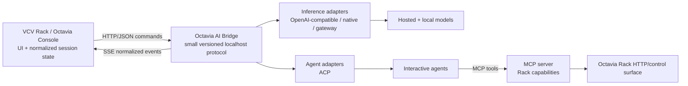
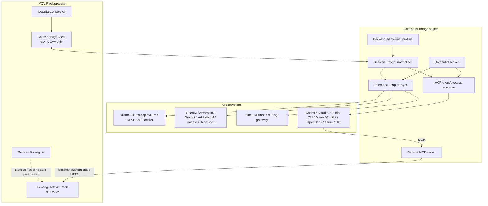
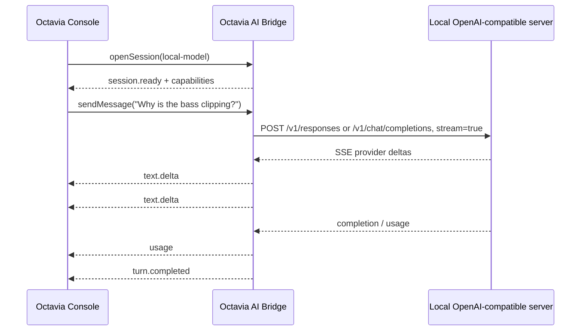
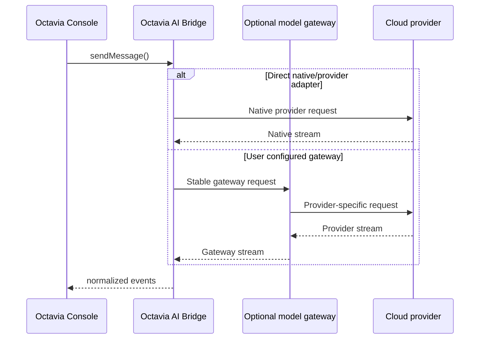
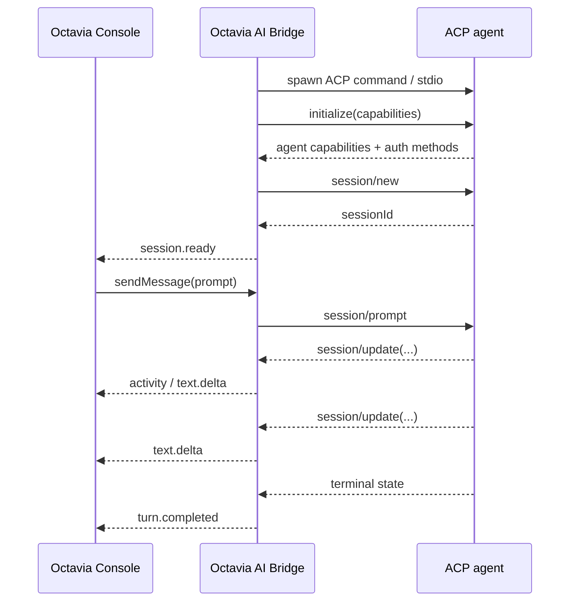
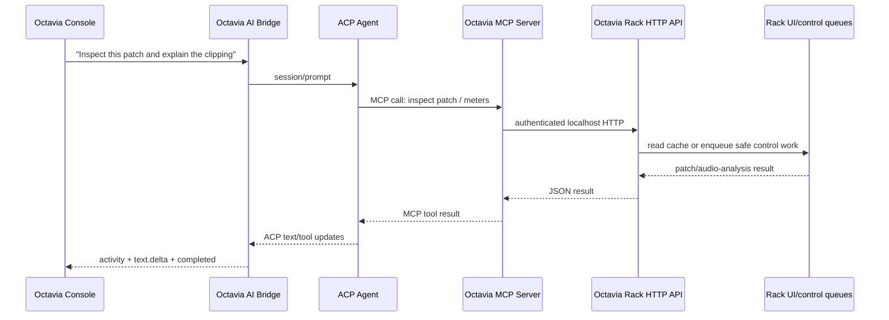
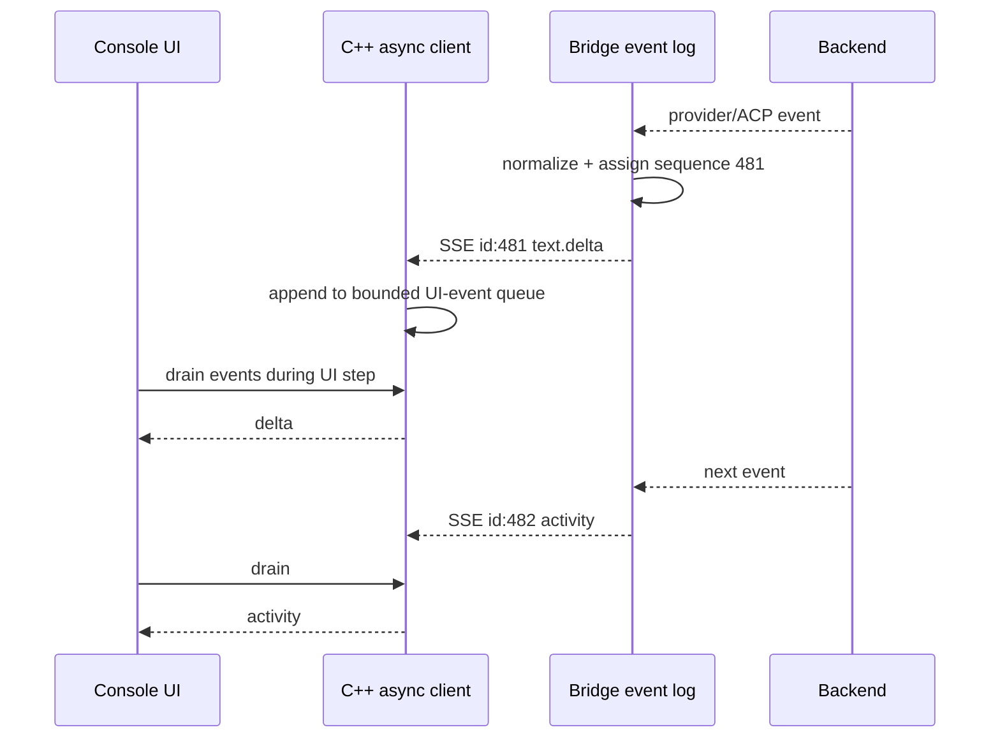
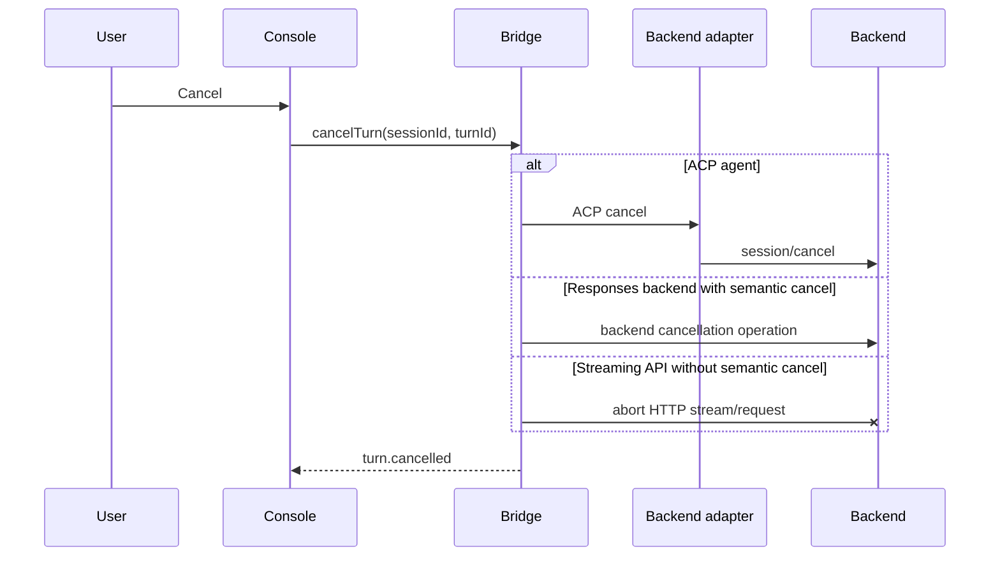
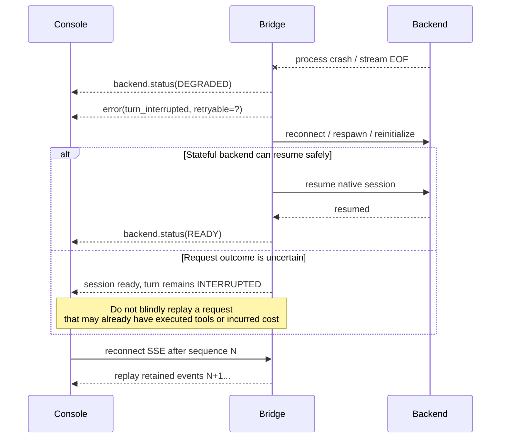

# Octavia Console: A Stable Membrane Between VCV Rack and the AI Ecosystem

## Executive conclusion

**Dragon King Leviathan, the central architectural recommendation is: Octavia Console should not speak directly to AI vendors, and it should not make any one existing AI protocol its universal internal abstraction.**

The most future-resistant design is a **three-plane architecture with a single, deliberately small Octavia-facing boundary**:



The three communication planes should remain **semantically separate**:

| Plane | Recommended boundary | Why |
|---|---|---|
| Prompt / inference | **Sidecar adapters: OpenAI-compatible APIs and provider/gateway adapters for raw models; ACP for full agents** | Raw inference and interactive agents have materially different session, permission, tool, and lifecycle semantics. OpenAI-compatible HTTP has broad but demonstrably incomplete interoperability; ACP has strong agent-session semantics but does not represent arbitrary raw inference servers. citeturn25search0turn25search1turn25search4turn0search0 |
| Tool / environment | **MCP remains orthogonal** | MCP exists to expose context, resources and tools to an intelligence; its current specification is not a general model-inference API or a replacement for an agent-client protocol. citeturn24search19turn0search14 |
| Session / control | **A tiny Octavia AI Bridge protocol between Rack and a helper process** | No verified current standard cleanly spans stateless LLM inference, stateful coding agents, permissions, arbitrary provider APIs, local-server quirks, backend discovery and Rack-specific UX while keeping all churn outside the plugin. This is the narrow place where a small Octavia-owned semantic contract earns its keep. |

The key distinction from a conventional “AI gateway” proposal is that **the gateway is not the stable boundary; the Octavia Bridge contract is**. Gateways, OpenAI-compatible endpoints, ACP adapters and provider APIs remain replaceable implementations behind it.

This produces a deliberately two-level architecture:

> **Inside Leviathan:** one protocol-neutral asynchronous Console client.  
> **Outside Leviathan:** two broad interoperability families—model inference and interactive agents—with MCP independently supplying Rack powers.

That falsifies part of the tempting hypothesis in the research brief. Plain models and agents **do** require different external interfaces, but Octavia itself should not need to implement both. fileciteturn0file0

**ACP deserves a major role, but one layer farther out than initially tempting.** Octavia Console is conceptually a valid ACP client: ACP has initialization, session creation/resumption, prompt submission, streamed session updates, permissions and cancellation, and its ecosystem now includes a substantial registry of competing agents such as Codex, Claude adapters, Gemini, GitHub Copilot, OpenCode and Qwen Code. citeturn0search0turn0search4turn23search0 However, putting ACP directly into the Rack C++ plugin would force Rack to own subprocess management, JSON-RPC lifecycle, protocol-version evolution and coding-agent assumptions. The **sidecar should be the ACP client; Octavia should be an Octavia-Bridge client**.

The strongest evidence for this placement is Codex itself. OpenAI's Codex app-server is a rich, Codex-specific bidirectional protocol, transported primarily as newline-delimited JSON over stdio, with WebSocket explicitly described as experimental/unsupported. citeturn13search2 The ACP project now supplies a `codex-acp` adapter whose job is precisely to start Codex app-server and translate its events to ACP, including model/reasoning settings, approvals, shell/file operations, MCP, terminals, plans and other agent events. citeturn0search12 **Octavia should consume that standard adapter rather than permanently know Codex app-server.**

Likewise, the ACP project supplies a Claude-agent adapter that translates the Claude Agent SDK into ACP and includes tool approvals, edits, terminal activity and client-provided MCP servers. citeturn0search6 This is exactly the ecosystem behavior Octavia should exploit: **let agent communities own their adapters.**

For raw models, OpenAI-compatible HTTP is the correct **lowest-common-denominator adapter family**, but not a sufficient architectural boundary. OpenAI itself supports both Chat Completions and Responses; Ollama documents compatibility with parts of the OpenAI API including both `/v1/chat/completions` and `/v1/responses`; current vLLM documents Chat Completions plus Responses and a Responses cancellation route; Cohere exposes an OpenAI-SDK compatibility API; and DeepSeek explicitly documents OpenAI- and Anthropic-compatible formats. citeturn24search7turn25search1turn25search4turn25search0turn25search13 Yet vLLM also documents semantic differences—such as ignored parameters and model-dependent tool behavior—which illustrates why “same endpoint name” cannot mean “identical capability.” citeturn25search4

Therefore:

**Prefer Responses when a backend positively advertises and passes a capability probe for it. Retain Chat Completions as the wider compatibility fallback. Never infer semantic compatibility solely from a URL containing `/v1`.**

A self-contained **Rust helper executable** is the strongest distribution target. The Rack plugin then requires no Python, Node, provider SDK or agent SDK. External agents may themselves require their own runtimes, but those dependencies belong to the selected backend, not Leviathan. ACP's ecosystem includes a Rust SDK alongside other SDKs, making Rust a particularly natural implementation option for the helper. citeturn0search1

The resulting five-year rule should be:

> **A new 2028 model should usually require configuration or one sidecar adapter. A new 2028 agent implementing ACP should require no Leviathan code at all. A new Rack capability should require an MCP tool, not an inference adapter.**

## Current Octavia architecture and research frame

The repository already contains more of the correct architectural DNA than might first appear, but its AI-facing mechanisms have grown into different abstractions.

The `expander` branch currently contains dedicated `MCP`, `src`, `scripts`, `tools`, tests and documentation trees, including the requested Octavia-related source files. citeturn15view0 This report analyzes the live `expander` branch as crawled on August 24, 2026 rather than an immutable commit; conclusions about future refactoring should therefore be tied to a commit before implementation begins.

**Important retrieval limitation:** the GitHub crawler successfully exposed the core C++ implementation but repeatedly failed to render the contents of the repository's top-level `MCP` directory and the `OctaviaConsoleBackgroundWorkerDesign.md` file. I therefore verified the existence of that tree, the C++ HTTP/MCP integration points, the mailbox protocol and the Console UI in source, but I cannot honestly claim a line-by-line inventory of every Python/MCP file from this session. The research brief itself confirms the existing Python Codex app-server connector and MCP-oriented utilities. fileciteturn0file0 Migration recommendations for those unrendered individual files are consequently architectural rather than file-by-file definitive.

**Octavia itself is already a localhost Rack-control server.** It uses `cpp-httplib`, defaults to port `34570`, obtains an optional `OCTAVIA_TOKEN` from the environment, binds its listener to `127.0.0.1`, and checks `X-Octavia-Token` in a pre-routing handler when the token is configured. citeturn12view2turn20view0turn20view3 This is a sound starting trust boundary: the control API is local by default, and credentials need not be embedded into patch state.

The realtime separation is also thoughtful. Audio data exposed to HTTP is written through atomics, and the loudness code uses `try_lock` rather than blocking the audio thread; comments explicitly state that the HTTP thread reads separately published data. citeturn12view2 The Console mailbox routes are even more explicit: the source says text exchange is control/UI work and the audio thread never reads or writes the mailboxes. citeturn21view1 **That principle should become an architectural invariant for all future AI communication.**

There is, however, one lifecycle detail worth hardening independently of the AI redesign: Octavia starts `httplib::Server::listen()` on a C++ thread and immediately detaches that thread; `stopServer()` stops the server but cannot join a detached thread. citeturn20view3 That does not prove a current defect, but explicit ownership and joining would be preferable when adding more asynchronous components.

**Octavia Console today is an in-process mailbox UI rather than an LLM client.** Each Console owns a shared `Mailbox`; it registers that mailbox under the module ID and considers itself attached only when its left expander is an Octavia module. Its persisted patch state currently contains the `backgroundWorkerEnabled` flag—not API credentials or backend configuration. citeturn21view3 That last property should be preserved.

The mailbox already abstracts several useful concepts. It defines prompt and response limits, agent states, queued prompts, workers, leases, claims, event IDs and a snapshot containing queue and transcript state. It supplies operations for submitting prompts, waiting for prompts, posting responses, registering/heartbeating workers, claiming/renewing/releasing/completing prompts and waiting for events. citeturn21view2

The HTTP surface exposes two generations of this mechanism. A legacy path lets an external program long-poll `/console/{id}/prompt` and POST a complete response. A newer background-worker API registers workers, heartbeats them, exposes an SSE `/events` feed with `Last-Event-ID`, and uses claim tokens plus renew/release/complete operations. The source itself labels the old path a supported “synthetic legacy claimant.” citeturn20view1turn21view0

That leads to the most important repository-level diagnosis:

| Existing concept | Architectural judgment |
|---|---|
| Octavia Rack HTTP API | **Keep.** It is a useful environment-control substrate, independent of which intelligence is talking to Console. citeturn20view0turn21view0 |
| Loopback binding + optional shared secret | **Keep and strengthen.** It is already the right local-security direction. citeturn20view0turn20view3 |
| Audio/HTTP separation | **Keep as a hard invariant.** citeturn12view2turn21view1 |
| Console `Mailbox` registration | **Generalize.** The module-to-control-plane association is useful, but the payload should evolve from prompt/whole-response jobs into sessions plus normalized streamed events. citeturn21view2 |
| Worker leases and SSE event IDs | **Reuse conceptually.** Leases, resumable event cursors and explicit ownership are good sidecar/control-plane primitives. citeturn20view1 |
| External worker prompt claiming | **Compatibility shim, not future primary protocol.** It models a job queue, not a rich conversational session. citeturn20view1turn21view2 |
| Whole-response `postResponse()` / `completeClaim()` | **Insufficient for the future Console.** The current mailbox's public response operations accept complete text, whereas agents and model APIs increasingly emit multiple typed streaming events. citeturn21view2turn24search3turn0search4 |
| Client-specific Python Codex app-server bridge | **Deprecate as the canonical Codex route.** Official ACP adaptation now exists outside Leviathan. fileciteturn0file0 citeturn0search12turn13search2 |
| MCP Rack tooling | **Retain as an independent tool plane.** MCP's purpose aligns with giving an intelligence powers over Rack, not carrying ordinary Console inference. citeturn24search19turn0search14 |

The existing worker design is therefore not wasted work. It has discovered real requirements—leases, event cursors, asynchronous ownership, multiple Console instances, errors and reconnects—but it has encoded them around **“a worker claims a prompt”**. The generalized abstraction should instead be **“a session has turns and emits typed events.”**

That distinction matters because the future event stream is not merely:

`prompt available → worker owns it → complete text returned`

It can be:

`turn started → reasoning summary → text delta → tool started → permission required → tool result → text delta → usage → completed`

ACP already demonstrates this richer agent model; Anthropic's native Messages stream similarly distinguishes text, tool-use and extended-thinking deltas rather than treating streaming as a sequence of anonymous strings. citeturn0search4turn24search3

## Protocol landscape and the ACP question

The landscape becomes much clearer when protocols are classified by **what is on each side of the wire**, rather than by the fact that all of them contain JSON and AI-related nouns.

| Interface | What it actually connects | Classification | Octavia role |
|---|---|---|---|
| OpenAI Chat Completions | Application ↔ model inference service | **Vendor API that became a de facto compatibility convention** | Excellent raw-model fallback; poor universal agent protocol. OpenAI, Ollama, vLLM, Cohere compatibility and DeepSeek all provide evidence of the convention's reach. citeturn24search7turn25search1turn25search4turn25search0turn25search13 |
| OpenAI Responses | Application ↔ richer OpenAI-style model/tool runtime | **Vendor API increasingly emulated elsewhere** | Preferred inference dialect when capability-tested; not safe to assume everywhere merely because Chat Completions exists. Ollama and vLLM now document Responses support, while provider compatibility surfaces remain heterogeneous. citeturn25search1turn25search4 |
| Anthropic Messages | Application ↔ Claude inference | **Vendor-native API** | Sidecar/provider adapter. Native streaming carries typed text/tool/reasoning events. Anthropic also documents compatibility layers separately from its general-purpose Messages API. citeturn24search3turn24search16 |
| Gemini native API | Application ↔ Gemini inference | **Vendor API** | Sidecar/provider adapter or gateway target; no Gemini-specific code belongs in Rack. Current hosted Gemini compatibility details should be revalidated during implementation because an authoritative Gemini API result was not surfaced in this retrieval. |
| MCP | AI host/client ↔ tools, context, resources and capabilities | **Open interoperability protocol** | **Rack tool/environment plane.** The current 2026 specification has continued to evolve around interoperability, extensions and authorization—not general model inference. citeturn24search19turn0search14 |
| ACP | Interactive client/editor ↔ coding/interactive agent | **Open protocol with independent clients, agents, registry and SDKs** | **Primary full-agent adapter protocol.** citeturn0search0turn0search1turn23search0 |
| A2A | Agent/application ↔ remotely addressable agent/task service | **Open agent interoperability protocol under Linux Foundation stewardship** | Useful later for remote delegation or exposing an Octavia-side agent; not the best Console-to-local-agent boundary. Current docs center Agent Cards, stateful tasks, messages, artifacts, authentication and streaming. citeturn26search6turn26search7 |
| AG-UI | Candidate frontend/agent event layer | **Emerging protocol; current primary specification not successfully retrieved here** | Do not make a five-year core dependency on the basis of this research set. Re-evaluate before implementation if its current specification now subsumes the required session/control semantics. |
| LiteLLM-style gateways | Application ↔ translation/routing layer ↔ model providers | **Implementation/product category, not an interoperability standard** | Potentially useful *inside* the sidecar architecture; should never become an assumption baked into the plugin. |

**OpenAI compatibility is broad, but “compatible” is not binary.** Current vLLM, for example, documents both Chat Completions and Responses yet calls out parameters it ignores or does not support and notes that parallel tool behavior ultimately depends on the model. citeturn25search4 Ollama explicitly describes its implementation as compatibility with **parts** of the OpenAI API. citeturn25search1 Cohere's compatibility documentation demonstrates Chat Completions through the OpenAI SDK, which is useful evidence of ecosystem convergence but not evidence that every OpenAI Responses event, tool schema or state mechanism is identical. citeturn25search0 DeepSeek now explicitly supports OpenAI- and Anthropic-shaped access, further illustrating that these interfaces function as lingua francas even though they remain vendor-originated APIs rather than neutral standards. citeturn25search13

The practical compatibility model should therefore be **feature negotiation by dialect**:

| Capability | `chat/completions` expectation | `responses` expectation | Octavia behavior |
|---|---|---|---|
| Plain text | Very broad | Growing | Require at least one |
| SSE text streaming | Broad | Growing | Normalize to `text.delta` |
| Tools/functions | Common, not identical | Richer where implemented | Probe and advertise |
| Structured output | Provider/model dependent | Provider/model dependent | Capability bit, never assumption |
| Reasoning events | Nonstandard extensions common | Better typed support on richer implementations | Normalize only externally exposed summaries/events |
| Image/file input | Highly implementation dependent | Often richer | Content-block capability |
| Persistent server conversation | Usually client-managed | Sometimes server identifiers/state | Sidecar abstracts it |
| Cancellation | Often connection abort only | Some implementations expose semantic cancellation; vLLM documents a Responses cancel endpoint | Report exact capability rather than inventing portability. citeturn25search4 |
| Model discovery | Often `/v1/models`, but not sufficient to infer features | Same problem | Probe models separately from features |
| Provider extensions | Common | Common | Adapter-owned namespaced extensions |

### The special ACP question, answered

**Yes: Octavia Console can legitimately participate as an ACP client even though VCV Rack is not an IDE. But the recommended ACP client is the Octavia sidecar, not the Rack binary.**

ACP's core interaction is sufficiently general: initialize and negotiate capabilities, create or resume a session, submit a session prompt, receive session updates, handle permission interactions and cancel the session/turn. citeturn0search0turn0search4 Its ecosystem is no longer merely a Zed-specific thought experiment. The official registry contains entries for Codex, Claude adapters, Gemini, GitHub Copilot, OpenCode, Qwen Code, Devin, Mistral Vibe and many others, while the ACP organization maintains SDKs and adapters. citeturn23search0turn0search1

The conceptual mapping is unusually good:

| Octavia concept | ACP mapping | Caveat |
|---|---|---|
| Prompt field | `session/prompt` | Natural fit. citeturn0search4 |
| Conversation/thread | ACP session created/resumed by session ID | Natural for stateful agents. citeturn0search4 |
| Transcript | Accumulated `session/update` content | Octavia still owns its visual transcript. |
| Streaming output | `session/update` notifications | Handles richer events than today's whole-response mailbox. citeturn0search4 |
| Agent status | Normalized from ACP session/tool/plan/state updates | Do not expose raw ACP event vocabulary directly to C++. |
| Cancel button | ACP session cancellation | Stronger semantic fit than merely dropping a TCP connection. citeturn0search4 |
| Permission dialog | ACP agent→client permission interaction | Sidecar forwards a normalized `permission.request`; Console returns a decision. |
| MCP Rack exposure | Client-provided MCP server to supporting ACP agents, or independently configured MCP | Codex and Claude ACP adapters both document MCP integration. citeturn0search12turn0search6 |
| Agent discovery | ACP Registry plus local command/profile discovery | Registry is real, but this is not automatic LAN service discovery. citeturn23search0 |
| Model selection | Optional capability/agent-specific control | Do not make it mandatory in the normalized core. |
| Background worker | **Not an ACP primitive** | This belongs to the sidecar's process/lifecycle manager. |
| Codex app-server bridge | Official `codex-acp` adapter | This is the clearest immediate migration win. citeturn0search12turn13search2 |

ACP's editor heritage does matter. Full coding agents can request filesystem access, terminal interaction, file edits and permission decisions. `codex-acp` and `claude-agent-acp` expose precisely those richer behaviors. citeturn0search12turn0search6 A VCV Rack Console does not need to impersonate an editor: the sidecar should advertise only capabilities it actually supplies. Where an agent fundamentally requires a workspace, the backend profile can specify one; where it does not, Octavia need not invent fake files and terminals.

What ACP **does not** solve is just as important:

It does not make a stateless GGUF model into a stateful agent; it does not provide a universal OpenAI/Anthropic/Gemini inference surface; it does not store Octavia's cloud credentials; it does not define the Rack-control API; it does not make MCP redundant; and it does not eliminate backend process discovery or packaging. Its proper scope is the **interactive-agent adapter boundary**.

This is why an “ACP everywhere” design loses to the sidecar architecture. Wrapping every raw inference server in a pretend coding agent would move complexity rather than remove it.

**A2A should likewise not be forced into the Console path.** Current A2A concepts focus on discoverable Agent Cards, messages, tasks with lifecycle state, output artifacts and context IDs. Its current protocol supports streaming state/artifact updates and remote authentication over HTTP(S). citeturn26search6turn26search7 That is compelling for **agent-to-agent delegation and remotely addressable services**, but heavier and differently scoped than “a local human-facing Console is talking interactively to Codex.” A future Octavia orchestration service could expose itself as an A2A agent; Octavia Console itself does not need to.

MCP and A2A are in fact complementary rather than competing ideas: A2A answers “how do I delegate work to this agent?” while MCP answers “what tools/context can an intelligence use?” Current A2A documentation explicitly treats an agent as a task-oriented service with discovery and capabilities, whereas MCP's own framing remains application-to-tool/context integration. citeturn26search6turn24search19

## Compatibility matrix and architectural decision

The following scoring is an architectural decision model, not an empirical benchmark. Scores run from **1 = poor** to **5 = excellent**. Weights deliberately sum to 100, with compatibility, API-churn isolation, realtime safety, user simplicity, plugin stability and unknown-future-backend extensibility dominating, as requested. The evidence base includes the repository architecture, ACP/MCP/A2A specifications and demonstrated diversity of OpenAI-compatible implementations. citeturn12view2turn23search0turn0search14turn26search6turn25search1turn25search4

Architectures:

**A** = direct native provider clients in Rack  
**B** = Rack implements OpenAI-compatible HTTP only  
**C** = Rack implements ACP only  
**D** = Rack speaks OpenAI-compatible API to a universal model gateway  
**E** = Rack directly implements both OpenAI-compatible HTTP and ACP  
**F** = **protocol-neutral Rack client + Octavia sidecar with model and ACP adapters**

| Criterion | Weight | A | B | C | D | E | **F** |
|---|---:|---:|---:|---:|---:|---:|---:|
| Raw hosted LLM compatibility | 6 | 5 | 4 | 1 | 5 | 4 | **5** |
| Local LLM compatibility | 6 | 3 | 5 | 1 | 5 | 5 | **5** |
| Full agent compatibility | 8 | 2 | 1 | 5 | 1 | 5 | **5** |
| Streaming | 4 | 4 | 4 | 5 | 4 | 5 | **5** |
| Stateful sessions | 4 | 3 | 2 | 5 | 3 | 4 | **5** |
| Tool calling | 3 | 4 | 3 | 5 | 4 | 5 | **5** |
| MCP interoperability | 4 | 4 | 2 | 4 | 2 | 4 | **5** |
| Capability discovery | 4 | 3 | 2 | 5 | 3 | 4 | **5** |
| Multimodality | 3 | 4 | 3 | 4 | 4 | 4 | **5** |
| Cancellation | 3 | 3 | 2 | 5 | 3 | 4 | **5** |
| Authentication | 3 | 4 | 4 | 4 | 4 | 4 | **5** |
| Windows/macOS/Linux | 4 | 4 | 5 | 4 | 4 | 4 | **5** |
| Low native-C++ complexity | 6 | 1 | 4 | 2 | 4 | 1 | **5** |
| Low external dependency burden | 3 | 4 | 5 | 3 | 2 | 4 | **3** |
| Plugin stability/isolation | 7 | 1 | 3 | 3 | 4 | 2 | **5** |
| Protocol maturity | 3 | 3 | 3 | 3 | 3 | 3 | **3** |
| Ecosystem adoption | 4 | 3 | 5 | 4 | 5 | 5 | **5** |
| Vendor neutrality | 4 | 2 | 2 | 5 | 4 | 4 | **5** |
| Future extensibility | 8 | 2 | 4 | 4 | 5 | 4 | **5** |
| User setup simplicity | 5 | 3 | 4 | 3 | 3 | 4 | **5*** |
| Realtime safety | 8 | 2 | 3 | 3 | 4 | 2 | **5** |
| **Weighted score / 100** | **100** | **56.4** | **66.2** | **71.2** | **73.4** | **74.8** | **97.6** |

\*The sidecar earns the setup score only if Leviathan distributes or automatically manages a self-contained helper. Requiring musicians to install Python, Node and a manually configured gateway would reduce this score substantially.

The decisive result is not the precise 97.6. It is the structural gap between architectures that **put churn inside Rack** and one that puts churn behind a process boundary.

**Direct native provider support is the wrong long-term shape.** It maximizes feature access today but converts every provider authentication, streaming and schema change into a plugin release. It also accumulates SDK/TLS/JSON dependencies in a realtime host.

**OpenAI-compatible-only Rack support is an excellent tactical feature but an inadequate universal design.** Its local-model coverage is especially attractive: Ollama and vLLM both expose current OpenAI-compatible surfaces, while several cloud vendors explicitly support OpenAI-shaped clients. citeturn25search1turn25search4turn25search0turn25search13 But it has no native representation of agent permissions, rich stateful agent sessions, terminals or full agent lifecycle.

**ACP-only is the mirror-image failure.** It solves agent interaction strikingly well and is now backed by a diverse registry. citeturn23search0 But forcing llama.cpp/Ollama/vLLM and ordinary hosted inference into ACP would require agent wrappers that add no intrinsic value.

**A gateway-only design is strong for models but still weak for agents.** A multi-provider inference gateway can absorb provider peculiarities, but the plugin would still need another abstraction for Codex/Claude/Gemini CLI-class agents.

**Direct OpenAI-compatible + ACP is the best architecture that does not use a sidecar.** It is also the architecture most likely to look elegant for twelve months and regrettable after five years: Rack would permanently own two evolving protocol families, an ACP subprocess manager, credentials and asynchronous network semantics.

**The normalized sidecar wins because it makes both families implementation details.**

The ecosystem evidence supports exactly that direction. ACP has multiple competing agent implementations and adapters. citeturn23search0turn0search12turn0search6 OpenAI-style HTTP has independent implementations across both local runtimes and cloud vendors, but varying subsets. citeturn25search1turn25search4turn25search0turn25search13 The common lesson is not “pick one winner”; it is **put each interoperability convention behind an adapter and make the instrument depend only on semantics it actually needs.**

## Recommended architecture and Octavia-facing normalized interface

The proposed runtime has four ownership zones:



This makes the **stable Octavia boundary intentionally smaller than ACP, MCP or OpenAI's APIs**.

A useful first protocol version needs approximately these operations:

```text
handshake(clientInfo, protocolVersion)
listBackends()
openSession(backendId, options)
resumeSession(sessionKey)
sendMessage(sessionId, message)
cancelTurn(sessionId, turnId)
resolvePermission(sessionId, requestId, decision)
closeSession(sessionId)
subscribeEvents(sessionId?, afterSequence?)
```

`handshake()` is worth adding to the original conceptual list because a five-year boundary itself needs version negotiation. `resumeSession()` should be explicit because resuming a persistent ACP agent session is materially different from merely creating another stateless completion. `resolvePermission()` is also fundamental if full agents are first-class.

A backend descriptor should be semantically descriptive rather than API-shaped:

```text
BackendDescriptor {
    id
    displayName
    kind: MODEL | AGENT
    availability: READY | AUTH_REQUIRED | NOT_INSTALLED | OFFLINE | ERROR

    models[]                  // optional
    defaultModel             // optional

    capabilities {
        text
        streaming
        systemInstructions
        tools
        rackMcp
        structuredOutput
        images
        audio
        files
        reasoningSummary
        usage
        persistentSessions
        sessionResume
        cancellation
        permissions
        modelSelection
    }

    authState                 // NEVER credentials
    extensions{}              // namespaced, optional
}
```

Crucially, **capability negotiation must describe observed backend behavior, not protocol branding**. A backend reporting `protocol = openai` tells Console almost nothing useful. A backend reporting `streaming=true`, `images=false`, `persistentSessions=false`, `cancellation=connection_abort` tells Console exactly how to behave.

The content representation should use blocks from the beginning:

```text
Message {
    role
    content: [
        Text {...},
        ImageRef {...},
        AudioRef {...},
        FileRef {...}
    ]
}
```

That prevents today's text-only UI assumption from becoming tomorrow's ABI problem.

The streamed event union is the heart of the membrane:

```text
Event {
    sequence
    sessionId
    turnId?
    timestamp
    type
    payload
}
```

Core event types should be no larger than necessary:

| Event | Meaning |
|---|---|
| `backend.status` | Connecting, ready, degraded, offline, authentication required |
| `session.ready` | Session successfully created/resumed |
| `turn.started` | Backend accepted the user's turn |
| `text.delta` | Incremental assistant-visible text |
| `reasoning.summary` | Provider-exposed reasoning summary/status—not assumed hidden chain-of-thought |
| `activity` | Tool, MCP, terminal or other agent activity summarized for UI |
| `permission.request` | User decision required |
| `usage` | Optional token/cost/resource metadata |
| `artifact` | File/image/structured deliverable reference |
| `turn.completed` | Successful terminal state |
| `turn.cancelled` | Cancellation terminal state |
| `error` | Structured recoverable/fatal error |

Avoid creating separate core event types for `anthropic_tool_use`, `codex_command_execution`, `gemini_grounding`, `openai_response.output_text.delta`, etc. Those names belong in adapters. A namespaced `extensions` object can retain diagnostic/provider detail without making the Rack client depend upon it.

The current mailbox's event sequencing and SSE `Last-Event-ID` support are valuable precedents for this design. citeturn20view1 The new version simply makes the events rich enough to represent actual inference and agent streams.

**Conversation ownership should be layered.**

Octavia Console should own the **visual transcript currently displayed**. The sidecar should own the **logical conversation/session mapping**. Stateful agents should remain authoritative for their native persistent session whenever supported. Stateless Chat Completions-style backends should have their history replayed by the sidecar. Responses-style provider state can be used internally when available. This lets the user see one coherent conversation UX even though the underlying backend can be either stateless or stateful.

The `.vcv` patch should persist at most a **nonsecret backend profile identifier, UI preferences and optionally a logical session bookmark**. Conversation archives should live in user-specific application data, not be silently embedded into musical patches. The existing Console already avoids persisting secrets and stores only its background-worker flag. citeturn21view3

**Gateway responsibilities** should be sharply bounded.

The Octavia AI Bridge should own backend configuration, capability probes, provider/agent adapters, stream normalization, retry/backoff, authentication brokerage, session mapping, stateless-history replay, ACP subprocess lifecycle, local backend discovery, event resumption and crash isolation.

It should **not** own Rack DSP, patch mutation semantics, Sibyl semantics, the Console renderer, an artificial universal tool-call loop, hidden model reasoning, or cloud keys inside `.vcv` files. Rack operations remain Octavia/MCP concerns.

This also makes existing inference gateways optional components rather than architectural dependencies. A LiteLLM-class gateway can sit behind one inference adapter and translate provider APIs; a user who already operates such a gateway gets broad cloud coverage immediately. A user running Ollama directly does not need to install it. A future gateway can replace it without Rack noticing.

### Backend mappings

The same Console UX then maps cleanly to the requested backends:

| Backend | Bridge adapter path | Session semantics | Rack access |
|---|---|---|---|
| **llama.cpp** | OpenAI-compatible inference profile, normally Chat Completions; probe any richer endpoints before use | Sidecar-managed history | MCP only if a model/agent host supplies a tool loop; exact current official llama.cpp Responses parity remains a validation gap from this crawl |
| **Ollama** | OpenAI-compatible adapter; current docs show both Chat Completions and Responses compatibility | Sidecar-managed unless chosen dialect exposes reusable state | Same principle. citeturn25search1 |
| **vLLM** | OpenAI-compatible adapter; Responses preferred when its required semantics are supported | Can use Responses IDs/cancel where applicable, otherwise sidecar history | Same principle; current vLLM explicitly documents `/v1/responses` and cancel. citeturn25search4 |
| **LM Studio / LocalAI** | OpenAI-compatible adapter with runtime capability probe | Sidecar-managed | No Rack code change; exact Aug 2026 endpoint parity should be included in prototype certification rather than assumed |
| **OpenAI** | Responses adapter preferred; Chat Completions fallback where appropriate | Provider state when useful + normalized sidecar session | OpenAI Responses can itself use MCP on supporting models, but Octavia still treats Rack MCP as the independent capability surface. Current OpenAI models expose Responses, Chat and MCP-capable tool sets. citeturn24search7 |
| **Anthropic** | Native Messages adapter or a vetted gateway | Sidecar history/native semantics | MCP independently; Messages streaming natively exposes text/tool/reasoning deltas. citeturn24search3turn24search19 |
| **Gemini hosted** | Gemini-native or gateway adapter | Adapter normalized | MCP/tool access independently; current hosted API compatibility must be revalidated before shipping |
| **Cohere** | OpenAI-compatibility adapter where required features are supported; native adapter otherwise | Sidecar | Cohere explicitly documents OpenAI SDK compatibility for Chat Completions. citeturn25search0 |
| **DeepSeek** | OpenAI- or Anthropic-shaped adapter | Sidecar | DeepSeek explicitly documents both API-format options. citeturn25search13 |
| **LiteLLM-class gateway** | One configured gateway endpoint | Sidecar retains normalized semantics | Gateway is inference routing, not Rack tooling |
| **Codex** | **ACP → `codex-acp` → Codex app-server** | Native ACP/Codex session | Pass Octavia MCP server when supported. citeturn0search12turn13search2 |
| **Claude Agent / Claude Code** | **ACP → Claude agent adapter** | Native agent session | Client-supplied MCP supported by the documented adapter. citeturn0search6 |
| **Gemini CLI** | ACP registry/native ACP command when installed | ACP session | MCP according to advertised capability; Gemini appears in the official ACP Registry. citeturn23search0 |
| **Qwen Code** | ACP | ACP session | Same; Qwen Code appears in the official ACP Registry. citeturn23search0 |
| **GitHub Copilot** | ACP | ACP session | Same; the official ACP Registry contains Copilot entries. citeturn23search0 |
| **OpenCode** | ACP | ACP session | Same; OpenCode is represented in the official ACP Registry. citeturn23search0 |
| **Hypothetical 2028 “ZephyrMind” unique API** | New **external bridge adapter** implementing the normalized backend interface | Adapter chooses native or emulated session | Rack unchanged |

For a genuinely unique 2028 provider, a realistic target should be **hundreds rather than thousands of lines of adapter code**, plus protocol fixtures and integration tests. If ZephyrMind implements ACP as an agent or a sufficiently compatible OpenAI API as an inference server, even that adapter disappears: it becomes configuration.

## Operational design: sequences, transport, security and distribution

The recommended Rack↔helper transport is intentionally boring: **HTTP/JSON commands over loopback plus an SSE event stream**.

There is little benefit in making the plugin speak JSON-RPC over stdio directly. Stdio is excellent between the sidecar and child ACP agents, where process ownership naturally supplies a pipe. For Rack↔sidecar, localhost HTTP allows one helper to serve several Console modules, supports independent process lifetime, is cross-platform, can be inspected easily, and fits the codebase's existing HTTP/SSE experience. The existing Octavia background-worker implementation already demonstrates SSE, keepalives and `Last-Event-ID`. citeturn20view1

WebSockets should be optional, not required. The interaction is naturally asymmetric: Console sends relatively infrequent commands using POST while the bridge continuously pushes events using SSE. Even OpenAI's Codex app-server treats stdio as its normal transport and marks its WebSocket listener experimental/unsupported, which is a useful warning against picking WebSocket merely because it looks more “realtime.” citeturn13search2

**Plain local LLM prompt**



Ollama and vLLM provide primary-source examples of why this path is broadly useful today; both document OpenAI-compatible interfaces, and both currently expose Responses as well as Chat compatibility. citeturn25search1turn25search4

**Hosted provider prompt**



The bridge, not Console, knows whether the backend is OpenAI Responses, Anthropic Messages, DeepSeek compatibility mode or some future API. Anthropic Messages currently streams typed text/tool/reasoning deltas, while DeepSeek documents OpenAI- and Anthropic-shaped access; this is precisely the variation the normalization layer exists to absorb. citeturn24search3turn25search13

**ACP agent prompt**



That interaction corresponds directly to ACP's published lifecycle and capability-negotiated session model. citeturn0search4turn0search0

**Agent using MCP to inspect and manipulate Rack**



This is the clean answer to the brief's clipping example. **The natural-language request and the power to inspect Rack travel over different interfaces.** MCP was designed to connect AI applications to data sources and tools, while ACP's session protocol deals with the conversational agent relationship. citeturn24search19turn0search4 Codex and Claude ACP adapters already provide evidence that ACP sessions and client-provided MCP capabilities can coexist naturally. citeturn0search12turn0search6

**Normalized streaming response**



No JSON parsing, sockets, TLS, subprocess management or provider retry logic belongs in Rack's audio `process()` path. The present code already makes the equivalent distinction for Console mailbox traffic and HTTP-visible audio data. citeturn21view1turn12view2

**Cancellation**



Cancellation must therefore be a **capability with levels**, not a Boolean fiction: `semantic`, `transport_abort`, or `unsupported`. Current vLLM explicitly documents a Responses cancellation route, whereas portability of that mechanism cannot be inferred for every Chat-compatible service. citeturn25search4 ACP provides an explicit session cancellation semantic. citeturn0search4

**Backend failure and reconnect**



This is another reason for the sidecar. A child agent can crash, a gateway can wedge, a provider can stall, and the sidecar itself can die without taking Rack's audio engine with it. The bridge should never automatically replay a possibly side-effecting agent turn merely because a connection disappeared.

### Security model

The current localhost boundary should remain the default. Octavia presently binds its HTTP server to `127.0.0.1`; optional authentication is sourced from `OCTAVIA_TOKEN` and applied as an HTTP header. citeturn20view0turn20view3 The bridge should use the same basic principle but improve the default: generate a per-user or per-process random bridge credential automatically rather than requiring musicians to understand local API security.

Cloud provider keys, OAuth refresh tokens and agent credentials should live in the **sidecar's operating-system credential store or provider-owned credential mechanism**. The Rack client should see only states such as `AUTH_REQUIRED` or `READY`. The current Console's patch serialization contains no cloud secret and should stay that way. citeturn21view3

Rack MCP permissions should be independent of provider permissions. An agent asking permission to execute a shell command via ACP and an agent requesting an MCP tool that mutates a patch are two different trust decisions. ACP's approval channel should control agent-side operations; Octavia/MCP policy should control Rack-side operations. Codex's ACP adapter already maps approval and sandbox concepts, demonstrating why collapsing these permission domains would lose information. citeturn0search12

For Rack tools, a useful policy split is:

**read/observe** operations may be allowlisted by default; **mutating** operations should support explicit user policy; high-impact operations such as patch replacement, file writes or broad destructive changes should require stronger permission. MCP's continuing authorization hardening reinforces the need to treat the tool boundary as a security boundary rather than assuming “localhost equals trusted AI.” citeturn0search14

Remote/LAN access should be **opt-in**, with TLS and real authentication. Auto-discovery must never silently turn the Rack control API into a LAN service.

### Discovery and “audio-device-like” UX

The sidecar should present users with **profiles**, not URLs and API jargon:

```text
Backends
  Local
    Ollama — Ready
      qwen...
      llama...
    vLLM — Offline
    llama.cpp — Ready

  Agents
    Codex — Ready
    Claude — Sign in required
    Gemini CLI — Not installed
    Qwen Code — Ready

  Cloud
    OpenAI — Ready
    Anthropic — Ready
    Studio Gateway — Ready
```

ACP has a concrete registry whose metadata includes agent distributions and platform targets, giving the sidecar a standards-aligned source for identifying available agents. citeturn23search0 The registry currently spans numerous competing agents, which is materially stronger evidence of interoperability than a protocol repository containing only one reference implementation. citeturn23search0

Local model discovery is less standardized and should therefore be conservative: check configured endpoints, optionally probe a small opt-in list of known localhost services, and enumerate models only after identifying a compatible service. **Do not scan arbitrary LAN ports by default.**

### Cross-platform distribution

The preferred packaging shape is:

```text
Leviathan Rack plugin
    native C++ only
    tiny OctaviaBridgeClient

Octavia AI Bridge
    self-contained Windows executable
    self-contained macOS executable
    self-contained Linux executable

Optional user backends
    Ollama / llama.cpp / vLLM / etc.
    Codex / Claude / Gemini CLI / etc.
    third-party gateway
```

The helper should preferably be implemented in **Rust** and released as native platform binaries. ACP's organization already maintains a Rust SDK, so the bridge does not need to invent ACP serialization from scratch. citeturn0search1 Rust also keeps Python and Node out of Leviathan's mandatory dependency chain; any Node/Python requirements of a selected external agent remain that agent's concern.

Rack should communicate with the helper through a dedicated non-audio I/O thread. Plugin shutdown should signal and **join** that thread. If Leviathan chooses to auto-start the helper, process ownership should also be explicit and bounded; an already-running user-level helper can instead be reused.

One distribution issue remains to verify before shipping: **VCV Rack Library/package policy for bundling or launching helper executables was not independently researched in this retrieval.** If bundled helpers are undesirable under the distribution policy, release the Bridge as a separate signed Leviathan companion application. The protocol architecture remains unchanged either way.

## Migration, prototype, final decisions and sources

The migration should preserve functioning mechanisms while moving intelligence-specific concerns outward.

| Stage | Repository action | Compatibility behavior |
|---|---|---|
| **Foundation** | Define `BackendDescriptor`, `Session`, `Turn`, `Event` and capability vocabulary independently of HTTP/ACP/OpenAI types | No current route removed |
| **Mailbox generalization** | Evolve `Mailbox` into a protocol-neutral session/event bus; add incremental deltas and terminal events while retaining existing transcript rendering | Existing `submitPrompt()` and complete-response path can adapt into one-turn legacy sessions |
| **Bridge client** | Add one dedicated C++ async client using loopback HTTP + SSE | Audio `process()` remains completely unaware of it |
| **Helper PoC** | Create the self-contained Octavia AI Bridge with one OpenAI-compatible adapter and one ACP adapter | Current Python/worker mechanisms continue operating |
| **Codex migration** | Route Codex through official `codex-acp` instead of teaching Leviathan more app-server protocol | Existing Python Codex connector becomes a temporary compatibility shim. citeturn0search12turn13search2 |
| **MCP consolidation** | Preserve Rack's existing control HTTP API; place/retain the MCP protocol adapter outside realtime Rack code | MCP continues to expose Rack powers independently of Console inference. citeturn24search19turn21view1 |
| **Gateway/provider expansion** | Add Anthropic/native or gateway adapters, then certify additional OpenAI-compatible servers via capability tests | No plugin rebuild |
| **Legacy retirement** | Deprecate external prompt claiming as the recommended Console integration after bridge parity is established | Keep routes for a documented transition period |

The migration is deliberately **not** a clean-room rewrite. The strongest current abstractions survive: Rack control HTTP, mailbox registration, event sequencing, SSE cursors, explicit worker/session status, UI transcript state and realtime isolation. citeturn20view1turn21view2turn21view3 What changes is which process owns protocol complexity.

The existing background-worker lease logic may even be reused inside the bridge's compatibility adapter: a legacy worker adapter could claim current Console prompts and translate them into new normalized bridge sessions while the C++ UI is migrated incrementally. Once Console natively speaks the new client interface, that adapter can disappear.

### The decisive prototype

The smallest proof-of-concept should avoid trying to support ten providers. It should deliberately select **three backends whose differences stress the architecture**:

1. **Ollama or vLLM** as a raw local OpenAI-compatible model. Both have current primary documentation for OpenAI-compatible operation; vLLM additionally provides a useful cancellation test. citeturn25search1turn25search4
2. **OpenAI or Anthropic** as a hosted streaming model, proving credentials remain outside Rack and provider-native event variation normalizes correctly. OpenAI exposes both Chat and Responses, while Anthropic Messages exposes SSE text/tool/reasoning deltas. citeturn24search7turn24search3
3. **Codex through `codex-acp`** as a full stateful agent with permission/activity/MCP events. citeturn0search12

Use the **same unmodified Octavia Console UI** for all three.

The prototype is successful only if it demonstrates all of the following:

| Acceptance test | Pass condition |
|---|---|
| Local model | Stream incremental text into Console |
| Hosted model | Same Console event vocabulary despite different provider wire protocol |
| ACP agent | Create session, stream agent output, expose status and cancel |
| MCP Rack inspection | Agent answers the clipping question using actual Octavia Rack tools rather than prompt-injected static context |
| Permissions | At least one ACP permission request reaches Console and receives a user decision |
| Cancellation | Cancel propagates through ACP and through at least one HTTP inference backend |
| Helper crash | Killing the helper does not crash Rack or disturb the audio engine; Console becomes `OFFLINE`/`DEGRADED` |
| Backend crash | Backend can be rediscovered/reconnected without plugin restart |
| Event reconnect | Disconnect and reconnect the Rack-side SSE stream using event sequence/cursor without duplicating transcript |
| Secret isolation | Saved `.vcv` contains no cloud API key, bridge bearer token or OAuth secret |
| Realtime isolation | No socket, JSON parser, subprocess function, condition-variable wait or provider callback is reachable from the audio `process()` path |
| Extensibility | A mock “future provider” is added entirely by helper adapter/configuration, with zero C++ changes |

Useful engineering targets for the PoC are **sub-5-ms p95 normalization/forwarding overhead for already-received local stream events**, **sub-250-ms local cancellation dispatch from UI click to adapter call**, bounded event queues, bounded shutdown, and no blind automatic replay of an uncertain side-effecting turn. These are proposed acceptance thresholds rather than claims about present performance.

### Residual uncertainties and research gaps

Three gaps should be explicitly carried into implementation rather than smoothed over.

First, the GitHub crawler did not expose the contents of Leviathan's `MCP` directory or background-worker design document in this session, although the tree and C++ integration points were verified. citeturn15view0turn20view1 Before refactoring, inventory those files at a pinned commit and classify every script as keep/generalize/move/deprecate.

Second, primary current compatibility documentation for **LM Studio, LocalAI, the official llama.cpp repository, xAI, Mistral and hosted Gemini** did not surface in the final retrieval set. The architecture deliberately does not rely on them implementing any one exact endpoint; nevertheless, the certification matrix should be filled with current provider-specific probes before declaring a particular release “supported.”

Third, an authoritative current **AG-UI** primary specification did not surface in the retrieval. That means this report cannot responsibly claim that its August 2026 design is either obsolete or superior. Its potential should be revisited specifically against the proposed `Event` vocabulary. If current AG-UI can express the entire Octavia session/control contract without forcing agent-only semantics onto raw models, adopting or profiling it could eliminate part of the small custom Bridge protocol. Until that is verified, it is a research candidate, not a foundation.

None of these gaps change the main conclusion because the recommendation is intentionally designed to survive uncertainty in those exact external interfaces.

### Final decision table

| Decision | Recommendation |
|---|---|
| **Use OpenAI-compatible HTTP for** | **Raw model inference adapters and gateway interop**, with Chat Completions as the widest fallback and Responses preferred only after capability verification. OpenAI, Ollama, vLLM, Cohere and DeepSeek collectively demonstrate substantial—but not identical—ecosystem convergence. citeturn24search7turn25search1turn25search4turn25search0turn25search13 |
| **Use ACP for** | **Interactive full-agent adapters**: Codex, Claude Agent, Gemini CLI, Qwen Code, Copilot, OpenCode and future compatible agents. citeturn23search0turn0search12turn0search6 |
| **Keep MCP for** | **Giving the intelligence powers inside VCV Rack**—inspection, patch manipulation, Sibyl operations, signal analysis and other environment capabilities. citeturn24search19turn0search14 |
| **Use A2A for** | **Future remote agent delegation only when Octavia itself becomes or orchestrates a remotely addressable agent service**; not ordinary Console prompting. citeturn26search6turn26search7 |
| **Do not use MCP for** | General Console→model inference merely because the model can also use MCP tools. |
| **Do not use ACP for** | Pretending every raw GGUF/local model is a coding agent. |
| **Do not use OpenAI compatibility for** | Modeling agent permissions, terminal/file lifecycle or rich persistent-agent semantics that the convention does not portably define. |
| **Do not make Codex app-server the Octavia boundary** | It is a Codex-specific rich-interface protocol; the ACP ecosystem now contains a dedicated adapter for translating it. citeturn13search2turn0search12 |
| **Do not put provider SDKs in Rack** | Provider churn, credential handling and network complexity belong outside the realtime plugin process. |
| **Octavia Console itself should know only** | **Backends, capabilities, sessions, messages, turns, permissions, cancellation and normalized streamed events.** |
| **The stable Rack boundary should be** | **A tiny versioned Octavia AI Bridge protocol over loopback HTTP/JSON + SSE**, implemented by an asynchronous C++ client. |
| **The sidecar should know** | ACP, OpenAI-compatible dialects, native provider/gateway adapters, credentials, process lifecycle, discovery, session emulation, retry/reconnect and normalization. |
| **A new standards-compliant agent should require** | **Registration/configuration only if it already speaks ACP.** |
| **A new OpenAI-compatible model/server should require** | **A profile plus capability probe, ideally zero new code.** |
| **A provider with a unique 2028 API should require** | **One isolated external adapter and tests—zero Leviathan/Rack rebuild.** |
| **Secrets persisted in `.vcv` should be** | **None.** |
| **Networking or AI work on the audio thread should be** | **None.** |

The narrowest useful membrane is therefore not “OpenAI-compatible,” “ACP,” “MCP,” “A2A,” or a gateway product.

It is a much smaller semantic promise:

> **Octavia can discover an intelligence, learn what it can do, open or resume a conversation, send content, observe typed progress, answer permission requests, cancel a turn, survive failure, and close the session.**

Everything below that membrane is allowed to evolve.

That is the architecture most aligned with Octavia's identity as a **stable musical instrument interface above an unstable intelligence ecosystem**: the Rack plugin knows what a conversation *means*, but almost nothing about which synthetic mind is on the other side.

### Sources

| Primary source | Used for |
|---|---|
| Leviathan `expander` repository and `Octavia.cpp` | Current tree, localhost server, authentication, realtime separation, Console HTTP routes and server lifecycle. citeturn15view0turn12view2turn20view0turn20view1turn20view3 |
| `OctaviaConsole.cpp` and `OctaviaConsoleMailbox.hpp` | Current Console attachment, patch persistence, mailbox states, workers, claims, sessions-to-be-generalized. citeturn21view2turn21view3 |
| User's Octavia research mission | Repository components and design questions not independently retrievable, including the existing Python Codex connector. fileciteturn0file0 |
| Agent Client Protocol official repository/specification | ACP lifecycle, version/capability negotiation, sessions, prompting, updates, permissions and cancellation. citeturn0search0turn0search4 |
| ACP organization and official Registry | SDK ecosystem and independent agent implementations, including Codex, Gemini, Copilot, OpenCode and Qwen. citeturn0search1turn23search0 |
| ACP `codex-acp` | Officially maintained translation of Codex app-server behavior into ACP. citeturn0search12 |
| ACP Claude agent adapter | Claude Agent SDK→ACP translation, permissions, terminals and MCP integration. citeturn0search6 |
| OpenAI Codex app-server documentation | Codex-specific JSON-RPC-like protocol and stdio/WebSocket transport status. citeturn13search2 |
| Model Context Protocol current materials | MCP's tool/context role and current 2026 protocol direction. citeturn24search19turn0search14 |
| OpenAI API documentation | Current coexistence of Chat Completions, Responses, streaming, tools and MCP-capable Responses models. citeturn24search7 |
| Anthropic Claude Platform documentation | Native Messages SSE with text/tool/reasoning events and separate compatibility-layer positioning. citeturn24search3turn24search16 |
| Ollama OpenAI-compatibility documentation | Current partial OpenAI compatibility including Chat Completions and Responses. citeturn25search1 |
| vLLM current serving documentation | Chat/Responses compatibility, semantic gaps and Responses cancellation. citeturn25search4 |
| Cohere compatibility documentation | Independent cloud-provider implementation of an OpenAI-SDK/Chat compatibility layer. citeturn25search0 |
| DeepSeek API documentation | OpenAI- and Anthropic-compatible API formats. citeturn25search13 |
| A2A official specification/current concepts | Agent Cards, remote task semantics, context, artifacts, streaming and transport. citeturn26search6turn26search7 |