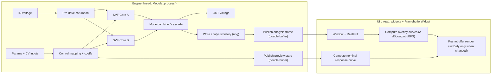
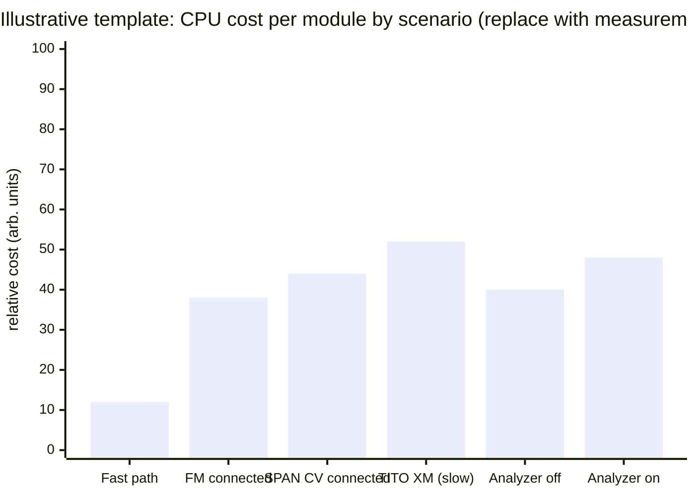

# Bifurx Module Improvement Research Report

## Executive summary

Prepared for Dragon King Leviathan.

The provided module is a **C++ Rack-plugin module** (plugins are written in C++11) citeturn1search7 that implements a **dual-core state-variable filter (SVF)** with 10 mode topologies, plus an on-panel **real-time preview** consisting of (a) a nominal magnitude-response curve and (b) a live FFT-based spectrum overlay. The implementation is already aligned with several key real-time and UI-performance best practices: it avoids UI-thread redraw cost by using a framebuffer caching pattern that is explicitly recommended for complex widgets citeturn4view0, it uses Rack’s fast exp2 approximation (`dsp::exp2_taylor5`) as suggested in Rack’s plugin API guidance citeturn12search4turn2search0, and it moves FFT work to the UI thread (with audio-thread capture and double buffering).

The highest-value improvements fall into three buckets:

- **UX correctness** (critical): the spectrum peak markers currently **clamp and relabel out-of-band peaks as if they were in-band**, which conflicts with your design notes emphasizing “SPAN can push peaks out of the audible range” as a user hazard. This can make the preview misleading precisely when the user needs it most.
- **Audio-thread determinism and efficiency**: there are a couple of small-but-worthwhile audio-thread hot-path refinements—especially removing an unnecessary per-sample atomic load and replacing modulo-copy loops with `memcpy` slices—to reduce worst-case jitter risk (real-time code should avoid blocking/slow calls such as file I/O, locks, and allocations in the process callback) citeturn5search2turn4view2.
- **Maintainability and regression safety**: the per-mode mixing formulas are duplicated (audio path vs. preview path). Centralizing them (via a templated “mode combiner”) will reduce drift risk and enable stronger automated tests.

A prioritized change table is included below with estimated effort and risk, plus concrete code-level patches/pseudocode for the most critical fixes, recommended static analysis rules/commands, a benchmarking plan (including mermaid diagrams and chart templates), and a test/CI roadmap.

## Current module scope and architecture

This module’s public surface area (its “API” from a Rack user’s perspective) is essentially:

- **Params**: MODE, LEVEL, FREQ, RESO, BALANCE, SPAN, FM AMT, SPAN CV ATTEN, TITO, plus two mode step buttons.
- **Ports**: IN, OUT, V/OCT, FM, RESO CV, BALANCE CV, SPAN CV.
- **Behavioral contract**: stable real-time audio processing and a preview UI that helps users understand what the filter is doing.

Internally, there are three coupled sub-systems:

- **Audio DSP core**: two SVF cores (A and B) using a trapezoidal-integrator/TPT-style structure (your coefficient mapping uses `tan(pi * f / fs)` prewarping, consistent with common BLT/TPT filter derivations) citeturn14search36turn12search2. Mode logic combines/cascades LP/BP/HP/Notch outputs into 10 distinct topologies.
- **Preview state publishing**: a small state struct is written on the audio thread into a double buffer, with `std::atomic` index/sequence used by the UI thread for lock-free consumption (release on publish, acquire on read). This is the right general pattern for avoiding mutexes in the audio thread, and it complements the Rack guidance that `Module::process()` is not called concurrently with other `Module` methods, but UI widgets *are* an independent concern citeturn4view2.
- **Spectrum overlay**: the audio thread records input/output history and periodically publishes an analysis frame (double-buffered) for the UI thread to window + FFT. Rack’s `dsp::RealFFT` requires **length multiple of 32** and **16-byte aligned buffers**, and your code satisfies this with `kFftSize = 4096` and `alignas(16)` buffers citeturn1search1. The UI applies a Hann window before FFT; that window is commonly defined as \(w(n)=0.5 - 0.5\cos(2\pi n/(M-1))\) citeturn7search12turn7search48.

Mermaid overview of the dataflow (current design, simplified):



This architecture is fundamentally sound for Rack-style real-time DSP: the heavy FFT work is off the audio thread, and the UI rendering is cached via a framebuffer—explicitly recommended because `Widget::draw()` runs every screen frame citeturn4view0.

## Key findings by nonfunctional requirement

### Performance and CPU jitter

The module already distinguishes a **fast path** (no modulation cables, TITO=CLEAN) from a **slow path** (any modulation present or TITO ≠ CLEAN), which is an excellent “pay only for what you use” strategy for Rack patches.

The main opportunities are micro-optimizations that reduce *worst-case* audio-thread jitter rather than average CPU:

- The analysis publisher currently performs a per-sample `analysisPublishSeq.load(relaxed)` check once the FFT buffer is filled. Even relaxed atomics can be avoided when they serve only as a “first publish” latch.
- `publishAnalysisFrame()` uses a per-element modulo index in a `for` loop; slicing with two `memcpy` calls is simpler and tends to compile into highly optimized copies (and avoids modulus in the inner loop).
- Preview publishing is cheap, but its comparison function calls `log2()`; it only runs on a divider tick, so it is not pathological, but it is still “expensive math on the audio thread.” The current divider (128 samples) means the check runs ~375 times/sec at 48 kHz.

These are not catastrophic, but they are low-effort wins and reduce the likelihood of audio dropouts in busy patches. The broader principle—avoid calling anything in the real-time process callback that can allocate, block, lock, or touch filesystem/network/UI—is widely emphasized in plugin real-time guidance citeturn5search2turn4view2.

### Memory and allocation behavior

The code appears real-time safe with respect to allocations:

- No per-sample dynamic allocations in the audio thread.
- UI thread uses stack arrays in FFT update; reasonable size for typical UI thread stacks.
- FFT buffers are statically allocated and aligned for `dsp::RealFFT` requirements citeturn1search1.

One enhancement worth making for robustness is **NaN/Inf containment**: if an upstream module ever emits NaNs (rare, but it happens), SVF state can become NaN and then persist. This becomes both a stability and a “security-like” hardening issue (protect against malformed numeric inputs).

### Concurrency correctness

The module uses a lock-free double-buffer publish scheme with acquire/release atomics. That’s an appropriate pattern for UI/audio sharing. The important memory-model concept is that a release operation ensures all prior writes in that thread become visible to an acquiring load on the same atomic variable citeturn1search16turn1search4. Your sequence counter and published-index scheme aligns with this model.

However, concurrency is notoriously hard to reason about by inspection alone—so the best “improvement” here is adding a **ThreadSanitizer-backed test harness**. ThreadSanitizer is explicitly designed to detect data races and is enabled with `-fsanitize=thread` citeturn15search1. You will almost certainly catch any accidental future regressions (e.g., a new UI widget reading a non-buffered variable).

### Security posture

This module is not network- or file-facing, so “security” is primarily about **memory safety, numeric safety, and supply-chain hygiene** (CI checks, sanitizers, dependency pinning).

The most relevant hardening actions are:

- Enable sanitizers in CI (ASan, UBSan, TSan): AddressSanitizer detects OOB and use-after-free citeturn8search9; UBSan detects undefined behavior like signed overflow and invalid conversions citeturn8search0; TSan detects data races citeturn15search1.
- Add fuzz testing at the “DSP core” boundary: libFuzzer is an in-process coverage-guided fuzzer suited for library-like APIs citeturn6search1.

### Maintainability and extensibility

Two maintainability risks stand out:

- **Duplicated mode math**: the preview curve and the DSP output both encode the 10-mode formulas with “magic coefficients” (e.g., 0.95, 1.05, -0.12, 1.15…). Any future tuning risks drift (preview no longer matches reality) unless changed in both places.
- **Single large translation unit**: UI code, DSP code, and panel wiring are all in one file. That’s workable for v1, but it raises the cost of future extension (polyphony, oversampling, context menu options, additional displays, etc.), and it complicates focused testing.

Rack’s plugin documentation explicitly encourages patterns like caching via `FramebufferWidget` for complex widgets citeturn4view0 and using the DSP library where appropriate citeturn12search4turn2search7. You’re already doing some of this; the maintainability improvements are mainly about structure and eliminating duplication.

## Proposed improvements and prioritization

The table below is intentionally pragmatic: the top items are either (a) likely to improve user trust in the visualizer, (b) reduce “pop/click risk” via less jitter, or (c) prevent future regressions via tests and centralization.

### Proposed change table

| Change | Description | Primary benefit | Risk | Est. effort (hours) | Priority |
|---|---|---|---|---:|---|
| Fix out-of-band peak markers | If a peak is < min display Hz or > max display Hz, show “<10 Hz” / “>20 kHz” (or arrows), instead of clamping label to the edge value. | Prevents misleading preview when SPAN pushes peaks out of audible band (explicit UX hazard in design notes). | Low | 2–4 | P0 |
| Reduce analysis publish overhead | Remove per-sample atomic “first publish” load; use a non-atomic latch. Replace modulo copy loop with 2× `memcpy` slices. | Lower audio-thread jitter, simpler code. | Low | 2–5 | P0 |
| Add numeric hardening | Clamp/sanitize NaN and Inf on input and on key internal signals; optionally de-denormalize SVF state near zero. | Prevents persistent NaN states; improves stability in hostile numeric conditions. | Low | 1–3 | P0 |
| Add bypass routing | Add `configBypass(IN_INPUT, OUT_OUTPUT)` so bypass behaves as expected for a filter/effect module. | Better UX and consistency with Rack guidance. | Low | 0.5–1 | P0 |
| Move sample-rate-dependent caches to event | Compute preview smoothing alpha and invalidate cached coeffs in `onSampleRateChange` instead of checking every sample. | Small CPU win, clearer lifecycle. Rack supports sample rate change events. | Low | 1–2 | P1 |
| Centralize mode-combine math | Implement `combineMode<T>()` templated on scalar vs complex; use it in both audio path and preview response. | Prevents preview/DSP drift; simplifies tuning. | Medium | 4–10 | P1 |
| Add analyzer enable/disable option | Context menu: toggle spectral overlay capture and FFT overlay rendering. | Lets users trade CPU for visuals; reduces cost in big patches. | Low | 2–6 | P1 |
| Replace custom biquad math with Rack filter utility | Use `rack::dsp::BiquadFilter` / `IIRFilter` response helpers instead of hand-coded biquad equations where feasible. | Less DSP math to maintain; consistent implementation. | Low–Med | 3–8 | P2 |
| Build a dedicated DSP test harness | Headless tests: impulse/sine sweep responses per mode; stability and “no NaN” properties. | Regression safety; supports safe refactor and tuning. | Low–Med | 10–24 | P1 |
| CI: sanitizers + clang-tidy + format | GitHub workflow with matrix builds; run clang-tidy, ASan/UBSan, and (where possible) TSan; upload logs. | Catches UB/races early; improves long-term quality. | Medium | 8–20 | P1 |
| Improve overlay scaling heuristic | Make dBFS top-scale selection configurable; optionally use a faster/clearer percentile estimator. | More legible overlay in varied material. | Low | 3–6 | P2 |
| Optional oversampling around saturation | Add optional 2× oversampling around the nonlinear stages. | Reduced aliasing in heavy drive. | High | 16–40 | P3 |
| Preview accuracy upgrade | Derive magnitude response from the exact SVF structure (vs. biquad approximation) for closer preview fidelity at high resonance/TITO behavior. | Better WYSIWYG preview, especially near self-oscillation. | Medium–High | 12–30 | P3 |
| Polyphony support (v2+) | Process up to 16 channels, duplicating per-channel SVF state. | Modern Rack usability; broader patch compatibility. | High | 16–40 | P3 |

### Concrete code-level suggestions for critical fixes

#### Peak marker out-of-range labeling and rendering

**Issue**: the marker builder clamps `targetHz` to [minHz, maxHz] *and* formats the *clamped* value, so a true 4 Hz peak becomes labeled as “10.00Hz” (or whatever minHz is) if your display floor is 10 Hz. This is exactly the scenario where your design notes say users can “lose peaks” and need visual help.

**Fix**: maintain both the true target and the clamped draw position, and annotate label.

```cpp
// In BifurxSpectrumWidget::draw() helper area
struct Marker {
    float x;
    float y;
    float clampHz;
    bool isLow;
    bool isHigh;
    char label[16];
};

// Helper: prefix label in-place (simple safe utility)
static void prefixLabel(const char* prefix, char* s, size_t cap) {
    const size_t len = std::strlen(s);
    const size_t pre = std::strlen(prefix);
    if (pre + len + 1 > cap) return;
    std::memmove(s + pre, s, len + 1);
    std::memcpy(s, prefix, pre);
}

Marker buildMarkerAtFrequency(float targetHz, float yCurve, float minHz, float maxHz, float width) {
    Marker m{};
    m.isLow = targetHz < minHz;
    m.isHigh = targetHz > maxHz;
    m.clampHz = clamp(targetHz, minHz, maxHz);
    formatFrequencyLabel(m.clampHz, m.label, sizeof(m.label));
    if (m.isLow)  prefixLabel("<", m.label, sizeof(m.label));
    if (m.isHigh) prefixLabel(">", m.label, sizeof(m.label));

    m.x = clamp01(logPosition(m.clampHz, minHz, maxHz)) * width;
    m.y = yCurve;
    return m;
}
```

Render improvement (optional, but high UX value): if `isLow` or `isHigh`, draw a small arrow/triangle at the display edge to signal “offscreen” rather than just a circle.

#### Analysis publish: remove per-sample atomic load and modulo loop

**Issue**: `analysisPublishSeq.load(relaxed)` is executed once per sample after buffer fill. Also, the analysis frame copy uses modulo in the inner loop.

**Fix**: add a non-atomic latch and rewrite the copy as two linear slices.

```cpp
// In Bifurx member variables:
bool analysisPublishedOnce = false;

// In pushAnalysisSample():
if (analysisFilled == kFftSize) {
    ++analysisHopCounter;
    if (!analysisPublishedOnce || analysisHopCounter >= kFftHopSize) {
        analysisHopCounter = 0;
        publishAnalysisFrame();
        analysisPublishedOnce = true;
    }
}

// In publishAnalysisFrame():
void publishAnalysisFrame() {
    const int writeIndex = 1 - analysisPublishedIndex.load(std::memory_order_relaxed);

    const int start = analysisWritePos;              // where the ring "wraps"
    const int firstCount = kFftSize - start;
    const int secondCount = start;

    std::memcpy(&analysisFrames[writeIndex].input[0],
                &analysisInputHistory[start],
                firstCount * sizeof(float));
    std::memcpy(&analysisFrames[writeIndex].input[firstCount],
                &analysisInputHistory[0],
                secondCount * sizeof(float));

    std::memcpy(&analysisFrames[writeIndex].output[0],
                &analysisOutputHistory[start],
                firstCount * sizeof(float));
    std::memcpy(&analysisFrames[writeIndex].output[firstCount],
                &analysisOutputHistory[0],
                secondCount * sizeof(float));

    analysisPublishedIndex.store(writeIndex, std::memory_order_release);
    analysisPublishSeq.fetch_add(1, std::memory_order_release);
}
```

This keeps the same correctness story (double buffer + release publish), while reducing arithmetic and branch pressure on the audio thread.

#### Bypass routing

Rack’s own migration guidance calls out bypass routes as an optional v2 feature that improves usability for effect modules, with `configBypass()` examples citeturn13search0.

Add:

```cpp
configBypass(IN_INPUT, OUT_OUTPUT);
```

#### NaN/Inf containment

A lightweight pattern:

```cpp
inline float sanitizeFinite(float x) {
    return std::isfinite(x) ? x : 0.f;
}

void process(const ProcessArgs& args) override {
    float in = sanitizeFinite(inputs[IN_INPUT].getVoltage());
    ...
    float out = sanitizeFinite(computedOut);
    outputs[OUT_OUTPUT].setVoltage(out);
}
```

If you also want denormal protection (optional), you can zero out tiny SVF states occasionally (not necessarily every sample) to avoid subnormal-related slowdowns on some CPUs.

#### Centralizing mode logic to prevent drift

Template the mode combiner once:

```cpp
template <typename T>
T combineMode(int mode,
              const T& lpA, const T& bpA, const T& hpA, const T& ntA,
              const T& lpB, const T& bpB, const T& hpB, const T& ntB,
              float wA, float wB) {
    switch (mode) {
        case 0: return lpB * lpA;
        case 1: return T(0.95f) * T(wA) * lpA + T(1.05f) * T(wB) * bpB - T(0.12f) * (bpA + bpB);
        case 2: return T(1.05f) * T(wB) * lpB - T(0.55f) * T(wA) * bpA;
        case 3: return ntB * ntA;
        case 4: return T(0.95f) * T(wA) * lpA + T(0.95f) * T(wB) * hpB;
        case 5: return T(1.15f) * (T(wA) * bpA + T(wB) * bpB);
        case 6: return lpB * hpA;
        case 7: return T(1.05f) * T(wA) * hpA - T(0.55f) * T(wB) * bpB;
        case 8: return T(1.12f) * T(wA) * bpA + T(0.92f) * T(wB) * hpB - T(0.10f) * (hpA + bpB);
        case 9: return hpB * hpA;
        default: return T(1);
    }
}
```

Then:

- In audio path: pass floats.
- In preview path: pass `std::complex<float>`.

This single change dramatically reduces the chance that “sound tuning” and “visual tuning” diverge over time.

## Static analysis, benchmarking, and profiling plan

### Static analysis and linting recommendations

Because this code targets Rack plugins (C++11) citeturn1search7, keep checks compatible with that baseline, but still lean on high-signal tooling:

**clang-tidy**

Use a `.clang-tidy` that emphasizes bug-prone patterns, performance traps, and readability:

- `bugprone-*` (including checks like unsafe/deprecated functions) citeturn7search8  
- `performance-*`, `readability-*`, `cppcoreguidelines-*` (selectively) citeturn7search13turn7search11

Command (assuming you can generate `compile_commands.json` from your Rack build):

```bash
run-clang-tidy -p build \
  -checks='bugprone-*,performance-*,readability-*,cppcoreguidelines-*,-cppcoreguidelines-owning-memory' \
  -warnings-as-errors='bugprone-*,performance-*' \
  src/Bifurx.cpp
```

**clang-format**

Adopt a single enforced formatting profile and run:

```bash
clang-format -i src/Bifurx.cpp
```

**Clang Static Analyzer**

The analyzer is a path-sensitive symbolic executor that finds bugs across paths citeturn8search8. For Makefile-based Rack builds, a common pattern is:

```bash
scan-build --use-analyzer=clang++ make -j
```

**Sanitizers in developer builds**

- AddressSanitizer: detects OOB, UAF, double-free; typical slowdown ~2× citeturn8search9  
- UndefinedBehaviorSanitizer: detects UB such as signed overflow and invalid conversions citeturn8search0  
- ThreadSanitizer: detects data races; enabled with `-fsanitize=thread` citeturn15search1  

### Benchmarking and profiling scenarios

Use Rack’s own profiling first, because it measures “time spent in module thread” directly; Rack’s CPU meter exists but consumes engine CPU itself, so disable it when not needed citeturn13search10.

Profile these scenarios (each with 1, 10, 50, 200 module instances):

- Fast path: TITO=CLEAN, no CV inputs connected.
- Slow path FM: connect FM and drive audio-rate FM.
- Slow path SPAN: connect SPAN CV with audio-rate modulation.
- High resonance / near self-oscillation.
- Analyzer enabled vs disabled (after you add the toggle).

Also note Rack guidance: engine CPU usage scales almost proportionally with sample rate citeturn13search10—so test at 44.1k, 48k, and 96k if you want realistic worst-case bounds.

#### Profiling output chart template (illustrative)

Replace the numbers with measured values from Rack’s CPU meter or an external profiler.



### Microbenchmark harness recommendation

For deterministic performance comparisons (especially after refactors), make a standalone “DSP harness” that:

1. Instantiates the module.
2. Feeds a synthetic input buffer (sine, noise, impulse).
3. Processes N samples in a tight loop.
4. Measures total time and max per-block time.

This catches regressions that might not be obvious inside Rack due to other engine factors.

### Fuzzing and robustness stress

Use coverage-guided fuzzing for the DSP harness with libFuzzer citeturn6search1:

- Generate random sequences of parameter/CV changes.
- Assert: output is finite, no runaway amplitude, no crash.
- Save any crashing inputs to a corpus and run them in CI.

## Testing strategy and CI integration

### Unit and integration tests

For DSP modules, tests that actually catch regressions tend to be **signal-based**:

- **Impulse response snapshots** per mode (and a few key knob positions).
- **Steady-state sine response** at a few spot frequencies (e.g., 50 Hz, 440 Hz, 5 kHz) and multiple resonance values.
- **Sine sweep “shape tests”**: compute a coarse magnitude profile and verify the expected dual-peak structure and notch behavior per mode (tolerant comparisons, not exact bitwise).

For floating-point comparisons, avoid strict equality; use approximate comparisons (ULP or near bounds). GoogleTest documents explicit floating-point assertions like `EXPECT_NEAR` and ULP-based `EXPECT_FLOAT_EQ`/`EXPECT_DOUBLE_EQ` citeturn9search4.

### Concurrency/race tests

Add a stress test that runs:

- One thread: repeatedly calls the DSP `process` loop (harness).
- Another thread: repeatedly calls “UI-like” update methods that read published buffers.

Run under ThreadSanitizer (`-fsanitize=thread`) to detect data races citeturn15search1.

### CI pipeline

If you use GitHub Actions, the workflow syntax supports matrix strategies for building across OS/compiler variants citeturn11search6. Use caching for dependencies to speed workflows citeturn10search7 and upload artifacts (logs, sanitizer reports, benchmark outputs) for postmortem analysis citeturn11search0turn11search3.

Minimal CI outline (adapt to your Rack SDK build):

```yaml
name: ci

on:
  push:
  pull_request:

jobs:
  build-test:
    strategy:
      matrix:
        os: [ubuntu-latest, macos-latest, windows-latest]
        build_type: [Debug, Release]
    runs-on: ${{ matrix.os }}

    steps:
      - uses: actions/checkout@v4

      - name: Cache dependencies
        uses: actions/cache@v4
        with:
          path: |
            ~/.cache
          key: ${{ runner.os }}-${{ hashFiles('**/Makefile', '**/*.mk', '**/CMakeLists.txt') }}

      - name: Build plugin
        run: |
          export RACK_DIR=/path/to/Rack-SDK
          make -j

      - name: Run unit tests (if harness exists)
        run: |
          ctest --test-dir build --output-on-failure

      - name: Upload logs
        if: always()
        uses: actions/upload-artifact@v4
        with:
          name: logs-${{ matrix.os }}-${{ matrix.build_type }}
          path: |
            build/**/Testing/**/*.xml
            build/**/*.log
```

If you adopt CMake for the test harness, CMake’s `add_test()` and CTest integration make it straightforward to register and run tests citeturn10search0turn10search6.

## Compatibility and migration considerations

### Patch compatibility constraints

For Rack modules, patch compatibility is primarily:

- **Param/port IDs and meaning**: do not reorder enum values or change ranges without a migration strategy.
- **Default values**: changing defaults affects “Initialize” behavior and user expectation.
- **Behavioral drift**: changes in mode mixing coefficients, resonance scaling, or frequency mapping can invalidate patches “by sound,” even if they still load.

Therefore:

- Treat **mode coefficients** as a compatibility surface. Centralizing them (single source of truth) doesn’t change behavior, but makes future behavior changes deliberate.
- If you add context-menu toggles (e.g., analyzer on/off), store them in JSON only if you truly need patch persistence (Rack warns that large JSON saves can lag the UI; use patch storage directories for large data, and avoid process-thread file access) citeturn4view2turn13search0.
- Adding bypass routes is typically backward-compatible and recommended for effect modules citeturn13search0.

### Signal level expectations

Rack’s voltage standards indicate typical audio is ±5 V (10 Vpp) and dBFS can be referenced to -10..10 V full scale citeturn13search1. Your design (soft clip stages and output scaling) should remain consistent with those expectations when tuning drive/level behavior, especially if you later add oversampling or alter saturation curves.

### Where changes could “break sound”

The risk multipliers are:

- Any change that touches SVF coefficient mapping, damping→Q mapping, or mode combine constants.
- Any change that increases per-sample cost in the slow path (FM/SPAN at audio rate).
- Any change that introduces locking or file/UI interaction in `process()` (explicitly discouraged because it can cause hiccups) citeturn5search2turn4view2.

For v1 stability, I recommend treating “sound-shaping refactors” (oversampling, nonlinear SVF internals beyond cutoff modulation, preview accuracy overhaul) as **opt-in** via context menu until you have a strong regression test corpus.

### Source and best-practice anchors referenced

- Rack plugin/UI performance patterns and thread-safety notes from the official manual/API guide citeturn4view0turn4view2.
- Rack DSP primitives used by this module: `dsp::exp2_taylor5` accuracy bounds citeturn2search0turn2search7 and FFT alignment/size constraints citeturn1search1.
- Windowing theory and Hann definition citeturn7search48turn7search12.
- Real-time process constraints emphasized by an official plugin SDK FAQ (avoid locking, allocations, filesystem, network, UI calls in the realtime callback) citeturn5search2.
- Sanitizers (ASan/UBSan/TSan) and fuzzing engine (libFuzzer) from primary LLVM/Clang documentation citeturn8search9turn8search0turn15search1turn6search1.
- GitHub Actions workflow matrix/caching/artifacts from GitHub Docs citeturn11search6turn10search7turn11search0.

Key historical references (for algorithms used/approximated):
- entity["people","Robert Bristow-Johnson","audio filter designer"]’s “Audio EQ Cookbook” biquad formulas are a widely cited baseline for RBJ-style filter coefficients citeturn0search48.
- entity["people","Fredric J. Harris","windowing paper author"]’s classic windowing paper is a primary reference on DFT window tradeoffs citeturn7search48.
- entity["people","Vadim Zavalishin","native instruments engineer"]’s VA filter design text (hosted by entity["company","Native Instruments","music software company"]) is a canonical reference for modern virtual-analog filter discretization citeturn14search36.

Operational/tooling entities referenced once:
- entity["company","Steinberg","audio software company"] (VST3 real-time processing guidance) citeturn5search2.
- entity["organization","LLVM","compiler infrastructure project"] (sanitizers, libFuzzer) citeturn8search9turn6search1turn15search1.
- entity["company","GitHub","code hosting platform"] (Actions CI primitives) citeturn11search6turn10search7turn11search0.
- entity["organization","CMake","build system project"] (CTest integration) citeturn10search0turn10search6.
- entity["company","VCV","modular synth software company"] (manual and API docs used as primary guidance) citeturn4view0turn13search0turn13search1.