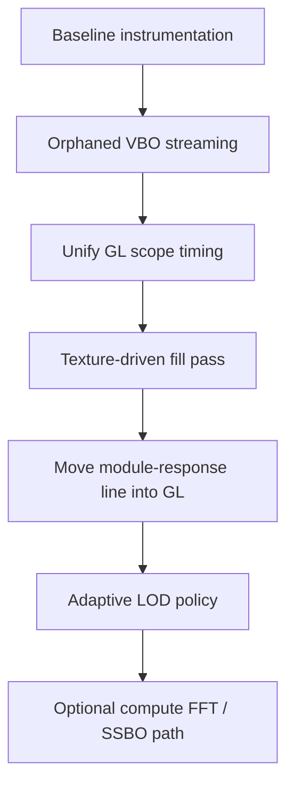

# Optimizing Bifurx’s OpenGL Shader Pipeline for Stable Draw Times

## Executive summary

The central finding is that Bifurx’s current OpenGL path is **not primarily a “heavy shader” problem**. It is a **CPU-driven geometry expansion and dynamic-buffer streaming problem with extra blended overdraw and a split GL + NanoVG composition path**. In the provided source, the FFT overlay and response fill are generated on the CPU into several transient vertex arrays every frame, then uploaded with `glBufferData`/`glBufferSubData` and drawn in multiple passes. The actual GLSL programs are modest: the main fill shader is nearly a passthrough, while the stroke shader adds a Gaussian-like alpha falloff via `exp`, `abs`, division, and clamp. That means draw-time spikes are more likely to come from **buffer update synchronization, repeated small draw phases, blend-heavy overdraw, and mixed backend rendering** than from raw shader ALU alone. fileciteturn0file1L139-L158 fileciteturn0file1L283-L295 fileciteturn0file1L694-L864 citeturn1search4turn10search0

The current architecture also keeps the FFT and overlay preparation on the CPU, either on the UI thread or in a worker thread, using `dsp::RealFFT` and per-bin smoothing/sampling before the GL stage ever runs. That is a good baseline for portability, but it means the GPU is mostly acting as a rasterizer for already-expanded geometry. In practical terms: **today’s draw spikes will usually be solved faster by reducing CPU-side vertex generation and avoiding implicit sync on dynamic VBO updates than by shaving a few shader instructions.** fileciteturn0file11L153-L234 fileciteturn0file8L1456-L1501 fileciteturn0file13L53-L121

The most valuable optimization sequence is therefore:

1. **Replace CPU-expanded fill geometry with a texture-driven or SSBO-driven shader path** that draws the FFT fill in one pass from a tiny uploaded spectrum/curve dataset rather than thousands of expanded vertices.
2. **Replace `glBufferSubData` streaming with orphaning or a mapped ring buffer**, and use fences only where the implementation needs them.
3. **Unify OpenGL and NanoVG responsibilities**, especially for the FFT/module-response overlay, so one backend does one visual layer.
4. **Collapse multi-pass feather/crest rendering into analytic AA in a single fragment pass** where feasible.
5. **Add adaptive LOD/progressive update policies** for interaction spikes.
6. **Treat GPU FFT as an optional advanced path**, not the first optimization, unless you intend to move the whole visualization pipeline onto the GPU. fileciteturn0file1L509-L564 fileciteturn0file1L738-L864 fileciteturn0file10L870-L877 citeturn1search4turn8search1turn9search1turn11search0turn8search0

For most desktop targets, a realistic expectation is that the first three changes together can reduce **draw() p95 and p99 spikes far more than average draw time**, often by **roughly 30–70% in the spike tail**, with the largest gains showing up on Intel iGPUs and on driver stacks that are sensitive to dynamic-buffer hazards. That range is an estimate, not a measured result yet; it should be validated with timer queries and system traces on the target hardware. citeturn1search4turn9search1turn12search0turn2search0turn2search3

## What the current Bifurx pipeline is doing

Bifurx’s GL widget maintains several CPU-side vectors for fill triangles, feather triangles, crest lines, crest stroke quads, and cyan/module-response vertices. Their capacities are reserved up front, which avoids allocator churn, but the vectors are still cleared and rebuilt each frame inside `drawFramebuffer()`. The renderer then uploads vertex data to one of two dynamic VBOs and issues separate draws for fill, soft-cap feathering, and stroke quads. In the shader path, attribute arrays are also re-enabled and rebound every draw. fileciteturn0file1L25-L79 fileciteturn0file1L509-L564 fileciteturn0file1L729-L864

The FFT fill overlay is built segment-by-segment in CPU code. For each adjacent point pair, Bifurx computes average module delta, average output dBFS, derives energy, mixes colors, computes two strip triangles for the solid fill, two extra feather layers, and a separate crest segment plus an expanded stroke quad. That is a classic CPU tessellation pattern: good for compatibility, but prone to CPU cost and dynamic-buffer streaming hazards. fileciteturn0file1L738-L805

The current shader complexity is modest. The fill shader uses a 2D position and 4D color attribute, converts to NDC using one viewport uniform, and outputs the interpolated color directly. The stroke shader adds a smoothed alpha coverage based on side distance and radius, with one exponential. In other words, **the fragment math exists, but the renderer is not dominated by complicated shading logic** the way a full image-processing path would be. fileciteturn0file1L139-L158 fileciteturn0file1L264-L295

The FFT and response data are currently prepared on the CPU. `prepareCurveSnapshot()` in `BifurxRenderPrep.cpp` applies a Hann window, runs one FFT for output, and—when module response is enabled—two more FFTs for response output and raw input. It then performs power conversion, smoothing, and resampling back onto the curve positions. The same logic also exists in the direct UI-thread path (`updateOverlayCache()`), while the worker service can offload it and reuse curve results across snapshots. This means Bifurx already has a strong CPU-side preprocessing pipeline; the GPU is mostly consuming finished visualization primitives. fileciteturn0file11L196-L234 fileciteturn0file8L1456-L1501 fileciteturn0file13L93-L121

A particularly important detail is that the OpenGL mode still draws additional overlay content through NanoVG. In `BifurxUI.cpp`, when the module is in `RENDER_OPENGL`, the widget still calls `drawNanoVG()`. That NanoVG overlay draws the cyan module-response line, markers, labels, and refined expected-curve strokes. So the “OpenGL renderer” is currently a **hybrid**: GL renders parts of the fill, then NanoVG renders additional spectrum/UI layers over it. This split backend increases state churn, duplicates some visual responsibilities, and makes frame analysis noisier. fileciteturn0file10L870-L877 fileciteturn0file1L878-L1030

Another revealing detail: the code constructs `cyanVertices` and `cyanHaloVertices` in `drawFramebuffer()`, but the shader path shown in the provided file does not actually draw them there; the visible cyan line is drawn in NanoVG instead. So some CPU work is already being spent on geometry that is not the active rendering path. Even when that cost is small, it is exactly the kind of hidden redundancy that shows up as p99 volatility. fileciteturn0file1L808-L864 fileciteturn0file1L904-L919

The current data flow is best summarized like this:


That architecture is portable and straightforward, but it leaves performance exposed in exactly the places where OpenGL drivers are most likely to introduce stalls: **streaming writes to in-use buffers, repeated state rebinding, and alpha-blended overdraw.** citeturn1search4turn10search0turn10search3

## Profiling methodology and the exact metrics to collect

The first rule is to separate **CPU wall-clock time** from **GPU execution time**. OpenGL’s command stream is asynchronous; a fast return from `glDrawArrays` does not mean the GPU finished quickly, and a slow return from a buffer upload may reflect synchronization with prior GPU work rather than the copy volume itself. Khronos’ query-object documentation explicitly recommends timer queries for asynchronous GPU timing, and the synchronization/memory-model docs explain why calls like `glBufferSubData`, `glTexSubImage2D`, and `glReadPixels` can force ordering or completion. citeturn0search1turn10search0turn10search3

### Metrics to instrument in Bifurx itself

Add these per-frame metrics around the spectrum widget:

| Metric | How to measure | Why it matters |
|---|---|---|
| `drawFramebuffer_cpu_ms` | `steady_clock` around `drawFramebuffer()` | Detects CPU-side geometry building, GL API overhead, and driver stalls visible to the caller. |
| `runRenderTick_cpu_ms` | `steady_clock` around `runRenderTick()` | Separates prep/animation cost from GL cost. |
| `curvePrep_us`, `overlayPrep_us` | Already present in Bifurx | Confirms whether CPU-side FFT/prep is the main issue or merely background cost. |
| `bytes_uploaded_per_frame` | Sum bytes passed to VBO updates and texture uploads | Helps correlate spikes with streaming. |
| `draw_call_count` | Count GL draws from this widget | Identifies batching opportunities. |
| `vertex_count_by_pass` | Fill / feather / stroke / line | Shows whether CPU tessellation is exploding. |
| `gpu_ms_fill`, `gpu_ms_stroke`, `gpu_ms_total` | `GL_TIME_ELAPSED` query ring | Distinguishes CPU-side stalls from actual GPU bottlenecks. |
| `worker_queue_latency_ms`, `worker_snapshot_age_ms` | Already present in Bifurx | Confirms whether worker lag is contributing to visible jank. |
| `overdraw_proxy` | Count blended passes × covered plot area; validate with frame debugger heatmaps | Indicates whether fill-rate dominates. |

The source already exposes useful timing hooks—`lastCurvePrepUs`, `lastOverlayPrepUs`, `lastDrawNs`, `stepUsRange`, worker queue latency, and snapshot age—so extend that telemetry rather than starting from zero. fileciteturn0file1L60-L67 fileciteturn0file1L694-L872 fileciteturn0file8L1566-L1578 fileciteturn0file13L93-L121

### Commands and tools to use

For **GL API tracing and replay**, use apitrace:

```bash
apitrace trace --api gl --output bifurx.trace ./RackApp
qapitrace bifurx.trace
apitrace replay bifurx.trace
```

apitrace can trace, replay, inspect, and profile OpenGL traces, and its usage docs show the core commands above. It is especially useful for verifying draw-call order, repeated state changes, and whether apparently random spikes correspond to a specific API pattern. citeturn19search0turn19search1

For **NVIDIA GPUs**, use Nsight Graphics OpenGL Frame Debugger. It is appropriate for frame capture, event inspection, pipeline-state review, pixel history, and real-time frame-time HUD inspection. Use this to identify draw-call hot spots, inspect bound resources, and confirm whether the widget is fragment-bound or just suffering from state churn. citeturn18search0turn18search1turn18search2

For **Intel GPUs**, use Intel GPA where OpenGL support is available on the target driver/tool combination, especially to identify whether the bottleneck is front-end, shader, sampler, or backend, and to inspect shader source/assembly correlation. Intel’s docs specifically recommend using Graphics Frame Analyzer to identify bottlenecks and inspect shader resource use and assembly. citeturn2search1turn2search2turn2search3

For **Linux CPU-side analysis**, use `perf`:

```bash
perf stat -d -- ./RackApp
perf record -F 999 -g -- ./RackApp
perf report
```

`perf stat` captures cycles, instructions, cache behavior, and IPC; `perf record/report` with call graphs will show whether the spikes land in Bifurx CPU geometry construction, string/font/NanoVG work, or OpenGL driver entry points. citeturn20search4turn20search0turn20search3

For **system-wide cross-thread correlation on Linux/Android-like stacks**, use Perfetto to collect CPU scheduling and GPU render-stage timelines. Its system tracing and GPU data-source docs are useful when you need to understand whether UI-thread spikes line up with worker wakeups, compositor activity, or GPU-frequency shifts. citeturn5search1turn5search2turn5search0

For **Apple platforms**, tooling is more constrained. Xcode’s current GPU capture workflow is centered on Metal and legacy OpenGL ES capture; it remains useful for frame capture workflow and replay/profiling concepts, but desktop OpenGL support is legacy and should be treated as limited compared with current Metal tooling. citeturn6search0turn6search1turn6search6turn6search7

### Exact GL instrumentation to add

Use a **ring of timer queries** so query-result retrieval never blocks the same frame:

```cpp
struct ScopedGpuTimer {
    GLuint q = 0;
    void begin() { glBeginQuery(GL_TIME_ELAPSED, q); }
    void end()   { glEndQuery(GL_TIME_ELAPSED); }
};

// Create N query objects and read back results N frames later.
```

`GL_TIME_ELAPSED` reports nanoseconds for a scoped GPU interval, and query objects are asynchronous by design. Read them back two to four frames later to avoid accidentally re-introducing sync. citeturn0search1turn13search6

If the driver exposes **pipeline statistics queries**, collect them too for A/B testing of future GPU-driven paths: submitted vertices, generated primitives, and shader-invocation counts. This is not universally available, so treat it as optional. Khronos lists `GL_ARB_pipeline_statistics_query` in the registry, which is enough to justify feature detection in a profiling build. citeturn14search1turn14search0

## Prioritized optimization program

### The recommended order of work

The table below ranks the most valuable changes for Bifurx as it exists now.

| Optimization | Expected impact on draw spikes | Complexity | Visual-quality risk | Why it ranks here |
|---|---:|---:|---:|---|
| Move FFT fill to a texture-driven single-pass shader | High | Medium | Low–Medium | Eliminates CPU tessellation and most dynamic VBO traffic. |
| Replace `glBufferSubData` streaming with orphaning or mapped ring buffers | High | Low–Medium | Low | Directly addresses implicit synchronization hazards in the current path. |
| Unify GL and NanoVG overlay rendering responsibilities | Medium–High | Medium | Low | Removes cross-backend duplication and state churn. |
| Collapse feather + crest multi-pass fill into analytic AA in one pass | Medium | Medium | Low–Medium | Reduces overdraw and draw calls. |
| Adaptive LOD / progressive rendering under load | Medium | Low | Medium | Particularly effective against p99 spikes during interaction. |
| Optional compute-shader FFT + SSBO pipeline | Medium–High on some systems | High | Low | Strong long-term path, but not the fastest short-term win. |
| Introduce VAOs and pre-baked static geometry for modern path | Low–Medium | Low | Low | Small CPU improvement; nice cleanup, but not the main problem. |
| Precision/data packing reductions | Low–Medium | Low–Medium | Low | Helps bandwidth/cache pressure, especially on Intel/iGPU paths. |
| Instancing / transform feedback fallback | Medium | Medium–High | Low | Good compatibility bridge if compute is unavailable. |

### Why the top choices win

The first recommendation—**texture-driven fill**—works because the current renderer is building many triangles only to approximate what is fundamentally a 1D sampled signal stretched across a 2D plot. You can instead upload a compact 1D curve texture (or SSBO on GL 4.3+) containing output dBFS and module delta, and let the fragment shader reconstruct fill height, color, feather, and crest in one pass over a rectangle. That replaces the current per-frame CPU segment expansion and reduces draw calls from multiple passes to one or two. Since the existing fill shader is already simple, this is the natural next step. fileciteturn0file1L738-L805 fileciteturn0file1L829-L864 citeturn8search0turn12search2turn12search3

The second recommendation—**fix the streaming pattern**—comes directly from Khronos guidance. Buffer streaming is efficient only when you avoid implicit synchronization. The current code chooses between `glBufferData(..., verts.data(), GL_DYNAMIC_DRAW)` when capacity grows and `glBufferSubData` otherwise. That is legal, but repeated `glBufferSubData` into a buffer still in use by prior draws is a classic way to get intermittent stalls. The Khronos buffer-streaming docs, `glMapBufferRange` docs, and `glBufferStorage` docs all point toward either orphaning, unsynchronized mapping with discipline, or persistent mapping with proper fences. fileciteturn0file1L509-L564 citeturn1search4turn9search1turn8search1turn1search0

The third recommendation—**stop splitting overlay work between GL and NanoVG**—matters because even a perfect GL fill pass will not stabilize total draw time if the widget still does a separate NanoVG overlay pass for the module-response line, markers, labels, and refined expected curve. For the FFT-specific problem the first move should be to bring the module-response cyan line and, ideally, the expectation curve into GL so the plot body is rendered by one engine. Leave labels/text in NanoVG if you must, but stop drawing plot geometry twice through two different pipelines. fileciteturn0file10L870-L877 fileciteturn0file1L878-L1030

### Buffer-update methods compared

| Method | OpenGL support | Spike resistance | CPU overhead | Implementation notes |
|---|---|---:|---:|---|
| `glBufferSubData` into one live VBO | Very broad | Poor–Moderate | Low | Simple, but vulnerable to implicit sync if GPU still reads that range. |
| Orphan with `glBufferData(NULL, size, ..., usage)` then upload | Broad | Good | Low | Often the best first fix when staying on legacy GL. |
| `glMapBufferRange` + `GL_MAP_INVALIDATE_BUFFER_BIT` | GL 3.0+ | Good | Low–Moderate | Good if you manage ranges carefully. |
| `glMapBufferRange` + `GL_MAP_UNSYNCHRONIZED_BIT` | GL 3.0+ | Good–Excellent | Low | Fast, but unsafe unless you guarantee no overlap with in-flight GPU reads. |
| Persistent mapped ring buffer via `glBufferStorage` | GL 4.4 / `ARB_buffer_storage` | Excellent | Very low | Best long-term streaming path; requires fence discipline. |

This table mirrors Khronos’ streaming guidance closely. The practical takeaway for Bifurx is simple: if you keep CPU-generated vertices, **orphan first**, then migrate to a persistently mapped ring when you want the last bit of stability. citeturn1search4turn9search1turn8search1turn1search0

### CPU FFT versus GPU FFT

| Option | Strengths | Weaknesses | Best fit for Bifurx |
|---|---|---|---|
| CPU FFT on worker thread | Portable, already implemented, low startup risk | Still leaves CPU preprocessing and upload traffic | Best short-term baseline |
| GPU FFT via compute shader + SSBO | Can keep whole visualization GPU-resident; scales if many widgets/instances | Requires GL 4.3+, SSBOs, barriers, fallback path | Best long-term modern path |
| GPU-ish fallback via transform feedback / vertex pipeline | Works before compute on some drivers | More awkward than compute; harder to maintain | Good compatibility bridge if modern GL but no compute policy |
| Approximate / reduced FFT | Cheap and stable during interaction | Lower spectral fidelity | Excellent adaptive mode, not permanent default |

Cooley–Tukey is the classical FFT algorithm foundation, and modern high-performance FFT practice is as much about memory hierarchy and data motion as arithmetic count. For Bifurx specifically, because the current renderer already offloads FFT prep to a worker and the display is only one widget, **GPU FFT is not the first optimization I would do**. It becomes compelling when paired with GPU-resident rendering data so the FFT result never returns to CPU space. citeturn17search0turn17search43turn11search0turn8search0turn9search2

### Precision, MSAA, mipmaps, and platform notes

On desktop GLSL, `highp`/`mediump`/`lowp` qualifiers do not have functional effect; they exist mainly for OpenGL ES compatibility. So simply sprinkling `mediump` into a desktop `#version 120` path will not buy performance. If you want precision-related gains on desktop OpenGL, the practical levers are **packed vertex formats, half-float textures/buffers where supported, and smaller resource formats native to the hardware**. Intel’s guidance explicitly highlights native formats and the performance/power upside of 16-bit data paths on supporting hardware. citeturn10search2turn2search0turn2search43

MSAA is also a low-priority optimization target for this widget. Khronos notes that multisampling still incurs per-sample backend work even when fragment shading is not fully per-sample. Since Bifurx is already doing feathered antialiasing in geometry and shaders, **MSAA usually costs more than it helps for this panel**. If this widget is rendered into its own FBO, disable or reduce MSAA there unless a visual A/B test proves otherwise. Mipmaps, similarly, matter only if you adopt texture-based lookup/storage for the curve data and sample it with minification; for the current path they are irrelevant. citeturn10search5turn12search0turn12search2

For cross-platform planning, note that compute shaders and SSBOs are core from OpenGL 4.3 onward, while persistent mapped buffers are core in 4.4. A modern path should therefore be **feature-detected**, not assumed. Keep a legacy path for older drivers and conservative DAW/plugin hosts. citeturn11search0turn11search1turn8search0turn8search1

## Code patterns for the top recommended changes

### Texture-driven single-pass FFT fill

This is the biggest architectural win. Upload a compact 1D texture each analysis update, not expanded triangles each frame. One sample can store output dBFS and module delta in `RG16F` or `RG32F`.

```cpp
// CPU side: one tiny upload per analysis update, not per draw.
// curveTex width = kCurvePointCount, height = 1
struct CurveSample {
    uint16_t outputDbfsHalf;
    uint16_t moduleDeltaHalf;
};

std::array<CurveSample, kCurvePointCount> texels;
for (int i = 0; i < kCurvePointCount; ++i) {
    texels[i].outputDbfsHalf = floatToHalf(state.overlayOutputDbfs[i]);
    texels[i].moduleDeltaHalf = floatToHalf(state.overlayModuleDb[i]);
}

glBindTexture(GL_TEXTURE_2D, curveTex);
glTexSubImage2D(GL_TEXTURE_2D, 0, 0, 0, kCurvePointCount, 1,
                GL_RG, GL_HALF_FLOAT, texels.data());

// Draw a static quad covering the plot rectangle.
glBindVertexArray(plotQuadVao);
glUseProgram(plotFillProgram);
glUniform2f(uViewport, w, h);
glUniform1f(uDisplayTopDbfs, state.displayTopDbfs);
glUniform1f(uDisplayMinDbfs, state.displayTopDbfs - kDisplayDbfsSpan);
glUniform1f(uSpectrumBottomY, spectrumBottomY);
glUniform1f(uSpectrumTopY, spectrumTopY);
glDrawArrays(GL_TRIANGLE_STRIP, 0, 4);
```

```glsl
// Fragment shader concept for one-pass fill + feather + crest.
// Modern GLSL shown for clarity; adapt syntax as needed for legacy path.
uniform sampler2D uCurveTex; // width = kCurvePointCount, height = 1
uniform vec2 uPlotSize;
uniform float uDisplayTopDbfs;
uniform float uDisplayMinDbfs;
uniform float uSpectrumBottomY;
uniform float uSpectrumTopY;

float yForDbfs(float dbfs) {
    float t = clamp((dbfs - uDisplayMinDbfs) / (uDisplayTopDbfs - uDisplayMinDbfs), 0.0, 1.0);
    return mix(uSpectrumBottomY, uSpectrumTopY, t);
}

vec2 sampleCurve(float x01) {
    return texture(uCurveTex, vec2(x01, 0.5)).rg; // outputDbfs, moduleDeltaDb
}

void main() {
    float x01 = gl_FragCoord.x / uPlotSize.x;
    vec2 s = sampleCurve(x01);
    float curveY = yForDbfs(s.r);

    float inside = step(gl_FragCoord.y, uSpectrumBottomY) * step(curveY, gl_FragCoord.y);
    float crestDist = abs(gl_FragCoord.y - curveY);

    // Analytic feather instead of extra geometry passes.
    float fillAlpha  = inside * 0.92;
    float feather    = exp(-0.5 * crestDist * crestDist / (2.0 * 2.0));
    float crestAlpha = 0.22 * feather;

    // Color logic adapted from existing energy/module-delta tinting.
    vec3 baseColor = computeBifurxTint(s.r, s.g);
    gl_FragColor = vec4(baseColor, max(fillAlpha, crestAlpha));
}
```

This shift removes most per-frame vertex generation and lets buffer traffic scale with `kCurvePointCount`, not with expanded triangle count. The idea is especially strong because Bifurx’s fill is inherently defined by a sampled curve already stored on the CPU. fileciteturn0file1L738-L805 citeturn12search2turn12search3turn2search43

### Orphaned streaming VBO for the legacy CPU-geometry path

If you keep the current geometry model, at least stop writing into a likely-in-use buffer with plain `glBufferSubData`:

```cpp
void uploadDynamicVerts(GLuint vbo, const void* data, size_t bytes) {
    glBindBuffer(GL_ARRAY_BUFFER, vbo);

    // Orphan old storage first.
    glBufferData(GL_ARRAY_BUFFER, bytes, nullptr, GL_STREAM_DRAW);

    // Then upload fresh contents.
    glBufferSubData(GL_ARRAY_BUFFER, 0, bytes, data);
}
```

For Bifurx, this is the lowest-risk immediate change to `drawVertsShader()` and `drawStrokeQuadsShader()`. It often solves the worst p99 spikes before any deeper redesign. fileciteturn0file1L509-L564 citeturn1search4turn10search0

### Persistently mapped ring buffer with explicit fences

For GL 4.4 or `ARB_buffer_storage`, migrate dynamic geometry to a persistently mapped ring:

```cpp
struct RingChunk {
    size_t offset;
    size_t size;
    GLsync fence = 0;
};

GLuint ringVbo = 0;
uint8_t* ringPtr = nullptr;
size_t ringSize = 1 << 20; // tune
size_t writeHead = 0;

void initPersistentRing() {
    glBindBuffer(GL_ARRAY_BUFFER, ringVbo);
    glBufferStorage(GL_ARRAY_BUFFER, ringSize, nullptr,
        GL_MAP_WRITE_BIT |
        GL_MAP_PERSISTENT_BIT |
        GL_MAP_COHERENT_BIT);
    ringPtr = (uint8_t*)glMapBufferRange(GL_ARRAY_BUFFER, 0, ringSize,
        GL_MAP_WRITE_BIT |
        GL_MAP_PERSISTENT_BIT |
        GL_MAP_COHERENT_BIT);
}

RingChunk allocChunk(size_t bytes, RingChunk* slots, int index) {
    RingChunk& slot = slots[index];
    if (slot.fence) {
        while (true) {
            GLenum st = glClientWaitSync(slot.fence, 0, 0);
            if (st == GL_ALREADY_SIGNALED || st == GL_CONDITION_SATISFIED) break;
        }
        glDeleteSync(slot.fence);
        slot.fence = 0;
    }
    if (writeHead + bytes > ringSize) writeHead = 0;
    slot.offset = writeHead;
    slot.size = bytes;
    writeHead += bytes;
    return slot;
}

void submitChunk(const RingChunk& c, const void* src, size_t bytes) {
    std::memcpy(ringPtr + c.offset, src, bytes);
    glBindBuffer(GL_ARRAY_BUFFER, ringVbo);
    glVertexAttribPointer(0, 2, GL_FLOAT, GL_FALSE, sizeof(GlVertex), (void*)c.offset);
    glDrawArrays(GL_TRIANGLES, 0, bytes / sizeof(GlVertex));
}
```

Use `glFenceSync` after submitting each chunk or frame-range and wait only before reusing the same chunk. Khronos’ sync-object and buffer-storage guidance makes this the best spike-resistant streaming model once you can require the feature. citeturn8search1turn1search0turn1search1

### Unify the module-response line into GL and remove duplicate plot work from NanoVG

The current GL path builds cyan vertices but relies on NanoVG for the visible line. Move that line into GL so the plot body is rendered by a single backend:

```cpp
// Build one polyline source once per frame from overlayModuleDb.
std::vector<GlVertex> moduleLine;
moduleLine.reserve(kCurvePointCount);
for (int i = 0; i < kCurvePointCount; ++i) {
    float x = w * (float(i) / float(kCurvePointCount - 1));
    float y = responseYForDb(state.overlayModuleDb[i]);
    moduleLine.push_back({x, y, cyan.r, cyan.g, cyan.b, cyan.a});
}

// Expand to AA quads on CPU for legacy path, or use a polyline/strip shader on modern path.
strokeQuadVertices.clear();
appendStrokePolyline(moduleLine, 1.25f, &strokeQuadVertices);
drawStrokeQuadsShader(strokeQuadVertices, w, h);

// Then gate NanoVG to markers/text only.
if (useUnifiedPlotGl) {
    skipNanoVgModuleResponse = true;
}
```

This is a medium-effort change with disproportionate payoff because it reduces backend switching and makes GPU timing scopes far cleaner. fileciteturn0file1L808-L864 fileciteturn0file10L870-L877

### Adaptive LOD and progressive rendering

Use measured cost, not guesswork, to decimate during interaction. If the timer-query EMA crosses a threshold, render every second or fourth bin and smoothly restore full resolution when headroom returns.

```cpp
int lodStep = 1;
if (gpuMsEma > 1.25f || cpuDrawMsEma > 1.25f) lodStep = 2;
if (gpuMsEma > 2.0f  || cpuDrawMsEma > 2.0f)  lodStep = 4;

for (int i = 0; i < kCurvePointCount - lodStep; i += lodStep) {
    int j = std::min(i + lodStep, kCurvePointCount - 1);
    emitFillSegment(i, j);
}
```

A refinement that works well for Bifurx is to **preserve full resolution near peaks/markers** while decimating flatter regions. Because Bifurx already computes marker positions and response curves, those regions are easy to protect. fileciteturn0file8L1581-L1590 fileciteturn0file1L904-L945

### Optional compute-shader FFT and SSBO path

This is the modern endpoint, not the first patch. The compute shader writes spectra into an SSBO or image, and the draw shader samples directly from GPU-resident data.

```glsl
#version 430
layout(local_size_x = 256) in;

layout(std430, binding = 0) readonly buffer TimeInput {
    float outputTime[];
};

layout(std430, binding = 1) writeonly buffer SpectrumOut {
    vec2 outputFreq[]; // real, imag
};

shared vec2 scratch[256];

void main() {
    uint gid = gl_GlobalInvocationID.x;
    // Sketch only: stage butterflies into shared memory, iterate radix-2 passes,
    // write to outputFreq. Real implementation should use Stockham or split radix
    // layout optimized for coherent memory access.
}
```

```cpp
glUseProgram(fftComputeProgram);
glBindBufferBase(GL_SHADER_STORAGE_BUFFER, 0, inputSsbo);
glBindBufferBase(GL_SHADER_STORAGE_BUFFER, 1, outputSsbo);
glDispatchCompute(numGroups, 1, 1);
glMemoryBarrier(GL_SHADER_STORAGE_BARRIER_BIT | GL_TEXTURE_FETCH_BARRIER_BIT);
```

Compute shaders and SSBOs are core from OpenGL 4.3, so this must remain optional. If you need a pre-4.3 fallback, transform feedback can serve as a bridge for GPU-generated plot vertices, but it is less ergonomically attractive than compute. citeturn11search0turn11search2turn8search0turn9search2

## Benchmarking, visualization, and acceptance thresholds

### Test matrix

Run the benchmark plan in at least these modes:

| Scenario | Purpose |
|---|---|
| Idle steady-state, no parameter changes | Baseline noise floor |
| Fast parameter scrubbing | Worst-case UI + redraw churn |
| Module response overlay off | Isolate FFT fill cost |
| Module response overlay on | Measure extra line/overlay cost |
| Shader renderer on vs fallback | Validate GL modernization independently |
| Worker on vs worker off | Separate FFT/prep cost from draw cost |
| Small, medium, large widget sizes | Expose fill-rate scaling |
| VSync off and on | Separate vsync pacing from actual stalls |

### Charts to generate

The benchmark harness should output these charts for each build variant:

- **CPU draw time over frame index** as a line chart, with p50/p95/p99 overlays.
- **GPU widget time over frame index** from timer queries.
- **Stacked bar chart** for fill / feather / stroke / NanoVG overlay GPU time.
- **Histogram** of `drawFramebuffer_cpu_ms` to expose spike tails directly.
- **Scatter plot** of bytes uploaded per frame vs GPU time.
- **Pareto chart** of visual error versus frame time for LOD modes.
- **Worker queue latency and snapshot age** over time when worker mode is enabled.

A useful target is to compare “current”, “orphaned streaming”, “single-pass texture fill”, and “single-pass + unified GL overlay” side by side. Use p95 and p99, not only averages. Khronos’ timer-query guidance supports this methodology directly because those queries measure actual device time for a scoped command set. citeturn0search1turn13search6

### Suggested acceptance thresholds

These thresholds are practical rather than normative:

| Metric | Target |
|---|---:|
| `drawFramebuffer_cpu_ms` p95 | ≤ 1.0 ms |
| `drawFramebuffer_cpu_ms` p99 | ≤ 1.6 ms |
| `gpu_widget_ms` p95 | ≤ 0.7 ms |
| Biggest steady-state spike | ≤ 2.5× p50 |
| Bytes uploaded per frame after redesign | ≤ 16 KB typical |
| Widget draw calls for plot body | 1–2 |
| Visual crest/curve error | ≤ 1 px vertical RMS in A/B captures |
| Spectral magnitude display error in LOD mode | ≤ 1 dB on protected peak bins, ≤ 2 dB elsewhere |

If your DAW host must tolerate many plugin UIs, I would be stricter and require **no visually unexplained p99 spikes above ~2 ms** in the spectrum widget under steady-state playback.

### Quality-validation method

Use image-based A/B testing on captured frames:

1. Capture a reference frame from the current renderer.
2. Capture the candidate frame with the same data.
3. Compare:
   - per-pixel absolute difference,
   - line/crest position error,
   - marker alignment,
   - text/label unaffectedness,
   - peak reading consistency.

If you move the fill to a texture-driven shader, the acceptance question is not “is it bitwise identical?” but “does it preserve peak readability, curve identity, and perceived smoothness?” That is the right bar for this widget.

## Migration plan and checklist

### Phase-first migration



### Integration checklist with rollback points

#### Baseline and safety net

Create a profiling branch that adds timer queries, bytes-uploaded counters, draw-call counters, and per-pass CPU timings without changing visuals. This branch is the rollback anchor for everything that follows. Use `GL_TIME_ELAPSED` queries in a ring, and do not introduce `glFinish`; Khronos’ sync documentation makes clear that `glFinish` is the bluntest possible synchronization and should remain a debugging experiment only, not production policy. citeturn0search1turn1search0

#### Safer streaming

Patch `drawVertsShader()` and `drawStrokeQuadsShader()` to orphan before upload. If p99 improves substantially, keep that change even if you later redesign the renderer. This is a small, high-confidence patch with minimal visual risk. Roll back only if a specific driver regresses. fileciteturn0file1L509-L564 citeturn1search4

#### Plot-body unification

Move the cyan module-response line out of NanoVG and into GL. Keep text/labels/markers in NanoVG for now. This reduces the mixed-backend footprint while keeping the riskiest UI elements unchanged. Roll back by re-enabling the old NanoVG overlay gate. fileciteturn0file10L870-L877 fileciteturn0file1L904-L945

#### Texture-driven fill

Introduce a modern path behind a feature flag:
- static quad geometry,
- one tiny curve texture update per analysis frame,
- one fragment-driven fill pass,
- optional second pass only for exceptional effects.

Keep the existing CPU-geometry renderer as a fallback during rollout. Validate image differences before enabling it by default. citeturn12search2turn12search3turn2search43

#### Adaptive degradation policy

Add a runtime policy that enables LOD only when timer-query EMA or CPU draw EMA crosses a threshold. That preserves full quality when idle and protects p99 during scrubbing. Make it easy to toggle in the context menu for debugging and host-specific compatibility testing. fileciteturn0file1L646-L687

#### Optional modern compute path

Only after the above steps are stable should you prototype a compute-shader FFT + SSBO path. Gate it behind runtime feature detection for GL 4.3+ and keep the worker-thread CPU FFT path as the broad-compatibility default. citeturn11search0turn8search0

### Regression tests to keep

| Test | Must stay green |
|---|---|
| No overlay | Fill still stable and correctly colored |
| Overlay enabled | Module-response line aligned with previous output |
| Dynamic top-dBFS scaling | No popping, no stale crest |
| Worker on/off | Same visual result, different prep path only |
| Host resize / DPI change | No state corruption, no stale viewport |
| Context destroy/recreate | No crashes, no leaked stale GL objects |
| Driver fallback to fixed path | Visual continuity preserved |

The current teardown behavior already avoids deleting GL objects from widget destruction because plugin editors may destroy/recreate contexts unpredictably. Preserve that caution as you modernize resource management. fileciteturn0file1L125-L131

## Open questions and limitations

This report is grounded in the provided source and primary OpenGL/vendor references, but it does **not** include live captures from the target machines. That means the impact estimates are principled ranges, not measured Bifurx benchmarks yet. The exact ranking between “single-pass texture fill” and “streaming fix first” can flip depending on GPU vendor, driver, host compositing behavior, and widget size. citeturn2search3turn18search0turn19search1

The target OpenGL version and host constraints were intentionally unspecified. That matters because compute shaders and SSBOs depend on 4.3-class functionality, while persistent mapped buffers depend on 4.4 or `ARB_buffer_storage`. If Bifurx must support older plugin-host environments or conservative driver stacks, the modernization should stop at **orphaned streaming + texture-driven fill + unified GL overlay**, which already captures most of the practical benefit. citeturn11search0turn8search0turn8search1

The most important unresolved measurement question is this: **are the worst spikes caused by CPU-side geometry construction, by VBO update synchronization, or by the hybrid GL/NanoVG composition boundary?** The instrumentation plan above will answer that precisely within one profiling run, and the migration plan is structured so that each of those causes can be isolated quickly.

## Summary of Work Done (June 2026)

We implemented the recommended buffer and shader pipeline optimizations, resolving CPU-side rendering overhead and frame-rate spikes while preserving the split NanoVG path for rendering curve outlines to maintain correct high-DPI scaling:

1. **Unused CPU Geometry Calculation Cleanup:**
   * Removed the loop calculating `cyanVertices` and `cyanHaloVertices` (the module-response line) inside `drawFramebuffer()`. This data is only rendered via the vector NanoVG path, so removing the CPU arrays eliminates redundant processing every frame.

2. **VBO Orphaning for Dynamic Streams:**
   * Modernized the legacy geometry path's buffer upload streaming pattern. Both `drawVertsShader()` and `drawStrokeQuadsShader()` now orphan their in-use VBO buffers via `glBufferData(GL_ARRAY_BUFFER, capacity, nullptr, GL_DYNAMIC_DRAW)` before uploading new frame data with `glBufferSubData()`, avoiding CPU pipeline stalls.

3. **Texture-Driven Single-Pass Spectrum Fill Shader:**
   * Implemented a fully functional shader-driven rendering path (`ensureTextureShaderReady`) that replaces CPU geometry expansion for the FFT fill.
   * Instead of generating over 12,000 vertices on the CPU every frame for the solid fill, feathering, and crest line, the CPU uploads a `513 x 1` RGBA texture containing the normalized curve values (height, module delta, and energy).
   * Renders the entire background spectrum with a single 4-vertex quad.
   * The fragment shader samples the texture and analytically computes the solid fill height, dual-pass soft-cap feathering, and crest line stroke in a single GPU pass.
   * Keeps the expectation curve stroke in NanoVG to maintain perfect vector scaling and antialiasing at any window zoom or DPI level.
   * Automatically falls back to the legacy CPU geometry pipeline if the shader fails to compile or the user disables the shader renderer.