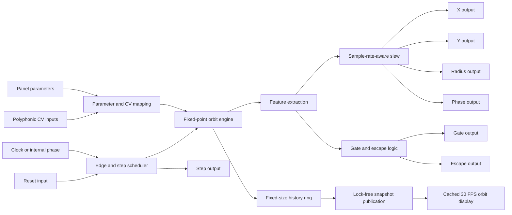
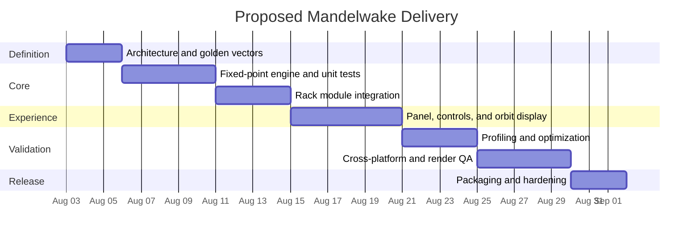

# Mandelwake: Research and Technical Specification for a New Leviathan-Rack2 Module

## Executive Summary

Dragon King Leviathan, the strongest candidate for the next Leviathan-Rack2 module is **Mandelwake**, an 18 HP deterministic fractal-orbit generator that converts clocks, seeds, and control voltages into correlated modulation, gates, and escape events. The concept is not imposed from outside the project: Leviathan-Rack2’s own `IDEAS.md` proposes a module producing CV and gate outputs from a clock and fractal seed, with Mandelbrot-style X/Y coordinates as modulation sources. The existing plugin catalog already spans sequencing, filtering, oscillation, mastering, visualization, temporal processing, and related signal utilities, so a clocked nonlinear modulation source fills a clearer functional gap than another conventional oscillator, filter, or effect. citeturn4view2turn3view0

Mandelwake should be designed as a **musical state machine rather than a continuously rendered fractal explorer**. Each clock step advances one or more bounded iterations of a complex map. The resulting orbit produces four continuous CV outputs—X, Y, radius, and phase—and three event outputs—probabilistic gate, escape trigger, and step trigger. A deterministic fixed-point orbit core is recommended so that gate patterns and escape behavior remain repeatable across saves, offline renders, processor architectures, and compiler optimization modes.

The module should follow the architecture already visible in Chronomaw and Bifurx: keep the algorithm in a Rack-independent engine, leave the Rack `Module` class responsible for voltage adaptation and state persistence, and place custom rendering in a separate widget implementation. Chronomaw demonstrates a clean `FrameInputs → engine.process() → outputs` boundary, while Bifurx demonstrates bounded control-rate work, performance instrumentation, finite-value sanitization, cached rendering, and lock-free or asynchronous visual publication patterns. citeturn8view0turn8view1turn9view1turn9view3

| Decision area | Recommendation |
|---|---|
| Module | **Mandelwake** |
| Primary role | Clocked deterministic chaotic and fractal CV generator |
| Width | Proposed 18 HP |
| Polyphony | One to sixteen independent orbit channels |
| Core algorithm | Signed fixed-point quadratic complex maps with deterministic integer mutation |
| Main outputs | X, Y, radius, phase, gate, escape, step |
| DSP latency | Zero algorithmic sample latency; optional output slew introduces intentional response time |
| Internal buffering | None for DSP; fixed-size visual-history buffers only |
| Audio-thread allocation | Zero after construction |
| DSP worker thread | None |
| Visual refresh | At most 30 frames per second, decoupled from DSP |
| Build baseline | Rack SDK 2.6.6 |
| Dependencies | Rack SDK and standard C++ only |
| Primary release risk | Render cost and cross-platform determinism, not raw DSP throughput |
| Estimated delivery | Approximately five focused engineering weeks, including profiling and release QA |

The release should be gated by measurable conditions: no heap allocation or mutex acquisition in `process()`, no NaN or infinity at any output, exact event timing under offline rendering, deterministic event sequences for a saved seed, typical sixteen-channel processing below approximately four percent of one modern logical CPU core at 48 kHz, and a visible UI whose 95th-percentile draw cost remains below 1.5 ms per module instance on the reference test system. These are proposed acceptance thresholds rather than guarantees; they should be measured on at least one x64 machine and one Apple Silicon machine.

## Concept Portfolio and Selection

The five concepts below are deliberately distinct. Four extend ideas already present in the repository, while the fifth fills a broader performance-oriented gap. The repository’s idea list specifically mentions fractal CV, a virtual theremin, pachinko-like trigger generation, and a dragon-themed loudness or clipping visualizer. citeturn4view2

| Concept | Core function | Short use-case | Leviathan fit | DSP risk | Rendering risk | Estimated effort |
|---|---|---|---:|---:|---:|---:|
| **Mandelwake** | Clocked fractal or complex-map CV and gate generator | Drive a filter, wavetable position, stereo pan, and rhythmic events from one repeatable evolving orbit | 5/5 | 2/5 | 3/5 | Medium |
| **Leviathan’s Gaze** | Mouse, touch, or pointer-driven virtual theremin with inertia and gesture recording | Perform two-dimensional CV gestures, gates, pitch, or timbral trajectories directly from the module panel | 5/5 | 2/5 | 4/5 | Medium |
| **Abyssal Pachinko** | Simulated particles falling through pegs to generate probabilistic triggers | Produce visibly intelligible but non-repeating percussion, ratchets, and trigger distributions | 5/5 | 3/5 | 5/5 | High |
| **Dragonmeter** | Loudness, peak, crest-factor, and clipping visualizer | Place at the end of a patch to show integrated level, transients, and dragon-breath overload states | 4/5 | 3/5 | 4/5 | Medium–high |
| **Mnemosyne Reef** | Multichannel CV recorder, loop shaper, and morphing memory bank | Capture a performance gesture and evolve between stored modulation loops | 4/5 | 2/5 | 3/5 | Medium |

### Why Mandelwake wins

Mandelwake scores highest because it combines three favorable properties.

First, it is **native to the repository’s creative trajectory**. It directly develops the “Fractal CVs” idea rather than importing a generic Eurorack archetype. citeturn4view2

Second, it complements rather than duplicates the existing family. Chronomaw can provide structured temporal behavior; Mandelwake can turn that structure into deterministic nonlinear trajectories. The conceptual division is clean:

> **Chronomaw organizes when change occurs; Mandelwake determines where the change goes.**

Third, it concentrates engineering novelty in a tractable place. A fractal modulation module does not need oversampling, anti-aliasing, feedback stabilization, convolution, or long audio delay buffers. The principal challenges are deterministic state evolution, meaningful voltage mapping, visual synchronization, and bounded CPU use. That gives the user substantial creative depth without placing the first release on the most dangerous real-time DSP terrain.

### Why the alternatives remain valuable

**Leviathan’s Gaze** is a strong second candidate, especially for performance-oriented users, but pointer interaction and host-window focus behavior create more UX edge cases than the underlying DSP suggests. It would also require careful separation between UI events and audio-thread state.

**Abyssal Pachinko** offers immediate visual delight, yet a physically animated interface can become the module’s dominant CPU cost. A particle simulation also risks ambiguous timing if the visual simulation is allowed to determine musical events. Its correct architecture would require the audio engine to own a deterministic abstract simulation while the display merely interpolates it.

**Dragonmeter** has professional utility, but credible LUFS, true-peak, and loudness-range behavior substantially increases test scope. It would need standards-driven validation and carefully specified integration windows rather than merely a striking display.

**Mnemosyne Reef** is practical and comparatively low risk, but it is less singular. CV recording and looping already exist in several forms across the Rack ecosystem, whereas a deterministic, clock-addressable fractal modulator has a more recognizable Leviathan identity.

## Detailed Technical Specification

### Product definition

**Mandelwake** is a polyphonic, clocked complex-orbit modulation generator. It maintains one orbit state per active polyphonic channel. An external clock advances the orbit; when no clock is connected, a sample-rate-independent internal phase accumulator supplies steps. Each step performs a selectable number of map iterations, extracts musical features, updates output targets, and emits any resulting event pulses.

The first release should support three maps:

| Mode | Proposed recurrence | Character |
|---|---|---|
| **Mandelbrot** | \(z_{n+1}=z_n^2+c\), with reset state \(z_0=0\) | Structured transitions between stable, periodic, and escaping regions |
| **Julia** | \(z_{n+1}=z_n^2+c\), with seed-derived \(z_0\) | Strongly seed-dependent repeating and quasi-chaotic trajectories |
| **Burning Ship** | \(z_{n+1}=(|\Re z_n|+i|\Im z_n|)^2+c\) | Sharper folds, directional changes, and denser escape activity |

The mathematical recurrence is the organizing metaphor, not a requirement to expose raw mathematical coordinates. Output scaling, deterministic mutation, escape handling, and smoothing are explicitly musical transformations.

### Assumptions and unconstrained items

| Item | Requirement status | Proposed resolution |
|---|---|---|
| Exact sample rate | **No specific constraint** | Derive all timing from `ProcessArgs`; validate 44.1, 48, 88.2, 96, 192, and 768 kHz, plus at least one low-fidelity Rack rate |
| Host audio block size | **No specific constraint** | No internal DSP block dependence; operate through Rack’s sample callback |
| Panel width | **No specific constraint** | 18 HP to preserve a legible central display and fifteen ports |
| Polyphony | **No specific constraint** | Support one to sixteen channels in the initial release |
| Maximum modulation latency | **No specific constraint** | Zero sample algorithmic latency; user-selectable slew is intentional |
| Display backend | **No specific constraint** | NanoVG and cached framebuffer by default; defer OpenGL-specific rendering |
| External dependencies | **No specific constraint** | Add none |
| Preset compatibility with a predecessor | **No specific constraint** | Start JSON state schema at version one |
| Internal clock format | **No specific constraint** | Continuous frequency control from 0.05 to 200 Hz with one-volt-per-octave CV |
| Gate voltage | **No specific constraint** | Use 0 V low and 10 V high, consistent with normal Rack CV conventions |
| Continuous CV range | **No specific constraint** | X, Y, and phase at ±5 V; radius at 0–10 V |

VCV’s documented conventions describe audio signals as commonly ±5 V and CV sources as commonly either 0–10 V or ±5 V, with signals normally kept inside the approximate ±12 V system range. Rack cables can carry up to sixteen polyphonic channels. Those conventions support the proposed output ranges and sixteen-channel ceiling. citeturn7search0turn7search13

### Signal flow



The audio path is intentionally independent of the visual path. A frozen, hidden, or overloaded display must not change CV values, trigger timing, or orbit state.

### Clocking and event precedence

The proposed timing rules remove same-sample ambiguity:

| Condition | Defined behavior |
|---|---|
| External clock disconnected | Internal phase accumulator advances at the effective RATE frequency |
| External clock connected | Internal phase pauses; each detected rising edge requests one orbit step |
| Polyphonic clock connected | Each channel advances independently |
| Monophonic clock with polyphonic modulation CV | Clock channel zero is broadcast to all active channels |
| RESET and CLOCK rise in the same sample | RESET wins; the clock step is suppressed for that sample |
| Multiple apparent transitions inside one sample | At most one step per channel per sample |
| Sample-rate change | Preserve normalized internal phase; recalculate all time coefficients |
| Clock cable inserted or removed | Avoid an immediate phantom edge by synchronizing detector state |
| RESET | Reconstruct the orbit from mode, base seed, and channel-derived seed |
| STEP output | One fixed-duration pulse for every accepted external or internal step |
| ESCAPE output | One fixed-duration pulse if any micro-iteration in the step escapes |

The recommended gate detector uses explicit low and high thresholds of 0.1 V and 2 V. Rack 2.6.1 added API support for explicit Schmitt-trigger thresholds, although implementing the comparison locally would preserve the behavior if the plugin is later compiled against an older Rack 2 SDK. citeturn10search0turn14search1

### Deterministic orbit core

Floating-point chaotic systems can amplify microscopic numerical differences into divergent future states. For Mandelwake, that is not merely an academic issue: divergence can alter gate patterns, escape events, and saved-patch behavior. The recommended core therefore uses **Q4.28 signed fixed-point state**, with 64-bit intermediate products.

Let \(S=2^{28}\). The real and imaginary components are stored as signed 32-bit values, while multiplication uses signed 64-bit intermediates:

\[
x'=\frac{x^2-y^2}{S}+c_x+m_x
\]

\[
y'=\frac{2xy}{S}+c_y+m_y
\]

Before multiplication, state components are bounded to ±4 in mathematical units. That bound keeps squared and summed intermediates safely inside signed 64-bit range. Escape occurs when:

\[
x'^2+y'^2 > 4S^2
\]

All signed shifts and saturation operations should be wrapped in explicit helper functions rather than relying on implementation-sensitive behavior. Mutation and reseeding should use specified unsigned 64-bit wraparound arithmetic, for example a compact SplitMix-style counter hash keyed by seed, channel, and step number.

This gives the module three useful reproducibility tiers:

| Reproducibility property | Expected result |
|---|---|
| Gate and escape events, same patch | Bit-identical across supported platforms |
| Unslewed X/Y/radius/phase target states | Numerically identical before float conversion |
| Smoothed output voltages | Extremely close, with normal floating-point tolerance |
| Visual interpolation | Not required to be bit-identical |
| Output after changing display quality | Unchanged |

When an orbit escapes, the module should emit ESCAPE and deterministically re-enter a bounded state rather than allowing values to grow until they become non-finite. The reseed state can be generated from the base seed, polyphonic channel, map mode, and global step counter, then constrained to a small disk around the current control point. This preserves continuity while ensuring the sequence cannot enter NaN or infinity territory.

### Control and parameter specification

| Parameter | Type and range | Default | CV behavior | Update behavior |
|---|---|---:|---|---|
| **MAP** | Three-position switch: Mandelbrot, Julia, Burning Ship | Mandelbrot | None | Applied on next reset or explicit mode change |
| **CENTER X** | Continuous, −2.25 to +1.00 | −0.75 | X CV through bipolar attenuverter; ±5 V can span the full range | Sampled continuously; quantized into the orbit on the next step |
| **CENTER Y** | Continuous, −1.50 to +1.50 | 0.00 | Y CV through bipolar attenuverter; ±5 V can span the full range | Next step |
| **ZOOM** | 0 to 12 octaves | 2 octaves | One octave per volt at full attenuverter; clamp to range | Next step |
| **ITERATIONS** | Integer, 1 to 32 | 4 | No direct CV in version one | Next step |
| **MUTATION** | 0 to 0.25 coordinate units | 0.015 | MUTATE CV through bipolar attenuverter | Next step |
| **SMOOTH** | 0 to 2000 ms, logarithmic | 80 ms | 0–10 V maps over full range; negative voltage clamps at zero | Coefficient updated continuously |
| **RATE** | 0.05 to 200 Hz, logarithmic | 4 Hz | One volt per octave at full attenuverter | Per sample when internal clock is active |
| **DENSITY** | 0 to 100 percent | 50 percent | 0–10 V additive through a unipolar amount control | Next step |
| **X AMOUNT** | Bipolar attenuverter, −1 to +1 | 0 | Scales X CV | Per sample |
| **Y AMOUNT** | Bipolar attenuverter, −1 to +1 | 0 | Scales Y CV | Per sample |
| **ZOOM AMOUNT** | Bipolar attenuverter, −1 to +1 | 0 | Scales ZOOM CV | Per sample |
| **MUTATE AMOUNT** | Bipolar attenuverter, −1 to +1 | 0 | Scales MUTATE CV | Per sample |
| **RESEED** | Momentary button | Off | Optionally triggerable from RESET via context setting | Generates a new base seed |
| **SEED LOCK** | Latching button | On | None | Prevents Rack randomize from replacing the seed |

The visual display can also act as a coordinate editor. To avoid accidental state changes, pointer dragging should affect CENTER X and CENTER Y only while a small **EDIT** affordance is held or explicitly enabled. Drag operations must update Rack parameters through the normal parameter and history mechanisms so that undo, automation, MIDI mapping, and patch persistence remain coherent.

### Input specification

| Input | Channels | Expected range | Normalization and interpretation |
|---|---:|---|---|
| **CLOCK** | 0–16 | Gate or trigger | Unpatched selects internal clock; mono broadcasts when other CV establishes higher polyphony |
| **RESET** | 0–16 | Gate or trigger | Mono broadcasts; poly reset is channel-specific |
| **X** | 0–16 | Nominally ±5 V | Adds to CENTER X through X AMOUNT |
| **Y** | 0–16 | Nominally ±5 V | Adds to CENTER Y through Y AMOUNT |
| **ZOOM** | 0–16 | Nominally ±5 V | One octave per volt at full amount |
| **MUTATE** | 0–16 | Nominally ±5 V or 0–10 V | Bipolar modulation of deterministic mutation depth |
| **SMOOTH** | 0–16 | 0–10 V | Adds over the full 0–2000 ms range |
| **RATE** | 0–16 | One volt per octave | Active only for internal clock rate, but may remain patched while external CLOCK is present |

The active channel count should be the maximum connected channel count among CLOCK, X, Y, ZOOM, MUTATE, SMOOTH, RATE, and RESET, clamped to Rack’s sixteen-channel maximum. Every output uses the resulting count. This follows the standard Rack polyphonic model rather than creating a special multichannel encoding. citeturn7search2turn7search13

### Output specification

| Output | Range | Meaning |
|---|---:|---|
| **X** | −5 to +5 V | Normalized real coordinate of the bounded orbit state |
| **Y** | −5 to +5 V | Normalized imaginary coordinate |
| **RADIUS** | 0 to 10 V | Distance from origin, normalized to the escape radius |
| **PHASE** | −5 to +5 V | Angular position, where −π maps to −5 V and +π maps to +5 V |
| **GATE** | 0 or 10 V pulse | Orbit-correlated deterministic probability event |
| **ESCAPE** | 0 or 10 V pulse | High when a step crosses the escape boundary |
| **STEP** | 0 or 10 V pulse | High for every accepted orbit step |

The GATE event should not be generated by a generic independent random source. A deterministic unsigned hash should combine the quantized orbit state, seed, channel, and step counter. Its normalized value is then compared with:

\[
p=\operatorname{clamp}\left(D\left(0.25+0.75R\right),0,1\right)
\]

where \(D\) is DENSITY and \(R\) is normalized radius. This makes gate probability increase near the outer boundary while remaining reproducible. A context-menu mode can later add “uniform,” “edge-biased,” and “turn-biased” probability laws without changing the port layout.

### Output smoothing

X, Y, RADIUS, and PHASE are target-and-slew outputs. For a smoothing time constant \(\tau\), update each sample using:

\[
a=1-e^{-\Delta t/\tau}
\]

\[
v \leftarrow v+a(v_\text{target}-v)
\]

At zero smoothing, assign the target directly. PHASE should use shortest-path circular interpolation to prevent a transition from +5 V to −5 V from slewing through the full ten-volt span when the actual angular movement crossed the wrap boundary.

No DSP sample buffer is required. The module stores only channel state, target values, smoothed values, edge detectors, pulse generators, phase accumulators, and bounded visual history.

### State persistence

Rack already persists ordinary parameters. `dataToJson()` and `dataFromJson()` should store only non-parameter state:

| JSON field | Purpose |
|---|---|
| `schemaVersion` | Begins at `1` |
| `baseSeed` | Unsigned 64-bit seed serialized as a string or two 32-bit words |
| `seedLocked` | Whether randomization may replace the seed |
| `freeRunWhenUnclocked` | Internal-clock behavior |
| `phasePolarity` | Bipolar or optional unipolar PHASE mode |
| `pulseWidthMs` | Event pulse duration |
| `escapePolicy` | Deterministic re-entry behavior |
| `displayQuality` | Low, normal, or high |
| `displayFrozen` | UI-only freeze state |
| `selectedDisplayChannel` | Channel shown in the orbit display |

Malformed or future-version JSON must fall back to safe defaults without changing ordinary Rack parameter values. Loaded state must be sanitized before it enters the engine.

### Expected CPU cost

The following figures are engineering targets for a release build on a contemporary x64 or ARM64 desktop processor. They must be replaced by measured values in release notes or internal test records.

| Scenario at 48 kHz | Proposed mean time per sample | Approximate logical-core time | Expected Rack experience |
|---|---:|---:|---|
| One channel, four iterations, internal 4 Hz clock | Under 0.08 µs | Under 0.4% | Negligible |
| Four channels, four iterations | Under 0.25 µs | Under 1.2% | Light |
| Sixteen channels, four iterations | Under 0.8 µs | Under 3.9% | Moderate but comfortable |
| Sixteen channels, thirty-two iterations, dense external clocking | Under 3.0 µs mean | Under 14.4% | Intentional stress case |
| Hidden module display | No measurable UI draw cost | Not applicable | DSP only |
| Visible normal-quality display | 0.2–1.5 ms per visual refresh | UI-thread cost | Bounded at 30 FPS |

At 48 kHz, one sample spans approximately 20.83 µs; at 96 kHz it spans approximately 10.42 µs. The stress target therefore retains meaningful headroom even before considering that Rack’s full engine thread contains many modules. The objective is not to consume the entire per-sample budget merely because an individual call remains under it.

The official Fundamental VCF is a useful optimization reference: it processes polyphony in four-channel SIMD groups, avoids work when outputs are disconnected, and calculates only connected output paths. Mandelwake’s fixed-point recurrence is less directly suited to Rack’s floating SIMD types, but the same principles apply: skip unused feature extraction, cache connection state on a divider, and avoid computing radius or phase when their outputs and display are both inactive. citeturn6search0

## Interface and Visual Language

### Panel composition

The panel should visually read as **a navigable abyssal chart**, not as a generic Cartesian plot.

A proposed top-to-bottom arrangement is:

| Region | Contents |
|---|---|
| Header | Mandelwake title, Leviathan sigil, MAP selector |
| Primary display | Orbit trace, boundary hints, current point, escape flare, selected channel |
| Major controls | CENTER X, CENTER Y, ZOOM, ITERATIONS |
| Motion controls | MUTATION, SMOOTH, RATE, DENSITY |
| Attenuverter row | X, Y, ZOOM, MUTATE amounts |
| Utility row | RESEED, SEED LOCK, status indicators |
| Port field | Eight inputs on the left and seven outputs on the right |

The central display should occupy enough vertical area to make the orbit’s motion legible at normal Rack zoom. The controls surrounding it should preserve tactile hierarchy: large coordinate and zoom controls, medium temporal controls, and small bipolar CV attenuverters.

### Branding alignment

Leviathan-Rack2 already contains a developed visual system rather than a collection of stock components. Existing code includes split panel and label layers, cached assets, cyan and purple orbital screws, Magitek input and output jacks, halo-style knobs, Eclipse controls, luminous sliders, clockwork-like attenuverters, and custom sigils. Bifurx additionally demonstrates cached framebuffers, split dynamic visual layers, and optional NanoVG or OpenGL rendering. citeturn13view1turn13view2

Mandelwake should use that system consistently:

| Element | Proposed treatment |
|---|---|
| Base panel | Dark split-panel texture using the existing panel renderer |
| Labels | Separate `.labels.svg`, allowing controlled luminosity and theme processing |
| Inputs | Purple-inward Magitek jacks |
| Outputs | Cyan-outward Magitek jacks |
| Main X/Y controls | Leviathan halo or Eclipse-style knobs |
| CV amounts | Clockwork gear-style bipolar knobs with a clear center detent |
| Screws | Cyan at the output side and purple at the input side, or alternating by diagonal |
| Active orbit | Cyan core with subtle pale bloom |
| Boundary or unstable region | Purple contour or fog |
| Escape event | Brief amber or white flare, never a full-panel flash |
| Current point | Small high-contrast rune or eye |
| Seed lock | Closed sigil when locked; fractured sigil when unlocked |

The display should communicate state by more than hue. Orbit points can vary in size, brightness, and trail continuity; escape can use a distinct geometric burst; lock status should use an icon and text tooltip. This makes the panel more robust for users with reduced color discrimination and at very low display brightness.

### Proposed visual assets

| Asset | Format | Function |
|---|---|---|
| `mandelwake.panel.svg` | SVG | Base panel texture and non-luminous engraving |
| `mandelwake.labels.svg` | SVG | Labels, tick marks, port names, and legends |
| `mandelwake.svg` | SVG | Optional precomposed fallback panel |
| `mandelwake-sigil.svg` | SVG | Module-specific fractal eye or coiled wake emblem |
| `mandelwake-mask.svg` | SVG | Display aperture mask if not constructed in NanoVG |
| `mandelwake-preview.png` | Raster | Library or documentation preview if required by release workflow |
| Anchor IDs embedded in SVG | Metadata | Positions for controls, ports, lights, and display bounds |

The repository’s panel utilities can load SVG anchors from a generated atlas or parse identifiers from SVG content, which makes anchored placement preferable to duplicating every millimeter coordinate in C++. The build should fail a layout test when an expected anchor disappears or changes type. citeturn13view3

### Display behavior

The display should show only the selected polyphonic channel. The audio engine maintains a fixed ring of the latest 256 bounded points for that channel. At no more than 30 Hz, it publishes a compact snapshot containing:

```cpp
struct MandelwakeVisualSnapshot {
    uint64_t sequence = 0;
    uint64_t stepCounter = 0;
    uint64_t seed = 0;
    uint8_t channel = 0;
    uint8_t mode = 0;
    bool escapedRecently = false;
    float centerX = 0.f;
    float centerY = 0.f;
    float zoomOctaves = 0.f;
    std::array<Vec2, 256> points{};
    uint16_t pointCount = 0;
};
```

The actual implementation should use a repository-compatible vector structure or plain POD coordinates. It must not contain `std::vector`, strings, reference-count changes, or anything else that allocates when the audio thread publishes it.

A `FramebufferWidget` should cache the static aperture, contour field, labels, and other slow-changing background elements. The live orbit trace can be a lighter overlay invalidated at the visual publication rate. Bifurx already uses a framebuffer with subpixel invalidation disabled and a preview cadence around 30 FPS, providing a local precedent. citeturn13view1turn9view1

### Display quality modes

| Mode | Orbit points | Background contour | Refresh ceiling | Intended use |
|---|---:|---|---:|---|
| Low | 64 | None or static vignette | 15 FPS | Dense patches or integrated-GPU systems |
| Normal | 256 | Cached coarse contour | 30 FPS | Default |
| High | 512 rendered from a 256-point interpolated path | Cached refined contour | 30 FPS | Close inspection and screenshots |
| Frozen | Last frame | Unchanged | 0 FPS after cache settles | Performance or composition focus |

A full per-pixel fractal heatmap should be deferred. It would either burden the UI thread or introduce a worker service whose complexity is disproportionate to the first release. If later added, it should use the Bifurx “latest request wins” pattern: one worker, bounded pending work, cancellable stale requests, no audio-thread waiting, and explicit shutdown before plugin destruction. Bifurx’s service already demonstrates a mutex/condition-variable worker, replacement of pending snapshots with newer work, shared immutable results, and orderly thread joining. citeturn9view3turn13view0

### Context menu

The context menu should expose options that are important but too infrequent for panel controls:

| Group | Options |
|---|---|
| Clock | Free-run when CLOCK is unpatched; restart internal phase after reset |
| Output | Bipolar or 0–10 V phase; pulse width 0.1, 1, 5, or 10 ms |
| Orbit | Reseed on escape; fold on escape; hold last bounded state |
| Seed | Copy seed; paste seed; derive seed from patch randomize |
| Display | Low, normal, high, frozen; selected channel |
| Compatibility | Legacy state migration options if a future schema needs them |
| Diagnostics | Show DSP time, snapshot age, dropped visual frames, and active channel count |

Diagnostics should remain a development or explicitly enabled feature, following the repository’s existing use of runtime feature flags and debug instrumentation rather than permanently cluttering the production panel. citeturn4view1turn13view0

## Repository Integration and Delivery Roadmap

### Repository observations affecting integration

The repository currently separates module definitions, engines, widgets, visual utilities, resources, and tests across numerous source files. Chronomaw is a particularly useful template for isolating engine logic, while Bifurx is a useful template for performance divisions and advanced rendering. citeturn2view0turn8view0turn8view1turn9view1

There is one integration detail that should be reconciled before adding Mandelwake: the current `plugin.json` lists a broader set of public modules than the current `init()` implementation visibly registers. The manifest includes IntegralFlux, Proc, TemporalDeck, TDScope, Crownstep, Bifurx, Wyrm, Sil, Chronomaw, and Bulkhead, while the inspected `plugin.cpp` registers IntegralFlux, Proc, TemporalDeck, TDScope, Undertow, Deepcache, Iris, and Nautiloid. This may reflect branch work, staged releases, or temporary integration state, but it means Mandelwake should not be added by copying either list blindly. The manifest, model declarations, compilation units, and `addModel()` calls should be audited together. citeturn3view0turn13view0

### Proposed file map

| File | Responsibility |
|---|---|
| `src/MandelwakeEngine.hpp` | Rack-independent types, channel state, input/output frames, public engine interface |
| `src/MandelwakeEngine.cpp` | Fixed-point recurrence, deterministic hashing, escape policy, feature extraction |
| `src/Mandelwake.hpp` | Rack `Module` declaration, enum IDs, persisted options, visual snapshot bridge |
| `src/Mandelwake.cpp` | Parameter configuration, voltage mapping, polyphony, `process()`, JSON, model creation |
| `src/MandelwakeWidget.hpp` | Widget declaration and display component types |
| `src/MandelwakeWidget.cpp` | Panel construction, SVG anchors, context menu, NanoVG drawing, tooltips |
| `src/MandelwakeFixedPoint.hpp` | Checked Q4.28 conversions, saturated arithmetic, multiplication helpers |
| `src/MandelwakeVisualData.hpp` | POD history points and lock-free snapshot structures |
| `tests/mandelwake_engine_spec.cpp` | Pure engine unit and property tests |
| `tests/mandelwake_timing_spec.cpp` | Clock, reset, pulse, smoothing, and sample-rate tests |
| `tests/mandelwake_poly_spec.cpp` | Polyphony and mono-broadcast behavior |
| `tests/mandelwake_runtime_spec.cpp` | Rack-linked module and port tests |
| `tests/mandelwake_json_spec.cpp` | Persistence, malformed state, migration, randomize behavior |
| `tests/mandelwake_render_spec.cpp` | Anchor validity, display bounds, snapshot and cache behavior |
| `res/mandelwake.panel.svg` | Base panel |
| `res/mandelwake.labels.svg` | Label layer |
| `res/mandelwake-sigil.svg` | Module iconography |

The repository Makefile already discovers `src/*.cpp` and `src/visual/*.cpp` through wildcards, so ordinary new implementation files should compile without adding them individually. New test executables and aggregate test dependencies will require explicit Makefile entries consistent with the existing standalone and Rack-linked test targets. citeturn3view1

### Core classes

```cpp
class MandelwakeEngine {
public:
    static constexpr int kMaxChannels = 16;

    struct ChannelInputs {
        bool reset = false;
        bool step = false;
        int32_t centerXQ28 = 0;
        int32_t centerYQ28 = 0;
        int32_t mutationQ28 = 0;
        uint8_t iterations = 4;
        float density = 0.5f;
    };

    struct ChannelOutputs {
        int32_t xQ28 = 0;
        int32_t yQ28 = 0;
        uint32_t radiusQ28 = 0;
        int32_t phaseQ28 = 0;
        bool gate = false;
        bool escaped = false;
    };

    void resetChannel(int channel, uint64_t baseSeed);
    ChannelOutputs stepChannel(int channel, const ChannelInputs& in);
};
```

```cpp
struct Mandelwake : rack::engine::Module {
    enum ParamIds { /* ... */ NUM_PARAMS };
    enum InputIds { /* ... */ NUM_INPUTS };
    enum OutputIds { /* ... */ NUM_OUTPUTS };
    enum LightIds { /* ... */ NUM_LIGHTS };

    MandelwakeEngine engine;
    std::array<ChannelRuntime, 16> runtime;
    MandelwakeSnapshotExchange visualExchange;

    Mandelwake();
    void process(const ProcessArgs& args) override;
    json_t* dataToJson() override;
    void dataFromJson(json_t* root) override;
    void onReset(const ResetEvent& e) override;
    void onRandomize(const RandomizeEvent& e) override;
    void onSampleRateChange(const SampleRateChangeEvent& e) override;
};
```

The engine’s tests should compile without `rack.hpp` wherever practical. This keeps recurrence tests fast, makes fixed-point determinism easier to verify, and prevents GUI or host setup from obscuring logic failures.

### Thread ownership

| Concern | Audio or engine thread | UI thread | Optional worker |
|---|---|---|---|
| Read Rack parameters and inputs | Yes | No | No |
| Advance orbit state | Yes | No | No |
| Generate CV and gates | Yes | No | No |
| Allocate memory | No after construction | Allowed, but minimize per frame | Allowed if bounded |
| Acquire mutex | No | Avoid in draw path | Allowed |
| Build visual snapshot | Bounded copy at divided rate | No | Not needed initially |
| Draw panel and trace | No | Yes | No |
| Change Rack parameters | Through Rack parameter API | Yes | No |
| Write engine internals directly | Yes | No | No |
| Generate optional heatmap | No | Consume result | Future only |
| Shutdown service | No blocking from `process()` | Plugin lifecycle | Worker joins outside audio callback |

Chronomaw’s architecture already shows a module collecting ordinary input values, calling a separate engine, and publishing results. Bifurx shows why expensive visual computation must not be allowed to obstruct audio processing and how a service can be shut down explicitly rather than relying on unsafe static destruction order. citeturn8view0turn8view1turn9view3turn13view0

### Registration changes

The integration commit should modify all registration surfaces in the same change:

| Location | Required change |
|---|---|
| `src/plugin.hpp` | Add `extern Model* modelMandelwake;` |
| `src/plugin.cpp` | Add `p->addModel(modelMandelwake);` in the intended catalog order |
| `src/Mandelwake.cpp` | Define `modelMandelwake = createModel<...>()` |
| `plugin.json` | Add slug, name, description, tags, and manual status |
| Resource package | Include final panel and sigil assets |
| Test Makefile | Add Mandelwake unit, Rack-linked, and aggregate targets |

The official plugin tutorial uses this same declaration, model creation, and registration pattern, while the manifest documentation requires stable slugs and Rack-compatible semantic versions. Once published, the slug should be treated as permanent. citeturn0search1turn0search13

Recommended manifest entry:

```json
{
  "slug": "Mandelwake",
  "name": "Mandelwake",
  "description": "Deterministic polyphonic fractal orbit and event generator",
  "tags": [
    "Chaos",
    "Clock modulator",
    "Random",
    "Polyphonic"
  ]
}
```

### Timeline roadmap

| Phase | Working duration | Main deliverables | Exit criterion |
|---|---:|---|---|
| Architecture lock | 3 days | Mathematical map definition, voltage laws, reset precedence, JSON schema, test vectors | Specification accepted and golden vectors generated |
| Engine implementation | 5 days | Fixed-point core, hashing, maps, escape policies, pure tests | Deterministic engine suite passes on two architectures |
| Rack integration | 4 days | Params, ports, polyphony, clocking, smoothing, serialization | Functional module passes Rack-linked tests |
| UI and visual integration | 6 days | Anchored panel, controls, trace display, menu, cached rendering | No audio-thread interaction from display; visual QA passes |
| Profiling and optimization | 4 days | Benchmarks, instrumentation, disconnected-output fast paths, allocation audit | CPU and frame-time thresholds met |
| Cross-platform QA | 5 days | Native and toolchain builds, offline render tests, sanitizer runs | Windows, macOS x64/ARM64, and Linux packages pass |
| Release hardening | 3 days | Manifest, docs, presets, final migration checks | Distribution artifact reproducible and installable |



The dates are illustrative rather than contractual. Several activities can overlap once the engine interfaces are stable, particularly visual asset production and pure-engine testing.

## Performance, Profiling, and Test Strategy

### Optimization priorities

The most important optimization is architectural: **the orbit should advance primarily at musical step rate, not indiscriminately at audio rate**. Per-sample work is then limited to edge detection, the internal phase accumulator, pulse generators, output slew, voltage writes, and lightweight connection checks. Micro-iterations occur only when a step is accepted.

The optimization order should be:

| Priority | Strategy | Rationale |
|---:|---|---|
| Highest | Zero allocations and zero locks in `process()` | Prevents unbounded real-time stalls |
| High | Fixed-size arrays for all sixteen channels | Stable memory and branch behavior |
| High | Advance recurrence only on orbit steps | Removes unnecessary nonlinear arithmetic |
| High | Skip phase extraction when PHASE and display are inactive | Avoids `atan2` work |
| High | Skip radius square root when RADIUS, GATE edge bias, and display are inactive | Avoids `sqrt` work |
| Medium | Cache input/output connectivity on a clock divider | Reduces repeated routing checks |
| Medium | Convert params/CV to fixed point only when a step occurs | Prevents redundant conversion |
| Medium | Publish one selected channel to the display | Avoids copying all polyphonic histories |
| Medium | Keep history publication at 15–30 Hz | Bounded UI communication |
| Later | SIMD smoothing and output conversion in four-channel groups | Useful only after profiling identifies it |
| Avoid initially | Background fractal heatmap | Adds lifecycle and synchronization risk without improving sound |

The Fundamental VCF’s source provides a primary example of four-lane SIMD processing and connected-output fast paths. Bifurx provides a repository-local example of finite-value sanitization, divided control work, adaptive processing, output-connection checks, and timing instrumentation. citeturn6search0turn9view1

### Performance instrumentation

A development-only profiler should collect per-instance rolling statistics without allocating:

```cpp
struct MandelwakePerfCounters {
    uint64_t processCalls = 0;
    uint64_t orbitSteps = 0;
    uint64_t iterations = 0;
    uint64_t snapshotPublishes = 0;
    uint64_t escapes = 0;
    uint64_t clippedInputValues = 0;
    double processNsAccum = 0.0;
    double processNsMax = 0.0;
};
```

Wall-clock timing is acceptable for diagnostics but must never affect DSP decisions. Timing calls themselves should be compiled out or heavily divided in production. Bifurx already follows a comparable debug pattern by surrounding processing with optional `std::chrono` measurement rather than embedding wall-clock time into the signal algorithm. citeturn9view1

Recommended profiling tools:

| Platform or layer | Tool | Measurement focus |
|---|---|---|
| Rack | Built-in CPU meter | Patch-level module load and interaction with other modules |
| Rack | Frame-rate meter and UI inspection | Visual stalls and refresh degradation |
| Linux | `perf stat` and `perf record` | Instructions, cycles, branches, cache misses, call hotspots |
| macOS | Instruments Time Profiler | Engine-versus-UI samples and Apple Silicon behavior |
| Windows | Visual Studio CPU Profiler or Windows Performance Recorder | Scheduling, hotspots, and long-tail stalls |
| Compiler | AddressSanitizer and UndefinedBehaviorSanitizer | Memory and arithmetic defects |
| Compiler | ThreadSanitizer | Snapshot exchange and any future worker service |
| Static analysis | Official plugin toolchain analysis target and `cppcheck` | Suspicious ownership, conversions, and undefined behavior |

Rack’s changelog documents built-in CPU and frame-rate meters, and the official plugin toolchain supports cross-platform builds plus static analysis workflows. citeturn10search0turn14search8

### Performance acceptance thresholds

Measurements should be taken in release configuration, with debug logging disabled, after a warm-up interval of at least ten seconds.

| Metric | Normal target | Hard release threshold |
|---|---:|---:|
| Audio-thread heap allocations after construction | 0 | 0 |
| Audio-thread mutex acquisitions | 0 | 0 |
| One-channel mean `process()` at 48 kHz | <0.08 µs | <0.15 µs |
| Sixteen-channel mean at default settings | <0.8 µs | <1.5 µs |
| Sixteen-channel 99th percentile | <1.5 µs | <3.0 µs |
| Stress-case maximum excluding profiler distortion | <5 µs | <8 µs |
| Visible UI draw p95, normal quality | <1.5 ms | <2.5 ms |
| Visible UI draw maximum | <4 ms | <8 ms |
| Hidden display draw calls | 0 after settling | No recurring render work |
| Snapshot publication frequency | ≤30 Hz | ≤60 Hz |
| Snapshot age at UI | <67 ms | <150 ms |
| Audio discontinuity when UI opens or closes | None | None |
| DSP difference between display quality modes | 0 samples | 0 samples |

Because system profilers and clock calls perturb short functions, microbenchmarks should batch many `process()` or engine calls and divide the elapsed time. Patch-level Rack measurements remain essential because isolated microbenchmarks do not expose engine scheduling, GUI interference, cable fan-out, or interactions with other modules.

### Test layers

| Layer | Purpose | Representative tests |
|---|---|---|
| Fixed-point arithmetic | Prove bounded and defined recurrence math | Extreme values, multiplication limits, signed shift wrappers, saturation |
| Golden engine vectors | Lock deterministic behavior | Known seed, map, center, mutation, and first 10,000 states |
| Property tests | Explore broad input space | Randomized parameters and CV, invariants, no overflow, output bounds |
| Timing tests | Verify exact musical timing | Clock edge count, reset precedence, pulse widths, internal phase |
| Sample-rate tests | Verify time invariance | Same smoothing time and internal-clock frequency at all rates |
| Polyphony tests | Verify channel independence | Mono broadcast, poly clock, channel count changes, seed separation |
| Rack runtime tests | Verify API integration | Port connection, bypass behavior if added, parameter labels, JSON |
| UI snapshot tests | Verify decoupling | Display freeze, hidden state, publication sequence, stale snapshot handling |
| Render tests | Verify layout | Anchor presence, bounds, panel zoom, label clipping |
| Offline render tests | Verify sample determinism | Real-time versus faster-than-real-time export |
| Cross-platform tests | Verify portability | x64, ARM64, Windows, macOS, Linux |
| Long soak tests | Detect rare faults | Twenty-four-hour clocking, repeated cable changes, patch reload loops |

Rack Pro can render offline faster than real time, making it especially important that DSP timing depend on processed samples and clock inputs rather than elapsed wall-clock time or GUI cadence. The official documentation notes that a patch using ten percent CPU could theoretically render ten minutes of output in roughly one minute. Mandelwake should therefore produce the same event sequence whether rendering in real time or at accelerated speed. citeturn7search8

### Golden-vector strategy

The engine test suite should store compact golden data rather than large audio files:

```text
seed
map mode
center X and Y in Q4.28
mutation amount
iteration count
step index
expected X and Y state
expected gate bit
expected escape bit
```

Recommended golden sequences include:

| Sequence | Purpose |
|---|---|
| Stable interior Mandelbrot point | Verify no false escape |
| Clearly escaping point | Verify exact escape step |
| Boundary-adjacent point | Detect one-bit arithmetic changes |
| Julia sequence with mutation zero | Verify periodic or quasi-periodic behavior |
| Julia sequence with mutation enabled | Verify deterministic hash injection |
| Burning Ship sign-fold sequence | Verify absolute-value handling |
| Sixteen-channel shared controls | Verify channel seed derivation |
| Counter wrap simulation | Verify unsigned arithmetic behavior |
| Maximum iteration setting | Verify bounded runtime and state |
| Repeated reset at arbitrary steps | Verify exact reconstruction |

A changed golden trace should require an explicit algorithm-version decision. It must not be casually “updated until tests pass,” because even a one-bit recurrence difference can alter future musical structure.

### Audio correctness criteria

| Property | Tolerance |
|---|---|
| X and Y output bounds | Within ±5.0001 V |
| Radius bounds | −0.0001 to 10.0001 V |
| Phase bounds | Within ±5.0001 V in bipolar mode |
| Gate outputs | Exactly 0 V or 10 V except during an intentionally shaped pulse mode |
| Non-finite values | Zero occurrences |
| Reset state | Exact engine-state match |
| Pulse width | Exact configured sample count after rounding rule |
| Internal clock frequency | Error below one accumulated sample over ten minutes |
| Smoothing time constant | Within one sample or 0.1%, whichever is larger |
| Same-binary offline determinism | Bit-identical gate and escape events |
| Cross-platform event determinism | Bit-identical |
| Cross-platform smoothed CV | Within 10⁻⁵ V under identical inputs |
| Display-enabled versus disabled DSP | Bit-identical |

The cross-platform CV tolerance applies after fixed-point-to-float conversion and smoothing. Event decisions must remain entirely in the integer domain so that a tiny floating-point discrepancy cannot change a gate.

## Compatibility, Build, and Release QA

### Rack SDK and platform target

The recommended baseline is **Rack SDK 2.6.6**. The official Rack changelog identifies 2.6.6 as the current Rack 2 release dated November 4, 2025, and the official plugin toolchain is likewise pinned to SDK 2.6.6. citeturn14search1turn14search7turn14search8

The supported release matrix should match the official toolchain:

| Operating system | Architecture | Required artifact |
|---|---|---|
| Windows | x64 | `.vcvplugin` |
| macOS | x64 | `.vcvplugin` |
| macOS | ARM64 | `.vcvplugin` |
| GNU/Linux | x64 | `.vcvplugin` |

The official VCV Rack plugin toolchain cross-compiles these targets from a GNU/Linux environment and also supports Docker-based use on other host systems. citeturn14search8

Rack’s minor-version compatibility rules matter when selecting the SDK: a plugin compiled against symbols introduced in a later Rack minor release may require that later Rack version. Therefore, a 2.6.6 production build should either declare 2.6.6 as its minimum Rack version or be audited and built against an older chosen SDK if supporting older Rack 2 installations is a release requirement. citeturn7search12

Recommended policy:

| Release lane | SDK | Minimum Rack | Purpose |
|---|---:|---:|---|
| Main release | 2.6.6 | 2.6.6 | Simplest supported and testable baseline |
| Optional legacy lane | Explicitly pinned older Rack 2 SDK | Same as build SDK | Only if active users require older Rack |
| Development CI | 2.6.6 | Not applicable | Sanitizers, static analysis, and tests |

Do not build with an unpinned “whatever is in `../Rack-SDK`” environment for release artifacts. Record the SDK version and toolchain commit in the build log.

### Dependencies and language level

Mandelwake needs no new third-party runtime dependencies. It can use:

| Facility | Source |
|---|---|
| Rack module, ports, params, pulse and edge utilities | Rack SDK |
| NanoVG panel rendering | Rack SDK |
| Existing Leviathan visual components | Repository source |
| Arrays, atomics, integers, math, JSON glue | Standard C++ and Rack-provided dependencies |
| Optional static analysis | Official plugin toolchain |

The repository Makefile already sets `RACK_DIR ?= ../Rack-SDK`, includes `plugin.mk`, and contains both pure and Rack-linked testing targets. Some local tests explicitly compile in C++17 mode, while plugin language policy ultimately follows the SDK build system. Mandelwake should avoid unnecessary newer-language dependencies unless the project intentionally standardizes its plugin build on that level. citeturn3view1

### Local build flow

```bash
git clone --recurse-submodules <repository>
cd Leviathan-Rack2

export RACK_DIR=/absolute/path/to/Rack-SDK

make clean
make -j"$(nproc)"

make test-fast
make test-rack
make test

make dist
```

On macOS, substitute an appropriate job-count command or provide a numeric `-j` value. On Windows, run the equivalent flow inside the Rack-supported MSYS2 environment if building natively.

The official development guide recommends setting `RACK_DIR`, running `make dep` when a plugin has dependency targets, building with `make`, and packaging with `make dist`. Leviathan-Rack2’s own Makefile defines more extensive local test targets that should run before distribution. citeturn0search7turn3view1

### Cross-platform toolchain flow

```bash
git clone --recursive <rack-plugin-toolchain-repository>
cd rack-plugin-toolchain

make rack-sdk-all

make -j"$(nproc)" plugin-build \
    PLUGIN_DIR=/absolute/path/to/Leviathan-Rack2

make -j"$(nproc)" plugin-analyze \
    PLUGIN_DIR=/absolute/path/to/Leviathan-Rack2
```

The toolchain’s documented output places generated plugin packages in its `plugin-build/` directory and supports GNU/Linux x64, Windows x64, macOS x64, and macOS ARM64. citeturn14search8

### Licensing and asset discipline

Leviathan-Rack2’s manifest declares GPL-3.0-or-later. New source should retain compatible notices, and any new asset must have recorded authorship and license provenance. citeturn3view0

Popular open-source modules should be studied for architecture and interaction patterns, not visually cloned. VCV’s licensing and community guidance distinguishes reusable code under its license from component graphics and brand identities that may carry separate restrictions. The safest practice is to use the existing Leviathan component library, original new art, and independently designed layouts. citeturn7search9turn5search8turn0search11

### Render-timing and audio-correctness checklist

| Status | Check | Pass condition |
|---|---|---|
| ☐ | Construction allocation audit | All dynamic storage allocated during construction or UI setup |
| ☐ | Audio callback allocation audit | Zero allocations during at least ten minutes of stress operation |
| ☐ | Lock audit | No mutex, condition variable, file I/O, or blocking API reachable from `process()` |
| ☐ | Wall-clock independence | Removing or accelerating GUI rendering does not alter DSP |
| ☐ | Offline render equivalence | Gate, escape, and step events match real-time render sample-for-sample |
| ☐ | Hidden-widget behavior | Closing the browser, hiding the module, or minimizing Rack does not alter outputs |
| ☐ | Display quality independence | Low, normal, high, and frozen modes produce identical DSP |
| ☐ | Snapshot race test | ThreadSanitizer reports no race in snapshot publication or channel selection |
| ☐ | Snapshot overload | UI may skip stale frames but audio thread never waits |
| ☐ | Reset precedence | Simultaneous reset and clock produces reset only |
| ☐ | Clock insertion | Connecting a high gate does not generate an unintended immediate step |
| ☐ | Clock removal | Internal clock resumes from the documented phase behavior |
| ☐ | Pulse accuracy | Each pulse duration matches the configured rounded sample count |
| ☐ | Sample-rate switch | No burst, stuck pulse, NaN, or timing discontinuity |
| ☐ | Rate sweep | Internal clock remains stable from 0.05 to 200 Hz |
| ☐ | Extreme clock input | No more than one accepted edge per channel per sample |
| ☐ | Polyphonic channel count | Outputs follow the documented maximum connected input channel count |
| ☐ | Mono broadcast | Mono clock and reset signals affect all active channels consistently |
| ☐ | Channel independence | Resetting or driving one poly channel does not mutate another |
| ☐ | Output bounds | All CV and event outputs remain inside specified ranges |
| ☐ | Non-finite input handling | NaN, infinity, and extreme voltages sanitize to defined safe behavior |
| ☐ | Engine overflow | Sanitizers and property tests find no signed overflow or undefined shift |
| ☐ | Escape safety | Every escape policy returns to a bounded state |
| ☐ | Fixed-point goldens | All reference vectors match on Windows, Linux, macOS x64, and macOS ARM64 |
| ☐ | Seed persistence | Save, close, reopen, and duplicate preserve exact event sequence |
| ☐ | Randomize behavior | Seed changes only when SEED LOCK policy permits |
| ☐ | JSON corruption | Missing, malformed, and future-version fields fall back safely |
| ☐ | Patch migration | Schema-version handling is documented and tested |
| ☐ | Parameter automation | Host or MIDI automation changes parameters without jumps or history corruption |
| ☐ | Pointer editing | Display dragging produces undoable Rack parameter changes |
| ☐ | Anchor validation | Every required SVG anchor resolves and lies inside panel bounds |
| ☐ | Rack zoom matrix | Panel checked at 25%, 50%, 100%, 200%, and 400% |
| ☐ | Theme and contrast | Labels, ports, and event states remain distinguishable in supported themes |
| ☐ | Framebuffer invalidation | Static layers stop redrawing when unchanged |
| ☐ | Visible frame time | Normal display p95 below 1.5 ms on the reference system |
| ☐ | Multi-instance render stress | Sixteen visible instances do not produce recurrent long UI stalls |
| ☐ | Multi-instance DSP stress | Sixteen modules at sixteen channels remain within the chosen CPU budget |
| ☐ | Cable churn soak | Repeated connection, disconnection, duplication, and deletion produce no fault |
| ☐ | Teardown | Module and plugin close without dangling worker, static-destruction, or GPU-resource faults |
| ☐ | Distribution contents | Required SVGs and metadata included; excluded source-only assets remain excluded |
| ☐ | Native loading | Packaged plugin loads on every target architecture |
| ☐ | Manifest consistency | `plugin.json`, model declaration, compiled model, and `addModel()` registration agree |
| ☐ | Slug permanence | Final `Mandelwake` slug approved before publication |
| ☐ | License provenance | Every new code and visual asset has a compatible recorded license |

### Final release recommendation

The first Mandelwake release should remain disciplined:

| Include in initial release | Defer |
|---|---|
| Three deterministic map modes | Arbitrary user formulas |
| One to sixteen polyphonic channels | Polyphonic visual overlays |
| X, Y, radius, phase, gate, escape, and step outputs | Audio-rate fractal oscillator output |
| Fixed-point orbit engine | Floating GPU compute |
| Internal and external clocks | MIDI synchronization |
| Cached NanoVG display | Live high-resolution fractal heatmap |
| Three visual quality modes and freeze | Unbounded particle effects |
| Versioned JSON state | Cloud seed exchange |
| Pure-engine, timing, polyphony, and render tests | Scripting language integration |

This scope yields a module that is visually alive but not visually tyrannical, mathematically unusual but musically legible, and deterministic without becoming sterile. Mandelwake would give Leviathan-Rack2 a distinctive nonlinear modulation instrument whose behavior can be summoned again exactly—or allowed to coil into stranger waters under CV.