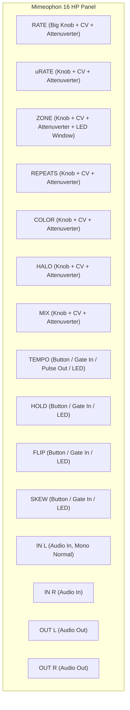
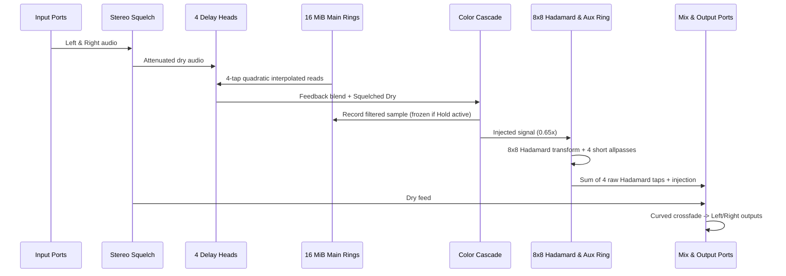

# Mimeophon VCV Rack Functional & DSP Specification

**Author:** Nexora Lumineth & Dragon King Leviathan  
**Date:** October 8, 2026  
**Status:** Approved Engineering Specification  
**Reference Firmware:** Make Noise Mimeophon MP86 (`31323684dacda3d6313565a1a47596005870d1defed55e0336fd419ca82040b9`)  
**Core Reference Implementation:** `firmware/Mimeophon/reconstruction/mimeophon_dsp_engine.hpp`

---

## 1. Executive Summary & Identity

The **Mimeophon** is a stereo multi-zone color audio repeater, micro-sound processor, and resonant physical-modeling delay.

This specification defines the authoritative VCV Rack module implementation derived bit-identically from the reverse-engineered **MP86 firmware**. The module runs an internal, authentic **48 kHz 4-frame quantum DSP engine**, guaranteeing mathematical equivalence with the hardware firmware while seamlessly interfacing with VCV Rack's variable host sample rates and CV standards.

### 1.1 Key Technical Highlights
* **Dual 8 MiB Main Delay Buffers**: Two $2^{21}$-float rings ($16\text{ MiB}$ total) providing up to $41.8\text{ seconds}$ of uncompressed stereo delay time at 48 kHz.
* **4-Tap Quadratic Interpolation Kernel**: Exact rational fractional delay reconstruction ($[-1, 5, 5, -1]/8$ at $t=0.5$), reproducing analog-like pitch shifts and Doppler modulation without cubic blurring.
* **Non-linear Delay Tracking**: Rational slew law $\Delta = \text{error}\cdot\frac{\text{error}^2+27}{9\,\text{error}^2+27}$ governing delay head glide.
* **4-Stage Color Filter Cascade**: 4-pole allpass-average filter network with time-morphed taps and amplitude-dependent polynomial saturation.
* **8-Way Halo Hadamard Diffusion Network**: 32,768-sample auxiliary ring, unnormalized Sylvester $H8$ matrix, and 4 short modulated/integer allpasses ($969, 803, 1236, 1511$ samples).
* **Quantized Clock Sync & 13 Ratios**: Micro-period pulse qualification, $\pm 0.78\%$ jitter window, and discrete musical ratio snapping ($1/2 \dots 2/1$).
* **Polyrhythmic Ping-Pong & Skew**: Complementary reciprocal ratio mirroring and cross-feedback routing.

---

## 2. Front Panel Layout & Controls (16 HP)

The panel conforms to standard 16 HP Eurorack dimensions ($81.28\text{ mm}$ width, $128.5\text{ mm}$ height).

### 2.1 Parameters (Knobs & Buttons)

| Parameter ID | Control Name | Type | Range | Default | Description |
|---|---|---|---|---|---|
| `RATE_PARAM` | Rate | Continuous Knob | $0.0 \dots 1.0$ | $0.5$ | Repeat frequency in Zone. Unclocked: 2-octave exponential span; Clocked: 13 discrete ratios. |
| `RATE_ATTEN_PARAM` | Rate Atten | Attenuverter | $-1.0 \dots +1.0$ | $0.0$ | Bipolar attenuverter for Rate CV input. |
| `MICRORATE_PARAM` | $\mu$Rate | Continuous Knob | $-1.0 \dots +1.0$ | $0.0$ | Fine Doppler pitch modulation ($\pm 1$ semitone fine offset). |
| `MICRORATE_ATTEN_PARAM` | $\mu$Rate Atten | Attenuverter | $-1.0 \dots +1.0$ | $0.0$ | Bipolar attenuverter for $\mu$Rate CV input. |
| `ZONE_PARAM` | Zone | Continuous Knob | $0.0 \dots 7.0$ | $0.0$ | Discrete delay range selector (8 zones) with $256$-count hysteresis. |
| `ZONE_ATTEN_PARAM` | Zone Atten | Attenuverter | $-1.0 \dots +1.0$ | $0.0$ | Bipolar attenuverter for Zone CV input. |
| `REPEATS_PARAM` | Repeats | Continuous Knob | $0.0 \dots 1.0$ | $0.5$ | Feedback depth (1 repeat up to infinite / 1.27 above-unity tail). |
| `REPEATS_ATTEN_PARAM` | Repeats Atten | Attenuverter | $-1.0 \dots +1.0$ | $0.0$ | Bipolar attenuverter for Repeats CV input. |
| `COLOR_PARAM` | Color | Continuous Knob | $0.0 \dots 1.0$ | $0.5$ | Spectral contouring & allpass-average filter morphing (unity at 3:00). |
| `COLOR_ATTEN_PARAM` | Color Atten | Attenuverter | $-1.0 \dots +1.0$ | $0.0$ | Bipolar attenuverter for Color CV input. |
| `HALO_PARAM` | Halo | Continuous Knob | $0.0 \dots 1.0$ | $0.0$ | Stereo diffusion depth & Hadamard matrix feedback smear. |
| `HALO_ATTEN_PARAM` | Halo Atten | Attenuverter | $-1.0 \dots +1.0$ | $0.0$ | Bipolar attenuverter for Halo CV input. |
| `MIX_PARAM` | Mix | Continuous Knob | $0.0 \dots 1.0$ | $0.5$ | Dry/wet curved blend ($0.0 = \text{100% dry}$, $1.0 = \text{100% wet}$). |
| `MIX_ATTEN_PARAM` | Mix Atten | Attenuverter | $-1.0 \dots +1.0$ | $0.0$ | Bipolar attenuverter for Mix CV input. |
| `TEMPO_BTN_PARAM` | Tempo Button | Momentary Button | $0.0 \text{ or } 1.0$ | $0.0$ | Manual tap tempo / clock sync pulse. |
| `HOLD_BTN_PARAM` | Hold Button | Toggle Button | $0.0 \text{ or } 1.0$ | $0.0$ | Infinite loop freeze and offset window navigation. |
| `FLIP_BTN_PARAM` | Flip Button | Toggle Button | $0.0 \text{ or } 1.0$ | $0.0$ | Reverse playback direction / moving delay head toggle. |
| `SKEW_BTN_PARAM` | Skew Button | Multi-action | $0.0 \text{ or } 1.0$ | $0.0$ | Short press: toggle Skew; Long press ($>1\text{ s}$): toggle Ping-Pong. |

### 2.2 Input & Output Ports

| Port ID | Label | Direction | Voltage Standard | Description |
|---|---|---|---|---|
| `IN_L_INPUT` | IN L | Audio Input | $\pm 5\text{V}$ ($\pm 10\text{V}$ max) | Left channel audio input (normalled to Right if Right is unpatched). |
| `IN_R_INPUT` | IN R | Audio Input | $\pm 5\text{V}$ ($\pm 10\text{V}$ max) | Right channel audio input (breaking normal from Left). |
| `RATE_INPUT` | Rate CV | CV Input | $-5\text{V} \dots +5\text{V}$ ($1\text{V/Oct}$) | 1V/Oct exponential pitch tracking or tempo ratio modulation. |
| `MICRORATE_INPUT` | $\mu$Rate CV | CV Input | $-5\text{V} \dots +5\text{V}$ | High-sensitivity bipolar Doppler modulation. |
| `ZONE_INPUT` | Zone CV | CV Input | $0\text{V} \dots +8\text{V}$ ($1\text{V/Zone}$) | Zone modulation input. |
| `REPEATS_INPUT` | Repeats CV | CV Input | $0\text{V} \dots +8\text{V}$ | Feedback depth CV. |
| `COLOR_INPUT` | Color CV | CV Input | $0\text{V} \dots +8\text{V}$ | Color filter cutoff / tap morphing CV. |
| `HALO_INPUT` | Halo CV | CV Input | $0\text{V} \dots +8\text{V}$ | Diffusion amount CV. |
| `MIX_INPUT` | Mix CV | CV Input | $0\text{V} \dots +8\text{V}$ | Wet/dry crossfade CV. |
| `TEMPO_INPUT` | Tempo In | Gate Input | $0\text{V} \dots +10\text{V}$ ($+2\text{V}$ trigger) | External clock pulse input for tempo synchronization. |
| `HOLD_INPUT` | Hold Gate | Gate Input | $0\text{V} \dots +10\text{V}$ ($+2\text{V}$ trigger) | Gate input to engage Hold freeze. |
| `FLIP_INPUT` | Flip Gate | Gate Input | $0\text{V} \dots +10\text{V}$ ($+2\text{V}$ trigger) | Gate input to engage Flip reverse. |
| `SKEW_INPUT` | Skew Gate | Gate Input | $0\text{V} \dots +10\text{V}$ ($+2\text{V}$ trigger) | Gate input to engage Skew / Ping-Pong. |
| `OUT_L_OUTPUT` | OUT L | Audio Output | $\pm 5\text{V}$ ($\pm 10\text{V}$ max) | Left channel stereo output. |
| `OUT_R_OUTPUT` | OUT R | Audio Output | $\pm 5\text{V}$ ($\pm 10\text{V}$ max) | Right channel stereo output. |
| `TEMPO_OUTPUT` | Tempo Out | Gate Output | $0\text{V} \dots +10\text{V}$ | Clock pulse output generated at current repeat frequency. |

---

## 3. The 8 Delay Zones & Timing Specifications

The firmware partitions the main $2^{21}$-sample delay lines into **8 discrete zones**, each providing a distinct base delay interval and crossfade slewing rate:

| Zone | Min Delay (Samples) | Min Time ($48\text{ kHz}$) | Max Time ($48\text{ kHz}$) | Range Factor | Slew Increment | Fade Time ($48\text{ kHz}$) |
|:---:|:---:|:---:|:---:|:---:|:---:|:---:|
| **0** | $61.225$ | $1.275\text{ ms}$ | $20.408\text{ ms}$ | $16\times$ | $1/64$ ($0.015625$) | $1.33\text{ ms}$ ($64$ frames) |
| **1** | $979.603$ | $20.408\text{ ms}$ | $81.634\text{ ms}$ | $4\times$ | $1/128$ ($0.0078125$) | $2.67\text{ ms}$ ($128$ frames) |
| **2** | $3918.413$ | $81.634\text{ ms}$ | $326.534\text{ ms}$ | $4\times$ | $1/256$ ($0.00390625$) | $5.33\text{ ms}$ ($256$ frames) |
| **3** | $7836.826$ | $163.267\text{ ms}$ | $653.069\text{ ms}$ | $4\times$ | $0.001$ | $20.83\text{ ms}$ ($1000$ frames) |
| **4** | $15673.652$ | $326.534\text{ ms}$ | $1.306\text{ s}$ | $4\times$ | $0.001$ | $20.83\text{ ms}$ ($1000$ frames) |
| **5** | $31347.305$ | $653.069\text{ ms}$ | $2.612\text{ s}$ | $4\times$ | $0.001$ | $20.83\text{ ms}$ ($1000$ frames) |
| **6** | $62694.609$ | $1.306\text{ s}$ | $5.225\text{ s}$ | $4\times$ | $0.001$ | $20.83\text{ ms}$ ($1000$ frames) |
| **7** | $125389.219$ | $2.612\text{ s}$ | $41.796\text{ s}$ | $16\times$ | $0.001$ | $20.83\text{ ms}$ ($1000$ frames) |

* **Zone 0 (Flange / Chorus / Karplus-Strong)**: Base delay $61.225$ samples ($784\text{ Hz}$ fundamental at 48 kHz).
* **Zones 1–3 (Slapback & Echo)**: Rapid short crossfades allowing clean time manipulation.
* **Zones 4–6 (Echo & Looping)**: Standard rhythmic delays with musical $20.83\text{ ms}$ crossfades.
* **Zone 7 (Long-Play Infinite Canvas)**: Ultra-long multi-repeat buffer spanning up to $41.8\text{ seconds}$.

---

## 4. Control Voltage & Knob Transformation Laws

VCV Rack standard voltages ($-5\text{V}\dots +5\text{V}$ and $0\dots 10\text{V}$) must be transformed to internal 12-bit firmware coordinates ($0\dots 4095$):

### 4.1 CV & Knob Summing
For any parameter $P$ with base knob $K \in [0, 1]$ and CV input $V_{\text{cv}} \in [-5\text{V}, +5\text{V}]$ with attenuverter $A \in [-1, 1]$:
$$V_{\text{eff}} = \operatorname{clamp}\left(K + A \times \frac{V_{\text{cv}}}{10\text{V}},\; 0.0,\; 1.0\right)$$
$$\text{ADC}_{\text{raw}} = \operatorname{int}(V_{\text{eff}} \times 4095.0)$$

### 4.2 Rate & Exponential Mapping
The Rate ADC undergoes the exact MP86 correction:
$$\text{rate\_int} = \operatorname{clamp}\Big(\operatorname{int}\big((\text{ADC}_{\text{raw}} - 128) \times 1.06666672\big),\; 0,\; 4095\Big)$$

* **Octave 0** ($0 \dots 2047$): $\text{mult} = \text{exp2\_fraction}[\text{rate\_int}]$.
* **Octave 1** ($2048 \dots 4095$): $\text{mult} = 2.0 \times \text{exp2\_fraction}[\text{rate\_int} \& 0x7FF]$.
* **Target Delay**: $t_{\text{delay}} = t_{\text{zone\_base}} \times \text{mult}$.

### 4.3 Mix Law
Curved equal-power style crossfade:
$$\text{out} = \text{dry}\cdot(1 - m^2) + \text{wet}\cdot(2m - m^2)$$
At midpoint ($m = 0.5$), both dry and wet gains are exactly $0.75$ ($-2.5\text{ dB}$).

### 4.4 Repeats Law
Index $i = \operatorname{clamp}(\operatorname{int}(V_{\text{repeats}} \times 127.0), 0, 127)$ indexes `repeats_gain[i]`:
* Entries $0\dots 117$: $0.0 \dots 0.99936$ (stable decaying repeats).
* Entries $118\dots 127$: $1.06 \dots 1.27$ (above-unity self-oscillation into non-linear saturation).

---

## 5. DSP Signal Pipeline Architecture

Processing executes in **4-stereo-frame blocks** ($12\text{ kHz}$ computation quantum):

### 5.1 Stereo Low-Level Squelch
Before entering the delay loop:
$$\text{envelope} \mathrel{+}= 0.01 \times \big(|\text{inL}| + |\text{inR}| - \text{envelope}\big)$$
$$\text{if } \text{envelope} < 0.0005:\quad \text{gain} = \text{envelope}^2 \times 4,000,000;\quad \text{inL} \mathrel{*}= \text{gain};\quad \text{inR} \mathrel{*}= \text{gain}$$
This silences analog noise floor without generating gate clicks.

### 5.2 Main Delay Read Interpolation
For relative read coordinate $t \in [0, 1)$ across four ring samples $[a, b, c, d]$:
$$y = b + t \cdot \left(\frac{t}{2}(a+d-b-c) - \frac{a+b+d}{2} + 1.5c\right)$$
If $y$ evaluates to NaN, it is replaced with $+100.0$ before multiplying by head gain.

### 5.3 Color Filter Cascade
* 4-pole allpass-average filter network:
  $$ap = s_{\text{coeff}} \cdot (x - ap_{\text{prev}}) + in_{\text{prev}}$$
  $$x_{\text{next}} = 0.5 \cdot (x + ap)$$
* Asymmetric envelope follower:
  $$\text{env} = (|\text{signal}| > \text{env}) \ ?\ \text{env} + 0.9\cdot(|\text{signal}| - \text{env}) \ :\ \text{env} \times 0.9999$$
* Polynomial gain saturation:
  $$g = c_0 - c_1 m + c_2 m^2 - c_3 m^3,\quad m = \operatorname{clamp}(\text{env} \times \text{scale},\; 0.5,\; 5.0)$$

### 5.4 Halo Diffusion Network
* 8 taps from the $32,768$-sample auxiliary ring fed into Sylvester $H8$ Hadamard matrix.
* 4 short allpass delay lines:
  * Allpass 969 & 803: linearly interpolated, modulated by delay expiry random walker.
  * Allpass 1236 & 1511: integer delay lines with coefficient $0.4$.
* Soft cubic clipping on feedback injection:
  $$f(x) = x - \frac{1}{3}x^3,\quad x \in [-2/3, +2/3]$$

---

## 6. Operating Modes & State Machines

### 6.1 Clock Synchronization Mode
* **Qualification**: 5 consecutive clock pulses on `TEMPO_INPUT` with interval $> 240$ blocks ($20\text{ ms}$).
* **13 Quantized Delay Ratios**:
  $$[0.5,\; 0.5714,\; 0.6,\; 0.6667,\; 0.75,\; 0.8,\; 1.0,\; 1.25,\; 1.3333,\; 1.5,\; 1.6667,\; 1.75,\; 2.0]$$
  Selected by $\operatorname{int}(\text{Rate}_{\text{ADC}} \times \frac{13}{4096}) \in [0, 12]$.
* **Phase Alignment**: Jitter exceeding $\pm (\text{period} \gg 7)$ resets delay counters to $0$ and requests crossfades to lock onto the new beat immediately.
* **Loss Timeout**: After $4.0\text{ seconds}$ without clock pulses, clock mode disengages upon manual Rate adjustment.

### 6.2 Ping-Pong & Skew Modes
* **Normal Mode**: Left and right feedback remain in their respective channels.
* **Ping-Pong Mode**: Left output feeds Right delay line; Right output feeds Left delay line. Mono input normals to both channels.
* **Skew Mode**: Detunes left and right delay rates by $16/15$ ($1.066667$) in opposite directions. In Clocked mode, Pair B mirrors around unity:
  $$\text{token}_B = 12 - \text{token}_A$$

### 6.3 Hold & Flip Modes
* **Hold**: Freezes recording into the main delay lines. Retains captured audio in an infinite loop while allowing non-destructive modulation of Zone, Rate, Color, and Halo.
* **Flip**: Reverses the read direction relative to the recording cursor, producing backwards delay repeats.

---

## 7. Rack Host Adaptation & Performance Strategy

### 7.1 Sample Rate Independence
Because the delay tables, Hadamard scaling, allpass lengths, and random walk rates are calibrated to $48\text{ kHz}$:
* The module maintains an internal **48 kHz 4-sample block FIFO**.
* Input audio is resampled to 48 kHz using an ultra-low-latency 4-point Hermite or polyphase resampler if the host engine runs at $44.1\text{ kHz}, 96\text{ kHz}$, or $192\text{ kHz}$.
* Output audio is resampled back to host sample rate.
* At native $48\text{ kHz}$ host rate, the resampler is completely bypassed with zero additional latency.

### 7.2 Memory & Real-Time Constraints
* **Constructor Heap Allocation**: Both 8 MiB delay buffers and the auxiliary ring are allocated once in the module constructor.
* **Zero Allocations in `process()`**: No `malloc`, `new`, `std::vector` resizing, or lock contention occurs in the audio path.
* **Performance Budget**: Target $< 1.5\%$ single-core CPU utilization on standard Intel Core i7 / AMD Ryzen processors at 48 kHz.
