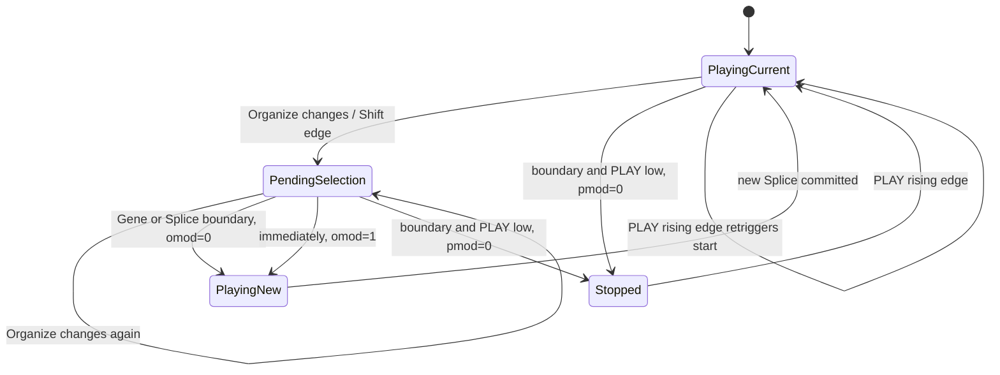
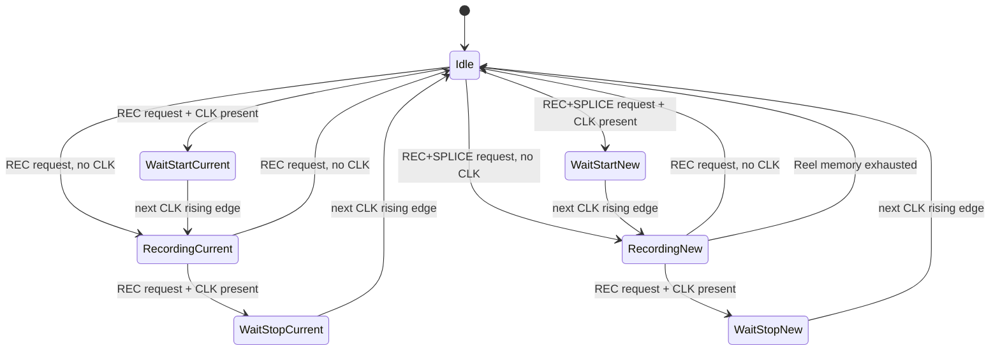
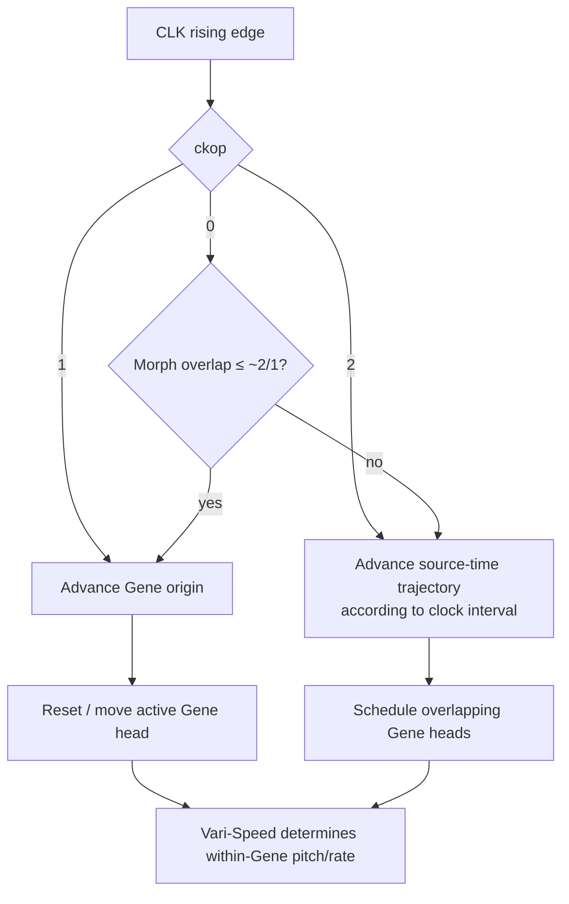

# Make Noise Morphagene: Engineering Reconstruction and DSP Technical Brief

## Executive summary

Dragon King Leviathan, the Morphagene is best understood not as a conventional SD-card sampler with a granular effect bolted on, but as a **RAM-resident, stereo, multi-read-head recording system** whose conceptual model deliberately mimics several independent tape mechanisms: one continuously addressable recording medium (“Reel”), one or more independently manipulated playback heads (“Genes”), and an independent fixed-rate record head. Make Noise explicitly describes recording and playback as independent processes, and the manual confirms that recording remains at a constant 48 kHz while playback can simultaneously run forward, backward, change rate, jump position, overlap multiple Genes, and feed the processed result back into recording through Sound-on-Sound. citeturn19view3turn15view0turn15view1

The hard specifications that can be established from primary sources are unusually useful. Current Make Noise documentation specifies a **24-bit audio codec**, **48 kHz operation**, **32-bit WAV files**, stereo I/O, a maximum Reel duration of **2 minutes 54 seconds**, Vari-Speed extending approximately **+12 semitones / −26 semitones** around nominal playback, and current firmware **MG204**. The manual further specifies that Reel files are **32-bit floating-point, 48 kHz, stereo-only WAV**, that an active Reel lives in internal memory, that microSD cards use FAT32, and that as many as 32 Reels may be addressed by the prescribed filenames. citeturn19view3turn18view0

A particularly strong reverse-engineering clue falls directly out of those numbers. A 174-second Reel at 48,000 frames/s, two channels and four bytes/channel requires:

\[
174 \times 48{,}000 \times 2 \times 4
 = 66{,}816{,}000\text{ bytes}
 = 63.7207\text{ MiB}.
\]

A 64 MiB memory contains 67,108,864 bytes and could hold 174.763 seconds of such stereo float data. The difference from the advertised 174 seconds is only about **293 kB, or 0.763 seconds**. Moreover, the MG137 firmware changelog says the available Reel time was doubled from 1.45 minutes to 2.9 minutes without changing 48 kHz/32-bit fidelity; 87 seconds of stereo float32 happens to consume 31.86 MiB, almost exactly half of 64 MiB. The strongest engineering inference is therefore that Morphagene contains **approximately 64 MiB / 512 Mbit of dedicated sample RAM**, with MG137 changing memory allocation/access so that essentially all of it became available to the Reel. The exact RAM technology and part number remain unverified. citeturn18view0turn19view2

The most defensible reconstruction of its DSP is therefore:

**24-bit ADC → floating-point live stream → RAM-resident stereo Reel + fractional-rate playback heads → Gene region/address generator → Morph multi-head scheduler → per-head Vari-Speed/resampling → short grain windows → optional pitch-ratio/pan processing → stereo sum → S.O.S. crossfade with live input → 24-bit DAC**, with the post-S.O.S. bus also feeding the default record path and envelope follower. MG155's `inop 1` changes the recorder tap from this S.O.S. bus to the direct input stream. The official manual explicitly confirms the latter distinction. citeturn15view1turn16view0

The central synthesis algorithm is almost certainly **time-domain granular overlap/add rather than a phase vocoder**. Make Noise explicitly calls the process granulation and synchronous granulation; Gene length is defined in elapsed time independently of Vari-Speed; Morph changes Gene overlap; the Clock can independently advance Gene positions or control time stretch; and the firmware exposes Gene window smoothing. Those are the ingredients of a multi-head OLA/granular time stretcher. There is no primary-source evidence that Morphagene performs FFT analysis, phase locking, spectral resynthesis or any other phase-vocoder operation. citeturn15view1turn15view2turn16view0

Several lower-level details remain genuinely proprietary. No public source located for this report establishes the exact processor, codec IC, RAM IC, interpolation kernel, anti-alias filter, control ADC resolution, DSP audio-block size, grain-window equation, envelope-follower constants, parameter-smoothing constants, or the exact handling of voltages outside the documented CV ranges. No credible public schematic or source-code release surfaced, and no Morphagene-specific patent surfaced in the patent searches performed for this investigation. Tom Erbe is explicitly credited for DSP while Tony Rolando is credited for hardware, and Erbe has described his Make Noise workflow as including code for knobs, LEDs, bootloaders and the DSP itself, but neither the Morphagene manual nor Erbe's published retrospective discloses these implementation primitives. citeturn27view1turn27view3

The confidence convention used throughout this report is:

| Mark | Meaning | Interpretation |
|---|---|---|
| **A — confirmed** | Primary-source specification or directly implied by an explicit documented behavior | ≳95% confidence |
| **B — strong inference** | Multiple primary-source facts constrain the implementation tightly | roughly 75–95% |
| **C — engineering estimate** | Technically plausible and consistent with observations, but several implementations fit | roughly 45–75% |
| **D — speculative** | Useful hypothesis for emulation/reverse engineering, not something to treat as product specification | <45% |

These percentages are epistemic labels, not measured probabilities.

## Evidence base and source reconciliation

The most authoritative document is the current Make Noise manual. It is especially valuable because it contains not just front-panel instructions but MG137, MG155, MG157 and MG203 firmware changelogs, including implementation-revealing options such as audio-rate position modulation, alternate Gene windowing, clocked time stretching, 1 V/oct Vari-Speed, alternate record routing and explicit high-Morph pitch ratios. The current product page, meanwhile, identifies MG204 as the distributed firmware and provides current marketing specifications. citeturn16view0turn19view3

There are, however, real inconsistencies even among first-party sources. The most conspicuous is the maximum Splice count: the current product page says **99 Splices/Reel**, whereas the manual's MG137 changelog explicitly says the maximum was increased to **300**, and subsequent manual sections continue to say 300. The technically detailed firmware changelog is more persuasive than the shorter product-page feature list, so **300 is the best estimate for actual post-MG137 firmware capacity**, but because the currently distributed firmware is MG204 and its own detailed changelog is not present in the manual, this should not be called absolutely resolved. citeturn19view3turn18view0turn16view0

The historical SoundHack page supplies a useful snapshot of the launch-era specifications: 87-second Reels, 99 Splices, 24-bit/48 kHz codec and 32-bit WAV output. Intriguingly, that page mentions MG137 while still displaying the old 87-second number, whereas Make Noise's own MG137 changelog says that firmware doubled Reel time to 2.9 minutes. This is strong evidence that the SoundHack feature list simply became stale rather than that two different current architectures exist. citeturn27view0turn18view0

DivKid's NAMM 2017 reporting independently preserves the original 87-second/99-Splice launch configuration, supporting the chronology rather than adding new low-level implementation details. Later third-party tutorials likewise demonstrate practical granular and resampling behavior but do not disclose processor or interpolation internals. citeturn21search5turn25search12

Tom Erbe's 2022 retrospective describes Morphagene as a looper with extensive granular capabilities and live splicing. His interview with Modulisme is more illuminating about the development philosophy: Erbe states that in hardware he writes code “from the knobs to LEDs to bootloader,” while Tony Rolando says Make Noise works with Erbe wherever DSP is required. This makes a monolithic embedded-firmware implementation substantially more likely than, for example, an FPGA data path with a separate UI MCU, but it does **not** identify the processor. citeturn27view1turn27view3

The resulting source comparison is:

| Property | Make Noise current page | Make Noise manual / firmware history | SoundHack / early reports | Engineering conclusion | Confidence |
|---|---|---|---|---|---|
| Current firmware | MG204 | Detailed text through MG203 | Older MG137-era material | MG204 current; MG203 behavior is the documented baseline where MG204 is silent. citeturn19view3turn16view0 | **A** |
| Sample rate | 48 kHz WAV | Constant 48 kHz record/playback | 48 kHz codec | Exactly 48 kHz audio domain. citeturn19view3turn19view2turn27view0 | **A** |
| ADC/DAC depth | 24-bit codec | “32-bit dynamic range” language | 24-bit codec | Converters are 24-bit; 32-bit refers file/internal numerical representation rather than converter resolution. citeturn19view3turn19view2turn27view0 | **A/B** |
| Reel file format | “48k 32bit WAV” | 32-bit float, 48 kHz, stereo-only WAV | 32-bit WAV | IEEE float32 stereo WAV is explicit in manual. citeturn18view0 | **A** |
| Current Reel time | 174 s | ~2.9 min | historical 87 s | 174 s current; 87 s pre-MG137. citeturn19view3turn18view0 | **A** |
| Sample RAM | not stated | Active Reel held in internal memory; MG137 doubled capacity without fidelity change | — | ≈64 MiB dedicated buffer is an unusually strong numerical inference. citeturn18view0turn19view2 | **B+** |
| Maximum Splices | 99 | MG137 explicitly increased to 300 | original 99 | Likely 300 on later firmware; current web page appears stale/inconsistent. citeturn19view3turn18view0turn27view0 | **B** |
| Reels/card | “multiple” | maximum 32 | multiple | 32 filenames/slots. citeturn18view0 | **A** |
| Vari-Speed | +12 / −26 semitones | same; nonlinear increased resolution near Stop | same | Signed variable-rate playback with nonlinear classic control law. citeturn19view3turn15view2 | **A** |
| Grain windowing | not detailed | default click-suppression window; optional stronger smooth window | — | Explicit amplitude windowing exists; exact shape/length unknown. citeturn16view0 | **A for existence / D for kernel** |
| High-Morph voices | “layer/stagger” | up to 3/1 in prose; MG203 exposes ratios for 2nd–4th Genes | demonstrations show poly-granular behavior | Four Gene voices apparently exist at highest settings, although old “3/1” terminology makes exact concurrency ambiguous. citeturn15view1turn16view0 | **B** |
| Processor | unstated | unstated | no credible teardown identification found | Unknown; Cortex-M-class/FPU architecture is plausible but not established. | **D** |
| Interpolation | unstated | unstated | no reliable implementation disclosure found | Fractional interpolation is almost certainly present; kernel unknown. | **B existence / D type** |
| Patented algorithm | — | — | no relevant patent surfaced in searches | No patent evidence should be used to infer internals. | — |

One further documentary subtlety matters for engineering reconstruction. Early manual pages still describe the original automatic input-level procedure and say there is no analog gain control, but the later MG203 changelog explicitly supersedes Auto-Level with a four-position input-gain system: **blue −3 dB, green “modular level,” orange +6 dB, purple +12 dB**. Any present-day model should therefore use the MG203 behavior rather than treating the earlier Auto-Level text as current. citeturn19view0turn16view0

## Hardware, memory, files, and real-time architecture

The externally verified audio architecture starts with stereo, AC-coupled inputs capable of accepting line- or modular-level signals and ends at stereo AC-coupled outputs nominally around **10 Vpp**. The current product page specifies a 24-bit codec. The manual says the digital record/playback frequency remains fixed at 48 kHz and that recorded Reel files are 32-bit float. citeturn19view0turn19view2turn19view3

The best interpretation is therefore:

\[
\text{analog input}
\rightarrow \text{input gain / attenuation}
\rightarrow 24\text{-bit ADC @ 48 kHz}
\rightarrow \text{32-bit processing domain}
\]

and correspondingly:

\[
\text{32-bit DSP}
\rightarrow 24\text{-bit DAC @ 48 kHz}
\rightarrow \text{AC-coupled Eurorack output}.
\]

Whether “32-bit processing domain” is literally IEEE-754 float for *every* DSP operation is not stated by Make Noise. It is nevertheless a strong inference: Reel files are float32, the manual describes 32-bit dynamic range, and SoundHack's descriptions of other contemporary Tom Erbe/Make Noise digital modules explicitly mention 24-bit/48 kHz codecs with 32-bit floating-point processing. That sibling evidence should not be mistaken for a Morphagene component specification, but it raises float DSP above a generic guess. citeturn18view0turn19view2turn27view0

The MG203 input-gain update is revealing. Because the gain selections were introduced purely by firmware while Make Noise simultaneously says internal processing was changed to improve input/playback signal-to-noise ratio, the most plausible mechanism is a **programmable PGA in the codec or another digitally controlled pre-ADC gain element**, not simply multiplication after conversion. Digital gain after a fixed ADC cannot restore ADC SNR lost when recording a weak line-level signal; a codec PGA can. The exact implementation is nevertheless undocumented, so a software-only post-ADC gain remains possible. citeturn16view0

The Reel memory arithmetic is even more constraining:

| Buffer configuration | Stereo frames | Raw float32 stereo bytes | Binary MiB |
|---|---:|---:|---:|
| Historical 87 s | 4,176,000 | 33,408,000 | 31.86 MiB |
| Current 174 s | 8,352,000 | 66,816,000 | 63.72 MiB |
| Exact capacity of 64 MiB at 48 kHz stereo float32 | 8,388,608 | 67,108,864 | 64.00 MiB |
| Corresponding duration | — | — | **174.763 s** |

The match is sufficiently close that a **512-Mbit external RAM part or equivalent 64-MiB bank** is the best hardware estimate. MG137's move from approximately 32 to 64 MiB of usable buffer also explains why the record time could double while retaining the same sample rate and numerical format. A less elegant possibility is that the machine always had more memory and MG137 changed representation/allocation in a different manner, but the power-of-two correspondence is striking. citeturn18view0

The active Reel is explicitly loaded into **internal memory**, while additional Reels live on microSD. This means microSD is not the audio-rate random-access medium. That distinction explains why Slide and Vari-Speed can be manipulated continuously without SD latency and why SD writes can continue in the background. The manual specifically warns that deleting audio in the middle of a full Reel can require rewriting the entire 2.9-minute file and tells the user to wait while the Shift LED indicates SD-card activity. citeturn18view0

A highly probable memory model is therefore:

```text
External sample RAM, approximately 64 MiB
┌──────────────────────────────────────────────────────────────┐
│ current Reel: interleaved or planar L/R float32 audio        │
│ 0 .................................................. N-1      │
│                                                              │
│ splice-marker table: tiny relative to audio                  │
│ playback-head state: current/next splice, slide, gene heads  │
│ record-head state                                             │
└──────────────────────────────────────────────────────────────┘
             ↑ simultaneous reads and writes ↓
DSP/audio engine                              SD task
             │                                 │
             └──────── background serialization┘
                              ↓
                     FAT32 microSD WAV
```

Whether channel samples are interleaved (`LRLR...`) or planar (`LLLL...RRRR...`) cannot be inferred from public documentation. Interleaving would make WAV I/O straightforward; planar buffers can make per-channel SIMD/DSP operations easier. **Confidence D**.

The WAV specification is much firmer. Morphagene expects **stereo-only, 48 kHz, float32 WAV** files in the FAT32 card's root directory. Files are named `mg1.wav` through `mg9.wav`, then `mga.wav`, `mgb.wav`, continuing through `mgw.wav`, giving 32 Reel slots. Splice markers are represented as standard audio markers in the WAV file and can be edited by compatible DAWs. Make Noise does not document the exact RIFF subchunks it emits, so assuming a specific `cue ` / `LIST-adtl` combination would exceed the evidence. citeturn18view0

A full 174-second Reel contains about **66.8 MB of audio payload** before RIFF metadata. Thirty-two completely full Reels would therefore contain roughly **2.14 GB decimal / 1.99 GiB** of raw sample payload. This fits comfortably inside FAT32's individual-file size limit, although actual card compatibility, capacity limits and allocation-unit requirements beyond “FAT32” are not specified in the manual. citeturn18view0

The record engine appears to operate on the RAM buffer itself. Time Lag Accumulation can continuously write into the same selected Splice while playback is simultaneously reading it; audible Vari-Speed, Morph and other manipulations on the playback side become material for the next pass. Conversely, recording remains fixed-speed and fixed-direction, so changing the playback head does not change the rate at which newly captured input samples are written. This is exactly the behavior of independent read and write pointers in a circular or bounded memory region. citeturn15view1turn18view0

The most likely record-pointer representation is a simple integer sample/frame address incremented by one each 48 kHz frame. Playback heads, by contrast, require fractional position because Vari-Speed is continuous and the MG155 `pmin` option performs audio-rate phase/position modulation. Thus a fixed-point phase accumulator or float/double sample coordinate is almost unavoidable for playback. citeturn15view2turn16view0

Exact real-time block size is unknown. A sensible embedded implementation would process roughly **16–128 stereo frames per codec/DMA interrupt**—0.33 to 2.67 ms at 48 kHz—with 32 or 64 frames being particularly conventional. This is only a **D-level engineering estimate**; no examined source states the DMA buffer or DSP vector size. Consequently, precise through-latency cannot be claimed either. Codec group delay plus one small DSP block suggests a likely few milliseconds rather than tens of milliseconds, but this remains unmeasured.

## Reconstructed signal flow and DSP algorithms

The following is the highest-confidence functional signal-flow reconstruction possible without a schematic or firmware source. Nodes marked **[A]** are directly documented; **[B]** are strongly implied; **[C/D]** remain implementation estimates. The ordering of the S.O.S. bus and record taps is constrained especially strongly by the MG155 `inop` option and Time Lag Accumulation behavior. citeturn15view1turn16view0

```mermaid
flowchart LR
    IN["L/R Audio Inputs\nAC-coupled [A]"]
    GAIN["Input gain staging\n-3 / modular / +6 / +12 dB [A]\ncodec PGA likely [C]"]
    ADC["Stereo 24-bit ADC\n48 kHz [A]"]
    LIVE["Live stereo DSP stream\nfloat32 likely [B]"]

    RAM["Active Reel RAM\n~64 MiB inferred [B]\n48 kHz stereo"]
    REGION["Region / address generator\nOrganize + Slide + Gene-Size\nClock / Play reset [A/B]"]
    MORPH["Morph voice scheduler\nstagger / overlap\nup to ~4 Gene voices [B]"]
    PTR["Per-voice read pointer\nVari-Speed × Morph ratio\n± direction [A/B]"]
    PM["Optional pmin audio-rate\nposition modulation [A]"]
    INT["Fractional sample interpolation\nkernel unknown [B/D]"]
    WIN["Gene amplitude window\nclick suppression or smooth [A]\nshape unknown [D]"]
    PAN["Per-Gene pan / high-Morph\npitch-ratio behavior [A/B]"]
    SUM["Stereo playback sum [B]"]

    SOS["S.O.S. live/playback crossfade\nlinear CV law [A]"]
    BUS["Post-S.O.S. stereo bus [B]"]
    DAC["24-bit stereo DAC @48 kHz [A]"]
    OUT["L/R Audio Outputs\n~10 Vpp, AC-coupled [A]"]

    ENV["Envelope / average-energy follower\n0…8 V [A]"]
    CV["CV OUT"]
    EOS["Gene/Splice boundary logic\nEOSG 0…10 V [A]"]

    RECSEL{"Record source"}
    WR["Fixed-rate record writer\n48 kHz, forward [A]"]
    SD["Background WAV persistence\nFAT32 microSD [A]"]

    IN --> GAIN --> ADC --> LIVE

    RAM --> REGION --> MORPH --> PTR --> INT --> WIN --> PAN --> SUM
    PM -. "pmin=1" .-> PTR

    LIVE --> SOS
    SUM --> SOS
    SOS --> BUS --> DAC --> OUT
    BUS --> ENV --> CV
    REGION --> EOS

    BUS -->|"inop=0 default"| RECSEL
    LIVE -->|"inop=1"| RECSEL
    RECSEL --> WR --> RAM
    RAM <-->|"load/save, non-audio-rate"| SD
```



The **S.O.S. control** is not merely an overdub-feedback amount. Make Noise explicitly calls it a mix between live input and previously recorded playback, says its CV response is linear, and notes that it can be abused as a voltage-controlled crossfader or as a VCA for the Reel when no live signal is present. At initial recording, full counter-clockwise yields the incoming input at full level; toward clockwise, Reel playback dominates. A defensible normalized model is therefore:

\[
s =
\begin{cases}
k_\mathrm{SOS}, & \text{CV unpatched}\\[3pt]
\operatorname{sat}_{0,1}\!\left(k_\mathrm{SOS}\frac{V_\mathrm{SOS}}{8}\right),
& \text{CV patched}
\end{cases}
\]

\[
y=(1-s)x_\mathrm{live}+s\,x_\mathrm{reel}.
\]

The exact gain law at the midpoint could theoretically contain gain compensation, but “linear response” strongly favors an ordinary linear-amplitude crossfade rather than an equal-power sine/cosine law. citeturn19view0turn18view0

**Vari-Speed** is best modeled as a signed fractional read-pointer increment. Let \(p[n]\) be a playback head position in sample frames:

\[
p[n+1]=p[n]+r[n]
\]

with \(r=+1\) representing normal forward playback, \(r=-1\) normal reverse, \(r=0\) Stop, and \(|r|>1\) faster/higher playback. The manual explicitly locates normal speed near 2:30 forward and 9:30 reverse and Stop at noon. It also states that the classic Vari-Speed control has increased resolution near the center and a greater slowing range than speeding range, so its transfer is **not a simple linear volts-to-read-increment law**. citeturn19view2turn15view2

The marketing specification of +12 and −26 semitones translates nominally to rate ratios of approximately:

\[
2^{12/12}=2.000
\]

and

\[
2^{-26/12}\approx0.223.
\]

Those should not be interpreted as hard \(|r|\) limits because the control also reaches \(r=0\) at noon; arbitrarily slow motion exists between nominal slow playback and Stop. The +12/−26 numbers are therefore best read as Make Noise's **musically useful calibrated playback/pitch range**, not a mathematically exhaustive rate interval. citeturn19view3turn15view2

MG155 provides much cleaner transfer behavior with `vsop 1` and `vsop 2`. In these modes the Vari-Speed CV can be trimmed with its attenuverter to track one volt/octave. A plausible internal equation is:

\[
|r| = r_0 2^{V_\mathrm{eff}}
\]

where \(r_0\) is set by the panel control/reference and \(V_\mathrm{eff}\) is the attenuated CV in volts. `vsop 1` retains bidirectionality; `vsop 2` is forward-only, relocates Stop to the fully counter-clockwise knob position, and provides more precision at low rates. Exact clamping and the panel/CV summing point are not documented. citeturn16view0

Because those read positions are fractional for almost every non-integer speed, the engine must either interpolate or accept catastrophic nearest-neighbor imaging. The manual's claim of high-fidelity playback under heavy speed modulation, together with audio-rate position modulation in `pmin`, makes **some fractional interpolation extremely likely**. Nearest-neighbor is therefore an implausible design. The exact kernel remains unknown. citeturn19view2turn16view0

The most plausible candidates are:

| Resampling method | Fit to observed design | Confidence |
|---|---|---|
| Nearest-neighbor | Computationally cheap but inconsistent with “high fidelity” continuous Vari-Speed and phase modulation | **Very unlikely** |
| Linear, 2-point | Cheap, smooth, natural for embedded variable-rate playback; attenuates highs at fractional positions | **Plausible C** |
| Cubic / Hermite / 4-point Lagrange | Better high-frequency performance, still affordable on float DSP hardware | **Plausible C**, my leading estimate |
| Windowed-sinc/polyphase SRC | Best anti-aliasing but costly for continuously modulated independent grain heads | **Possible but unsupported D** |
| FFT/phase-vocoder resampling | Not required for ordinary Vari-Speed and conflicts with tape-style pitch/time coupling | **Very unlikely for Vari-Speed** |

No source documents a dynamically adjusted digital anti-alias filter. This matters technically: at \(r=2\), material above approximately 12 kHz should be removed before a theoretically alias-free 2× read-rate conversion. Linear/cubic interpolation by itself supplies some spectral shaping but is not an ideal anti-alias filter. Therefore **anti-alias handling must remain unknown**; one should not assume Morphagene is a textbook band-limited sample-rate converter merely because its codec runs at 48 kHz.

**Gene-Size** defines a playback window. At full counter-clockwise the window becomes the entire selected Splice. Once moved away from that endpoint, the manual explicitly states that Gene length becomes a constant *time duration* rather than a fixed sample count relative to playback speed. Thus Vari-Speed changes how far through source memory the read pointer travels during one Gene but does not alter the wall-clock duration of the Gene. citeturn15view2

That implies an implementation approximately like:

\[
N_g = T_g(u_g)\times 48{,}000
\]

where \(N_g\) is the Gene's output duration in audio frames and \(T_g\) is controlled by Gene-Size, while the source-memory excursion for one voice is approximately:

\[
\Delta p_g \approx r\,N_g.
\]

This cleanly explains why pitch can change without the EOSG interval necessarily changing: one is read-pointer velocity; the other is playback-window scheduling. citeturn15view2

The Gene-Size knob spans the entire Splice at one end and “extremely short, potentially inaudible” Genes at the other. Make Noise does not publish the minimum duration or transfer curve. A purely linear map would be musically poor: on a 174-second full-Reel Splice, almost the entire pot travel would represent macroscopic durations and only an infinitesimal region would reach milliseconds. The most plausible implementation is therefore a **strongly nonlinear/logarithmic or exponential duration map with a special full-Splice endpoint**. A conceptual model would be:

\[
T_g(0)=T_\mathrm{splice}
\]

and, for \(u_g>0\),

\[
T_g(u_g)\approx T_\mathrm{max}\left(\frac{T_\mathrm{min}}
{T_\mathrm{max}}\right)^{u_g}.
\]

This equation is an engineering model, not recovered firmware. A practical minimum somewhere in the **sub-millisecond to few-millisecond range** is plausible at 48 kHz, but there is insufficient evidence to assign a precise value. **Confidence C for logarithmic behavior; D for minimum duration.** citeturn19view0turn15view2

**Slide** selects the location of the Gene/window inside the selected Splice and also offsets the Play-reset location. The simplest address equation is:

\[
p_\mathrm{start} =
p_\mathrm{splice,start}
+u_\mathrm{slide}\,
\bigl(L_\mathrm{splice}-L_\mathrm{window}\bigr).
\]

Whether the firmware uses precisely this endpoint correction or instead permits a Gene to wrap around the Splice is undocumented. The manual says Slide moves the playback window immediately enough that stepped voltages produce hard timbral changes, yet the MG137 notes also warn that moving through very long Splices can take noticeable time because the module “scans” toward the new location. That suggests **a deliberately rate-limited/slewed positional transition whose latency scales with travel distance**, even though it appears effectively immediate over short buffers. Exact scan speed is unknown. citeturn15view1turn18view0

**Morph** controls grain density/overlap rather than merely adding an effect mix. At full counter-clockwise there is a small gap between Genes; around 9 o'clock the output becomes a seamless 1/1 stream; turning farther clockwise causes overlap up to the region Make Noise describes as 3/1. Beyond that, additional pitch changes and stereo panning appear. Make Noise calls the boundary treatment “Dynamic Enveloping.” citeturn15view1

MG203 gives a major clue to the underlying polyphony: its `mcr1`, `mcr2`, and `mcr3` options specify the pitch ratios of the **second, third, and fourth Genes** at Morph's highest settings. The historical values are exactly 2.00000, 3.00000 and 4.00000, corresponding to +1 octave, +octave-and-fifth, and +2 octaves relative to a primary voice. User ratios can range from 0.06250 through 16.00000 and can be negative, which causes individual Genes to play backward. This strongly suggests at least **four independent playback-head/voice structures** available at maximum Morph. citeturn16view0

A likely Morph architecture is therefore:

```text
                   ┌─ Voice 1: read rate = r
Gene scheduler ────┼─ Voice 2: read rate = r × mcr1
                   ├─ Voice 3: read rate = r × mcr2
                   └─ Voice 4: read rate = r × mcr3
                          ↓
                  independent windows
                          ↓
                per-voice stereo gains/pan
                          ↓
                     stereo sum
```

The manual still describes high-Morph pitch behavior as randomized. The MG203 ratio controls show that the available transposition relationships are not simply arbitrary random numbers, so the most coherent interpretation is that **grain timing/selection and/or deployment of those detuned voices retains stochastic behavior while the per-voice nominal ratios are constrained by `mcr1–3`**. The exact random distribution and PRNG behavior are unknown. citeturn15view1turn16view0

Windowing is unambiguous in existence but not in form. `gnsm 0` uses a window only long enough to suppress clicks; `gnsm 1` extends the window enough to become audible, producing fades on longer loops and a more liquid result with small Genes. This is textbook grain-boundary amplitude enveloping. citeturn16view0

A **half-cosine / raised-cosine / Hann-like edge** is my best engineering guess because such a curve suppresses first-derivative discontinuities better than a hard linear splice and costs little on a floating-point MCU, but a simple linear ramp would also satisfy the documented behavior. No source justifies naming a particular window. Accordingly:

\[
w[n] = \text{unknown smooth edge function}
\]

is the only defensible exact specification.

The clock-driven **time-stretch** behavior follows naturally from this architecture. In default clock mode, lower Morph settings cause each clock edge to advance to the next Gene, while above roughly the 2/1 overlap region the Clock controls time compression/stretching. Vari-Speed can then determine the per-grain source read rate/pitch while Clock controls the progression of grain origins through the Reel. citeturn15view0turn16view0

In engineering terms there are two time axes:

\[
\text{within-grain source rate}=r_\mathrm{VariSpeed}
\]

versus

\[
\text{source-position advance rate}
=f_\mathrm{Clock}.
\]

Separating them produces pitch-shifting without the ordinary tape-machine change in overall traversal speed. This is essentially **synchronous granular overlap/add**. There is no evidence of Fourier-domain phase analysis; the manual itself calls the technique synchronous granulation. citeturn15view1turn15view2

`pmin 1` gives further confirmation that source position is a first-class DSP variable. When enabled, and when no active left input is detected, the right audio input becomes an **audio-rate phase/position modulation** signal for Morphagene playback. The implementation almost certainly adds a bipolar offset to each playback address before interpolation:

\[
p_i'[n]=p_i[n]+K_\mathrm{PM}x_R[n],
\]

although \(K_\mathrm{PM}\), clipping/wrapping behavior and whether all active heads receive exactly the same offset are undocumented. The several-second transition after removing the left signal strongly suggests a firmware signal-presence detector/hysteresis timer rather than an instantaneous mechanical jack-normal decision. citeturn16view0

Finally, **CV OUT** in its default mode is specified as a 0–8 V representation of the average energy at the audio outputs and is described elsewhere as an envelope follower. A likely implementation is either:

\[
e[n]=LPF\left(\frac{|L[n]|+|R[n]|}{2}\right)
\]

or

\[
e[n]=LPF\left(\frac{L[n]^2+R[n]^2}{2}\right),
\]

possibly with asymmetric attack/release constants. The phrase “average energy” technically favors the second, whereas “envelope follower” commonly means the first. No attack, release, RMS window or curve is specified, so this remains **C-level**. `cvop 1` replaces it with a ramp generator whose period follows Gene-Size, proving that CV OUT is firmware-generated rather than a purely analog envelope circuit. citeturn19view0turn16view0

## Control and jack implementation specification

The following control equations use:

\[
\operatorname{sat}_{0,1}(x)=\min(1,\max(0,x))
\]

and \(k\) for the normalized panel-pot position. For attenuverters, \(a\in[-1,+1]\). Except where Make Noise explicitly states a response law, these equations describe the **most plausible internal normalization**, not recovered source code.

| Control | Documented behavior and range | Best-guess digital mapping | Negative / over-range behavior | Confidence |
|---|---|---|---|---|
| **S.O.S. knob / combo pot** | Crossfades live input and Reel; when CV jack is empty it is the control itself; with CV patched it becomes the CV attenuator. citeturn19view0 | Unpatched: \(s=k\). Patched: \(s\approx sat(kV/8)\). Output approximately \((1-s)Live+sReel\). | N/A for knob. | **A/B** |
| **S.O.S. CV** | 0–8 V, unipolar, linear, normalized internally to +8 V. citeturn19view0 | 8 V corresponds to full-scale before combo-pot attenuation. | Negative input is outside specified range; likely clamped toward 0/live, but **not documented as safe transfer behavior**. | **A range / C clipping** |
| **Gene-Size knob** | Full Splice at CCW to extremely short/potentially inaudible at CW. citeturn19view0turn15view2 | Special full-Splice endpoint plus likely log/exponential time map. Gene duration is wall-clock based, not source-sample-count based. | N/A. | **A behavior / C curve** |
| **Gene-Size attenuverter** | Bipolar attenuator. citeturn19view0 | \(u_g\approx sat(k_g+a_g V_g/8)\). | Allows positive CV to increase or decrease Gene-Size depending on attenuverter sign. | **B** |
| **Gene-Size CV** | Manual oddly calls it “bipolar” but gives **0 to +8 V** range. citeturn19view0 | Treat 0–8 V as the authoritative expected jack range; “bipolar” most likely describes the associated attenuverter/action. | Raw negative voltage behavior unspecified; likely input-protected and parameter-clamped. | **A range / B interpretation** |
| **Vari-Speed knob** | Noon = Stop; clockwise forward, counter-clockwise reverse; 1× around 2:30 forward / 9:30 reverse; increased resolution near center; useful range roughly +12/−26 semitones. citeturn15view2turn19view2 | Signed nonlinear read-rate function \(r=g(k)\), with \(g(0.5)=0\), \(g(k_{1x})=\pm1\). | N/A. | **A behavior / unknown equation** |
| **Vari-Speed attenuverter** | Bipolar CV attenuation; trim required for 1 V/oct firmware modes. citeturn19view0turn16view0 | CV is likely summed into the speed-control domain before rate mapping. | Inversion reverses pitch-direction influence of CV. | **B** |
| **Vari-Speed CV** | ±4 V specified. citeturn19view0 | Classic: nonlinear continuous rate modulation. `vsop 1/2`: exponential \(2^{V}\) pitch relation after attenuator trim. | Negative CV explicitly valid. Depending on panel setting/mode it can slow, cross Stop and/or reverse. | **A** |
| **Morph knob** | Gap → seamless 1/1 around 9:00 → increasing overlap → high-Morph detuned/panned Genes. citeturn15view1 | Continuous overlap/density control with piecewise behavioral regions; likely maps scheduler interval relative to Gene duration. | N/A. | **A functional / C exact curve** |
| **Morph CV** | Unity-gain, 0–5 V unipolar. citeturn19view0 | Likely \(m=sat(k_m+V/5)\). There is no CV attenuator. | Negative outside specification; likely clips at minimum after input conditioning. | **B equation / C negative** |
| **Slide knob** | Scrubs playback position and offsets Play start; behavior depends on Gene-Size. citeturn19view1 | Approximately normalized source-window start address, probably linear in source position with slew/rate limiting over long distances. | N/A. | **A function / C equation** |
| **Slide attenuverter** | Bipolar attenuator. citeturn19view1 | \(u_s\approx sat(k_s+a_sV_s/8)\). | Can make positive CV move position either direction. | **B** |
| **Slide CV** | 0–8 V unipolar. citeturn19view1 | 0–8 V nominal full-scale positional modulation before attenuverter. | Negative outside stated range; final address likely clamps/wraps safely internally, but which is unknown. | **A range / D overload law** |
| **Organize knob** | Selects the next Splice; change normally waits for current Gene/Splice boundary; selects Reels in Reel Mode. citeturn19view1turn15view2 | Quantized selection, probably \(i=\lfloor N\,sat(u)\rfloor\) with an endpoint fix for \(u=1\). Splices receive equal control ranges regardless of their durations. | N/A. | **A quantization behavior / B formula** |
| **Organize CV** | 0–5 V unipolar. citeturn19view1 | Likely added to knob, normalized by 5 V, then quantized into N equal index bins. | Below 0 likely first index; >5 V likely last index after saturation, but undocumented. | **B/C** |

A consequence of Organize's likely equal-bin quantization is that with 300 Splices the ideal 5 V bin width would be only:

\[
5/300 = 16.7\text{ mV}.
\]

With 99 Splices it is about 50.5 mV. If 300-Splice operation is real, stable selection strongly implies adequate ADC resolution plus some combination of filtering, smoothing or hysteresis. A 12-bit ADC would easily provide enough raw code density, but the actual Morphagene control ADC resolution is not published. citeturn18view0turn19view1

The I/O jacks are:

| Jack | Official electrical / logical behavior | Digital-level reconstruction | Confidence |
|---|---|---|---|
| **Audio In L (Mono)** | AC coupled; line-to-modular sources accepted. citeturn19view0 | Analog conditioning → selectable gain → codec ADC → 48 kHz stream. “Mono” strongly suggests canonical single-input use and likely copying/normalization into the stereo path, but exact jack normalization is not documented. | **A/B** |
| **Audio In R** | Second AC-coupled audio channel. citeturn19view0 | Same ADC path; becomes audio-rate position modulator under `pmin 1` when the left signal is deemed absent. citeturn16view0 | **A** |
| **Audio Out L / R** | Nominally around 10 Vpp, AC coupled. citeturn19view0 | Post-S.O.S. stereo DSP bus → 24-bit codec DAC → analog output driver. | **A/B** |
| **CLK** | Clock/gate ≥2.5 V; synchronizes recording and drives Gene Shift / time stretch. citeturn19view0turn16view0 | Comparator/digital input → rising-edge event queue. Record commands can wait for next edge; playback function depends on `ckop`/Morph. | **A/B** |
| **PLAY** | Normally held high. High triggers/retriggers; high permits looping; low causes default playback to stop at a Gene/Splice end. citeturn19view0turn16view0 | Gate sampled both for rising-edge reset and, in default mode, as a state checked at boundaries. `pmod` changes semantics. | **A** |
| **REC Gate** | ≥2.5 V; toggles record on/off. citeturn19view0 | Rising edge toggles requested recorder state; when CLK is present transition can be quantized to the next clock edge. | **A/B** |
| **SPLICE Gate** | ≥2.5 V; drops Splice marker. citeturn19view0 | Rising event captures current playback/record location as a marker, quantized at least to a 48 kHz sample-frame address. | **A/B** |
| **SHIFT Gate** | ≥2.5 V; increments Splice selection. citeturn19view1 | `pending_splice=(pending_splice+1) mod N`; normally committed on next Gene/Splice boundary. | **A/B** |
| **CV OUT** | 0–8 V; default output follows average energy at audio outs. citeturn19view0 | DSP envelope value → control DAC/PWM+filter or codec auxiliary path; exact converter architecture unknown. `cvop1` outputs Gene-timed ramp. citeturn16view0 | **A function / D hardware** |
| **EOSG** | End-of-Gene/Splice gate, specified 0 to 10 Vpp; fires more frequently as Gene-Size/Morph activity rises. citeturn19view0turn18view0 | DSP boundary event → fixed-width digital pulse → Eurorack output driver. Pulse width is undocumented; ~5–10 ms would be a conventional estimate only. | **A function / D width** |
| **microSD** | FAT32; Reel persistence/loading, firmware/options, up to 32 named WAV Reels. citeturn18view0 | File-system task asynchronous to active RAM DSP; card need not remain inserted after desired Reel is loaded. | **A** |

The expected behavior of **negative voltages on nominally unipolar CV inputs should not be over-specified**. Make Noise gives operational ranges, not absolute maximum ratings or transfer curves outside those ranges. It is reasonable to expect input protection and a final saturating parameter range, but a clone/emulator should not infer that arbitrary negative voltages are electrically harmless merely because software could clamp the resulting value. citeturn19view0turn19view1

Control-rate processing is similarly undocumented. The regular CVs are almost certainly sampled by an auxiliary/control ADC rather than the 48 kHz audio codec, while `pmin` deliberately uses the right **audio input** to provide true audio-rate positional modulation. A reasonable firmware estimate is a control scan in approximately the **0.5–4 kHz** range followed by interpolation/one-pole smoothing for continuously variable parameters. That would permit smooth fast modulation while reserving audio-rate modulation for `pmin`. Nothing found establishes those numbers, however, so this is **D-level**.

There is positive evidence for at least some smoothing/precision management. MG137 explicitly “improves Vari-Speed response for slow modulation rates,” while the classic Vari-Speed control is described as providing greater resolution toward Stop. This suggests special numerical treatment around small read-rate increments and possibly parameter smoothing rather than a raw ADC-to-rate mapping. citeturn18view0turn15view2

For a software emulation, the following parameter equations would be sensible first approximations:

```text
SOS:
    s = clamp01(sos_knob)                                  # no cable
    s = clamp01(sos_knob * sos_cv / 8V)                   # cable inserted

GENE SIZE:
    ug = clamp01(gene_knob + gene_att * gene_cv / 8V)
    Tg = nonlinear_time_map(ug)                            # log-like estimate

VARI-SPEED:
    uv = classic_nonlinear(varispeed_knob)
         + var_att * var_cv / 4V
    rate = signed_rate_map(uv)

MORPH:
    m = clamp01(morph_knob + morph_cv / 5V)
    overlap, voices, pan_behavior = morph_scheduler(m)

SLIDE:
    us = clamp01(slide_knob + slide_att * slide_cv / 8V)
    target_position = position_map(us, splice, gene_size)
    position = slew_toward(target_position)

ORGANIZE:
    uo = clamp01(organize_knob + organize_cv / 5V)
    next_splice = quantize_equal_bins(uo, splice_count)
```

The additive knob-plus-CV model for Gene, Slide, Morph and Organize is strongly consistent with standard Make Noise control behavior and the front-panel descriptions, but Make Noise does not publish the internal summing equations. S.O.S. is different and much more explicit: plugging its CV converts the combo pot into an attenuator because the jack is normally held at +8 V. citeturn19view0

## State machines, timing, and firmware-controlled behavior

Morphagene's apparently continuous interface conceals several small state machines. One of the most important is **queued Splice selection**. Organize or Shift changes the *requested* Splice immediately, but under default behavior playback does not jump until the current Gene or Splice reaches its boundary. MG155's `omod 1` bypasses this waiting behavior and performs the jump immediately; Make Noise explicitly warns that no extra enveloping is applied to that jump, so discontinuities may click. citeturn15view2turn16view0



This queue explains why Organize can behave musically even under a rapidly changing sequencer: the control selects an index, but the transition can remain rhythmically aligned to the current playback unit. citeturn15view2turn16view0

The recording mechanism has a separate state machine. REC is fundamentally a toggle, while the record-new command chooses whether the destination is the current Splice/TLA region or newly appended Reel space. If CLK is patched, Make Noise quantizes recording transitions to clock edges. Initial/new-Splice recording automatically stops if the Reel reaches its memory limit, whereas Time Lag Accumulation can continue across repeated passes through the selected Splice. citeturn15view1turn19view0



Under default `inop 0`, `RecordingCurrent` is Time Lag Accumulation when a pre-existing Splice is selected: the record source is the S.O.S. mix and the write pointer loops through the record destination while processed playback is simultaneously being read. Under `inop 1`, the write source is direct input only and each pass replaces rather than recursively accumulates the buffer, turning Morphagene into a single-repeat delay that Make Noise explicitly says can become an immediate-ish granular pitch shifter with very short Splices. citeturn16view0

Clock behavior is another mode/state decision. The defaults and firmware overrides are:

| Firmware option | Setting | Digital behavior | Source |
|---|---:|---|---|
| `ckop` | `0` | Hybrid: at Morph 2/1 or below, clock advances Genes; above that region, clock controls time stretch/compression. | citeturn16view0 |
| `ckop` | `1` | Clock always performs Gene Shift regardless of Morph. | citeturn16view0 |
| `ckop` | `2` | Clock always drives time stretch regardless of Morph. | citeturn16view0 |
| `vsop` | `0` | Classic bidirectional smooth Vari-Speed. | citeturn16view0 |
| `vsop` | `1` | Bidirectional mode capable of 1 V/oct tracking after attenuverter calibration. | citeturn16view0 |
| `vsop` | `2` | Forward-only 1 V/oct; Stop at full CCW; enhanced low-speed resolution. | citeturn16view0 |
| `inop` | `0` | Recorder captures S.O.S. live/reel mix. | citeturn16view0 |
| `inop` | `1` | Recorder captures input only; TLA becomes buffer replacement / single-repeat delay. | citeturn16view0 |
| `pmin` | `0` | Both audio inputs conventional. | citeturn16view0 |
| `pmin` | `1` | Right input provides audio-rate phase/position modulation when left audio is absent. | citeturn16view0 |
| `omod` | `0` | Organize/Shift changes commit at Gene/Splice boundary. | citeturn16view0 |
| `omod` | `1` | Changes commit immediately, with no extra smoothing envelope. | citeturn16view0 |
| `gnsm` | `0` | Short click-suppression Gene window. | citeturn16view0 |
| `gnsm` | `1` | Longer/more audible smooth Gene window. | citeturn16view0 |
| `rsop` | `0` | REC = current Splice/TLA; REC+SPLICE = new Splice. | citeturn16view0 |
| `rsop` | `1` | Reverses those record-command assignments. | citeturn16view0 |
| `pmod` | `0` | Classic Play: boundary-sensitive level control plus retrigger behavior. | citeturn16view0 |
| `pmod` | `1` | Momentary gate: playback starts immediately on high, stops immediately on low. | citeturn16view0 |
| `pmod` | `2` | Rising edge immediately jumps to Slide/Organize start; playback otherwise continues. | citeturn16view0 |
| `cvop` | `0` | CV OUT is envelope follower. | citeturn16view0 |
| `cvop` | `1` | CV OUT is a ramp synchronized to current Gene-Size. | citeturn16view0 |
| `mcr1–3` | numeric | High-Morph pitch/read-rate ratios for Genes 2–4; 0.06250–16.00000, negative permitted for reverse. | citeturn16view0 |

Those options provide unusually strong evidence that most Morphagene functions are **parameterizations of one generalized multi-head playback engine**, rather than separate granular, looping, pitch-shift and time-stretch algorithms switched wholesale in and out. The same Gene heads can be repositioned, overlapped, run at independent ratios, reversed, windowed differently and clock-scheduled differently. That model is also consistent with Erbe's stated preference for modeless hardware interaction. citeturn27view1turn27view3

A conceptual clock-mode decision tree is:



This makes the pitch/time separation intuitive. An unclocked Vari-Speed head behaves like tape:

\[
\text{pitch factor}=\text{duration factor}^{-1}
\]

because one read-rate variable controls both. Clocked granular time stretch breaks that coupling by using clock-derived **head-origin spacing** to control duration while retaining Vari-Speed as **intra-grain read velocity**. citeturn15view0turn16view0

EOSG can then be generated directly from the scheduler's Gene/Splice-completion events; the manual explicitly says Gene-Size and Morph increase its event frequency. This strongly suggests there is no separate audio-analysis algorithm behind EOSG—it is a deterministic consequence of the playback-head state machine. citeturn19view0turn18view0

The button mechanics also reveal deliberate debouncing/state separation. Recording begins after the REC button release in the original interaction model, allowing the firmware to distinguish a simple REC action from button chords such as REC+SPLICE. Likewise Shift participates in short presses, held combinations and long three-second erase commands. Those interactions imply a conventional button-event layer with press, release, held and long-held states above the audio ISR. citeturn19view0

## Unspecified primitives and best engineering estimates

The remaining uncertainty is concentrated not in **what** Morphagene does, but in the fine numerical machinery by which Tom Erbe implemented it. These are the most important unresolved parameters for anyone attempting a faithful software or hardware reconstruction.

| Internal detail | What the evidence establishes | Best estimate | Confidence / rationale |
|---|---|---|---|
| **DSP processor** | Embedded programmable DSP/firmware; Erbe wrote DSP/UI-level code. Exact part absent from examined documentation. citeturn27view1turn27view3 | ARM Cortex-M4/M7-class MCU with FPU or comparable embedded DSP is architecturally plausible for the era. | **D, ~30% for any specific family**. Do not build compatibility assumptions around STM32 without board-level confirmation. |
| **Sample RAM capacity** | 174 s, 48 kHz, stereo, 32-bit format; MG137 doubled 87→174 s without quality change. citeturn18view0 | 64 MiB / 512 Mbit external RAM. | **B+, ~90%** due near-perfect numerical fit. |
| **RAM technology** | Not specified. | SDRAM is the most economical 2017-era candidate; PSRAM or equivalent is possible. | **C/D**. |
| **Internal sample representation** | 32-bit float WAV; 32-bit dynamic-range wording. citeturn18view0turn19view2 | Float32 Reel buffer. | **B, ~85%**; memory-capacity match reinforces it. |
| **DSP arithmetic** | No direct Morphagene statement; related Erbe modules use 32-bit floating processing. citeturn27view0 | Predominantly float32. | **B/C, ~75%**. |
| **Audio block size** | 48 kHz real-time operation. | 16–128 frames; 32–64 likely. | **D**. |
| **Audio latency** | Not specified. | Codec + approximately one block, probably low single-digit milliseconds. | **D**. |
| **Read-pointer precision** | Continuous Vari-Speed and audio-rate PM demand fractional addressing. citeturn15view2turn16view0 | 32-bit fixed-point phase accumulator or float position; enough fractional bits to avoid slow-speed stepping. | **B existence / D representation**. |
| **Sample interpolation** | Continuous/high-fidelity modulated playback. citeturn19view2 | Low-order polynomial, probably linear-to-cubic; 4-point cubic/Lagrange is my leading guess. | **C/D**. |
| **Anti-aliasing during faster playback** | No documentation. | Possibly interpolation-kernel roll-off and/or a speed-dependent low-pass; a full polyphase SRC is possible but not evidenced. | **D**. |
| **Gene minimum** | “Extremely short, potentially inaudible.” citeturn19view0 | Probably sub-ms to several ms at extreme; the musically useful granular range extends upward from there. | **D**. |
| **Gene-size mapping** | Full Splice endpoint, then constant wall-clock Gene duration. citeturn15view2 | Strong log/exponential taper. | **C+, ~70%** because enormous time span would make linear control impractical. |
| **Gene window shape** | Short click-suppression envelope; optional longer smoothing. citeturn16view0 | Raised cosine/Hann edge or linear fade; raised cosine slightly more plausible. | **D**. |
| **Default window duration** | Only long enough to suppress clicks. citeturn16view0 | Order of a few milliseconds, perhaps dynamically constrained by Gene length. | **D**. |
| **Morph voice count** | MG203 adjusts Genes 2, 3 and 4. citeturn16view0 | Four playback voices at maximum Morph. | **B+, ~90%**. |
| **Morph overlap law** | Gap → 1/1 → multiple overlap → high-Morph pitch/pan. citeturn15view1 | Scheduler interval decreases continuously relative to Gene length, with thresholds triggering extra voices/behaviors. | **B/C**. |
| **Random pitch law** | Manual says randomized upward pitch; MG203 exposes voice ratios 2,3,4 historically. citeturn15view1turn16view0 | Stochastic selection/deployment around deterministic per-voice ratios. | **C**. |
| **Pan law** | High Morph introduces panning. citeturn15view1 | Per-grain random pan; equal-power coefficients plausible. | **C/D**. |
| **Time-stretch algorithm** | Clocked synchronous granulation with overlapping Genes. citeturn15view1turn16view0 | Time-domain OLA/synchronous granular scheduler. | **B+, ~90%**. |
| **Phase vocoder** | No FFT/spectral processing documented for Morphagene. | Almost certainly not necessary for this time-stretch mode. | **B against**, though absence cannot be proven. |
| **Slide mapping** | Positional scrub over current Splice; extremely long Splices take time to scan. citeturn18view0turn19view1 | Linear normalized target position plus rate-limited interpolation. | **C+**. |
| **Control ADC rate** | Not stated. | Roughly 0.5–4 kHz. | **D**, generic embedded estimate. |
| **Control ADC resolution** | Must support smooth CV and potentially hundreds of Organize slots. | 12-bit or better is plausible. | **D**. |
| **Control smoothing** | Vari-Speed slow modulation explicitly improved in MG137; controls are described as continuous. citeturn18view0turn15view2 | One-pole/ramped parameter interpolation, perhaps 1–20 ms depending parameter. | **C/D**. |
| **Organize hysteresis** | Not stated. | Small digital hysteresis is plausible, especially if 300 Splices are selectable over 5 V. | **D**. |
| **Envelope detector** | “Average energy” / envelope follower from output audio. citeturn19view0turn16view0 | Rectified-average or squared/RMS-ish stereo detector with low-pass attack/release. | **C**. |
| **EOSG pulse width** | 0–10 V gate at boundaries. citeturn19view0 | Several ms, perhaps 5–10 ms. | **D**. |
| **MG203 gain implementation** | Firmware adds −3/+6/+12 dB etc and improves SNR. citeturn16view0 | Codec analog PGA controlled over I²C/SPI is most likely. | **C+**, because a pre-ADC PGA explains the SNR improvement better than post-ADC multiply. |

A faithful emulator should therefore resist the temptation to invent sophistication where there is no evidence. In particular, there is no basis for asserting a phase vocoder, FFT engine, sinc resampler, spectral anti-aliasing bank, look-ahead crossfader or high-order reconstruction filter. Morphagene's documented behaviors can all emerge from a comparatively elegant **multi-head sample-buffer engine using fractional resampling, amplitude-windowed grains, clock-controlled scheduling and feedback recording**. citeturn15view1turn15view2turn16view0

Conversely, a naïve granular emulator would miss several things that appear fundamental to Morphagene's sound. The first is the **constant-wall-clock Gene duration independent of Vari-Speed**. The second is the **short default boundary envelope** rather than a conventional full-length Hann envelope on every grain. The third is the continuously variable Morph scheduler with its transition from gaps through overlap to additional pitch/pan behavior. The fourth is the S.O.S. feedback topology: playback manipulations occur **before** the crossfade/record tap, so Time Lag Accumulation recursively prints those manipulations into RAM. citeturn15view1turn15view2turn16view0

That last property is responsible for much of Morphagene's tape-like emergent behavior. If a TLA loop is replayed below 1×, each generation is repitched again before being recorded back into the same buffer; Make Noise explicitly notes that this eventually pushes the signal away or out of the useful frequency range. Likewise extreme Morph transpositions can accumulate across generations. This is not merely an overdub gain loop: it is a **feedback system containing a variable-rate, multi-head resampler inside its feedback path**. citeturn15view1

Mathematically, a simplified TLA pass can be expressed as:

\[
B_{k+1}(t)
=
(1-s)X(t)
+
s\,\mathcal{M}_{\theta_k}\{B_k\}(t),
\]

where \(B_k\) is the Reel content on generation \(k\), \(X\) is live input, \(s\) is the S.O.S. balance and \(\mathcal{M}\) is the complete Morphagene playback transformation parameterized by Vari-Speed, Slide, Gene-Size, Morph, Organize and clock state. This formulation reproduces the documented fact that audible playback manipulations become source material for the next pass. citeturn15view1

For `inop 1`, that recurrence effectively becomes:

\[
B_{k+1}(t)=X(t)
\]

for the record destination while the user still hears a S.O.S. mixture of \(X\) and the transformed previous buffer. That cleanly explains Make Noise's description of the alternate mode as a **single-repeat microsound-capable delay** instead of an accumulating feedback system. citeturn16view0

## Engineering conclusions

At the architectural level, Morphagene can be reconstructed with comparatively high confidence. It is a **48 kHz stereo floating-buffer instrument with a 24-bit codec, approximately 64 MiB of active sample memory, asynchronous SD persistence, fixed-rate recording and several fractional-rate playback heads**. Splices are metadata boundaries over one linear Reel; Genes are dynamically generated playback windows within a selected Splice; Organize selects metadata regions; Slide sets a continuously variable position; Vari-Speed controls signed source-read velocity; Morph schedules additional overlapping playback heads; S.O.S. closes the feedback/recording loop. citeturn19view3turn18view0turn15view1

The 64-MiB inference is probably the strongest undocumented implementation conclusion in the entire analysis. A 174-second 48 kHz stereo float32 buffer lands within **0.44%** of exactly 64 MiB, while the pre-MG137 87-second limit lands within roughly the same relationship to 32 MiB. Coupled with Make Noise's explicit statement that MG137 doubled record time without changing audio fidelity, the simplest explanation is that the firmware went from effectively using about half to nearly all of a 64-MiB Reel store. citeturn18view0

Likewise, MG203's Morph Chord Ratios make a four-head architecture highly likely. The ability to specify independent signed rate ratios for Genes 2–4 means these cannot merely be delayed copies of a single rendered output; each must have enough independent playback state to run at a different magnitude and even a different direction. That is exactly what a small bank of independent fractional read heads provides. citeturn16view0

The most plausible high-level playback pseudocode is therefore:

```text
for each 48 kHz audio frame:

    controls = smoothed_control_state()

    splice = current_splice_or_pending_boundary_commit()

    gene_duration = map_gene_size(controls.gene_size, splice.length)
    base_position  = slide_position(controls.slide, splice, gene_duration)

    schedule_gene_heads(
        clock       = controls.clock_state,
        morph       = controls.morph,
        duration    = gene_duration,
        base_pos    = base_position
    )

    playback_L = 0
    playback_R = 0

    for each active Gene head:
        ratio = varispeed_rate * head.morph_chord_ratio

        read_position =
            head.position +
            optional_audio_rate_position_modulation()

        sample = interpolate(reel_ram, read_position)

        sample *= gene_window(head.phase)

        (gL, gR) = head_pan_coefficients()
        playback_L += gL * sample.L
        playback_R += gR * sample.R

        head.position += ratio
        head.phase += 1

    s = sound_on_sound_control()

    output =
        linear_crossfade(live_input, playback_sum, s)

    if recording:
        if inop == 0:
            record_source = output
        else:
            record_source = live_input

        reel_ram[record_head] = record_source
        record_head += 1       # fixed 48 kHz, never Vari-Speed

    cv_out =
        envelope_follow(output) if cvop == 0
        else gene_phase_ramp()

    if gene_or_splice_boundary:
        emit_EOSG()
        process_pending_Organize_Play_and_Clock_state()
```

Everything in that pseudocode above the interpolation/window primitives is either directly documented or tightly constrained by documented behavior. The unresolved “secret sauce” lies mostly in `map_gene_size`, `interpolate`, `gene_window`, `head_pan_coefficients`, control smoothing, and the precise scheduler equations. citeturn15view1turn15view2turn16view0

For purposes of building a sonically convincing clone, the first implementation I would test would use **float32 audio, four playback voices, cubic four-point interpolation, logarithmic Gene duration, a very short raised-cosine edge window in classic mode, a substantially longer raised-cosine window in `gnsm1`, linear S.O.S. mixing, linear Slide address mapping with a rate-limited position ramp, and an overlap scheduler whose inter-onset interval continuously decreases as Morph rises**. Those particular primitive choices are estimates rather than discoveries, but they form the simplest DSP implementation consistent with essentially every confirmed Morphagene behavior.

A second-pass emulation experiment should then compare those choices against a hardware Morphagene using controlled stimuli: single impulses to expose grain-window shape; swept sine tones at multiple Vari-Speed settings to reveal interpolation and alias products; DC-safe low-frequency ramps into every CV to recover mapping curves and smoothing constants; impulse trains through CV OUT to recover envelope attack/release; oscilloscope capture of EOSG for pulse width; and WAV round trips to inspect exact RIFF marker chunks and numerical treatment. Those tests would turn most of the **C/D** entries in this report into directly measured **A/B** facts.

The source record, however, already permits one broad conclusion with high confidence: Morphagene's remarkable complexity is not likely the product of a large collection of unrelated DSP algorithms. It is the consequence of an economical underlying abstraction—**a shared sound memory, independent record and fractional playback heads, continuously addressable windows, overlapping envelopes, and recursive rerecording**. Make Noise and Tom Erbe expose those primitives directly enough that the performer can continuously mutate one process into another: tape shuttle into grain oscillator, scrubber into time stretcher, overdub loop into feedback pitch shifter, and sampler into an instrument whose memory is itself part of the signal path. That architectural unity is consistent both with the documented firmware and with Erbe's stated preference for deep, modeless, physically playable hardware processes. citeturn27view1turn27view3turn19view3