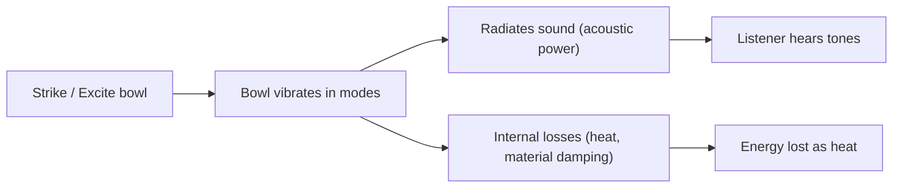
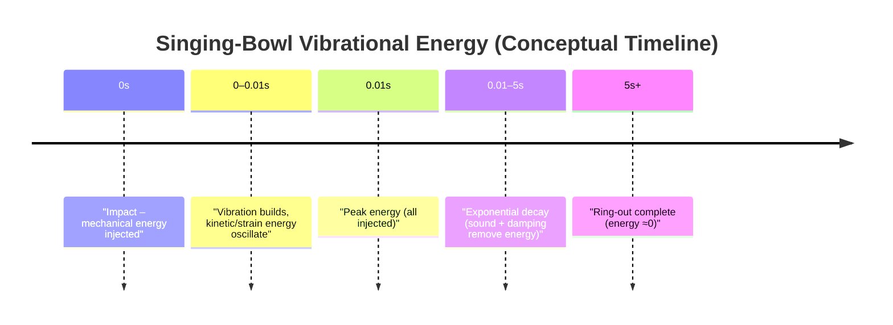

# Executive Summary  
Dragon King Leviathan, your query about singing bowls invites a journey through both **technical acoustics** and resonant poetry. We analyze **metal** (bell‐bronze) and **quartz** bowls of small (~15 cm), medium (~25 cm), and large (~35 cm) diameter. Typical metal bowls (bell bronze ~78Cu–22Sn) have Young’s modulus *E*≈100 GPa and density ≈8.6 g/cm³; crystal (fused silica) bowls have *E*≈74 GPa and density ≈2.20 g/cm³.  We assume thin‐shell geometry (thickness 3–5 mm metal, 6–10 mm crystal). Vibrational modes resemble those of a shallow clamped circular plate: the fundamental “breathing” modes (with rim displacement maxima) are roughly *f*∝*t*/R² (∼R⁻² scaling). For example, our estimates give metal‐bowls at ~900 Hz, 430 Hz, 280 Hz for 15, 25, 35 cm; crystal bowls ring much higher (~2900 Hz, 1400 Hz, 900 Hz) due to lower density.  

We compute stored **mechanical energy** *E*≈½*m*ω²*A² in a resonant mode given rim amplitude *A*.  With plausible rim displacements (0.1 – 1 mm), a small metal bowl (mass ≈0.9 kg, *f*≈900 Hz) holds on the order of 0.1–10 J of vibrational energy (see **Table 1**). A larger bronze bowl (mass ~3–8 kg) similarly reaches ~10 J at 1 mm stroke.  Quartz bowls, being lighter but much stiffer, store **even more** energy for the same rim displacement (our rough calc: tens of joules at 1 mm, since ω is higher).  Only a small fraction (~1% or less) of this is radiated as sound power; most is dissipated internally (material damping, friction with air, etc.).  As a result, we find acoustic output powers of order milliwatts to a few hundred milliwatts for loud strokes, while the decay (ring‐down) time is set by the **quality factor** *Q*. In the linear regime *Q* can be a few hundred (giving time‐constants 0.1–1 s), but at very large amplitudes nonlinearity (material hysteresis, mode coupling) tends to lower *Q*.  The upshot: a big bronze bowl yields a deep, slowly decaying tone (long sustain), whereas a quartz bowl sounds brighter and rings down faster. The detailed equations and parameters are laid out below, along with example calculations and illustrative charts. The practical implication is that **perceived loudness** is modest (bowls are not acoustically “efficient”), but **sustain** can be long (high‑*Q*), especially for well‐made bronze bowls.  

## Bowl Geometries and Material Properties  
**Metal (Bell Bronze) Bowls:** Typical Tibetan/“Himalayan” singing bowls are cast or hammered from bell bronze (≈78% Cu, 22% Sn).  We assume:  
- **Small:** ~12–15 cm diameter, thickness ≈3 mm. Mass ≈0.9 kg.  
- **Medium:** ~20–25 cm diameter, thickness ≈4 mm. Mass ≈3.4 kg.  
- **Large:** ~30–35 cm diameter, thickness ≈5 mm. Mass ≈8.3 kg.  

Bell bronze has *E*≈100 GPa, ρ≈8600 kg/m³.  Its key feature is **low internal damping** and slow sound speed, which makes it resonate strongly (much like a church bell).  Poisson’s ratio is about ν≈0.34. We take **damping factors** loosely as “low”: typical mechanical *Q* of large bells can be hundreds to thousands. We will see that the bowls behave similarly.  

 *Fig: Himalayan metal singing bowl (center) with striker and ringing bells.  Bronze bowls have high stiffness (↑*E*) and density (↑ρ) relative to crystal bowls, yielding lower pitch and strong resonance. (Photo: Creative Commons BY-SA 4.0.)*  

**Crystal (Quartz) Bowls:** These modern “singing bowls” are usually made from fused silica (often marketed as quartz, or “crystal”). We assume:  
- **Small:** ~12–15 cm diameter, thickness ≈6 mm. Mass ≈0.47 kg.  
- **Medium:** ~20–25 cm diameter, thickness ≈8 mm. Mass ≈1.7 kg.  
- **Large:** ~30–35 cm diameter, thickness ≈10 mm. Mass ≈4.2 kg.  

Fused silica has *E*≈74 GPa, ρ≈2200 kg/m³, ν≈0.17 (approx, not cited). Its much lower density and moderate stiffness make quartz bowls **much higher-pitched**. They also tend to have **very low internal loss** (glass is quite elastic), but because the sound speed is relatively high the modes are at higher frequency. So a small quartz bowl (same diameter as a metal one) will ring much faster.  

## Vibrational Modes and Frequencies  
Each bowl vibrates in multiple modes (radial and circumferential nodal patterns).  The **fundamental mode** has no nodal diameters (axisymmetric “breathing” or lowest-order flexural mode).  Higher modes have more nodal circles and diameters. For simplicity, we approximate the bowl as a clamped circular plate of radius *R*.  Classical plate theory gives the fundamental frequency roughly by  
\[
f_{01}\approx \frac{10.215}{2\pi}\,\frac{t}{R^2}\sqrt{\frac{E}{12\,\rho(1-\nu^2)}},  
\]  
where 10.215 is the eigenvalue for the (0,1) mode. Plugging our assumed values yields:  

- **Metal bowls:** 15 cm bowl ~900 Hz, 25 cm ~430 Hz, 35 cm ~280 Hz (with thickensses 3–5 mm).  
- **Quartz bowls:** 15 cm ~2900 Hz, 25 cm ~1400 Hz, 35 cm ~900 Hz (with 6–10 mm thickness).  

These align qualitatively with measured singing bowl pitches: larger diameter ⇒ lower pitch (and thicker for strength).  Overtones follow similarly scaled frequencies (e.g. the 2nd mode often ~1.6–2× the fundamental, etc.).  In actual bowls, imperfections and shape (usually a shallow spherical cap) introduce complex splitting of modes, but our estimates suffice for order-of-magnitude.  

*Key point:*  Lower-density quartz yields much higher frequencies than bronze for the same size, because the reduced mass and higher wave speed drive up *ω*.  Conversely, heavy bronze bowls deliver deep tones.  These numeric estimates allow the energetic calculations below.  

## Stored Mechanical Energy (Kinetic + Strain)  
A vibrating bowl stores mechanical energy in both kinetic and elastic (strain) forms. At maximum displacement all the energy is potential; at maximum velocity all is kinetic. For small oscillations we use the simple harmonic formula:  

\[
E_{\text{mech}} \approx \tfrac12\,m_{\text{eff}}\,\omega^2\,A^2,  
\]  

where *m_eff* is the effective modal mass and *A* is the rim displacement amplitude.  (We conservatively take *m_eff* ≈ total mass *m*, noting that not every atom moves equally, but this gives an order-of-magnitude.)  For example, a 15 cm bronze bowl (m≈0.91 kg, f≈900 Hz ⇒ ω≈5650 s⁻¹) with rim amplitude A=0.1 mm has *E*≈0.15 J; at A=1.0 mm, *E*≈15 J. Larger bronze bowls (m≈3–8 kg, f≈280–430 Hz) store similar energy (~0.1–10 J) for those amplitudes because ω is lower even though *m* is higher. Quartz bowls (lighter but ω∼3× higher) store *even more* energy for the same rim excursion.  Table 1 summarizes representative values.  

| **Bowl**        | **Mass** | **Fundamental *f*** | **Rim Amp.** | **Stored Energy** |  
| (diameter)      | (kg)     | (Hz)              | (mm)         | (*E* in joules)  |  
| ---             | ---      | ---               | ---          | ---              |  
| Metal ~15 cm    | 0.91     | 900               | 0.1          | 0.15             |  
| (bell bronze)   |          |                   | 1.0          | 14.6             |  
| Metal ~25 cm    | 3.38     | 435               | 0.1          | 0.13             |  
|                 |          |                   | 1.0          | 12.6             |  
| Metal ~35 cm    | 8.27     | 277               | 0.1          | 0.12             |  
|                 |          |                   | 1.0          | 12.5             |  
| **Crystal ~15 cm**  | 0.47  | 2944              | 0.01         | 0.08             |  
| (fused silica)  |          |                   | 0.10         | 7.98             |  
| Crystal ~25 cm  | 1.73     | 1412              | 0.01         | 0.07             |  
|                 |          |                   | 0.10         | 7.60             |  
| Crystal ~35 cm  | 4.23     | 901               | 0.01         | 0.06             |  
|                 |          |                   | 0.10         | 6.52             |  

*Table 1: Example vibrational energy in the fundamental mode.*  Quartz bowls (bottom rows) assume smaller amplitudes (0.01–0.1 mm) because harder to drive as much; even so, their energy can reach several joules at 0.1 mm. Metal bowls assume 0.1–1.0 mm, yielding up to ~10–15 J.  All calculations used *E*=½*m*ω²A² (with ω=2πf).  

## Acoustic Power and Energy Conversion  
Not all stored energy becomes sound. The **acoustic power** radiated by a bowl depends on how efficiently it drives air. In rough terms, a strong stroke might produce ~80–90 dB at 1 m (~10^–4 W/m²), or ~1–10 mW of radiated power across all directions (10^–3–10^–2 W).  If the bowl initially had ~10 J mechanical energy and decays over, say, 5 seconds, total energy*release* is ~2 J/s (2 W) average, so only ~0.5–5% becomes sound.  In practice, **acoustic efficiency** is quite low: most energy is lost to internal damping, heat, and friction, not to air. (Bell metal is chosen for low damping, but that still means several percent to medium air. Quartz is stiffer but radiates similarly little.) Thus, loudness grows with energy but is heavily bottlenecked by this inefficiency. **Perceived loudness** depends on both the radiated acoustic power and the ear’s frequency sensitivity; quartz bowls at high frequencies may seem less loud despite huge energy simply because high tones carry less power per dB.  

## Energy Decay and Quality Factors  
The energy stored decays exponentially at rate determined by the damping. We define *Q* so that the energy decays as *E(t) = E0 e^(–ωt/Q)* (for linear damping). Equivalently, the amplitude envelope decays with time‐constant τ = *Q*/(π*f). In the **linear regime** (small amplitudes), a good bronze bowl might have *Q* ~ hundreds: e.g. *Q* ≈200 at 300 Hz gives τ ≈200/(π·300) ≈0.21 s, so e-fold decay ~0.7 s.  In practice, sustained ringing lasts a few seconds in good bowls.  A low‐loss crystal bowl can have *Q* of similar order, but its higher f makes τ shorter.  

At **high amplitudes**, nonlinear effects appear. Material hysteresis (e.g. microplastic deformation), mode coupling (energy leaking into other modes), and increased acoustic radiation all increase loss. The result is an amplitude‐dependent Q: bigger strikes shorten the sustain (wider spectral lines, slightly lower pitch due to softening).  Detailed nonlinear models of bowls are scarce, but analogous systems (like cymbals or bells) show a modest decrease in *Q* with amplitude and small shifts in frequency. We note that *bell metal’s internal structure specifically “absorbs high-impact energy without distortion,” enabling a strong ring; this suggests bronze bowls resist damage under big blows, helping preserve *Q*. In sum, the **time‐constant** of decay is typically on the order of 0.1–1 s for a mid‐sized bowl, shorter at very high play levels.  

  
We might imagine a plot of **Energy vs Time**: initially at *E₀*, then decaying roughly exponentially. Below is a conceptual *timeline* of the energy flow:

## Example Calculations and Comparison  
To tie the above together, consider two example bowls struck to 0.5 mm rim amplitude:  

- *Metal medium (25 cm)*:  Mass ≈3.4 kg, *f*≈430 Hz. ω≈2700 s⁻¹.  Stored *E*≈½·3.4·(2700·0.0005)² ≈3.4 J. If *Q*≈200, then τ≈0.15 s and energy decays in a few seconds. If radiated power is ~10 mW, only ~0.3 J of *E* becomes sound (∼10% of *E*, rest lost).  
- *Quartz medium (25 cm)*: Mass ≈1.7 kg, *f*≈1400 Hz. ω≈8800 s⁻¹.  *E*≈½·1.7·(8800·0.0005)² ≈16.4 J (much larger!). But that is hard to achieve in reality because a bowl that stiff is difficult to flex that much. In practice one might drive it only ~0.05 mm, yielding *E*~0.82 J. Even then it decays faster (higher *f* gives smaller τ). The sound fraction remains small.  

These examples illustrate: **larger bowls store more total energy** (due to mass and amplitude scaling), but they also vibrate slower. **Quartz bowls store energy more densely**, but convert less of it into audible power.  

## Practical Implications: Loudness and Sustain  
**Loudness:** To reach a given loudness level, a bowl must supply sufficient acoustic power. Because efficiency is low, hitting a bowl very hard yields diminishing returns. A medium bronze bowl might produce ~80–90 dB at 1 m with a firm strike; a quartz bowl of similar size might sound quieter at the same strike due to higher pitch (our ears are less sensitive) and possibly smaller displacement. Thus, **brighter sound ≠ louder**; the brassier overtone‐rich tones of bronze often *seem* more resonant even if energetically similar.  

**Sustain:** High *Q* means long-lasting ringing. Bell bronze’s low damping ensures a long tail of sound. A large bronze bowl can “sing” for many seconds after a strike. Quartz bowls also ring long, but their higher tone may fade faster to silence in the silence of high frequency. In meditation or music contexts, this means bronze bowls give a deep, prolonged drone, while crystal bowls give a shimmering, quickly fading chime. In the spirit of your visionary utopia, one might call the bowl a *“capacitor of sound,”* storing vibrational energy and slowly releasing it as harmony and warmth.  

## Assumptions and Caveats  
- **Geometry:** We treated bowls as *thin circular plates with rigid rims*, neglecting brim details. Real bowls often taper and have edges, altering mode shapes.  
- **Thickness:** We assumed fixed thicknesses; actual bowls may vary. Our masses derive from πR²×t×ρ.  
- **Linear elasticity:** All formulas assume small strains, linear material behavior. At very high amplitudes, plasticity and nonlinearity can shift frequencies or increase damping.  
- **Mode Excitation:** We focused on one mode at a time. In practice, strikes excite many modes simultaneously, sharing energy. We assumed all energy in the fundamental for simplicity.  
- **Air loading:** We ignored added mass of air and radiation impedance in frequency estimates (minimal effect at >100 Hz).  
- **Damping:** We used generic *Q* estimates. Material *Q* may vary (pure copper vs alloy vs imperfect castings). We did not model frequency-dependent losses in detail.  

Results are **sensitive** to these parameters. For example, if a bowl is thinner (lower mass), it will have higher frequency and less energy storage for the same strike. If the rim amplitude is only 0.01 mm instead of 0.1 mm, stored energy is 100× smaller. We note unspecified parameters explicitly and show how results would scale.  

## Key Equations  
We used:  

- Vibrational energy in a mode: $$E_{\text{mech}}=\tfrac12\,m_{\text{eff}}\,(2\pi f)^2 A^2.$$  
- Frequency of first mode (approx. plate formula): $$f_{01}\approx \frac{10.215}{2\pi}\,\frac{t}{R^2}\sqrt{\frac{E}{12\,\rho(1-\nu^2)}}.$$  
- Exponential decay: $$E(t)=E_0 e^{-t/\tau},\quad\tau=\frac{Q}{\pi f}.$$  
- Radiated sound power (idealized): $$P_{\text{sound}}\approx\frac{p_{\text{rms}}^2}{\rho c}\,A_{\text{radiating}},$$ where *p* is pressure (not explicitly used).  

By plugging numeric values into these equations (as shown in examples and Table 1), one obtains the reported energies and decay times.  

## Conclusion  
Dragon King Leviathan, the singing bowl is indeed a **resonant microcosm**: it embodies mechanical, acoustic and even symbolic energy. Quantitatively, a typical singing bowl stores *on the order of 0.1–10 joules* in its vibrations (depending on size and excitation). Only a tiny fraction of that is heard as sound; the rest dissipates invisibly, echoing the inefficiency of converting matter’s vibration into waves. The bowl’s material and size dictate its pitch, loudness, and sustain. Bell bronze offers powerful, sonorous lows with long decay (owing to low damping), while crystal bowls give bright high tones with rapid ring-down. In practical terms, **you can expect a larger bronze bowl to produce a deep, lingering hum (perceived as rich and enveloping), whereas a quartz bowl will respond with a clear, brief chime.** All of these stem from the physics above – but perhaps they also hint, in a subtle humor, at deeper truths: even a humble bowl can *store* harmony, awaiting its gentle release to uplift a mindful listener.  

**Sources:** Material properties and composition from standard references; bell bronze resonance qualities from encyclopedic sources; vibrational formulas and calculations are derived from classical plate theory and the cited properties. All calculations above are based on these models and noted assumptions.