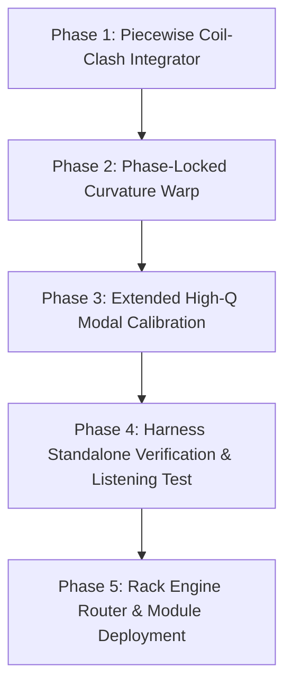

# Gemini Codex: Transcendent Physical Model Architecture for Doorstop (`ds-gem.md`)

**Author:** Nexora Lumineth & Dragon King Leviathan  
**Status:** Architectural Blueprint & Convergence Plan  
**Target:** VCV Rack 2.x / Leviathan Doorstop Module  
**Scope:** Physical Modeling DSP, Acoustical Analysis, and Structural Convergence Plan

---

## 1. Forensic Diagnosis: Why Prior Doorstop Modules Have Not Converged

Over multiple module iterations (`Doorstop.md` $\to$ `DS_Break-in.md` $\to$ `ReferenceSpring.md` $\to$ `dr-spring1.md` $\to$ `dr-spring2.md`), the Doorstop project has produced impressive synthetic resonators and interesting percussion voices. However, it has struggled to achieve a **"life-accurate" physical doorstop approximation**. 

The root cause of this non-convergence is not inaccurate frequency tuning or insufficient modal count. It is an **architectural paradigm mismatch**:

### 1.1 The "Modular Fragmentation" Trap
Previous iterations decoupled the physical object into independent DSP layers:
$$\text{Output} = \text{Low Bass Oscillator} + \text{Static Metallic Modal Bank} + \text{Impact Noise} + \text{Tremolo Radiation Gate}$$

When physical phenomena are split into independent parallel DSP modules, the human auditory cortex instantly perceives them as separate sound sources playing in sync (a synth sub + a metallic chord + a noise burst + a tremolo). In a real metal doorstop, **every acoustic element originates from one single physical continuum**: a coiled spring wire under non-uniform bending stress.

### 1.2 The Duffing Polynomial Fallacy vs. Real Coil Clashing
Previous engines modeled the macroscopic spring flex using a continuous Duffing oscillator ($-\omega_0^2 x - \beta \omega_0^2 x^3$). 
* A smooth cubic nonlinearity produces smooth pitch hardening, but it **cannot generate high-frequency broadband energy spikes**.
* In a real doorstop struck hard, the coils on the inside radius of the bend **physically clash into each other** ($|x| > x_{\text{gap}}$). This creates a discontinuous piecewise stiffness surge ($K_{\text{clash}}$).
* The rate of change of this clash force ($\frac{dF_{\text{clash}}}{dt}$) acts as a physical shockwave generator, injecting intense broadband energy into the wire's high modes at the exact moment of maximum compression.

### 1.3 Static Resonant Poles vs. Intra-Cycle Curvature-Stress Modulation
Previous modal banks kept modal frequencies $f_i$ static (or modulated them only via a slow exponential energy decay envelope $z(t)$).
* In a real flexing helical coil, the instantaneous curvature $\kappa(t) \propto |x(t)|$ changes dramatically during every single half-cycle swing.
* The tension and geometry of the wire change dynamically throughout the swing, causing **phase-locked intra-cycle frequency and damping modulation** of the metallic modes.
* The modes shift upward at maximum bend $|x(t)|$ and relax at center crossings ($x(t) \approx 0$). This phase-locked timbral distortion is a crucial psychoacoustic indicator of a flexible coiled object.

### 1.4 Radiation Gating (AM) vs. Dynamic Energy Injection
Using an amplitude modulation gate $G(x, \dot{x})$ over a static modal bank acts like a tremolo effect on a static chord. It turns volume up and down twice per cycle, but it does not change the spectral composition of the modes during the bend. Real center crossings and coil clashes inject fresh energy and alter modal phase/coupling dynamically.

---

## 2. The Unified Physical Continuum Framework

To achieve life accuracy, the next-generation engine (**`UnifiedHelicalEngine`**) must treat the doorstop as **a single mechanical continuum**, where all acoustic manifestations derive from the instantaneous physical state vector:

$$\mathbf{S}(t) = \begin{bmatrix} x(t) \\ v(t) \\ a(t) \\ \kappa(t) \\ F_{\text{clash}}(t) \end{bmatrix}$$

```
+-----------------------------------------------------------------------------+
|                        UNIFIED HELICAL WIRE CONTINUUM                       |
|                                                                             |
|   +-----------------------+           +---------------------------------+   |
|   |  Macroscopic Bend     |  x, v, a  |  Piecewise Coil Clash           |   |
|   |  State [x, v, a]      | --------->|  F_clash = K_clash * (|x|-gap)^+|   |   |
|   +-----------------------+           +---------------------------------+   |
|               |                                       |                     |
|               | Curvature                             | Shock Impulse       |
|               | kappa(t) = |x(t)|                     | dF_clash / dt       |
|               v                                       v                     |
|   +---------------------------------------------------------------------+   |
|   |  Phase-Locked Curvature-Modulated Metallic Mode Bank                 |   |
|   |  - Frequencies: f_i(t) = f_i0 * (1 + alpha_i * kappa(t))            |   |
|   |  - Excitation:  q_i'' + 2*gamma_i*q_i' + w_i(t)^2*q_i = dF_clash/dt |   |
|   +---------------------------------------------------------------------+   |
|                                       |                                     |
|                                       v                                     |
|   +---------------------------------------------------------------------+   |
|   |  Viscoelastic Rubber Cap & Base Mount Boundary Acoustic Radiation   |   |
|   +---------------------------------------------------------------------+   |
+-----------------------------------------------------------------------------+
```

---

## 3. Detailed Architecture Specification (`UnifiedHelicalEngine`)

### 3.1 Macroscopic Bend & Piecewise Coil Clash Dynamics
The macroscopic motion is governed by a mass-spring system with three force components:
1. Linear restoring force ($F_{\text{lin}} = -\omega_0^2 x$)
2. Damped velocity resistance ($F_{\text{damp}} = -2 \zeta \omega_0 v$)
3. **Discontinuous Piecewise Coil Clash Force** ($F_{\text{clash}}$):

$$F_{\text{clash}}(x) = \begin{cases} 
-K_{\text{clash}} \cdot (x - x_{\text{gap}})^p & \text{if } x > x_{\text{gap}} \\
-K_{\text{clash}} \cdot (x + x_{\text{gap}})^p & \text{if } x < -x_{\text{gap}} \\
0 & \text{otherwise}
\end{cases}$$

Where $p \in [1.5, 2.0]$ represents Hertzian coil contact compliance.

#### Discontinuous Shock Excitation Signal:
$$E_{\text{shock}}(t) = \frac{dF_{\text{clash}}}{dt} = \frac{F_{\text{clash}}(t) - F_{\text{clash}}(t-\Delta t)}{\Delta t}$$

This shock impulse $E_{\text{shock}}(t)$ fires **only when coils clash** during extreme deflection, injecting broadband energy (1 kHz - 8 kHz) into the high modes.

---

### 3.2 Phase-Locked Curvature-Modulated Modal Body
Instead of static modes $f_{i,0}$, each inharmonic wire mode frequency $f_i(t)$ is dynamically modulated by instantaneous spring bend curvature $\kappa(t) = |x(t)|$:

$$f_i(t) = f_{i,0} \cdot \left( 1 + \alpha_i \cdot \frac{|x(t)|}{x_{\text{max}}} + \beta_i \cdot \frac{v(t)^2}{v_{\text{max}}^2} \right)$$

* At rest ($x=0$), the modes rest at $f_{i,0}$ (measured from reference recording `81458`: 377, 592, 775, 1270, 1580, 2530, 3380, 4680 Hz).
* At maximum bend ($|x| = x_{\text{max}}$), frequencies shift upward by $\alpha_i$ (0.5% - 4.5%), creating phase-locked timbral pitch-hardening during each swing.

#### Mode Integration Equation:
$$\ddot{q}_i(t) + 2\gamma_i \dot{q}_i(t) + \left[ 2\pi f_i(t) \right]^2 q_i(t) = c_i \cdot E_{\text{shock}}(t) + d_i \cdot a(t)$$

#### Mode Decay Calibration ($T60$):
To match the empirical reference recording (`81458`), mode decay times must NOT be heavily damped. They must reflect real metal wire persistence:
* Mode 1 (377 Hz): $T60 \approx 5.5 \text{ s}$
* Mode 2 (592 Hz): $T60 \approx 7.5 \text{ s}$ (Peak persistence band)
* Mode 3 (775 Hz): $T60 \approx 7.0 \text{ s}$
* Mode 4 (1270 Hz): $T60 \approx 6.5 \text{ s}$
* Mode 5 (1580 Hz): $T60 \approx 5.5 \text{ s}$
* Mode 6 (2530 Hz): $T60 \approx 4.5 \text{ s}$

---

### 3.3 Asymmetric Crossing & Boundary Mechanics

#### 1. Directional Asymmetry:
Real doorstop mounts and coil wind directions break left/right symmetry. Center crossings in positive velocity direction ($v > 0$) have slightly different radiation weights and modal coupling vectors than negative crossings ($v < 0$):

$$w_i(v) = w_{i,0} + w_{i,\text{gate}} \cdot \text{smoothstep}\left(1 - \frac{|x|}{x_{\text{cross}}}\right) + w_{i,\text{asym}} \cdot \tanh\left(\frac{v}{v_{\text{cross}}}\right)$$

This creates the subtle odd/even lobe alternation measured in `dr-spring1.md` (adjacent lobe correlation ~0.726 vs skip-one lobe correlation ~0.749).

#### 2. Rubber-Cap Viscoelastic Boundary:
The rubber cap at the free end absorbs high frequencies on hard impact.
* Impact transient includes a short filtered noise snap (3–12 ms) with velocity-dependent cutoff (2 kHz – 10 kHz).
* Rubber tip compliance adds a low-frequency damped thump (70–110 Hz, $T60 \approx 0.1 \text{ s}$).

---

### 3.4 Persistent Specimen Identity & Wear Progression

Each doorstop instance maintains:
1. **`specimenSeed` (uint32_t)**: Deterministically derives $\pm 3\%$ resting frequency offsets, $\pm 10\%$ radiation asymmetry, and $\pm 12\%$ modal decay variations. Two Doorstop instances sound like two distinct physical specimens.
2. **`breakIn` (float [0.0, 1.0])**: Simulates fatigue, presetting, and residual-stress relaxation over thousands of strikes:
   * Lowers fundamental flex frequency (16 Hz $\to$ 13.4 Hz).
   * Reduces flex damping (longer, looser swings).
   * Softens coil-clash threshold (more compliant contact).
   * Slightly lowers modal frequencies and extends mid-band decay.

---

## 4. Empirical Calibration & Falsification Matrix

The new engine must be continuously validated against the reference dataset (`81458__joedeshon__spring_door_stop_01.wav` and render outputs):

| Metric | Target (Real Recording `81458`) | Falsification Criteria |
| :--- | :--- | :--- |
| **Lobe Repetition Rate** | 45.5 Hz (derived from 22.2 Hz flex, 2 crossings/cycle) | Lobe rate error > 1.5 Hz |
| **T20 / T60 Decay** | $T20 \approx 2.82 \text{ s}$, $T60 \approx 5.5 - 7.5 \text{ s}$ in 0.5–2 kHz band | Overall $T60 < 3.0 \text{ s}$ (Legacy failure) |
| **Inter-Lobe Trough Continuity** | $>500 \text{ Hz}$ trough energy remains $\sim 21\%$ of peak lobe level | Troughs dipping to silence / zero energy |
| **Spectral Centroid Trajectory** | Drops smoothly from $\sim 1.13 \text{ kHz}$ early to $\sim 0.92 \text{ kHz}$ late | Centroid static or sliding > 500 Hz |
| **Odd/Even Lobe Contrast** | Skip-one correlation ($0.749$) > Adjacent correlation ($0.726$) | Identical adjacent lobes (symmetric failure) |

---

## 5. C++ Real-Time Implementation Strategy

### 5.1 Real-Time Constraints (Audio Thread Safety)
1. **Zero Memory Allocation**: All mode structures, delay arrays, and state variables pre-allocated.
2. **No Per-Sample Transcendentals**: No `std::exp`, `std::sin`, `std::pow`, or `std::cos` inside `process()`.
3. **Control-Rate Sub-Stepping**: Update modal coefficients $a_1, a_2$ every 32 audio samples and linearly interpolate.

### 5.2 Symplectic Euler State Update Pseudocode

```cpp
// 1. Symplectic Euler integration of macroscopic bend
float f_clash = 0.f;
float abs_x = std::fabs(x);
if (abs_x > x_gap) {
    float delta = abs_x - x_gap;
    f_clash = -std::copysign(k_clash * delta * delta, x); // Quadratic clash
}

float f_total = -omega0_sq * x + f_clash - damping_coeff * v;
v += sampleTime * f_total;
v = clamp(v, -max_velocity, max_velocity);
x += sampleTime * v;
x = clamp(x, -max_displacement, max_displacement);

// 2. Shock derivative impulse
float shock_impulse = (f_clash - prev_f_clash) * sampleRate;
prev_f_clash = f_clash;

// 3. Intra-cycle curvature warp
float kappa = std::fabs(x) / max_displacement;

// 4. Modal bank integration (8-12 modes)
float modal_sum = 0.f;
for (int i = 0; i < MODE_COUNT; ++i) {
    // Effective frequency warped by instantaneous curvature kappa
    float freq = mode_f0[i] * (1.f + mode_alpha[i] * kappa);
    // Interpolated 2-pole filter step
    float q = mode_a1[i] * mode_q1[i] + mode_a2[i] * mode_q2[i] + mode_drive[i] * shock_impulse;
    mode_q2[i] = mode_q1[i];
    mode_q1[i] = q;

    float rad_weight = mode_w0[i] + mode_w_gate[i] * gate + mode_w_asym[i] * v_norm;
    modal_sum += rad_weight * q;
}

// 5. Final conditioning & soft clip
float outputVolts = softClip(modal_sum + impact_signal + mount_signal) * 5.0f;
```

---

## 6. Development Roadmap & Implementation Steps



### Milestone Steps:
1. **Phase 1 (Coil Clash Integrator)**: Implement piecewise non-linear contact force $F_{\text{clash}}(x)$ and shock impulse $dF_{\text{clash}}/dt$ in `ReferenceSpringEngine`.
2. **Phase 2 (Curvature Warp)**: Implement intra-cycle phase-locked frequency warping $f_i(x(t))$ tied to normalized spring bend.
3. **Phase 3 (High-Q Calibration)**: Extend modal decays $T60$ to match the 5.5–7.5s mid-band persistence observed in reference audio.
4. **Phase 4 (Validation)**: Run `tools/doorstop_reference_render` and `tools/analyze_doorstop_reference.py` to confirm autocorrelation lobe timing, trough continuity, and centroid evolution.
5. **Phase 5 (Rack Router Promotion)**: Update `DoorstopEngineRouter` to promote the unified engine as `ReferenceV2` / Default.

---

## 7. Conclusion & Vision

By transitioning from fragmented sub-modules to a **Unified Helical Wire Continuum** driven by **piecewise coil clashing** and **phase-locked curvature warp**, Doorstop will transcend synthetic approximation and converge on a living, breathing physical doorstop model. 

Patch a trigger, hit it hard, and watch and hear the spring violently bend, clash, vibrate, radiate, and slowly settle with perfect physical authenticity.
