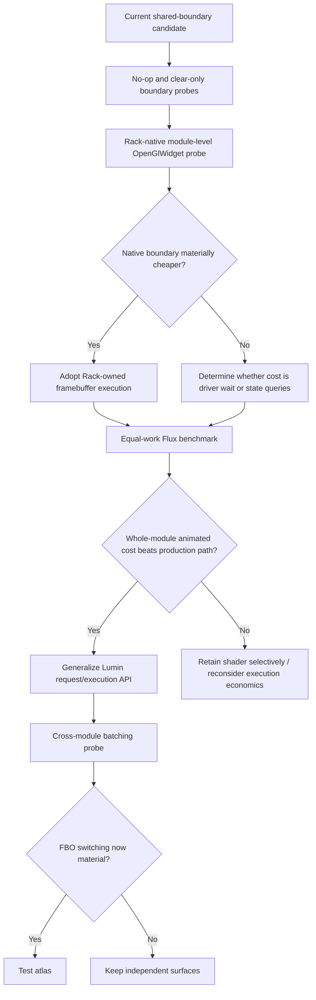
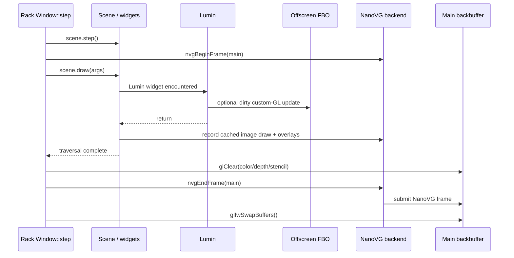
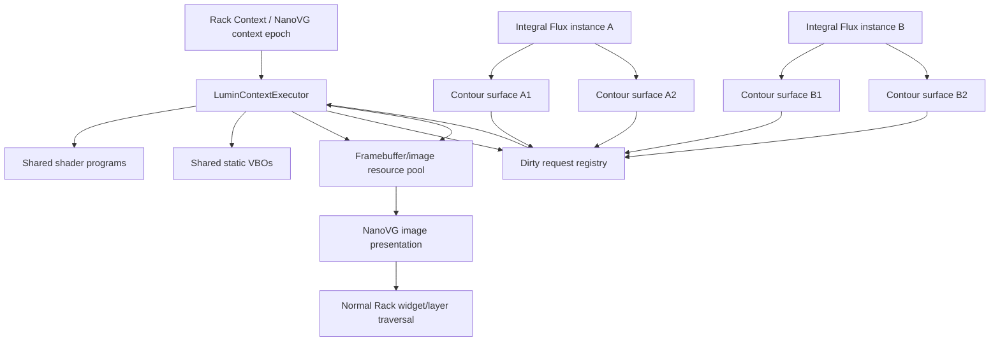

# Lumin Rendering Architecture for VCV Rack: Where the Boundary Really Is

## Executive summary

Dragon King Leviathan, the strongest conclusion from the host source is that **Lumin should not try to render its shader directly into Rack's main framebuffer from ordinary widget traversal**. On the current Rack `v2` source path, `Window::step()` performs `APP->scene->step()`, begins the main NanoVG frame, traverses `APP->scene->draw()`, then explicitly clears the main OpenGL framebuffer, calls `nvgEndFrame()`, and finally swaps buffers. Any GL fragments written directly to the main framebuffer during `Widget::draw()` are therefore erased by Rack's later clear; NanoVG's normal frame is then submitted afterward. citeturn13search0turn15search0 NanoVG's OpenGL backend is designed around buffered frame submission at `nvgEndFrame()`, which is consistent with Rack's sequencing. citeturn16search0turn16search5

That eliminates the most tempting alternative: there is **no public, traversal-ordered "draw raw GL here" insertion point into Rack's final framebuffer** in the normal widget API. Preserving arbitrary interleaving with NanoVG without an offscreen texture would require a host-level change, a NanoVG custom command/flush mechanism, or another non-public integration point, all of which conflict with the shipping constraints in the supplied brief. fileciteturn0file1

The research does, however, point to a substantially better experiment than further shaving individual `glGet*()` calls from the present guard:

> **Replace the hand-written host-state boundary experimentally with Rack's native `OpenGlWidget`/`FramebufferWidget` execution contract, ideally as one module-level Lumin surface for both Flux previews.**

`OpenGlWidget` is explicitly documented as a `FramebufferWidget` intended for OpenGL commands. Its callback is `drawFramebuffer()`, and its stock implementation changes viewport, clear state, projection/modelview state, and issues GL drawing without saving and restoring the previous global state. citeturn23search0turn14view3 The enclosing `FramebufferWidget` owns framebuffer binding, rendering, image presentation, sizing, dirtying, and context-loss behavior. citeturn13search6turn18search3 This is important evidence that **exact reconstruction of arbitrary incoming Rack GL state is not inherently part of Rack's intended custom-GL widget model**.

My recommendation is therefore:

**Do not abandon offscreen rendering, but do challenge the current handoff implementation. Prototype a module-level Rack-native GL framebuffer path before doing more work on the restricted guard or an atlas.** The likely long-term answer is still “amortize,” but amortize a much thinner, host-native boundary rather than assuming a 40–50 µs state snapshot is inevitable.

I assign approximately **85% confidence** to the architectural conclusion that a distributable third-party plugin preserving Rack painter order needs an offscreen/composite boundary under the current public widget model. I assign **70% confidence** that moving execution into `OpenGlWidget`/`FramebufferWidget` can remove most of the explicit state-capture cost. The latter remains a live-test question because the exact installed Rack Pro minor version, VCV's exact NanoVG fork revision bundled into that build, GPU/driver implementation, and DAW editor lifecycle have not been supplied.

A second, more ambitious Lumin route also emerged: **collect dirty Lumin requests during `Widget::step()` across module instances, then execute the complete same-context queue from the first participating visible Lumin draw callback.** Rack calls the whole scene's `step()` before beginning rendering, so the dirty set can in principle be known before any Lumin image is presented. citeturn13search0turn15search0 This potentially amortizes one GL transition across *multiple* modules without changing Rack, while leaving image presentation in normal traversal order. It is promising, but should come only after proving the native module-level boundary.

The decision sequence I recommend is:



The supplied measurements are consistent with this priority. The latest matched offline restricted/shared path still spends **44.0–53.6 µs median in capture/restore**, while the older live shader callbacks themselves total only about **20.5 µs median**. Those measurements do not establish whether that time is CPU state bookkeeping, driver serialization, or displaced earlier GPU work, and they do not establish a shader-versus-NanoVG speedup because the live workloads differed. fileciteturn0file1

## Research questions and assumptions

The brief contains seven explicit research questions and several consequential implicit ones. fileciteturn0file1 They reduce to four architectural unknowns.

| Research question | What actually has to be established | Why it changes the design |
|---|---|---|
| Where is the real Rack rendering boundary? | When widget traversal occurs relative to NanoVG GL submission, framebuffer clears, framebuffer widgets, and final swap | Determines whether direct main-target GL is viable |
| What state must Lumin preserve? | Whether Rack expects arbitrary incoming GL state to survive a custom callback, or whether its supported GL path owns/re-establishes downstream state | Determines whether the 44–54 µs state guard is necessary |
| What does the measured “guard cost” really represent? | CPU API overhead versus driver-thread flush, implicit synchronization, previous-frame debt, allocation, or FBO transition | Determines whether guard micro-optimization attacks the real cost |
| At what scope should Lumin batch? | Preview, module, Rack context/frame, or atlas | Determines scaling behavior and complexity |

The most important implicit assumption in the current implementation is that **a custom GL excursion nested inside `ModuleWidget::draw()` must preserve essentially all GL state it encounters**. The Rack-native `OpenGlWidget` implementation is direct evidence against treating that assumption as established fact: its default callback alters legacy matrix state, viewport and framebuffer contents and contains no matching state restoration. citeturn14view3turn23search0 That does not prove Lumin may destroy *every* piece of GL state safely, especially state internally cached by NanoVG, but it makes the burden of proof favor a substantially narrower contract.

A second implicit assumption is that `OpenGlWidget` represents a fundamentally different presentation architecture. It does not. Rack documents it as a subclass of `FramebufferWidget`, and `FramebufferWidget` is explicitly the framebuffer-image caching mechanism. citeturn23search0turn23search15 Therefore, adopting `OpenGlWidget` would **replace Lumin's execution/ownership boundary, not the offscreen-composition concept itself**.

A third assumption is that an atlas addresses the expensive phenomenon seen today. It does not necessarily do so. Once both current previews already share one state boundary, an atlas can reduce framebuffer binds, clears, image/resource count, and possibly presentation texture switches, but it cannot remove the one outer state transition that currently dominates the timings. This follows directly from the supplied architecture and measurements. fileciteturn0file1

### Assumptions used in this report

The installed Rack Pro minor version was not specified, so I treat current `VCVRack/Rack` `v2` source as an **implementation reference rather than a binary-identity guarantee**. Rack's source contains compile-time NanoVG GL2, GL3, and GLES2 branches; the GL2 branch requests an OpenGL 2.0 context and creates both a main context and a shared framebuffer NanoVG context. citeturn15search0turn17search0 The actual installed Windows binary must therefore log `APP_VERSION`, `GL_VERSION`, `GLSL_VERSION`, `GL_VENDOR`, `GL_RENDERER`, relevant extensions, and the current NanoVG/backend assumptions before Lumin hardens any state contract.

The product remains constrained to a normal third-party Rack 2 plugin. Rack's build system identifies major version 2, and the plugin build/link architecture is designed around Rack's exported SDK rather than host replacement. citeturn13search3 Host or NanoVG patching is consequently treated only as architectural context.

GLSL 1.20 remains the compatibility baseline given in the brief. fileciteturn0file1 GPU timestamp queries and synchronization primitives should be considered **optional instrumentation capabilities**, detected at runtime rather than made shipping dependencies. Khronos explicitly requires runtime extension discovery, and on Windows extension entry points normally need to be obtained dynamically rather than presumed from compile-time headers. citeturn22search0turn22search5

## Host render sequence and the state contract

### What Rack actually does

The current Rack `v2` `Window::step()` sequence is unusually decisive for this question. Rack first restores the expected GLFW context, steps the scene, and, if the window is visible, begins a NanoVG frame. It constructs a `Widget::DrawArgs` and calls `APP->scene->draw(args)`. **Only after scene traversal returns does Rack set the main viewport, clear color/depth/stencil, and call `nvgEndFrame(vg)`.** The buffer swap follows afterward. citeturn13search0turn15search0

Conceptually:



This means direct rendering to the main framebuffer from `ModuleWidget::draw()` has two independent ordering problems.

First, Rack's subsequent `glClear()` destroys those pixels before the frame is displayed. citeturn15search0

Second, NanoVG's OpenGL architecture buffers a frame for later submission at `nvgEndFrame()`. citeturn16search0turn16search5 Thus a GL draw occurring “between” two widgets in C++ call order is not automatically between their eventual GPU draws.

That makes a direct main-buffer architecture **non-viable through ordinary public widget callbacks**.

### Widget ordering and clipping

Rack's widget traversal preserves child order and wraps child drawing with NanoVG save/translate/restore operations. Its `DrawArgs` contains the active `NVGcontext`, a `clipBox`, and an optional framebuffer pointer. citeturn11view0turn11view1turn11view3 These abstractions provide logical traversal clipping and NanoVG transform management, but they do not constitute an OpenGL scissor-state contract for arbitrary custom GL.

Rack adds further painter-order layers around modules: normal module drawing is followed by later visual layers such as lights/halos, plugs and cables. citeturn9search0 A contour represented as a normal NanoVG image can participate in that ordering naturally. Raw direct GL would need an explicit host submission point corresponding to that order, which the ordinary plugin API does not provide.

### FramebufferWidget is the important integration primitive

`FramebufferWidget` is not merely a cache convenience. It is Rack's own mechanism for safely doing a separate render pass and subsequently treating the result as a normal NanoVG image. Its implementation tracks world transform, scale, framebuffer dimensions, subpixel offsets and dirty state. When drawing an already framebuffer-targeted tree, it avoids recursively creating another framebuffer cache. citeturn13search6turn18search3

For framebuffer rendering, Rack uses its separate `fbVg`, calls `nvgBeginFrame()` for that render target, constructs child `DrawArgs` with `args.fb` pointing to the framebuffer, clears the target and calls `nvgEndFrame()` for the offscreen NanoVG context. citeturn18search3 Rack also reacts to context creation/destruction by dirtying and deleting framebuffer resources. citeturn13search6

That closely matches the engineering goals already present in `AdaptiveGlSurface`: texture-backed presentation, context ownership, transform/scale accounting, dirty rendering, and recovery. fileciteturn0file1

### OpenGlWidget changes the interpretation of the guard

`OpenGlWidget` inherits this machinery and is explicitly described by the Rack API as a framebuffer widget “that can be drawn on with OpenGL commands.” By default it marks itself dirty every step, but the documentation specifically says an override can restore ordinary `FramebufferWidget` dirty behavior. citeturn23search0

More revealingly, Rack's stock `OpenGlWidget::drawFramebuffer()` does approximately this:

- obtains framebuffer dimensions;
- sets the GL viewport;
- clears color/depth/stencil;
- replaces projection state;
- uses immediate-mode OpenGL to draw;
- returns.

It does **not** save and restore the previous viewport, matrix state, color state, framebuffer state, or general attribute state. citeturn14view3

This is an implementation observation, not a formal statement that every GL state variable can be discarded. But it is enough to reject the idea that a full `GL_ALL_ATTRIB_BITS` snapshot is mandated by Rack's supported custom-render model.

The right question is therefore no longer:

> “How do we make the exact-state guard cheaper?”

It is:

> **“What minimal postcondition must a Lumin shader callback satisfy when invoked through the same lifecycle Rack uses for `OpenGlWidget`?”**

That is a dramatically smaller research surface.

### NanoVG complicates “restore nothing”

There is one important caveat. NanoVG itself may cache pieces of GL state internally to avoid redundant driver calls. The reference NanoVG GL backend contains state filtering around texture, stencil and blend bindings; it also performs texture uploads during frame construction and explicitly manipulates pixel-store and texture state. citeturn20view0turn20view3 Its GL2 shader binds vertex attributes to known locations, including locations 0 and 1. citeturn21view0

Consequently, Lumin should not infer from the stock `OpenGlWidget` that “anything goes.” A custom shader changing a texture binding behind NanoVG's internal cache, for example, is qualitatively different from Rack's stock immediate-mode triangle.

This suggests three state classes:

| State class | Recommended treatment | Rationale |
|---|---|---|
| State wholly owned by Lumin while its FBO is active: program, VBO, attributes, blend mode, viewport | Establish directly; do **not** query incoming value by default | Rack-native GL callback exists specifically to permit GL drawing; downstream rendering should establish what it uses |
| Resource bindings that can collide with NanoVG's internal state cache, especially texture unit/binding and pixel-store settings | Restore to a tested canonical value or avoid touching entirely | NanoVG texture creation/update manipulates and internally tracks these states. citeturn20view0turn20view3 |
| Framebuffer/context identity | Treat as hard ownership boundary | Drawing to the wrong target is catastrophic; Rack explicitly owns FBO/context lifecycle. citeturn13search6turn15search0 |

The distinction between **restoring an unknown incoming value** and **returning a small set of states to a canonical postcondition** is likely the key to eliminating the query-heavy boundary.

## Architecture comparison and scaling

### Viable integration architectures

| Architecture | Host boundary | Painter order / clipping | Dirty independence | Expected scaling | Shipping assessment |
|---|---|---|---|---|---|
| Current independent offscreen surfaces with shared guard | One explicit capture/restore per module dirty batch | Excellent; images are normal NanoVG draws | Excellent | Boundary amortized over two previews, but repeated by modules | **Viable fallback** |
| Rack-native `OpenGlWidget`, one per preview | Rack-owned framebuffer transition per dirty preview | Excellent | Excellent | Potentially two FBO render passes per Flux | **Supported but probably too granular** |
| **Module-level Rack-native `OpenGlWidget` / custom FramebufferWidget** | One Rack-owned framebuffer pass for both contours | Good if widget is inserted at the contour z-position | Coupled framebuffer dirtying unless partial redraw | One pass/module; no explicit exact-state guard expected | **Best immediate experiment** |
| Direct GL in normal `draw()` to main framebuffer | None in theory | Fails final ordering; Rack later clears main framebuffer | N/A | Attractive only superficially | **Reject** |
| Force NanoVG flush, draw GL, resume NanoVG | Multiple explicit renderer breaks | Could preserve order if perfectly implemented | Good | Likely destroys NanoVG batching; depends on internals | **Reject for shipping** |
| Existing current surfaces + module atlas | Same outer state guard, fewer FBOs | Excellent | More complicated | Saves target switching, not outer boundary | **Later experiment only** |
| Context-wide Lumin dirty queue, first-visible execution | One custom execution boundary across many modules | Presentation stays in traversal order | Good if requests collected before draw | Potentially excellent at high instance count | **Promising phase-two design** |
| NanoVG custom render command / host callback | Potentially ideal | Ideal | Ideal | Ideal in principle | **Requires host/backend change; contextual only** |

Rack's own `OpenGlWidget` is framebuffer-backed, so it does **not** offer direct in-place final-backbuffer rendering. citeturn23search0turn23search15 What it offers is more valuable for Lumin's present problem: an explicit place where Rack already expects foreign GL work.

### The module-level native surface is the leading candidate

For Integral Flux, one `OpenGlWidget` can conceptually represent the union of the two contour regions. It need not replace histories or tracer overlays. Instead, place its image in child/layer order exactly where the contours presently appear, with transparent pixels outside the two regions.

There are several variants worth distinguishing:

**Bounding-box surface.** One FBO spans both previews and the space between them. Every dirty event redraws the two curves. This is easiest to implement and is the best discriminator because it tests the integration point without building an atlas manager.

**Tightly packed logical atlas.** The FBO packs two 106×48 regions adjacent to one another while the NanoVG presentation draws two source regions at their independent destinations. This keeps framebuffer area small but reintroduces custom image-region presentation logic.

**Persistent partial-update surface.** Only the dirty preview rectangle is cleared/redrawn. This preserves independent shader work but requires careful rules for initial allocation, resize, filtering gutters and front/back ownership.

For the present 106×48 pair, two RGBA8 color regions contain only 10,176 pixels, or approximately 40.7 KiB of color storage for one copy before framebuffer/depth/stencil overhead. Double color storage is about 81.4 KiB. Those values are arithmetic consequences of the dimensions in the supplied benchmark, not measured driver allocations. fileciteturn0file1 The atlas decision is therefore unlikely to be about memory; it is about submission and lifetime complexity.

### What an atlas can and cannot buy

With the current shared restricted guard:

```text
current:
  capture once
    bind preview A FBO
    clear/draw A
    bind preview B FBO
    clear/draw B
  restore once
```

An atlas changes that approximately to:

```text
atlas:
  capture once
    bind atlas FBO
    clear/update A region
    clear/update B region
  restore once
```

Therefore it can remove one FBO transition and possibly consolidate clears and image ownership. It **cannot remove the outer capture/restore that currently accounts for 44–53.6 µs median offline**. fileciteturn0file1

The atlas becomes interesting only after the boundary is reduced. If the boundary drops to, say, single-digit microseconds and two FBO switches emerge as a material fraction of contour update cost, then the economic ordering changes.

There is also a hidden dirty-region cost. If a front/back atlas is swapped as a whole when only one region changes, the new back image must still contain valid pixels for the unchanged region. That requires redrawing/copying the unchanged region or adopting an in-place update protocol with precise “image already queued this frame” protection. The current double-buffer logic was explicitly designed to avoid mutating an image already queued for presentation, so an atlas makes that ownership problem more coupled. fileciteturn0file1

**Recommendation: do not build the atlas yet.**

### Cross-module batching is feasible enough to test

A more interesting scaling route comes from Rack's global sequence: `APP->scene->step()` completes before `nvgBeginFrame()` and `APP->scene->draw()`. citeturn13search0turn15search0

That permits a conceptual Lumin protocol such as:

```text
every Lumin-backed module Widget::step():
    inspect/update immutable render request
    register dirty surface with a context-scoped coordinator

first visible Lumin presenter during draw():
    coordinator.executePending(current Rack/GL context)
        one GL ownership boundary
        render all pending surfaces/atlases
    presenter records its normal NanoVG image

later presenters:
    images are already ready
    record normal NanoVG image draws in traversal order
```

This is an inference from Rack's source, not a documented Rack batching feature.

It has an elegant property: **execution order and presentation order no longer need to be the same**. Offscreen updates can occur early, while actual image composition remains exactly where each widget belongs in Rack's painter traversal.

It needs four protections before it is shippable:

1. Requests must be keyed by Rack/NanoVG/GL context rather than a process-global anonymous singleton.
2. An image already recorded earlier in the same NanoVG frame must never be mutated.
3. Hidden/offscreen modules must not force expensive updates indefinitely when no visible presenter exists.
4. Context destruction must invalidate every resource and queued request belonging to that epoch.

Rack explicitly sends `ContextCreateEvent` after NanoVG setup and `ContextDestroyEvent` before NanoVG contexts and the window are destroyed, giving Lumin a proper host lifecycle signal. citeturn13search0

### DAW/editor lifecycle

Rack's source recreates and destroys its window/NanoVG contexts as part of `Window` construction/destruction and sends widget context lifecycle events around that process. citeturn13search0 That supports the epoch strategy already present in the brief. fileciteturn0file1

The exact Rack Pro DAW-editor lifecycle cannot be proven from the public standalone `Window.cpp` alone. A useful contextual counterexample is Cardinal's host adaptation, which has had to manage externally supplied NanoVG contexts and swap/restore graphics resources as plugin UI contexts change. citeturn15search1turn15search2 Cardinal modifies the Rack host and is therefore **not a shipping model for Lumin**, but it reinforces the conclusion that context identity must be an explicit resource-domain key rather than assumed process-global state.

### Working-example survey

The strongest directly applicable implementation example found is Rack itself: `OpenGlWidget`, `FramebufferWidget`, and Rack's framebuffer-backed screenshot path. citeturn14view3turn13search6turn18search0 These are better evidence for the execution contract than a third-party plugin that merely happens to contain a shader.

The search did **not** surface a maintained third-party Rack 2 plugin whose public source both uses shader-based `OpenGlWidget` rendering and provides performance evidence relevant to tiny, frequently updated widgets. I therefore do not use plugin popularity as architectural evidence. Cardinal is useful only as a lifecycle/context example, not as a normal Rack plugin. citeturn15search1turn15search2

This is one area where inspecting the local `HaloKnob2.cpp` and `WyrmRendererGL.cpp` would add more value than broad GitHub archaeology, because those implementations run in precisely the same distributable plugin and toolchain described in the brief. I have not inferred their contents because they were not attached. fileciteturn0file1

## Evidence interpretation and discriminating experiments

### What the existing measurements establish

The supplied live measurement establishes a strong concentration of *CPU-scope attribution*: in 520 both-dirty frames, summed state capture/restore scopes had a median of 427.5 µs, while the summed shader callback scopes were about 20.5 µs. The state scopes represented 90.85% of the measured contour CPU path in that capture. fileciteturn0file1

The matched offline test establishes that grouping helps: separate full guards measured about 104–105 µs total median, while the shared restricted guard measured about 61.8–75.5 µs. Yet 44.0–53.6 µs remained inside capture/restore. fileciteturn0file1

They do **not** establish any of the following:

- that copying state itself consumed all of that time;
- that the same cost will remain inside Rack's native `OpenGlWidget`;
- that the GPU completed the shader within the shader CPU callback;
- that the shader path beats or loses to NanoVG at equal animated workload;
- that a cost moved from the custom scope into `nvgEndFrame()`, swap, or the next frame has disappeared.

Those limitations are explicitly recognized in the brief. fileciteturn0file1

### Why a state query can appear expensive

OpenGL commands are mediated by the driver and may involve deferred command processing rather than immediate GPU completion. That makes a CPU duration surrounding an API sequence an attribution measurement, not a GPU execution measurement. Khronos provides asynchronous timer-query mechanisms precisely to measure completion time without requiring the application to synchronously wait for each query result; their availability must be checked as an extension or through the corresponding later core version. citeturn22search0turn22search1turn22search5

On Windows, GPUView exposes CPU graphics queues and GPU hardware queues, allowing a trace to distinguish CPU activity, queued graphics work and hardware execution instead of inferring GPU behavior from one C++ timer. citeturn23search1turn23search6

For Lumin, several mechanisms could therefore produce a 40–50 µs “guard” scope:

**Pure API/driver overhead.** Many state queries and compatibility-state stack operations simply cost significant CPU time even when no GPU wait occurs.

**Driver-thread rendezvous.** A query whose answer is not immediately available from front-end shadow state may require synchronization with the driver's command processor.

**Debt from preceding offscreen/NanoVG work.** The guard can become the first operation that forces earlier queued work to become observable.

**Allocation/recreation effects.** FBO or texture validation inside the boundary can occasionally trigger driver work even if the steady-state shader is trivial.

**Measurement relocation.** Removing one synchronization point may make `nvgEndFrame`, swap, or the next graphics API call slower instead.

The experiments must distinguish these rather than celebrate a smaller named scope.

### The discriminating experiment matrix

| Priority | Experiment | Hypothesis | Controlled variable | Measurements | Correctness check | Decision rule |
|---|---|---|---|---|---|---|
| **P0** | **No-op current boundary** | The guard itself is expensive even with no render work | Same traversal, same dirty cadence; callback does nothing | boundary CPU, module Draw median/p95/p99, whole-frame behavior | identical image from previous valid frame | If cost remains near current 44–54 µs, shader/FBO work is not the cause |
| **P0** | **Clear-only current boundary** | FBO transition/clear, not shader, creates a large portion of the cost | No program/VBO/uniform/draw call | same plus delayed GPU timer if available | expected transparent/solid diagnostic target | Difference from no-op estimates FBO+clear cost |
| **P0** | **Rack-native OpenGlWidget no-op / clear-only** | Rack's intended GL callback can avoid explicit state snapshot cost | Same geometry, dimensions and dirty cadence as above | callback, FramebufferWidget render, total module Draw | image placement, clipping, zoom, lifecycle | If median/p95 substantially beat hand-written boundary, promote this architecture immediately |
| **P0** | **Native shader pair** | Native framebuffer callback retains low boundary cost with actual Lumin state footprint | Add program/VBO/attribs/uniforms only | CPU + delayed GPU time | pixel diff against current shader output | If total animated module cost beats current candidate with equal work, adopt |
| **P1** | **State-contract poisoning test** | Only a narrow subset of GL state must be normalized after callback | Deliberately alter one state family per run | downstream Rack rendering errors and timing | automated screenshot/diff across nearby widgets/layers | Derive minimum canonical postcondition empirically; do not rely on one GPU |
| **P1** | **Query-family ablation** | One class of `glGet*`/attribute-stack calls dominates | Remove one family at a time while keeping shader work constant | scope delta + downstream frame delta | restoration state assertions | Remove only families that pass correctness matrix |
| **P1** | **Prior-work sensitivity test** | Guard time is absorbing earlier GPU/driver debt | Run same boundary early versus after known FBO/NanoVG work | CPU scope, external GPUView queue | identical rendering | Strong dependence on preceding work means “guard cost” is partly synchronization |
| **P1** | **Equal-work production comparison** | Shader system wins only after integration overhead is reduced | Native NanoVG vs Lumin with identical parameter sequences/caching policy | Process/Step/Draw, component CPU, GPU timing, p50/p95/p99 | image acceptance | Ship only on whole-module animated win without static regression |
| **P2** | **Cross-instance coordinator** | One context-wide execution pass improves 2/4/8-module scaling | Same number and pattern of dirty contours | total frame/module cost vs instance count | presentation order and independent dirtying | Keep if marginal per-module boundary cost collapses without tail regression |
| **P3** | **Atlas** | Once outer boundary is cheap, FBO switching is significant | Independent surfaces versus packed target | FBO/update/presentation timings | bleed, fractional alignment, partial dirties | Build only if FBO switching is ≥~20% of residual dirty-frame contour cost |

The thresholds in the final atlas decision are engineering heuristics, not sourced hardware constants.

### How to instrument the first probe

The no-op test should preserve all of the surrounding control flow:

```text
collect same dirty keys
same update cadence
same ModuleWidget::draw location
same front/back bookkeeping
same image presentation
same histories and overlays

variant A: guard only
variant B: guard + FBO bind/unbind
variant C: guard + FBO clear
variant D: guard + real shader
variant E: Rack-native FBO + no-op
variant F: Rack-native FBO + clear
variant G: Rack-native FBO + shader
```

The crucial difference between A→D and E→G is **ownership of the handoff**, not shader math.

Run all variants with rotated ordering, warm-up, and enough frames to characterize at least p50, p95 and p99. The supplied offline procedure already rotates mode order and warms up, which is a good pattern to retain. fileciteturn0file1

Each variant should cover:

| Workload | Purpose |
|---|---|
| Static/cache hit | Ensure Lumin is effectively free when nothing changes |
| First allocation | Isolate creation cost from steady state |
| One preview dirty | Measure update independence |
| Both dirty | Current normal grouped case |
| Continuous modulation | Primary product target |
| Rack zoom change | Transform/FBO reallocation behavior |
| Pixel-density change | Resource resize and fractional placement |
| Two, four, eight module instances | Scaling boundary |
| Editor close/reopen | Context destruction/recreation |
| Screenshot/offscreen framebuffer | `args.fb` / nested-target correctness |
| DAW editor lifecycle | Real Rack Pro host behavior |

Where `GL_EXT_timer_query` or compatible functionality exists, issue timing queries and consume their results several frames later rather than blocking immediately. Extension support must be detected dynamically. citeturn22search0turn22search1 A timer query is diagnostics, not a reason to raise Lumin's minimum GL requirement.

On Windows, one representative run should also be captured with GPUView. GPUView exposes both context CPU queues and GPU hardware queues, making it useful for deciding whether a long CPU API call corresponds to queue submission, GPU saturation, or waiting. citeturn23search1turn23search6

`glFinish()` should not be part of the candidate architecture. More importantly, it is unnecessary for this discrimination: asynchronous GPU timers plus whole-frame CPU timings and GPUView provide the required evidence without intentionally serializing every frame.

## Proposed Lumin architecture

The source evidence favors separating **request preparation, GL execution, resource ownership, and presentation** rather than letting each visual widget independently cross the host boundary.

### Conceptual interface

A reusable Lumin API could look conceptually like this:

```cpp
struct LuminRenderKey {
    // Context-independent visual identity:
    // dimensions, density, shader inputs, style revision, etc.
};

struct LuminTargetRef {
    // Opaque handle to a context-owned render target.
    // Never exposes GL names to presentation widgets.
};

struct LuminRequest {
    LuminTargetRef target;
    LuminRenderKey key;
    Rect logicalBounds;
    RenderPayload payload;
};

class LuminSurface {
public:
    void prepare(const PrepareArgs&);       // CPU only; safe during step/draw preparation
    bool needsRender() const noexcept;

    // Presentation remains ordinary NanoVG traversal.
    void present(const rack::widget::Widget::DrawArgs&);
};

class LuminContextExecutor {
public:
    // Called only while the correct Rack graphics context is current.
    void execute(std::span<const LuminRequest>);

    void onContextCreate(NVGcontext*);
    void onContextDestroy(NVGcontext*);
};
```

This is conceptual rather than a proposed ABI.

The important invariant is:

> **Presentation widgets do not own shaders, FBOs, or GL state. The context executor does.**

That enables Lumin to change from per-surface FBOs to a module surface or atlas later without changing the curve widget API.

### Recommended ownership hierarchy



Rack already broadcasts context-create and context-destroy events around NanoVG lifetime, so a context-bound executor maps naturally onto the host lifecycle. citeturn13search0turn13search6

### Near-term Integral Flux realization

For the first production candidate, I would implement:

```text
IntegralFluxWidget
 ├─ existing background/history widgets
 ├─ LuminModuleSurface : rack::widget::OpenGlWidget
 │    ├─ reads prepared immutable contour state
 │    ├─ renders preview A
 │    └─ renders preview B
 └─ existing tracer/overlay widgets
```

Override `OpenGlWidget::step()` so the framebuffer becomes dirty only when either contour key changes; Rack documents this as the route back to normal `FramebufferWidget` caching behavior. citeturn23search0

The first version should redraw both tiny curves when either changes. That deliberately trades perhaps one extra ~10 µs shader callback for the chance to eliminate tens or hundreds of microseconds of state-boundary work observed in current tests. The shader callback cost estimate comes from the supplied live data rather than a general GPU claim. fileciteturn0file1 Only after the integration point wins should independent dirty regions be restored.

### State policy

I would give Lumin three explicit policies rather than one giant guard:

**`RackFramebufferOwned`** — default and preferred. Used inside a Rack-native framebuffer callback. Lumin assumes the framebuffer/context is supplied by Rack, establishes every state its shader needs, avoids touching unrelated state, and returns to a documented/tested canonical postcondition. No incoming-state queries on the steady path.

**`ForeignDrawScoped`** — compatibility path for the existing `AdaptiveGlSurface` entry point. Performs explicit preservation because it is injecting GL into a location without the same ownership contract.

**`GeneralInterop`** — existing broad guard for exceptional mixed callers. Correctness-first and deliberately not the performance path.

This prevents an unusual surface user from silently re-expanding the hot contour path into `GL_ALL_ATTRIB_BITS`.

### Context and cache recovery

Each target and shared program should be tagged with a context epoch containing at least:

```text
rack Context identity
NVGcontext identity
current graphics-context identity where observable
Lumin epoch/generation
```

On `ContextDestroyEvent`, all resources tied to that epoch should become unreachable from future presentation immediately; GL deletion should occur only while the owning context is valid. Rack sends the destruction event before it destroys NanoVG contexts and the GLFW window. citeturn13search0

On recreation, targets should be lazy-created on first dirty/visible use rather than eagerly reconstructing every historical surface.

This is broadly consistent with the context-epoch and retirement machinery already described in the supplied implementation. fileciteturn0file1

### Presentation invariants

Regardless of executor implementation, preserve these hard rules:

1. **An image handle presented into the current NanoVG command stream is immutable until that frame's submission has passed.**
2. Dirty updates may occur before their presentation point, but never after that same backing image has already been recorded for presentation.
3. The cache key includes every property that changes raster results: contour shape, mode, styling, density, surface dimensions and relevant transform class.
4. Unsupported nested framebuffer or transformation configurations remain on a correctness fallback until explicitly proven.
5. Presentation coordinates remain floating point; framebuffer allocation may quantize pixels internally but must not quantize the widget's final NanoVG placement.

Those rules are derived from the product requirements and current safeguards in the brief. fileciteturn0file1

## Prioritized action plan, gaps, and source-backed conclusion

### Recommended development sequence

| Horizon | Work | Effort estimate | Decision produced |
|---|---|---:|---|
| **Day 1** | Add host fingerprint logging; implement current no-op/FBO/clear probes | 0.5–1 engineer-day | Is current “boundary” inherently expensive without shader work? |
| **Days 1–2** | Build one module-level `OpenGlWidget` clear-only and shader pair | 1–1.5 days | Does Rack-native ownership eliminate explicit state cost? |
| **Days 2–3** | Run equal-work live Rack matrix, including p95/p99 and zoom/context recreation | 1 day | Choose native surface versus existing grouped surface |
| **Days 3–4** | State-poison/ablation tests on winning execution point | 0.5–1 day | Define minimum Lumin GL postcondition |
| **Days 4–5** | GPU timer capability + one Windows GPUView capture | 0.5–1 day | Separate CPU boundary overhead from displaced GPU/driver wait |
| **Following week** | Integrate winning path into Flux with production cache semantics | 2–4 days | Production-quality first Lumin backend |
| **After Flux win** | Two/four/eight-instance context-wide batching prototype | 1–2 days | Decide whether global Lumin coordinator is worthwhile |
| **Only afterward** | Atlas prototype if profiling now implicates FBO switching | 1–2 days | Keep independent targets versus atlas |

Assuming one experienced C++/OpenGL engineer at an illustrative fully loaded rate of **$150/hour**, the core discriminator phase is approximately **$3,600–$6,000** for 24–40 hours. A production integration plus broader host/GPU validation is plausibly another **$4,800–$9,600**. Those are planning estimates rather than market quotations; the brief does not specify labor rate or budget.

Hardware expenditure can be near zero if the existing Windows test systems cover at least one NVIDIA, AMD and Intel graphics implementation. Otherwise, a small compatibility bench is more useful than additional optimization work because the minimum-state question is driver-sensitive. The exact hardware budget is intentionally left unspecified rather than inventing current component prices.

### The decision rules

I would make the architectural choice with the following gates.

**Adopt the module-level Rack-native surface** if its no-op/clear boundary is substantially below the present restricted guard and the real shader pair beats the existing grouped candidate in equal-work live Rack tests without p95/p99 degradation. There is no reason to retain a complex exact-state guard merely because it already exists.

**Keep the existing surface framework but replace its guard strategy** if `OpenGlWidget` does not fit the required painter order or union-surface geometry, yet a state-ablation probe proves a query-free canonical postcondition is correct. In that case Lumin's existing per-preview front/back targets remain useful.

**Amortize aggressively** if both current and host-native callbacks exhibit a similar fixed CPU cost under no-op conditions and GPUView/timing evidence shows the cost belongs to driver submission or synchronization rather than state snapshotting. Then module batching and eventually context-wide batching become the main lever.

**Do not build the atlas** unless, after solving the state boundary, measured FBO transitions and per-target work become a material fraction of dirty-frame cost.

**Do not pursue direct main-buffer drawing** under the present public widget model. Rack clears that framebuffer after widget traversal and before final NanoVG submission. citeturn15search0

### Facts, supplied measurements, hypotheses, and validation status

| Classification | Statement |
|---|---|
| **Source-supported fact** | Rack performs scene `step()` before rendering and traverses `scene->draw()` inside a NanoVG frame. citeturn13search0 |
| **Source-supported fact** | Rack clears the main framebuffer after widget traversal and before `nvgEndFrame()`. citeturn15search0 |
| **Source-supported fact** | NanoVG's GL model buffers frame rendering for submission at `nvgEndFrame()`. citeturn16search0turn16search5 |
| **Source-supported fact** | Rack's `OpenGlWidget` is framebuffer-backed rather than a direct final-backbuffer callback. citeturn23search0turn23search15 |
| **Source-supported fact** | Rack's stock `OpenGlWidget::drawFramebuffer()` changes substantial GL state without an explicit save/restore pair. citeturn14view3 |
| **Source-supported fact** | `FramebufferWidget` owns dirty framebuffer rendering and responds to context creation/destruction. citeturn13search6turn18search3 |
| **Supplied measurement** | The older live two-preview path attributed 427.5 µs median to the two state scopes versus 20.5 µs to shader callbacks. fileciteturn0file1 |
| **Supplied measurement** | The shared restricted offline candidate measured 61.8–75.5 µs total median, with 44.0–53.6 µs still inside capture/restore. fileciteturn0file1 |
| **Hypothesis** | Rack-native framebuffer ownership will permit Lumin to eliminate most exact-state queries while retaining correctness. |
| **Hypothesis** | A context-wide request coordinator can amortize the boundary across module instances because requests can be collected during `step()` before drawing begins. |
| **Requires live validation** | Which exact state values must Lumin normalize after using program/VBO/generic vertex attributes on the installed Rack/NanoVG build. |
| **Requires live validation** | Whether the current guard timing is front-end query overhead or synchronization with earlier graphics work. |
| **Requires live validation** | Exact Rack Pro DAW editor/context lifecycle and behavior across target host applications. |
| **Requires live validation** | Whether a module-wide transparent GL surface has acceptable bounding-box area and painter placement in Integral Flux. |
| **Requires live validation** | Whether cross-module batching remains beneficial after hidden/offscreen module filtering and multiple-context ownership are accounted for. |

### Remaining research gaps

The largest source gap is **the exact NanoVG revision embedded in the user's installed Rack Pro build**. VCV maintains its own NanoVG fork, and the organization shows continued maintenance through February 2026, while the Rack public `v2` branch references NanoVG as a dependency. citeturn13search3turn16search1 The upstream backend source demonstrates the relevant deferred-submission and state-filter mechanisms, but a shipping minimum-state contract should be validated against the SDK/source revision matching the actual Rack binary rather than inferred indefinitely from upstream.

The second gap is plugin-local evidence. `HaloKnob2.cpp` and `WyrmRendererGL.cpp` are likely much more informative comparison points than unrelated third-party repositories because they share the exact compiler, DLL, Rack API and Windows packaging constraints. Their contents were not attached, so this report makes no claims about their state boundary or render lifecycle. fileciteturn0file1

The third gap is driver attribution. CPU scopes alone cannot tell whether a long `glGet*` sequence is spending time reading state or merely becoming the point at which queued graphics work is reconciled. Delayed GPU timers where supported, whole-frame timing, and a Windows GPUView trace are the smallest triangulation set. Khronos requires runtime extension detection rather than assuming a particular extension from an OpenGL version string, and GPUView exposes the CPU/GPU queue relationship needed for the Windows side of that analysis. citeturn22search0turn23search1turn23search6

### Final recommendation

**Replace the integration point experimentally before optimizing the present guard further.**

More precisely:

> **Keep the offscreen→NanoVG-composite model, because Rack's public rendering sequence effectively requires it for correctly ordered third-party custom GL. Replace Lumin's manually guarded GL excursion first with a module-level Rack-native `OpenGlWidget`/`FramebufferWidget` execution probe. If that probe confirms that Rack-owned framebuffer execution avoids the current exact-state snapshot cost, make it Lumin's default execution backend. Then generalize batching from two contours to a context-scoped request executor. Test an atlas only if target switching becomes significant after the boundary has been solved.**

This is not merely “amortize what you already have.” It is a narrower architectural pivot:

**offscreen presentation is probably fundamental; the expensive state handoff is probably not.**

Rack already contains a sanctioned place where arbitrary OpenGL drawing lives inside a framebuffer-backed widget, and its own implementation does not perform the kind of broad exact-state restoration Lumin currently pays for. citeturn14view3turn23search0 At the same time, Rack's main render sequence makes direct traversal-ordered main-buffer GL a dead end because the host clears the backbuffer after traversal. citeturn15search0

That makes the next smallest decisive experiment pleasantly unromantic: **no curve math, no atlas, no new renderer—just the same dirty cadence, one Rack-native GL framebuffer, and a clear.** If that boundary is cheap live in Rack, Lumin has found the door the host intended it to walk through.