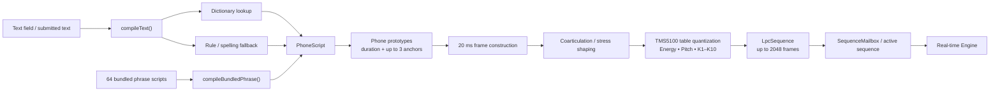
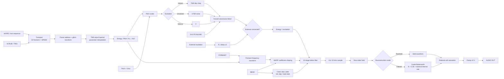

# Phonex Audio-Quality and TMS Speech-Emulation Research Report

## Executive summary

Dragon King Leviathan, the central conclusion is pleasantly paradoxical: **Phonex should become cleaner around the emulated chip, not cleaner inside it.** The module already preserves many of the features that create the classic Texas Instruments LPC voice—quantized energy/pitch/reflection coefficients, a chirp source, pseudo-random unvoiced excitation, a tenth-order lattice filter, 20 ms speech frames, and stepped TMS-style parameter interpolation. The largest opportunities are therefore in reconstruction, input anti-aliasing, neutral coefficient handling, output staging, and—in an optional authenticity profile—more exact finite-word-length TMS behavior. citeturn13view0turn21view0turn19view3turn25view5

One historical correction materially affects the design target: **the original Speak & Spell is fundamentally a TMS5100/TMC0280-family target, not a TMS5220 target.** IEEE's historical account identifies the TMS5100/TMC0280 as the Speak & Spell speech processor, and the current Phonex source itself explicitly labels its coefficient tables, chirp, and interpolation as TMS5100-derived. TMS5220 is a closely related later TI LPC device, but treating the two as interchangeable would blur exactly the character you are trying to preserve. Adafruit's work on Talkie similarly distinguishes TMS5100 and TMS5220 data/table formats rather than treating them as one profile. citeturn22search2turn21view0turn25view5turn0search1

My highest-priority findings are:

| Priority | Finding | Recommendation |
|---|---|---|
| **Very high** | Phonex converts its 8/10 kHz internal stream to Rack rate with zero-order hold followed by only a second-order Butterworth at `0.45 × internalRate`. | Upgrade the reconstruction stage to a steeper low-latency filter, ideally three or four cascaded biquads, and make its cutoff follow the *effective* bent chip clock. |
| **Very high** | External excitation is effectively sampled by the 8/10 kHz synthesis ticks without an anti-alias filter. | Add a host-rate anti-alias filter before the excitation is consumed by the LPC core. |
| **Very high** | `WARP=0` is **not spectrally neutral**: every reflection coefficient still passes through `fastTanh()`. Large coefficients are substantially reduced even at the nominal neutral setting. | Redefine the clean path so `warp == 0` gives the quantized LPC coefficient exactly; keep the current behavior as a legacy/character mode. |
| **High** | The output soft-compressor is applied **after** the reconstruction filter, so it can recreate high-frequency harmonic content that the reconstruction stage just removed. | Put deliberate chip/DAC nonlinearity before the final reconstruction filter; leave only a nearly inactive ±5 V safety limiter after it. |
| **High** | Phonex quantizes LPC parameters like a TI chip but performs the lattice arithmetic in floating point without TMS finite-word-length wrap/truncation and hardware-style DAC behavior. | Add an optional **TMS5100 Fixed** core profile based on patent/MAME behavior, while preserving current float Phonex as a backwards-compatible mode. |
| **High** | Under `BEND`, reflection coefficients may be allowed as high as ±1.08, beyond the normal stability condition for reflection coefficients. Nonfinite output is explicitly trapped/reset later. | Keep the chaos, but create it explicitly rather than by allowing an unbounded lattice: stable `|k|<1` core plus controllable state saturation/leak/feedback. |
| **Medium-high** | Forced voiced excitation can collapse toward silence on unvoiced frames because compiled unvoiced frames have zero pitch while `ForcedExcitation::Voiced` asks the chirp generator to use that frame pitch. | Retain the last valid voiced period or use a defined fallback pitch when forcing voicing. |
| **Medium** | The current TMS character is somewhat hybrid: TMS5100 tables/interpolation, a custom float lattice/output stage, and creative Phonex extensions. | Formalize this as profiles: **Phonex Legacy**, **Speak & Spell / TMS5100**, and eventually **TMS5220**. |

These recommendations follow directly from the source path: Phonex generates an internal sample only at 8 or 10 kHz, holds that value between ticks, optionally filters the held waveform, and then applies a rational output saturation. Its external input, coefficient shaping, bend behavior, and post-reconstruction saturation each introduce their own opportunities for non-historical aliasing or distortion. citeturn20view3turn19view7turn19view8turn19view11turn19view12turn20view8

No CPU ceiling or real-time budget was specified, so this report assumes **quality-first desktop VCV Rack operation with no specific CPU constraint**. Even so, the recommended first wave is deliberately modest: a few additional biquads and control-rate computations are small compared with the existing LPC/formant processing.

## Scope and source audit

I attempted the requested local `git clone` of the `expander` branch. The execution sandbox could not resolve `github.com`, so I cannot honestly claim a successful local clone or local build. I instead audited the branch through GitHub's branch-specific source views and inspected every Phonex-prefixed source artifact I could enumerate. I also attempted repository search for Phonex-specific tests; none surfaced through the available GitHub web index. This limitation means the performance findings below are **static code-analysis hotspots rather than measured profiler results**.

The Phonex surface I found comprises fourteen Phonex-specific files:

`Phonex.cpp`, `Phonex.hpp`, `PhonexWidget.cpp`, `PhonexEngine.cpp`, `PhonexEngine.hpp`, `PhonexTypes.hpp`, `PhonexPronunciation.cpp`, `PhonexPronunciation.hpp`, `PhonexRom.cpp`, `PhonexRom.hpp`, `PhonexRomData.inc`, `PhonexSequenceCompiler.cpp`, `PhonexSequenceCompiler.hpp`, and `PhonexSequenceMailbox.hpp`. The module wrapper owns the engine and mailbox; the engine contains the excitation, lattice, transport, reconstruction, bending and glitch logic; `PhonexTypes.hpp` defines the 10th-order LPC representation; pronunciation and ROM code provide the text/phone data path; the sequence compiler converts those phones into TMS-quantized frames; and the widget supplies text entry and module UI. citeturn10view0turn17view5turn13view0turn16view0turn11view0turn11view2turn25view2turn11view3

The generated ROM/data layer is not a packed historical Speak & Spell ROM image. Phonex instead exposes phone prototypes with up to three anchors, 64 bundled phrase scripts, phone symbols, and a pronunciation dictionary; `PhonexRom.cpp` performs bounds-safe lookups into the generated `PhonexRomData.inc`. That is an important architectural distinction: **Phonex is synthesizing new speech with a TMS-like parameter vocabulary rather than merely playing decoded Speak & Spell ROM frames.** citeturn11view0turn13view1turn16view3

The current `expander` branch's `plugin.json` identifies the plug-in as version 2.9.1, but I did **not** find a Phonex entry in its module list at inspection time. Given that the source exists, my inference is that Phonex is either development-stage on this branch or not yet wired into the distributable manifest. That is worth resolving before establishing golden audio hashes because module registration/state compatibility may still be moving. citeturn9view0

The code already shows considerable intentionality about historical behavior. The sequence compiler explicitly describes its arrays as TMS5100 parameter reconstruction tables, `PhonexEngine.hpp` describes its 41-value excitation waveform as a signed TMS5100 chirp, and the runtime interpolation function is explicitly named `tms5100InterpolationMix()`. This makes **TMS5100 / Speak & Spell fidelity the natural historical anchor for Phonex**, with TMS5220 best treated as a separate selectable model. citeturn25view5turn21view0turn19view3

## Architecture and signal path

Phonex has two distinct pipelines: a **speech-data compiler** and a **real-time LPC synthesizer**.

The compiler works in 20 ms source frames. `PhonexTypes.hpp` fixes the LPC order at ten, allows up to 2,048 frames per sequence, and stores normalized energy, a pitch period field named `pitchPeriod10k`, ten floating-point reflection coefficients, and one of three excitation classes: silence, unvoiced, or voiced. citeturn13view0



The compiler performs more than a simple lookup. It linearly interpolates prototype anchors, inserts an intermediate transition frame for some same-excitation phone boundaries, performs explicit coarticulation—for example shaping `HH` toward a following voiced phone and softening the end of an unvoiced consonant before a voiced phone—and modifies energy/pitch for stress. Every resulting frame is then re-quantized to the TMS tables. Energy is mapped to the TI-style energy table, voiced pitch to the pitch table, and reflection coefficients to tables with progressively fewer entries for higher-order coefficients; unvoiced frames retain only the first four active coefficients. citeturn14view2turn14view3turn25view5

That is a good design choice for character: even when the higher-level linguistic model produces smooth floating-point values, the actual synthesis sequence is snapped back onto the characteristic TI parameter lattice. I would **not** remove this quantization in a quality upgrade. It is part of the voice.

The text frontend first attempts dictionary pronunciations and otherwise uses simple English-oriented rule/spelling behavior. The fallback code contains direct orthographic mappings such as context-dependent `G`, `Q→K W`, `X→K S`, and letter-to-phone approximations. Consequently, some perceived “audio quality” problems will actually be **pronunciation and phone-transition problems rather than DSP problems**. Improving the dictionary or fallback G2P later can yield more intelligible speech without changing the chip's sonic fingerprint. citeturn25view0turn25view1

### Runtime signal path

At runtime the module selects one of 64 bundled sequences from the WORD control/CV or accepts a compiled text sequence. The WORD CV maps 0–10 V to indices 0–63. Pitch covers ±2 octaves in addition to V/oct, formant and warp are bipolar ±1, SPEED spans −4 to +4, excitation blend and bend span 0–1, and sixteen glitch algorithms operate on frame addressing, energy, pitch, K coefficients, excitation, or combinations thereof. The module offers 8 kHz or 10 kHz internal synthesis, Raw Hold or Filtered reconstruction, two trigger modes, and voiced/unvoiced forced-excitation selection. citeturn10view0turn17view5



This signal path follows the engine implementation directly. Voiced frames read the discrete chirp according to pitch period; unvoiced frames use the LFSR's sign; excitation is multiplied by frame energy and passed through the tenth-order lattice. Internal ticks are produced by a phase accumulator at 8 or 10 kHz, and the most recent sample is held until the next tick. Filtered mode then feeds that held waveform to a host-rate second-order Butterworth. Finally, Phonex maps the result through

\[
y=\frac{x}{0.25+0.2|x|}
\]

and clips it to ±5 V. citeturn19view0turn19view1turn19view2turn19view11turn17view0turn19view7turn19view8turn20view8

That last function is much more than a safety limiter. Its small-signal gain approaches **4×**, while its asymptote is ±5. Thus it substantially compresses the LPC core's natural energy variation. At `x=1`, for example, the output is about 2.22; at `x=5`, it is 4.0. This is a mathematically smooth form of “loudness normalization by accident,” and it is one reason I would separate chip/DAC coloration from final Rack voltage scaling. The source location of that mapping is immediately after reconstruction. citeturn20view8

### Parameter behavior worth preserving—and correcting

| Control/path | Current behavior | Audio consequence |
|---|---|---|
| **Pitch** | ±2 octaves plus V/oct; scales the chirp period through an approximate `exp2`. citeturn20view0turn19view11 | Excellent creative range; high positive shifts can generate non-chip-like internal aliasing. |
| **Speed** | −4…+4; values within ±0.025 become zero; normal transport advances at `speed × 50 frames/s`. citeturn19view2turn20view6 | Reverse and freeze are useful Phonex extensions; 1× retains the nominal 20 ms frame cadence. |
| **Formant** | Converts reflection coefficients to predictor coefficients and performs an all-pass-style frequency transformation with `alpha = -0.24 × formant`, then converts back. citeturn20view1turn20view2 | Sophisticated and stable when conversion succeeds; computationally the heaviest timbral operation. |
| **Warp** | Even at `warp=0`, applies `fastTanh(k)` to every formant-shifted coefficient; warp changes the tanh input multiplier from 0.2 to 1.8. citeturn20view7turn20view0 | **Neutral is not neutral.** Strong K values are damped at the nominal center. |
| **Bend** | At maximum: internal clock falls to 45% of normal, instantaneous jitter reaches ±12%, tick skipping reaches 30%, lattice-state leak reaches 4%, and coefficient overdrive reaches +10%. citeturn18view7turn19view12 | Great circuit-bent personality, but deliberately creates broadband discontinuities and can push the lattice outside its stable reflection-coefficient region. |
| **Glitch** | Sixteen modes alter addresses, energy resolution, pitch, coefficient sign/order/hole/quantization, or excitation. citeturn19view5turn19view6 | Distortion here is intentional; do not “fix” it globally. |
| **Reconstruction** | Raw Hold or 2-pole Butterworth; module default is Filtered even though the engine member default is RawHold. citeturn17view5turn19view7 | Correct concept, insufficient image rejection for a quality mode. |
| **External excitation** | Host input divided by 5, clamped to ±2 and substituted directly for internal carrier when connected. citeturn17view0 | No anti-aliasing before the 8/10 kHz effective sampling operation. |

The **neutral-warp issue is particularly important**. `fastTanh()` is a rational tanh approximation, and the neutral path invokes it unconditionally. For illustration, feeding 0.8 into the function used by the code gives roughly 0.675; 0.9 becomes roughly 0.730; 0.985 becomes roughly 0.771. Those are not subtle deviations. This means the underlying TMS-quantized coefficients are considerably damped before reaching the lattice even with FORMANT=0, WARP=0 and BEND=0. The source quantization is therefore more historically faithful than the nominally clean runtime spectral path. citeturn20view0turn20view7

A second important corner case is forced voicing. The compiler sets pitch to zero for an unvoiced quantized frame, while `ForcedExcitation::Voiced` asks `chirp_.next(frame.pitchPeriod10k / pitchScale)` when replacing an unvoiced excitation. `ChirpGenerator::next()` explicitly returns zero for non-positive periods. Thus a fully forced-voiced blend can suppress unvoiced frames instead of turning them into periodic excitation. Retaining the most recent valid voiced period would make that control behave much more musically. citeturn14view2turn19view0turn17view0

There is also an intentional but important coupling between internal clock and voice spectrum. `setInternalRate()` selects exactly 8 or 10 kHz, but the chirp consumes `pitchPeriod10k` directly and the reflection coefficients are not rate-normalized when switching rate. Therefore changing internal rate changes the physical frequencies implied by the discrete LPC model rather than merely choosing a higher-quality renderer. That may be desirable as a “different chip clock” effect, but it should be documented as such—or formalized into separate 8 kHz and 10 kHz model profiles. citeturn20view3turn19view11turn13view0

## Historical emulation benchmark

The original Speak & Spell should anchor a **TMS5100 mode**. IEEE's history identifies the TMS5100/TMC0280 as the LPC chip used for the 1978 product. Phonex is already pointed in that direction by its TMS5100 reconstruction tables and interpolation. citeturn22search2turn25view5turn21view0

The characteristic architecture is pitch-excited LPC: voiced speech is driven by a short chirp-like glottal excitation, unvoiced speech by pseudo-random excitation, and the result passes through a multi-stage lattice whose coefficients model the vocal tract. Parameters are highly quantized to reduce speech storage requirements, then interpolated between frames. The later official TI TSP50C0x/1x design manual describes the same broad TI design philosophy—decoded speech parameters, interpolation between fetches, a lattice synthesizer, selectable 8/10 kHz speech rates, and on-chip digital low-pass filtering—although that later family is LPC-12/12-pole and therefore should **not** be copied coefficient-for-coefficient into Phonex's LPC-10 core. citeturn26view2turn26view3

TI's later manual is particularly relevant to the “quality without losing character” question because it explicitly treats **output filtering as part of the speech synthesizer system**, rather than assuming the raw discrete samples are the final audible signal. It also documents finite-resolution D/A output options and AC-coupled amplifier/speaker interfaces. That strongly supports keeping historical quantization inside the core while giving Phonex a better-defined reconstruction/output stage. citeturn26view2

The most useful current open-source technical reference is MAME's TMS51xx/TMS52xx implementation. MAME models details that Phonex currently abstracts away: stateful per-interpolation-period parameter updates, voiced chirp addressing, pseudo-random excitation, finite-width arithmetic, lattice wrapping/truncation, and different final analog/digital output quantization behavior. MAME's implementation comments explicitly tie the lattice equations to TI patent material and describe the voiced chirp behavior using Figure 14B of US Patent 4,331,836. citeturn24view1turn24view2turn26view1

A particularly telling difference concerns unvoiced excitation. Phonex advances a 17-bit LFSR once per internal output tick and emits ±1 from its low bit. In the current MAME TMS5110 implementation, the noise generator is advanced twenty times for each generated output sample according to the documented hardware timing, while the actual excitation magnitude is a fixed positive or negative value selected from the random state. These approaches both sound “digital-noisy,” but their sequence spectra and periodicities are not equivalent. citeturn19view0turn17view5turn24view1turn24view4

The lattice arithmetic is another major distinction. Phonex performs each stage as floating-point subtraction/addition and clamps reflection coefficients, whereas MAME models the TMS finite-width matrix multiplication and 14-bit running arithmetic, including wrap behavior and low-bit loss before final output conversion. MAME separately models a low-resolution clipped analog speaker path and a digital output path. Those finite-word-length effects are not nuisances to be removed from an authenticity profile; they are part of why a physical TMS device sounds like a physical TMS device. citeturn19view1turn19view2turn24view2

Likewise, MAME's TMS5110 implementation describes a voiced chirp address space reaching 52 samples before the excitation remains at the final table value, while Phonex contains 41 explicit signed TMS5100 values and returns zero once the index is outside that 41-value array until the pitch counter wraps. Depending on how the omitted tail is intended to be represented, these can be audibly equivalent over some periods or different over others. This is exactly the sort of behavior that should be covered by **golden excitation-vector tests rather than assumed from table names**. citeturn21view0turn19view0turn24view1

Adafruit's adaptation of the Talkie project is useful as a pragmatic secondary implementation reference. Their account notes that Talkie originally targeted TMS5220-style speech and that they added a TMS5100 mode for Speak & Spell, with chip-specific coefficient tables being a material difference. That reinforces the recommendation not to create one ambiguous “TMS5220/Speak & Spell” switch. citeturn0search1

The historical source hierarchy I would use during implementation is therefore:

| Reference | What it should govern in Phonex |
|---|---|
| **TI patent US 4,331,836** | Hardware architecture, excitation timing/chirp behavior; primary historical source. citeturn26view1 |
| **Current MAME TMS5110/TMS5220 source** | Executable reference for interpolation state, noise timing, fixed-point lattice, clipping and edge cases; verify implementation against it rather than blindly copying code. citeturn23view0turn23view2turn23view3turn24view1turn24view2 |
| **Phonex's existing TMS5100 tables** | Preserve the current corpus's pitch/energy/K quantization and existing sonic identity. citeturn25view5 |
| **TI TSP50C0x/1x design manual** | Later-family corroboration for interpolation, 8/10 kHz operation, finite DAC, output low-pass/filter architecture—not a direct LPC-10 coefficient source. citeturn26view2turn26view3 |
| **IEEE Speak & Spell history** | Defines the historical product target as TMS5100/TMC0280. citeturn22search2 |
| **Talkie/Adafruit** | Useful practical cross-check for TMS5100 versus TMS5220 profiles and embedded approximations. citeturn0search1 |

The design philosophy that emerges is straightforward: **make the core dirt historically meaningful and make the surrounding DSP clean**.

## Audio-quality findings and proposed changes

### Make the reconstruction stage substantially better

This is the single highest-confidence improvement.

Phonex's current Filtered mode first generates a zero-order-held host-rate waveform and then runs a second-order Butterworth at `min(0.45 × internalRate, 0.45 × hostRate)`. For a 10 kHz core at 48 kHz host rate, that means a 4.5 kHz cutoff. A second-order Butterworth is only about 5 dB down at 5.5 kHz and 6 dB down at 6 kHz; combined with the ZOH's sinc attenuation, the lower edge of the first reconstruction image can still be only roughly 10–12 dB below the baseband. That is audible as extra fizz/metallicity and also sends needless ultrasonic energy into later Rack modules. The filter itself and cutoff are directly visible in the source. citeturn19view7turn19view8

I would replace it with a **sixth-order Butterworth or comparable minimum-phase low-pass implemented as three biquads**. A useful starting specification is:

- Passband edge: `0.40–0.42 × effectiveInternalRate`
- Transition region: approximately `0.42–0.58 × effectiveInternalRate`
- Stopband goal: at least 45–55 dB integrated first-image rejection in the real-time mode
- No deliberate resonance
- Recalculate only when host rate or the smoothed effective chip clock changes appreciably

At 8 kHz that puts the clean speech passband around 3.2–3.36 kHz; at 10 kHz, around 4.0–4.2 kHz. This intentionally keeps the narrow TI bandwidth while removing the *host-rate reconstruction artifacts* that are not part of a TMS voice.

For an optional **Studio** reconstruction mode, a 64–96 tap Kaiser/windowed-sinc FIR can target ≥70 dB image rejection. The caveat is latency: a linear-phase FIR delays the audio relative to Phonex's FRAME and EOX outputs. Either compensate those pulse outputs or document Studio mode's latency. For the normal real-time mode I prefer the steeper IIR because the module has timing outputs and minimum latency is useful.

BEND makes this even more important. At maximum bend, Phonex reduces the synthesis clock to 45% of nominal, but the reconstruction cutoff is still calculated from the nominal `internalRate_`. Thus the actual sample-image spacing moves downward while the output low-pass does not follow it. I would use

```text
effectiveRate = internalRate * clockMultiplier
```

for the reconstruction cutoff, with perhaps 10–30 ms smoothing, while **not** following the instantaneous ±12% random jitter. That makes bending darken naturally as the simulated chip clock collapses rather than increasingly exposing reconstruction images. The current bend clock law is explicit in the engine. citeturn18view7turn19view12

### Anti-alias the external excitation before the core

External excitation is currently normalized and clamped at host rate but only consumed when `synthesizeTick()` occurs. Functionally, a 48 or 96 kHz source can therefore be sampled into an 8/10 kHz LPC core without a prefilter. Frequencies above the internal Nyquist fold directly into the voice. citeturn17view0turn19view11

Add a dedicated host-rate `externalExcitationAA_` filter and run it **on every host sample**, before the internal-tick loop. A fourth- or sixth-order Butterworth is sufficient:

```cpp
// Conceptual placement in Engine::process():
const float extNorm = clampf(controls.externalExcitation / 5.f, -2.f, 2.f);
externalFiltered_ = externalAa_.process(extNorm);

// synthesizeTick() consumes externalFiltered_, not the raw host sample.
```

Use a cutoff near `0.40–0.42 × effectiveInternalRate`. Keep a context-menu **External Excitation: Raw / Anti-aliased** option because brutal folding can itself be an enjoyable retro effect.

This is a particularly low-risk improvement because it does not touch internal speech synthesis at all when EXT is disconnected.

### Make WARP's center truly neutral

This is the most important **core-timbre** correction.

At present:

```text
formantReflection
    -> fastTanh(k × (1 + 0.8 × warp))
    -> coefficient clamp
```

so `warp=0` is still `fastTanh(k)`, not `k`. citeturn20view7turn20view0

A cleaner bipolar warp is to operate in a stability-preserving transformed domain:

```cpp
float k = clampf(formantReflection[i], -0.995f, 0.995f);

// warp = 0 -> exact identity.
// Negative warp damps resonances; positive warp strengthens them.
// tanh guarantees |k'| < 1.
float qScale = std::exp2(0.6f * warp);
float shaped = std::tanh(std::atanh(k) * qScale);
```

That gives:

- `WARP = 0`: **exact LPC coefficient**
- negative WARP: progressively flatter/damped formants
- positive WARP: progressively stronger resonances
- guaranteed `|k| < 1`
- no mysterious neutral-position coloration

`atanh/tanh` need not run at audio rate. Phonex already caches transformed reflection coefficients and only needs to update them when the frame or smoothed formant/warp value moves enough. citeturn20view7

Because changing the center tone could alter existing patches, retain the present mapping under a **Legacy coefficient shaping** option or use the legacy path when loading older patch JSON until users explicitly migrate.

### Replace unstable Bend overdrive with controlled chaos

The normal lattice clamps coefficients at about ±0.995, but BEND raises the coefficient limit to 1.08 and multiplies warped coefficients by up to 1.10. Reflection-coefficient magnitudes beyond one are outside the usual stable lattice region. Phonex's later check for nonfinite audio, followed by `clearSynthesis()`, confirms that catastrophic states are anticipated. citeturn19view1turn17view0turn20view7turn20view8

I would preserve the bend character but separate its components:

```text
clock slowdown          keep exactly
clock jitter            keep exactly
sample skips            keep exactly
lattice-state leak      keep exactly
unstable |K| > 1        replace in Safe Bend
```

For **Safe Bend**, keep `|K| ≤ 0.999` and create the final “circuit is dying” sensation with explicit bounded mechanisms such as a soft state saturator, excitation overdrive before the lattice, or controlled feedback/leak modulation. For historical patch compatibility, a context-menu **Bend feedback: Legacy unstable / Bounded** option can retain the current behavior.

This improves audio quality not by making BEND polite—heaven forbid—but by making its ugliness deterministic rather than occasionally falling through floating-point infinity.

### Fix forced-voiced excitation

Track a valid voiced pitch whenever one is encountered:

```cpp
if (frame.excitation == Excitation::Voiced && frame.pitchPeriod10k > 0.f)
    lastVoicedPitchPeriod_ = frame.pitchPeriod10k;
```

Then, when forcing voicing onto an unvoiced frame:

```cpp
float forcedPeriod = lastVoicedPitchPeriod_;

if (!(forcedPeriod > 0.f)) {
    // Musically neutral startup fallback, e.g. ~125 Hz.
    forcedPeriod = internalRate_ / 125.f;
}

forced = chirp_.next(forcedPeriod / pitchScale);
```

The exact fallback should be tuned by ear, perhaps 100–140 Hz. The important point is that forcing voiced excitation should produce a voiced source rather than calling the chirp generator with the zero pitch carried by an unvoiced TMS frame. citeturn14view2turn19view0turn17view0

Estimated patch size: perhaps 20–40 LOC plus tests.

### Separate chip output behavior from Rack voltage normalization

The best architecture is three layers:


The current engine instead performs floating-point LPC, reconstructs it, and **then** applies a strong nonlinear voltage compressor. citeturn20view8

I recommend:

**Phonex Float mode:** retain the float lattice, but use a fixed calibrated output gain. Determine the gain from the 64 bundled phrases and a representative direct-phoneme corpus. Map perhaps the 99th percentile of clean absolute signal to roughly 4 V and reserve ±5 V for peaks.

**TMS5100 Fixed mode:** emulate the relevant finite-width lattice and DAC/clipping behavior *before* reconstruction. MAME provides an executable reference for the 14-bit lattice arithmetic and its low-resolution final output path. citeturn24view2

**Final safety:** a very gentle limiter beginning around 4.7–4.9 V, expected to operate only on pathological Bend/External settings.

**DC removal:** add a transparent 10–20 Hz DC blocker after reconstruction. TI speech systems historically fed amplifiers/speakers through output coupling/filtering rather than treating DC as useful audio; the later TI design manual illustrates AC-coupled output interfaces. citeturn26view2

Most importantly, put any strong intentional nonlinearity **before the final low-pass**. Otherwise harmonic generation after reconstruction repopulates frequencies above the chip's intended bandwidth.

### Add a true TMS5100 core profile before a TMS5220 profile

Do not replace the current engine outright. Formalize its identity:

```text
Core model
 ├─ Phonex Legacy       existing floating-point personality
 ├─ TMS5100 / S&S       historically targeted mode
 └─ TMS5220             later, separately verified profile
```

The TMS5100 profile should eventually reproduce:

- exact chip-specific energy, pitch and K tables;
- exact chirp/tail behavior;
- chip-specific LFSR state/update schedule and unvoiced excitation level;
- parameter update/inhibition rules over the eight interpolation periods;
- finite-width matrix multiplication/lattice state;
- hardware-style overflow/truncation;
- appropriate analog/digital output quantization choices.

MAME's TMS5110 source models all of these categories and explicitly connects some of them to TI patents. Phonex already implements the TMS-style stepped interpolation curve, but its implementation computes a cumulative static mix between decoded frame A and B, whereas MAME models stateful hardware parameter updates and special zero/inhibit behavior across frame transitions. citeturn19view3turn20view5turn24view4turn24view2

This is one area where “lower fidelity” can mean **higher authenticity**. A fixed-point TMS profile may measure worse in conventional THD terms while sounding much more like the machine. Pairing that dirty core with clean host reconstruction is the sweet spot.

### Improve phone transitions without smoothing away the machine

The compiler currently performs a first layer of interpolation while building phone frames, including an added midpoint frame for certain same-excitation boundaries, and the real-time engine then performs a second layer of TMS-style interpolation between adjacent frames. citeturn14view2turn19view9

This deserves a listening experiment. A 20 ms inserted midpoint followed by runtime interpolation can effectively spread some spectral transitions across approximately two frame intervals. That may make vowels pleasant but smear consonant attacks.

I would test:

```text
Existing:
A -> inserted midpoint -> B
     with TMS runtime interpolation on both transitions

Candidate:
A -> B
     runtime TMS interpolation only
```

and a selective policy:

```text
vowel / sonorant boundary        allow midpoint
plosive / fricative attack       no midpoint
unvoiced -> voiced transition    explicit excitation boundary rules
```

This can improve intelligibility while retaining the low-rate LPC movement rather than turning Phonex into a modern vocoder.

### Keep oversampling and band-limited synthesis selective

I **would not oversample the entire lattice by default**. The filter coefficients and chirp timing exist in the internal chip-rate domain; simply running the same lattice coefficients at 40 kHz instead of 10 kHz moves its physical resonances and destroys exactly the historical structure you are preserving.

Where oversampling does make sense is **extended pitch behavior outside the historical sweet spot**. With +2 octaves, pitch periods can become very short and the discrete chirp can create substantial in-band folding at 8/10 kHz. A `Clean Extended Pitch` mode could precompute band-limited versions of the chirp or generate the excitation at 4× internal rate, low-pass it, and decimate **before** feeding the normal-rate lattice. The default TMS5100 profile should leave native aliasing intact.

A useful policy would be:

```text
Pitch |≤ 0.5 octave        native chip excitation
Pitch > +0.5 octave        optional anti-aliased excitation
Authentic TMS mode         always native
```

The current ±2-octave range and direct period scaling make this an optional enhancement rather than a correction. citeturn10view0turn19view11

### Treat speaker EQ, reverb and chorus as cabinet effects

A real Speak & Spell experience includes much more than the silicon: DAC, amplifier, enclosure and a very small speaker. But without a measured transfer function, calling an arbitrary EQ “authentic” would be storytelling rather than emulation.

I would therefore add an optional **Cabinet** stage, disabled in the neutral output mode. A reasonable initial listening preset—not asserted as a measured Speak & Spell response—is:

```text
HPF:        120–180 Hz, 2-pole
Presence:   +1 to +2 dB around 1.8–2.4 kHz, Q ≈ 0.7–1.0
LPF:        3.6–4.2 kHz, 2-pole
```

The better long-term method is to record a real Speak & Spell and a bit-accurate emulator rendering the same ROM phrase, time-align them, estimate the spectral ratio, and fit two or three biquads to that measured hardware transfer function.

Reverb and chorus should remain tiny and optional. For a built-in **Room** effect, try 2–6% wet, roughly 0.25–0.6 s decay, 3–10 ms predelay, and a 3–4 kHz damping cutoff. For a mono **Micro-Chorus**, use approximately 5–8% wet, 8–15 ms base delay, 0.2–0.7 ms modulation, and 0.1–0.3 Hz rate. Those settings add dimensionality without turning Speak & Spell into Blade Runner's backing vocalist. They belong *after* Cabinet and should never be part of the historical dry reference.

### Proposed-change comparison

The LOC and effort figures are engineering estimates, excluding extended listening/QA and any VCV UI artwork work.

| Change | Expected sonic effect | Risk | Estimated LOC / effort |
|---|---|---:|---:|
| **Upgrade reconstruction to 6th-order low-pass and track effective clock** | Strong reduction of ZOH image fizz while retaining 8/10 kHz voice bandwidth | Low | 80–140 LOC; **0.5–1 day** |
| **External-excitation anti-alias filter** | Greatly reduces foldover when feeding audio-rate EXT signals | Low | 50–90 LOC; **0.5 day** |
| **Neutral WARP redesign** | Restores original quantized LPC resonances at center; clearer vowels/formants | Medium because legacy patches change | 40–80 LOC; **0.5–1 day** |
| **Move coloration before reconstruction; linear output calibration + DC blocker** | More natural dynamics, fewer newly generated >Nyquist harmonics, cleaner downstream behavior | Low–medium | 60–120 LOC; **0.5–1 day** |
| **Forced-voiced pitch fallback** | Makes EXCITE BLEND behave musically on unvoiced phones instead of fading toward silence | Low | 20–40 LOC; **2–4 hours** |
| **Bounded Bend mode** | Keeps broken-clock character without runaway/nonfinite lattice bursts | Medium; affects extreme Bend tone | 40–90 LOC; **0.5–1 day** |
| **TMS5100 exact noise/chirp/interpolation state** | More authentic Speak & Spell consonants, pitch excitation and transitions | Medium | 120–220 LOC; **1–2 days** |
| **TMS5100 finite-width lattice/DAC profile** | Characteristic hardware grit/quantization without host-rate imaging | Medium–high | 200–350 LOC; **2–4 days** |
| **Separate TMS5220 profile** | Correct later-TI character without contaminating S&S mode | Medium | additional 150–300 LOC; **2–3 days** |
| **Selective band-limited high-pitch excitation** | Cleaner +1/+2-octave creative ranges; leaves native mode unchanged | Medium | 120–220 LOC; **1–2 days** |
| **Phone-boundary/coarticulation retuning** | Better consonant definition and intelligibility | Medium; linguistic tuning required | 100–250 LOC/data; **1–3 days** |
| **Measured/optional Cabinet EQ** | More physical toy-speaker presentation | Low when default-off | 70–130 LOC; **0.5–1 day** |
| **Subtle room / micro-chorus** | Depth and polish rather than chip fidelity | Low when default-off | 150–300 LOC; **1–2 days** |
| **Control-rate optimization of formant transform** | Little/no direct sonic change; creates CPU headroom for quality DSP | Low–medium | 80–150 LOC; **~1 day** |

## Validation and performance

The most important test principle is to stop relying on “sounds better” alone. Phonex is exactly the sort of instrument where one person's “cleaner” is another person's “someone pressure-washed my childhood.” The test suite should therefore have **two independent axes: historical fidelity and host-audio cleanliness**.

### Build a headless DSP harness

`PhonexEngine`, `PhonexTypes`, the sequence compiler and much of the ROM/compiler path are sufficiently separated from Rack that a small non-Rack test executable should be practical. The harness should render deterministic WAV/float buffers from known frame sequences at 44.1, 48, 96 and 192 kHz host rates. The engine already exposes deterministic seed state and an internal tick counter, which are ideal regression hooks. citeturn17view5

For every render, write both the final audio and intermediate diagnostics:

```text
frame index
frame excitation
energy
pitch
K1…K10
chirp / noise excitation
raw lattice sample
held sample
reconstructed sample
final output
internal tick timestamp
```

That turns “why did this A/B change?” into a solvable engineering question.

### Generate a fixed audio corpus

The minimum reference pack should contain:

| Render | Purpose |
|---|---|
| **Bundled phrase 36, defaults** | Main regression anchor because it is the module's current default selection. citeturn10view0 |
| **All 64 bundled phrases** | Statistical level, stability and spectral coverage. |
| **`[AA1 IY1 UW1]` or equivalent sustained vowels** | Formant clarity and WARP/FORMANT behavior. |
| **`[S SH F TH]`** | Unvoiced-noise spectrum and reconstruction images. |
| **Alternating voiced/unvoiced phones** | Excitation-transition clicks and interpolation behavior. |
| **Pitch sweep −2 → +2 octaves** | High-pitch aliasing and period continuity. |
| **FORMANT sweep −1 → +1, WARP=0** | Verify stability and neutral coefficient behavior. |
| **WARP sweep −1 → +1, FORMANT=0** | Verify exact identity at zero after redesign. |
| **BEND sweep 0 → 1** | Clock/image tracking, skipped samples and stability. |
| **8 kHz / 10 kHz A/B** | Expose pitch/formant coupling and reconstruction differences. |
| **External sine at 1, 3, 5, 6, 10 and 15 kHz** | Measure EXT foldover before/after anti-aliasing. |
| **Zero-K lattice test** | Isolate chirp/noise/output stages from formant filtering. |
| **Single fixed LPC frame for several seconds** | Golden-vector comparison against reference emulation. |

Use the existing deterministic RNG seed for golden files; otherwise noise-spectrum comparisons will be unnecessarily noisy. citeturn17view5

### Measure reconstruction image rejection

For a 10 kHz core, integrate the desired signal energy below approximately 4.2–4.5 kHz and separately integrate energy in the first image bands above roughly 5.5–6 kHz. Repeat at every host sample rate.

Useful target metrics:

```text
Real-time Clean reconstruction:
    integrated image rejection:  >45 dB target
    passband ripple:             <0.25 dB through 0.38 × Fi

Studio reconstruction:
    integrated image rejection:  >70 dB target

RawHold:
    no target; this is intentionally raw
```

Do not compare only one FFT bin at exactly 8 or 10 kHz; ZOH has sinc zeros at integer multiples of the internal rate, so that would make a poor filter look misleadingly excellent. Compare **bands around the images**.

### Quantify external-input alias rejection

Feed host-rate sine tones above the core Nyquist. At 10 kHz core rate, for example, a 6 kHz excitation aliases near 4 kHz when naively sampled; at 8 kHz it folds differently.

Measure:

\[
A_\text{alias}=20\log_{10}\frac{\text{aliased output amplitude}}{\text{input amplitude}}
\]

after accounting for the LPC filter's transfer function by performing the same test with all K values zero.

A good first target is **at least 35–45 dB additional alias suppression** in Anti-aliased EXT mode relative to Raw.

### Establish historical golden vectors

Rather than immediately trying to compare whole words between Phonex and MAME—which use different speech corpora—compare the primitive state machines.

Derive test vectors from the TI/MAME behavior for:

- first several hundred RNG states/bits;
- chirp output for several pitch periods;
- one complete eight-period energy interpolation trajectory;
- pitch interpolation trajectory;
- K1 and K10 interpolation trajectories;
- voiced→unvoiced and unvoiced→voiced transition rules;
- a fixed excitation/energy/K lattice sequence;
- finite-width overflow/wrap test vectors;
- analog/DAC clipping thresholds.

MAME's implementation exposes exactly the kinds of arithmetic and timing details needed to define these independent vectors. citeturn24view1turn24view2turn24view4

For the finished TMS5100 profile, useful aggregate targets are:

```text
Golden primitive vectors:        exact where integer behavior is modeled
Waveform correlation:            >0.99 after allowed gain/polarity alignment
Log-spectral distance:           <1 dB over the usable speech band
F0 error on steady voiced frame: <0.5%
No unexpected NaN/Inf:           zero occurrences
```

The waveform target should not be applied to Phonex Legacy; only to the explicit historical profile.

### Measure dynamic range rather than simply peak level

For all 64 bundled phrases, record:

- peak voltage;
- RMS;
- crest factor;
- short-term LUFS;
- 95th and 99th percentile absolute sample magnitude;
- percentage of samples touching the output limiter;
- frame-by-frame energy correlation between encoded energy and output RMS.

The current rational output function strongly compresses amplitude variation, so the last metric will reveal whether the revised output stage restores useful speech dynamics. The current function is visible directly in the engine. citeturn20view8

A sensible goal is for the post-Rack safety limiter to engage on **well below 0.1% of clean default speech samples**, while leaving ample voltage for modular use.

### Verify LPC stability explicitly

For every frame after FORMANT/WARP transformation, assert:

```text
abs(reflection[i]) < 1
finite(all coefficients)
finite(all lattice states)
```

For a more rigorous test, convert the reflection coefficients to predictor coefficients and verify that the corresponding all-pole model remains stable. Phonex already contains both reflection→predictor and predictor→reflection operations for the formant transformation, so the infrastructure is partly present. citeturn18view4turn20view1turn20view2

Run this across:

```text
all 64 phrases
all frames
FORMANT = {-1, -.5, 0, .5, 1}
WARP    = {-1, -.5, 0, .5, 1}
BEND    = {0, .5, .7, 1}
```

Legacy unstable Bend can be explicitly exempted and tested instead for bounded output recovery.

### Profile the actual hotspots

Static inspection suggests the main CPU hotspot is **`formantShiftReflection()` under continuous FORMANT modulation**. It converts tenth-order reflection coefficients to predictor form, builds polynomial powers for the frequency transformation using doubles, performs nested polynomial combinations, and converts back. Because the cached result is invalidated when formant/warp changes by more than `1e-4`, smooth CV modulation can cause this work to recur at many internal ticks. citeturn20view1turn20view2turn20view7

The next tier is the per-host-sample frame path: `interpolatedFrame()` selects two potentially glitched frames and interpolates energy, pitch and all ten K values before synthesis. The actual tenth-order lattice itself is comparatively small and only runs at 8/10 kHz, not at host rate. citeturn20view5turn19view9turn19view2

A clean optimization, should profiling confirm it, is to update transformed K coefficients at perhaps **1 kHz control rate or on internal ticks only**, then interpolate between stable reflection vectors. Since there is no stated CPU ceiling, I would make this optimization **after** the sonic fixes rather than prematurely complicating the code.

Profile four stress scenarios:

```text
default speech, no modulation
audio-rate FORMANT/WARP CV
BEND=1 + GLITCH=15
external excitation + Clean reconstruction
```

at 44.1, 48, 96 and 192 kHz. Record mean and 99.9th percentile `process()` time. The 96/192 kHz cases matter because host-rate reconstruction and control processing scale with Rack's sample rate even though the LPC core remains 8/10 kHz.

## Implementation timeline and prioritized next steps

The safest rollout separates **transparent technical improvements**, **historical fidelity**, and **creative polish** so each layer can be A/B-tested independently.

| Phase | Work | Deliverable |
|---|---|---|
| **Baseline — half day** | Create headless renderer, deterministic test frames, default/64-phrase WAV corpus, FFT/level scripts | Golden audio and metrics for current Phonex |
| **Clean boundaries — day one** | External-excitation AA; 6th-order reconstruction; effective-clock tracking; DC blocker | Biggest immediate reduction in unwanted alias/image energy |
| **Neutral core — day two** | WARP=0 identity mode; forced-voicing fix; output-stage reorder/calibration; bounded Bend option | Clearer LPC spectrum and more predictable dynamics |
| **Historical primitives — days three to four** | Exact TMS5100 chirp/noise/interpolation golden vectors and implementation | Verified S&S excitation/timing profile |
| **Fixed-point character — days five to six** | TMS-style finite arithmetic, DAC/clipping profile, MAME/patent cross-check | `Core: TMS5100 / Speak & Spell` |
| **Listening and linguistic pass — day seven** | Transition-midpoint experiments, coarticulation A/B, pronunciation regression | Improved intelligibility without modernizing the voice away |
| **Polish — following days** | Measured/voiced Cabinet, optional Studio FIR, clean extended pitch, tiny room/chorus | Optional “finished instrument” presentation |
| **TMS5220 branch — after TMS5100 is stable** | Separate tables/timing/profile and regression vectors | Genuine TMS5220 mode rather than a blended approximation |

The immediate code order I would use is:

**First: reconstruction.** Replace the two-pole filter with a steeper minimum-phase reconstruction stage and have its bandwidth follow `internalRate × bendClockMultiplier`. This should produce the largest improvement in perceived cleanliness while changing almost nothing about the actual LPC speech generator. The current two-pole reconstruction and Bend clock laws make this a tightly scoped change. citeturn19view7turn19view8turn18view7

**Second: external-excitation anti-aliasing.** This closes the clearest textbook alias path and can be made bypassable for deliberately crunchy patches. citeturn17view0turn19view11

**Third: restore a genuinely neutral coefficient path.** `FORMANT=0, WARP=0, BEND=0, GLITCH=0` should feed the quantized TMS coefficients to the lattice unchanged. I expect this to improve vowel definition noticeably because the present neutral path compresses strong reflection coefficients through `fastTanh()`. Preserve the old mapping as Legacy. citeturn20view0turn20view7

**Fourth: fix forced voicing and output staging.** Retain the last valid voiced pitch for forced chirp excitation, move deliberate nonlinear coloration before reconstruction, and replace the always-active dynamic compressor with calibrated gain plus a rarely used final limiter. citeturn14view2turn17view0turn20view8

**Fifth: build the exact TMS5100 profile rather than incrementally contaminating the float core.** Port the *behavior* described by TI/MAME—chip-specific RNG timing, chirp, stateful interpolation, finite lattice arithmetic and output quantization—behind a selectable core mode. Keep existing Phonex float behavior so old patches remain old patches. citeturn24view1turn24view2turn26view1

**Sixth: only then add a TMS5220 mode.** The historical Speak & Spell target and Phonex's current tables point to TMS5100; TMS5220 should get its own verified tables and behavior rather than becoming a vague synonym for “TI robot voice.” citeturn22search2turn25view5turn0search1

The resulting architecture would preserve the delightful limitations that actually define the instrument—20 ms frame rhythm, coarse TMS parameter tables, periodic chirp, strange noise, lattice resonance, clock bend and glitch addressing—while removing unrelated digital debris introduced by naïve host-rate conversion and ambiguous output processing. In other words: **keep the Speak & Spell's teeth; polish the glass around them.**