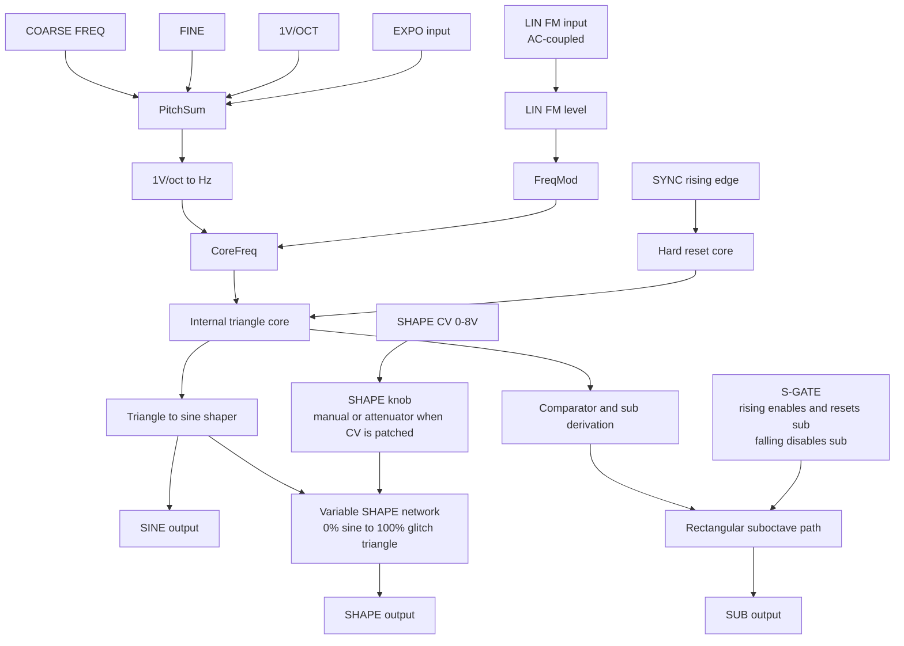

# Faithful VCV Rack Conversion of the Make Noise STO

## Executive summary

The Make Noise STO should be modeled in VCV Rack as a **triangle-core analog VCO whose public outputs are SINE, SHAPE, and SUB**, not as a generic “analog-style oscillator” with an STO skin. The official manual is unusually informative on the behaviors that matter for fidelity: the oscillator is triangle-core; the sine is formed from that triangle “as in the DPO”; the SHAPE circuit is a distinct waveshaping stage that produces **both even and odd harmonics** while keeping the fundamental strong; the SHAPE output is **sine at 0% and “glitch triangle” at 100%**; the SUB is a **rectangular/comparator-derived** signal one octave lower; the LINEAR FM input is **AC-coupled** with a **unipolar depth control**; the EXPO input is deeper and less pitch-stable; the SYNC input hard-resets the core; and the S-GATE input independently enables/resets only the sub path. citeturn51view0turn53view0

That source picture has two immediate consequences for a Rack port. First, a faithful model should **not** use a mathematically perfect sine as its primary identity if the goal is hardware resemblance, because the STO manual explicitly describes a triangle-to-sine shaping circuit and even documents sine-wave calibration and residual harmonics. Second, the SHAPE output should **not** be implemented as a plain sine-to-triangle or triangle-to-square crossfade. Because Make Noise says the SHAPE circuit creates both even and odd harmonics while staying fundamental-forward, the digital model needs some controlled asymmetry or non-centrosymmetric transfer in the shaping path. citeturn51view0turn53view0turn55search1turn52search2

The best Rack design is therefore a **hybrid**: a bandlimited triangle core, a calibrated analog-style sine shaper, an asymmetric variable-shape transfer that moves from sine toward a kinked or glitch-triangle endpoint, a comparator/divider-derived sub output, and band-limited correction applied **selectively** to the discontinuous parts of the model such as hard sync and the sub edges. For UI, the strongest ideas in the attached files are the display and performance architecture: top-panel waveform preview, no audio-thread allocation, decimated display writes, double-buffered handoff, and a simple performance-first layout. Those ideas are worth keeping, while the non-STO controls and semantics in the attached files are not. citeturn48view0turn45view0turn45view1turn45view3 fileciteturn0file0 fileciteturn0file1

## Source basis and attached-file synthesis

The most important primary source available in this session was the publicly hosted **Make Noise Japanese STO manual PDF**, which provided the core functional description, panel-control definitions, calibration notes, and patch examples. The English STO PDF was linked from a retailer page but was bot-protected during this browsing session, so the English wording below is my translation of the official Japanese PDF where needed. For English-facing corroboration of the product summary, panel image, and current physical specs such as width and depth, I used retailer pages that reproduce Make Noise feature language and link back to the official manual. For Rack implementation details, I used the current Rack manual/API guide pages on parameters, widgets, framebuffers, voltage standards, polyphony, SIMD, and DSP. citeturn41view1turn51view0turn53view0turn40view0turn40view2turn44view0turn45view0turn45view1turn45view2turn45view3turn46view0turn48view0

The two attached files turned out not to be STO documentation, but rather an oscillator concept and implementation companion for an original module named **Undertow**. They are still useful. They contribute three especially valuable ideas for an STO Rack build: a **top display / middle controls / lower patch points** visual hierarchy, a **lock-free decimated waveform preview** with preallocated buffers, and a **performance-first shipping profile** that avoids complex user-facing quality modes in the first release. They also include practical suggestions such as PolyBLEP handling on the sub path and leaving display work off the audio hot path. fileciteturn0file0 fileciteturn0file1

Those files should not, however, be adopted wholesale. Their proposed control set adds `RIPPLE`, omits `EXPO FM`, treats LIN FM and SHAPE CV as attenuverters, and assumes a mathematically generated sine core. All of those choices diverge from the official STO behavior. A faithful STO conversion should preserve the hardware’s actual public control set and the unusually specific SHAPE semantics described in the Make Noise manual. fileciteturn0file0 fileciteturn0file1 citeturn51view0turn53view0

No public official schematic was located in the current research set. Because of that, the “internal circuit” discussion below is intentionally constrained: it sticks to what Make Noise states explicitly, plus clearly labeled inference from standard triangle-core / sine-shaper analog practice. That is the right level of confidence for a Rack conversion document whose goal is fidelity rather than mythology. citeturn51view0turn53view0turn52search2

## STO architecture and panel semantics

The STO is documented as a **compact analog VCO** with three outputs—**variable SHAPE**, **SUB**, and **SINE**—plus **COARSE** and **FINE** tuning, **LINEAR FM level**, **LINEAR FM input**, **SHAPE control**, **SHAPE CV input**, **EXPO input**, **1V/OCT input**, **S-GATE**, and **SYNC**. The manual specifies the output levels as approximately **10 Vpp** for SHAPE and SINE and **12 Vpp** for SUB, with a coarse frequency range of **8 Hz to 4 kHz** over about **nine octaves**, and a fine range of roughly **±2.5 semitones**. The SHAPE CV input is documented as **unipolar and direct-coupled over 0 to 8 V**, the LINEAR FM input as **AC-coupled with a 10 V range**, the EXPO input as **bipolar over ±10 V**, and the 1V/OCT input as a pitch control input with an optimal range around **±5 V**. Multiple retailer listings tied to the official manual specify the physical module at **8HP** and about **30 mm** deep. citeturn51view0turn40view0turn40view2

One subtle but crucial fidelity point is that the STO does **not** expose a dedicated triangle output, and it does **not** expose a conventional variable-width pulse output. The nearest equivalents are internal or derived: the core itself is triangle-based; the SINE output is the triangle after sine shaping; the SHAPE output can approach a “glitch triangle” region at maximum SHAPE; and the SUB output is a rectangular or square-like comparator-derived signal one octave below the main voice. In other words, if a Rack recreation shows separate front-panel **TRIANGLE** or **PULSE** outputs, it has already drifted away from the STO hardware. citeturn51view0turn53view0



The signal-flow diagram above is the most defensible high-level topology that fits the official manual. The triangle core and triangle-to-sine shaper are explicit in the manual; the SHAPE circuit is described as STO-specific and as producing both even and odd harmonics without obscuring the fundamental; and the SUB is explicitly described as a comparator-derived rectangular output one octave down that can be independently reset or gated by S-GATE. citeturn51view0turn53view0

The hardest interpretive issue is the SHAPE output, because secondary English summaries flatten its behavior. One retailer summary says the waveshaped output morphs from a “soft triangle” toward something between a triangle and square, but the official Make Noise manual says something more specific and more interesting: **0% SHAPE = sine**, **100% SHAPE = glitch triangle**, and the circuit produces **both even and odd harmonics** while preserving a strong fundamental. Since an ideal symmetric triangle contains only **odd harmonics**, a faithful digital SHAPE stage cannot be a mere symmetric triangle-family morph. It needs controlled asymmetry, offset compensation, or another non-centrosymmetric shaping principle so that even harmonics are genuinely available. That is the most important sonic-design clue in the entire manual. citeturn40view0turn53view0turn55search1

The manual also gives unusually helpful analog-behavior cues. It says the sine wave is adjusted by a **sine waveform trim** and an **amplitude trim**, recommends minimizing harmonics while keeping the top and bottom arcs smooth, sets the calibrated sine amplitude at roughly **10.5 Vpp**, and explicitly states that **a small amount of harmonic content in the sine is part of the design specification**. That means the purest Rack implementation is not a mathematically sterile sine; it is a very clean analog-style sine shaper with trace residual imperfection. The calibration section also says the STO tracks musically over about **4 to 5 octaves**, while one retailer summary states **5 octaves**, which is a reasonable digital target. citeturn53view0turn40view0

FM and sync behavior also point toward a particular digital model. The manual says LINEAR FM preserves the base pitch better, is **AC-coupled**, becomes more complex as the level rises, and begins to **overdrive above about 80%**, at which point pitch tracking degrades. By contrast, EXPO FM is deeper and wilder because it acts directly on the core frequency law and therefore sacrifices 1V/OCT stability more readily. The SYNC input is explicitly **hard sync**, resetting the oscillator core on each cycle of an external source and producing richer harmonics across all outputs; the documentation does not indicate any dedicated soft-sync mode. The S-GATE input is a separate behavior altogether: rising edges turn on and reset the sub, falling edges turn it off, and audio-rate signals can be used there to create pseudo-sync textures on the SUB output without affecting SINE or SHAPE. citeturn51view0turn53view0

The static waveform preview below is illustrative rather than measured. It follows the manual’s hard endpoints—near-sine at minimum SHAPE and glitch-triangle territory at maximum SHAPE—and the recommendation that the SHAPE stage permit both even and odd harmonics while keeping the fundamental forward. citeturn53view0turn51view0

<svg width="420" height="150" viewBox="0 0 420 150" xmlns="http://www.w3.org/2000/svg" role="img" aria-label="Illustrative STO SHAPE waveform preview">
  <rect x="0" y="0" width="420" height="150" rx="10" fill="#0f1117"/>
  <line x1="18" y1="30" x2="402" y2="30" stroke="#2a3040" stroke-width="1"/>
  <line x1="18" y1="75" x2="402" y2="75" stroke="#2a3040" stroke-width="1"/>
  <line x1="18" y1="120" x2="402" y2="120" stroke="#2a3040" stroke-width="1"/>
  <polyline fill="none" stroke="#b7c1ff" stroke-width="2.5"
    points="20,75 40,55 60,39 80,28 100,24 120,28 140,39 160,55 180,75 200,95 220,111 240,122 260,126 280,122 300,111 320,95 340,75 360,55 380,39 400,28"/>
  <polyline fill="none" stroke="#8394ff" stroke-width="2.5"
    points="20,76 40,63 60,49 80,38 100,33 120,35 140,44 160,58 180,75 200,92 220,106 240,115 260,117 280,112 300,102 320,89 340,75 360,61 380,50 400,43"/>
  <polyline fill="none" stroke="#4460ff" stroke-width="2.5"
    points="20,77 40,86 60,102 80,117 100,124 120,115 140,95 160,72 180,50 200,34 220,28 240,37 260,57 280,80 300,101 320,117 340,123 360,114 380,94 400,72"/>
  <text x="22" y="17" font-family="sans-serif" font-size="11" fill="#d6d9e0">Illustrative SHAPE preview</text>
  <text x="22" y="141" font-family="sans-serif" font-size="10" fill="#b0b8c8">0%</text>
  <text x="200" y="141" font-family="sans-serif" font-size="10" fill="#b0b8c8">50%</text>
  <text x="371" y="141" font-family="sans-serif" font-size="10" fill="#b0b8c8">100%</text>
</svg>

## DSP strategy for a faithful Rack model

The most faithful core algorithm is **not** the cheapest possible phase-to-sine lookup. It is a **triangle-first** architecture, because that is what the manual actually describes. VCV’s own DSP guide states that even triangle waves need proper bandlimiting and specifically notes that a triangle can be regarded as an **integrated square wave**, so a bandlimited integrated square is a good way to obtain a bandlimited triangle. That makes a lot of sense for STO: it gives you an internal triangle core that matches the hardware description, it gives you a natural source for the comparator/sub path, and it lets you target anti-aliasing effort where it matters most. citeturn48view0turn55search1

For the SINE output, the most faithful strategy is a **calibrated transfer curve applied to the triangle**, analogous to the nonlinear sine-shaping networks used in analog function generators. This is where the attached Undertow implementation companion is least faithful to STO: it proposes a clean sine LUT core, which is sensible for a different oscillator, but Make Noise documents a shaped sine path and explicit sine calibration. In practice, that means a Rack STO should prefer a light, calibrated triangle-to-sine shaping function—polynomial, diode-like, or otherwise analog-style—over a mathematically perfect oscillator sine. The payoff is not only sonic resemblance; it also gives you a natural place to model the STO’s documented slight residual sine harmonics. fileciteturn0file1 citeturn51view0turn53view0turn52search2

For the SHAPE output, the right digital strategy is a **second shaping stage that starts from the sine-shaped node**, not a direct crossfade between pre-baked waveforms. The simplest strong option is an **asymmetric polynomial or phase-warp transfer** whose coefficients are driven by SHAPE and tuned so that minimum SHAPE is the sine output itself while maximum SHAPE approaches a kinked, strong-fundamental, glitch-triangle target. A small final soft limiting stage is useful at the top end, but it should be carefully bounded. VCV’s DSP guide explicitly warns that nonlinear processes such as waveshaping and saturation usually require anti-aliasing, so the cheapest faithful shipping model is either a very smooth shaping transfer at base rate or a small **local oversampling** block around the SHAPE stage only. citeturn53view0turn48view0

A faithful digital handling of the STO’s front panel also requires obeying the manual’s input semantics, not generic Rack convenience semantics. The most unusual example is the **SHAPE** knob: the manual says it behaves as the **manual SHAPE control when no SHAPE CV cable is patched**, but becomes an **attenuator for the incoming SHAPE CV** when the jack is patched. That is not equivalent to a normal “base offset + attenuverter” design. For fidelity, the Rack module should preserve that dual behavior exactly, even if the tooltip makes it explicit because users may not expect it. The LINEAR FM level is also documented as a **unipolar positive attenuator**, not an attenuverter. citeturn51view0

A concise Rack-side signal recipe looks like this:

```cpp
pitchV = coarse + fine + vOct + expoIn;
freqHz = dsp::FREQ_C4 * dsp::exp2_taylor5(pitchV);

linHz  = linAmount * acCouple(linFmIn) * kLin;
core   = triangleCore(freqHz + linHz, syncEdge);

sine   = calibratedTriangleToSine(core.triangle, sineTrim, ampTrim);

shapeAmt = shapeCvConnected
         ? clamp(shapeKnob * clamp(shapeCvIn / 8.f, 0.f, 1.f), 0.f, 1.f)
         : shapeKnob;

shape  = dcBlock(variableShape(sine, core.triangle, shapeAmt));
sub    = subPath(core.wrapEvent, sGateEdge, sGateHigh);
```

That pattern is grounded in the STO manual’s documented signal roles, the Rack guide’s `exp2_taylor5()` optimization advice for 1V/oct conversion, and Rack’s voltage and trigger standards. In a future polyphonic version, Rack’s own manual recommends processing oscillator channels in arrays and, where useful, in `simd::float_4` batches. Since the hardware STO is monophonic, I would keep the first faithful release mono and treat polyphony as a clearly documented digital convenience rather than a default identity assumption. citeturn45view3turn45view2turn46view0turn51view0turn53view0

The analog behaviors worth emulating are the ones the sources actually imply. That includes: a sine that is very clean but not mathematically sterile; a SHAPE stage whose asymmetry is subtle enough to preserve the fundamental; LINEAR FM depth soft-overdrive above the upper part of the control; EXPO modulation that gets unruly quickly; explicit hard sync; separate S-GATE behavior for the sub; and output amplitudes around the documented 10–12 Vpp range. By contrast, other “analog character” traits—temperature drift, startup randomness, generalized control-path slew, soft-sync hysteresis—are not quantified in the public STO sources. If you add them at all, they should be small, deterministic, and off by default. That way the module remains faithful to documented behavior instead of inventing undocumented instability. citeturn53view0turn51view0turn46view0

## Revised layout and UI implementation

The revised Rack layout should remain conservative. A faithful conversion does not need to cosmetically imitate Make Noise’s industrial design, but it should preserve the **same signal set and control priorities**: outputs and display high on the panel, pitch and timbre in the center, low-level input jacks below, and no invented controls such as RIPPLE. The most useful attached-file insight here is the ergonomic hierarchy of **top display, middle pitch/timbre, lower patch points**, which adapts well to STO while keeping the Rack version readable and less cable-obscured than a literal transplant. fileciteturn0file0 citeturn51view0turn40view0turn40view2

The mockup below keeps the module at **8HP**, preserves the hardware control set, makes **FINE** visibly explicit, keeps **EXPO** and **SYNC** as jack-only controls, and adds one small waveform preview that shows the current SHAPE output without turning the module into a display instrument. That is closer to the STO’s “performance-optimized voice” philosophy than a screen-heavy redesign would be. citeturn40view0turn40view2turn51view0

<svg width="230" height="640" viewBox="0 0 230 640" xmlns="http://www.w3.org/2000/svg" role="img" aria-label="Revised STO panel mockup">
  <rect x="8" y="8" width="214" height="624" rx="18" fill="#eceef2" stroke="#1b1d22" stroke-width="2"/>
  <text x="115" y="34" text-anchor="middle" font-family="sans-serif" font-size="24" fill="#16181d">STO</text>
  <text x="115" y="54" text-anchor="middle" font-family="sans-serif" font-size="9" fill="#575d67">faithful Rack conversion</text>

  <rect x="22" y="70" width="186" height="78" rx="9" fill="#0f1117" stroke="#222838" stroke-width="1.5"/>
  <polyline fill="none" stroke="#8fa0ff" stroke-width="2.2"
    points="30,109 42,101 54,93 66,87 78,84 90,86 102,92 114,101 126,110 138,118 150,124 162,127 174,124 186,116 198,104"/>
  <text x="34" y="141" font-family="sans-serif" font-size="8" fill="#a6afc3">live SHAPE preview</text>

  <circle cx="50" cy="182" r="12" fill="#d2d6dd" stroke="#1f232b" stroke-width="2"/>
  <circle cx="115" cy="182" r="12" fill="#d2d6dd" stroke="#1f232b" stroke-width="2"/>
  <circle cx="180" cy="182" r="12" fill="#d2d6dd" stroke="#1f232b" stroke-width="2"/>
  <text x="50" y="206" text-anchor="middle" font-family="sans-serif" font-size="9" fill="#1f232b">SHAPE</text>
  <text x="115" y="206" text-anchor="middle" font-family="sans-serif" font-size="9" fill="#1f232b">SUB</text>
  <text x="180" y="206" text-anchor="middle" font-family="sans-serif" font-size="9" fill="#1f232b">SINE</text>

  <circle cx="88" cy="292" r="44" fill="#1b1d23" stroke="#59606d" stroke-width="3"/>
  <circle cx="88" cy="292" r="35" fill="#f7f8fa" stroke="#262a33" stroke-width="2"/>
  <line x1="88" y1="292" x2="73" y2="257" stroke="#262a33" stroke-width="4" stroke-linecap="round"/>
  <text x="88" y="352" text-anchor="middle" font-family="sans-serif" font-size="12" fill="#1f232b">FREQ</text>

  <circle cx="156" cy="262" r="12" fill="#1b1d23" stroke="#59606d" stroke-width="2"/>
  <circle cx="156" cy="262" r="8" fill="#f7f8fa"/>
  <line x1="156" y1="262" x2="161" y2="256" stroke="#262a33" stroke-width="2"/>
  <text x="156" y="284" text-anchor="middle" font-family="sans-serif" font-size="9" fill="#1f232b">FINE</text>

  <circle cx="64" cy="406" r="24" fill="#1b1d23" stroke="#59606d" stroke-width="2.5"/>
  <circle cx="64" cy="406" r="18" fill="#f7f8fa" stroke="#262a33" stroke-width="1.5"/>
  <line x1="64" y1="406" x2="55" y2="391" stroke="#262a33" stroke-width="3" stroke-linecap="round"/>
  <text x="64" y="444" text-anchor="middle" font-family="sans-serif" font-size="10" fill="#1f232b">LIN FM</text>

  <circle cx="156" cy="406" r="24" fill="#1b1d23" stroke="#59606d" stroke-width="2.5"/>
  <circle cx="156" cy="406" r="18" fill="#f7f8fa" stroke="#262a33" stroke-width="1.5"/>
  <line x1="156" y1="406" x2="148" y2="391" stroke="#262a33" stroke-width="3" stroke-linecap="round"/>
  <text x="156" y="444" text-anchor="middle" font-family="sans-serif" font-size="10" fill="#1f232b">SHAPE</text>

  <circle cx="64" cy="472" r="12" fill="#d2d6dd" stroke="#1f232b" stroke-width="2"/>
  <circle cx="156" cy="472" r="12" fill="#d2d6dd" stroke="#1f232b" stroke-width="2"/>
  <text x="64" y="496" text-anchor="middle" font-family="sans-serif" font-size="9" fill="#1f232b">LIN IN</text>
  <text x="156" y="496" text-anchor="middle" font-family="sans-serif" font-size="9" fill="#1f232b">SHAPE CV</text>

  <circle cx="40" cy="566" r="12" fill="#d2d6dd" stroke="#1f232b" stroke-width="2"/>
  <circle cx="90" cy="566" r="12" fill="#d2d6dd" stroke="#1f232b" stroke-width="2"/>
  <circle cx="140" cy="566" r="12" fill="#d2d6dd" stroke="#1f232b" stroke-width="2"/>
  <circle cx="190" cy="566" r="12" fill="#d2d6dd" stroke="#1f232b" stroke-width="2"/>
  <text x="40" y="590" text-anchor="middle" font-family="sans-serif" font-size="9" fill="#1f232b">EXPO</text>
  <text x="90" y="590" text-anchor="middle" font-family="sans-serif" font-size="9" fill="#1f232b">1V/OCT</text>
  <text x="140" y="590" text-anchor="middle" font-family="sans-serif" font-size="9" fill="#1f232b">SYNC</text>
  <text x="190" y="590" text-anchor="middle" font-family="sans-serif" font-size="9" fill="#1f232b">S-GATE</text>
</svg>

The UI implementation should copy the attached files’ display discipline and merge it with Rack’s official widget guidance. Rack recommends custom waveform displays by subclassing `Widget` and drawing with NanoVG, and recommends `FramebufferWidget` when a custom widget does not need to be redrawn every screen frame. The attached Undertow implementation companion independently reaches the same architecture: decimated audio-thread writes into a preallocated double buffer, atomic publication of the readable buffer index, and a UI reader that simply draws the most recent published snapshot. That combination is ideal here. It keeps the preview “live enough” to be informative, while preserving CPU for the oscillator itself. citeturn45view1turn45view0 fileciteturn0file1


A good STO preview is simple: a faint reference trace for the SINE output, a brighter trace for the current SHAPE waveform, a very small SUB activity indicator, and a one-frame sync flash at the left edge. The attached refined file describes almost exactly that composition, and it is a strong fit here because it reinforces the STO’s identity rather than replacing it with a generic oscilloscope. The display should also remain **single-voice** even if polyphony is added later, typically following channel 0. fileciteturn0file1 citeturn45view1turn45view0turn45view2

The only user-facing semantic wrinkle that is worth making unusually explicit is the SHAPE knob behavior. Because the hardware knob changes meaning when SHAPE CV is patched, the Rack tooltip should say so directly, for example: **“Shape. Manual when SHAPE CV is unpatched; attenuates incoming SHAPE CV when patched.”** Rack’s parameter-tooltip system is built for exactly this sort of clarification. citeturn44view0turn51view0

## Comparison tables and parameter mapping

The comparison table below intentionally mixes source-grounded facts with engineering judgment. The grounded parts are: Make Noise’s stated topology and shape endpoints, the harmonic property of triangle waves, VCV’s documented anti-aliasing guidance for discontinuities and nonlinear processes, and the attached files’ emphasis on low-CPU display and PolyBLEP-style correction. The CPU and fidelity labels are therefore **relative engineering estimates**, not benchmark measurements, because the target CPU budget was unspecified. citeturn53view0turn55search1turn48view0 fileciteturn0file1

### Algorithm option matrix

| Technique | Best placement in an STO Rack port | Relative CPU | Fidelity to STO | Pros | Cons | Basis |
|---|---|---:|---:|---|---|---|
| Direct phase triangle + pure `sin()` or LUT sine | Fast prototype only | Very low | Low | Simple and cheap | Misses documented triangle-to-sine shaping, residual sine impurity, and the SHAPE path’s analog character | Official manual says sine is shaped from the triangle and trimmed, not generated as an abstract perfect sine. citeturn51view0turn53view0 |
| Integrated **bandlimited square** to make the triangle core | Main oscillator core | Low | High | Matches the documented triangle-core topology and follows VCV’s guidance that triangle can be generated as an integrated bandlimited square | Slightly more stateful than direct phase math | VCV DSP guide and triangle-wave properties. citeturn48view0turn55search1 |
| Polynomial or diode-like **triangle-to-sine shaper** | SINE path | Very low | High | Closest to the documented analog sine-shaping path; easy to calibrate for slight residual THD | Needs calibration constants and careful normalization | Make Noise sine calibration notes and analog function-generator practice. citeturn53view0turn52search2 |
| Asymmetric polynomial or phase-warp **SHAPE shaper** | Main SHAPE path | Low | High | Can produce both even and odd harmonics, preserve the fundamental, and land near the manual’s glitch-triangle endpoint | Needs tuning and DC management | Make Noise SHAPE description plus triangle odd-harmonic property. citeturn53view0turn55search1 |
| Controlled **wavefolding** only near the top of SHAPE range | Adjunct to SHAPE, not whole model | Low to medium | Medium to high | Good way to get the high-end “agitated” or glitchy feel without replacing the core shaper | Easy to overdo; can sound more like a folder than an STO | Useful because the manual’s 100% endpoint is not a plain triangle, but VCV warns all nonlinear stages can alias. citeturn53view0turn48view0 |
| **PolyBLEP / BLAMP** correction | SUB edges and SYNC resets | Low to medium | High | Targets actual discontinuities cheaply; best cost/benefit for STO | Not a full-spectrum cure for aggressive nonlinearity | VCV explicitly recommends minBLEP/polyBLEP for jumps, and sync handling needs band-limited correction. citeturn48view0turn55search4 |
| **minBLEP** correction | Higher-quality SYNC handling | Medium | High | Cleaner hard-sync correction than the cheapest residual schemes | More implementation machinery than polyBLEP | VCV names minBLEP as an appropriate discontinuity-correction method. citeturn48view0 |
| Full-core **BLIT / LP-BLIT** style synthesis | Optional HQ core, mainly for extreme sync/poly use | Medium to high | Medium to high | Excellent anti-aliasing for classic oscillator generation | Heavier than STO usually needs because the exposed core behavior is mostly continuous except at sub/sync events | Waveform references cite LP-BLIT for bandlimited classic waves; good but arguably overkill here. citeturn56search0turn56search1turn48view0 |
| Mipmapped **wavetable interpolation** | Alternate SHAPE implementation or measured-hardware mode | Low to medium runtime | Medium | Very practical alias control and stable CPU | Static tables underrepresent circuit interaction unless captured from hardware across CV states | Best treated as an engineering shortcut unless you have measured STO tables; otherwise less circuit-faithful by inference. citeturn48view0 |
| Local **2x or 4x oversampling** of the SHAPE stage | Aggressive audio-rate SHAPE CV / HQ mode | Medium | High | Most effective anti-aliasing where the STO actually becomes nonlinear | Higher CPU than a base-rate shaper | VCV says the general remedy for nonlinear aliasing is oversample, filter, and decimate. citeturn48view0 |

### STO to Rack mapping

| STO control or jack | Faithful Rack representation | Suggested Rack implementation | Source basis |
|---|---|---|---|
| COARSE FREQ | Main pitch parameter | Store in pitch-volts or equivalent exponential domain and display in Hz over the documented **8 Hz to 4 kHz** range. A literal midpoint default lands near **179 Hz**; a Rack-convention C4 default is useful but slightly less hardware-literal. | Manual frequency range. citeturn51view0 |
| FINE | Secondary pitch trim | Range **±2.5 semitones** or about **±0.208 V** in 1V/oct terms; centered default. | Manual range. citeturn51view0 |
| LINEAR FM level | Knob parameter | **Unipolar 0 to 1**, not an attenuverter. Tooltip should say “AC-coupled linear FM level.” Soft-overdrive above the upper part of the range is appropriate. | Manual says unipolar positive attenuator and notes overdrive beyond ~80%. citeturn51view0turn43view0 |
| LINEAR FM input | Input jack | AC-couple with a light one-pole HP stage so DC is rejected and audio-rate FM remains intact; scale for the documented **10 V** range. | Manual and Rack voltage standards. citeturn51view0turn46view0 |
| SHAPE knob | Main timbre parameter | If SHAPE CV is **unpatched**, knob directly sets SHAPE amount. If SHAPE CV is **patched**, knob becomes a **unipolar attenuator** for the incoming SHAPE CV instead of a base offset. | Manual’s dual-role SHAPE semantics. citeturn51view0 |
| SHAPE CV input | Input jack | Accept **0 to 8 V** unipolar, clamp above 8 V for hardware-like behavior, ignore negative voltages or rectify them to zero for strict faithfulness. | Manual input range. citeturn51view0 |
| EXPO input | Input jack | Add directly to the pitch law before `exp2`, with a nominal **±10 V** operating range and no front-panel attenuator. | Manual says bipolar 10 V exponential frequency-control input and recommends it for transposition and deeper FM. citeturn51view0turn43view0 |
| 1V/OCT input | Input jack | Standard Rack pitch input; optimize around **±5 V** but do not unnecessarily cripple larger values. | Manual optimal range and Rack pitch standard. citeturn51view0turn46view0 |
| SYNC | Input jack | **Hard sync only** in faithful mode. Detect rising edges robustly at audio rate using Rack-style Schmitt thresholds. No soft-sync mode on the faceplate. | Manual and Rack trigger guidance. citeturn51view0turn53view0turn46view0 |
| S-GATE | Input jack | Rising edge resets and enables the sub; falling edge turns it off. Do not reset the main core here. If unpatched, let SUB run continuously. | Manual S-GATE behavior. citeturn51view0turn43view0 |
| SINE output | Audio output | Target roughly **10 to 10.5 Vpp** centered around 0 V, with very small residual harmonics permissible. | Manual output spec and sine calibration notes. citeturn51view0turn53view0 |
| SHAPE output | Audio output | Target about **10 Vpp**, strong fundamental, asymmetry-managed shaping, and optional light DC blocking after the SHAPE stage only. | Manual output spec and SHAPE harmonic description. citeturn51view0turn53view0 |
| SUB output | Audio output | Rectangular/square-like output at **one octave below**, around **12 Vpp**, derived from the core but separately gated/reset by S-GATE. | Manual SUB description. citeturn51view0turn53view0 |
| Front-panel 1V/OCT trim | Hidden calibration behavior | Do **not** expose as a regular Rack control. Either bake digital calibration internally or, at most, provide a hidden service menu or compile-time trim constant. | Hardware trim exists, but digital emulation does not need a user-facing calibration trimmer. citeturn51view0turn53view0 |
| Sine waveform and amplitude trims | Hidden calibration behavior | Bake into the sine shaper constants and output scale, not into the front panel. | Manual dedicated sine-shape and amplitude calibration. citeturn53view0 |

## Recommended build profile

If the goal is a first Rack release that feels like the STO instead of a broader “inspired by STO” oscillator, the strongest shipping profile is this: **mono by default**, **hard sync only**, **triangle-core engine**, **calibrated triangle-to-sine shaper**, **asymmetric SHAPE stage starting from the sine node**, **PolyBLEP or BLAMP-style correction only on SUB and SYNC discontinuities**, **no user-facing quality modes**, **single small waveform preview**, and **no added controls beyond the hardware set**. That profile fits the STO’s own documented identity as a compact, melodic, performance-optimized voice with a strong fundamental and a useful sub, and it also aligns with the attached files’ healthiest implementation instincts around display cost and low-CPU shipping defaults. citeturn51view0turn53view0turn40view0turn45view0turn45view1turn48view0 fileciteturn0file0 fileciteturn0file1

A useful final distinction is what to **adopt** from the attached files and what to **reject** for STO fidelity. Adopt: the display hierarchy, the decimated lock-free preview architecture, the preference for CPU restraint, the idea that the SUB path deserves explicit anti-alias attention, and the possibility of adding Rack-standard polyphony later if it stays coherent. Reject or quarantine behind clearly marked non-faithful options: `RIPPLE`, LIN FM attenuverters, SHAPE-as-offset-plus-attenuverter semantics, omission of EXPO FM, soft-sync defaults, and a pure sine-LUT identity. Those are all sensible for another oscillator; they are not the Make Noise STO. fileciteturn0file0 fileciteturn0file1 citeturn51view0turn53view0

Because the target CPU budget and exact Rack API version were unspecified, the design above deliberately leans on currently documented Rack 2-era primitives—`configParam()`, NanoVG custom widgets, `FramebufferWidget`, Rack voltage standards, optional SIMD, and `dsp::exp2_taylor5()` for optimized pitch conversion. If hardware measurements become available later, the first places to refine are the sine-shaper transfer curve, the maximum-SHAPE asymmetry/kink, and the exact transient shape of hard sync; those are the three places where a public manual gives clear behavior but not component-level topology. In its present form, though, this design is already close to the documented STO: triangle at the core, shaped sine as the sonic center, a distinct SHAPE circuit that does real harmonic work, and a sub path that is separate enough to be musically special. citeturn44view0turn45view0turn45view1turn45view2turn45view3turn46view0turn48view0turn51view0turn53view0