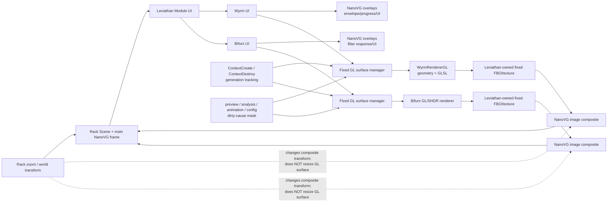
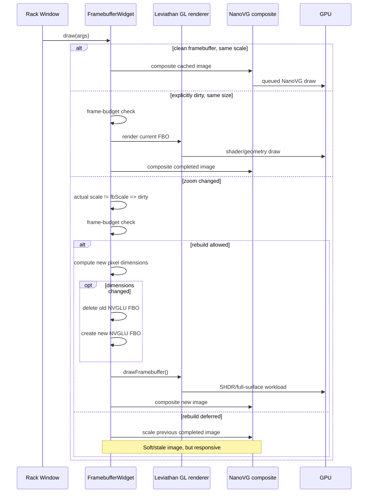

# Zoom-Stable OpenGL/SHDR Rendering in VCV Rack 2

Dragon King Leviathan, the evidence points to a fairly sharp architectural conclusion: **the original zoom stalls are most plausibly caused by Rack’s framebuffer scale lifecycle repeatedly forcing expensive GL surfaces to redraw—and frequently to be destroyed/recreated—through intermediate zoom values, with Wyrm’s zoom-coupled geometry/shader specialization adding a second synchronous stall mechanism.** The successful fixed-density experiment is therefore attacking the right variable. The dangerous part is not the idea of a fixed-resolution surface; it is **where Experiment C currently invokes `FramebufferWidget::render()`**.

The supplied research brief was analyzed as the authoritative description of the experiments and observations. No separate Google Docs URL was present in the actual request payload, so the uploaded research document is the design-context source used here. fileciteturn0file0

A source-access limitation matters: I was able to inspect the current public Rack `v2` implementation, official Rack API documentation, NanoVG documentation, Khronos specifications, and current profiling documentation, but the browser/indexer would not retrieve the supplied `zoom_and_shaders` branch files themselves. Consequently, **Rack-side conclusions below are source-verified; Leviathan-specific function behavior comes from the supplied research brief unless explicitly marked otherwise; exact Git diff line counts are not fabricated.** This is the principal remaining confidence gap.

## Executive conclusion

### Verdict

My recommended end state is:

**Keep Experiment A. Keep Experiment B. Replace Experiment C with a context-owned, fixed-resolution Leviathan render surface that is refreshed outside Rack’s zoom-coupled `FramebufferWidget` lifecycle and composited as an ordinary NanoVG image. Add a transition policy that freezes that completed surface during an active zoom gesture and permits at most one quality rebuild after zoom settles.**

The confidence levels are:

| Finding | Confidence | Why |
|---|---:|---|
| Rack automatically dirties `FramebufferWidget` when its world scale changes | **Very high** | Direct Rack source |
| Accepted zoom redraws can recreate the backing FBO whenever rounded dimensions change | **Very high** | Direct Rack source |
| Rack can display the previous framebuffer scaled while a dirty render is deferred | **Very high** | Direct Rack source |
| Experiment A is explicitly supported by the `OpenGlWidget` API | **Very high** | Official Rack API documentation |
| Removing absolute zoom from Wyrm authored geometry is structurally correct | **High** | Rendering architecture + supplied Wyrm behavior |
| Wyrm shader recompilation can magnify zoom stalls if radius changes | **High**, Leviathan-side behavior document-derived | Supplied research brief |
| Experiment C can immediately fight `FramebufferWidget::draw()` by setting `fbScale` to a value different from the actual world scale | **Very high** | Direct consequence of Rack source |
| Experiment C can bypass Rack’s `args.fb` nested-framebuffer guard if invoked before the base `draw()` | **Very high** | Direct consequence of Rack source |
| Experiment C caused the unrelated-module initialization symptom | **Unproven** | Needs controlled A/B evidence |
| FBO allocation versus shader compilation versus GPU fill is the dominant numerical cost on the affected Windows machine | **Unknown until instrumented** | Driver/GPU dependent |
| Rack Pro DAW editor close/reopen follows precisely the public standalone Window lifecycle | **Unverified** | Pro host integration is not publicly source-verifiable |

Rack’s current `FramebufferWidget::draw()` obtains the current NanoVG transform, extracts its scale, and calls `setDirty()` whenever that scale differs from the scale stored at the last framebuffer render. Dirty widgets are then conditionally re-rendered according to Rack’s framebuffer scheduling budget. citeturn21view1 A render computes new framebuffer dimensions from the scaled widget bounds and Rack pixel ratio; if those integer dimensions differ from the existing allocation, Rack deletes the previous NVGLU framebuffer and creates a new one. citeturn22view0turn22view1

That mechanism is enough to explain why ordinary NanoVG overlays remain alive while expensive SHDR content appears frozen: the overlay and GL surface are different layers with radically different rebuild costs. This exact layer-separation symptom is documented for Wyrm and Bifurx in the supplied research brief. fileciteturn0file0

The most important new source-level finding concerns Experiment C. Your current sequence is conceptually:

```cpp
if (dirty) {
    float fixedScale = logicalDensity / getAbsoluteZoom();
    render(Vec(fixedScale, fixedScale));
}
widget::FramebufferWidget::draw(args);
```

But `render(fixedScale)` stores `fixedScale` into `internal->fbScale`. The immediately following `FramebufferWidget::draw(args)` extracts the **actual** current transform scale and, if it differs, calls `setDirty()` again. citeturn22view0turn21view1 In other words, the manual fixed-scale render and Rack’s normal framebuffer lifecycle are not actually agreeing on what scale owns the cache.

That can produce a loop resembling:

```text
manual fixed-scale render
        ↓
dirty = false; fbScale = fixedScale
        ↓
base draw observes actualScale != fbScale
        ↓
dirty = true again
        ↓
Rack may render(actualScale) now
   OR defer and temporarily scale fixed image
        ↓
next frame repeats
```

This makes the responsiveness improvement especially interesting: **part of the improvement may be coming from Rack scaling the previously completed fixed-resolution image when its own dirty rebuild is deferred**, rather than from a clean fixed-resolution contract. Rack explicitly computes a `scaleRatio = currentScale / fbScale` and composites the existing framebuffer image at that ratio. citeturn21view1turn22view0 That behavior is useful—but Experiment C is currently obtaining it by fighting Rack’s internal scale state rather than by owning the policy deliberately.

### Recommended rendering architecture



The architectural invariant should become:

> **Rack zoom changes where and how large the completed image is composited, not the resolution, geometry topology, shader variant, or texture allocation of the image being composited.**

That invariant removes several coupled failure modes at once.

## Verified Rack lifecycle and rendering architecture

### What `FramebufferWidget` actually does

The current public Rack `v2` implementation stores an `NVGLUframebuffer*`, its pixel dimensions, framebuffer world-space box, last framebuffer scale, subpixel offset, and valid clipping box in `FramebufferWidget::Internal`. `getFramebufferSize()` simply returns the stored pixel dimensions. `deleteFramebuffer()` invokes `nvgluDeleteFramebuffer()` and clears Rack’s framebuffer pointer. citeturn21view0

`FramebufferWidget::step()` itself does nothing graphics-specific beyond calling `Widget::step()`. This is important because it means cached widgets do **not** require a special framebuffer maintenance operation in `step()`. citeturn21view0

`FramebufferWidget::draw()` is where the scale lifecycle resides. It first has an essential protection:

```cpp
// Conceptual form of Rack source
if (bypassed || args.fb) {
    Widget::draw(args);
    return;
}
```

Thus, when a `FramebufferWidget` is already being rendered inside another framebuffer, Rack intentionally does **not** start another cache render. citeturn21view0

For a normal top-level draw it obtains the current NanoVG transform, extracts the X/Y scale, integer and fractional translation, and compares those values against the cached render state. A sufficiently changed fractional offset can dirty the framebuffer; more importantly here, **any non-equal scale dirties it**. A changed viewport/clip region can dirty it as well. citeturn21view1

Once dirty, Rack increments a per-frame framebuffer counter and considers remaining frame time. The present source guarantees one early framebuffer an opportunity to redraw while later expensive framebuffers can be deferred when the frame is already late. citeturn21view1turn24view2

This scheduling detail is potentially relevant to the “some modules remain visually uninitialized” observation. A large collection of expensive dirty framebuffers can compete for refresh opportunities. That does **not** establish that Leviathan is causing unrelated modules to fail; it merely creates a plausible Rack-level starvation/fairness branch that should be measured. The supplied research brief correctly treats the cross-plugin symptom as causally unresolved. fileciteturn0file0

### How Rack decides framebuffer size

Inside `render(scale, offsetF, clipBox)`, Rack first stores the caller-supplied scale as `internal->fbScale`. It computes a local content box, clips it, transforms that box using the framebuffer scale and fractional offset, rounds it outward to integer world coordinates, then independently obtains a floored Rack window pixel ratio. The persistent framebuffer size is:

```text
worldBounds =
    outwardRound(localBounds × renderScale + fractionalOffset)

framebufferPixels =
    ceil(worldBounds.size × floor(window.pixelRatio))
```

The implementation then compares this result against `internal->fbSize`. Any change causes the old framebuffer to be deleted and a fresh `nvgluCreateFramebuffer()` allocation attempted. citeturn22view0turn22view1

There are several distinct scale concepts here:

| Scale contributor | Role |
|---|---|
| Widget logical size | Establishes the local area to rasterize |
| Parent/Rack zoom transforms | Present in the current NanoVG world transform used by normal `draw()` |
| Caller-provided `render(scale)` | Directly becomes Rack’s cached `fbScale`; manual callers can substitute another scale |
| Window `pixelRatio` | Used by the root NanoVG frame and also explicitly in framebuffer allocation |
| `oversample` | Does **not** enlarge the persistent framebuffer; it creates a temporary higher-resolution framebuffer during each oversampled render |
| Fractional translation | May independently dirty the cache when subpixel movement exceeds Rack’s threshold |

Rack’s main Window begins its NanoVG frame with the current pixel ratio and explicitly applies a root NanoVG scale before drawing the scene. A pixel-ratio change also triggers a global dirty event. citeturn24view3turn24view4 The framebuffer code separately multiplies its computed framebuffer box by the floored Rack pixel ratio when allocating its backing surface. citeturn22view0

This means the safest way to reason about actual physical dimensions is not to infer them from `getAbsoluteZoom()`: **log both the transform scale Rack supplies to `FramebufferWidget::draw()` and the resulting `getFramebufferSize()`**.

### Oversampling deserves special attention

With `oversample == 1`, Rack binds the persistent framebuffer, invokes `drawFramebuffer()`, then binds `NULL`. citeturn22view1

With `oversample != 1`, Rack allocates a **temporary oversampled NVGLU framebuffer for that render**, renders into it, downscales it into the persistent framebuffer using NanoVG, then deletes the temporary framebuffer. citeturn22view1turn22view2

Therefore, for these expensive SHDR surfaces, Rack’s built-in `oversample` is not a good substitute for a persistent fixed logical density. It adds transient allocations precisely on a path where allocation churn is already under suspicion.

### Does Rack keep and scale the old image?

Yes—with an important qualification.

If the widget is dirty but Rack decides not to re-render it because the frame is already overloaded, the existing framebuffer remains available. `FramebufferWidget::draw()` resets the current NanoVG transform and composites that image using:

```cpp
scaleRatio = currentScale / framebufferScale;
```

so the old image is stretched/shrunk to the current world transform. citeturn21view1turn22view0

This is essentially the behavior you want during a zoom gesture: **reuse a completed raster, accept temporary softness, remain responsive**.

However, once `render()` actually begins and the new dimensions differ, Rack deletes the previous framebuffer before creating the replacement. citeturn22view0 Thus Rack does not maintain an explicit old/new double-buffer pair across reconstruction.

### Normal, dirty, and zoom-transition sequence



### Context creation and destruction

Rack creates its NanoVG GL context and shared framebuffer NanoVG context, then recursively emits `ContextCreateEvent` through the scene. During Window destruction it emits `ContextDestroyEvent` **before** deleting cached images/fonts, NanoVG contexts, and the GLFW window. citeturn24view0turn24view1

`FramebufferWidget::onContextCreate()` marks itself dirty. `onContextDestroy()` deletes its NVGLU framebuffer and marks itself dirty for the eventual replacement context. citeturn22view2

That strongly supports the existing Leviathan rule that GL programs, textures, FBOs, and NanoVG image handles are context-owned and must be invalidated by context generation.

One caveat is important for Rack Pro: the public source verifies the standalone Rack Window lifecycle. The exact host-facing Rack Pro editor reopen/window embedding machinery is not publicly established by these sources. Therefore **“DAW editor close/reopen always produces the exact same callback/context sequence” remains a live Pro validation requirement**, even though the plugin should design as though replacement can occur.

### Is `render()` public and intended for callers?

Yes. `FramebufferWidget::render()` is part of the public API; the documentation describes it as re-rendering/re-creating the framebuffer as needed and handling oversampling. `setDirty()` is likewise the documented mechanism for requesting another render. citeturn21view4

But there is a critical distinction:

> **Public callable does not imply “safe to call re-entrantly from this same widget’s `draw()` before delegating to the base implementation.”**

Rack’s ordinary lifecycle chooses `render()` from inside `FramebufferWidget::draw()` *after* its `args.fb` nesting guard and *using the exact world scale that the base class has just extracted*. citeturn21view0turn21view1 Your Experiment C changes both of those properties.

### What graphics state is guaranteed?

Rack’s `render()` binds its own framebuffer and later calls `nvgluBindFramebuffer(NULL)`; the implementation does not visibly save an arbitrary previous framebuffer binding before doing so. citeturn22view1 Its generic NanoVG `drawFramebuffer()` saves/restores NanoVG state and resets the framebuffer NanoVG context after ending the offscreen frame. citeturn22view2

NanoVG itself documents that its OpenGL backend touches a broad collection of GL state, including program selection, blending, culling, depth/scissor enablement, color/stencil state, active texture, buffer/VAO bindings, texture binding, and pixel-store state during texture updates. NanoVG buffers rendering and flushes it at `nvgEndFrame()`. citeturn20search0

Rack’s `OpenGlWidget` API consequently tells implementations to override `drawFramebuffer()` to **initialize, draw, and flush the OpenGL state**. citeturn23search2

The practical rule should therefore be:

> A Leviathan raw-GL renderer must not assume Rack/NanoVG preserves arbitrary GL state for it, and it must not assume its own GL mutations are harmless to the caller unless it explicitly restores the state contract needed at that boundary.

## Leviathan experiment assessment and source map

### Experiment A: explicit Bifurx dirty caching

**Verdict: keep. High confidence.**

The official `OpenGlWidget` documentation says that its default `step()` draws every frame and explicitly instructs subclasses to override it and call `FramebufferWidget::step()` to restore ordinary cached-framebuffer behavior. citeturn23search2

Therefore replacing:

```cpp
OpenGlWidget::step();
```

with conceptually:

```cpp
FramebufferWidget::step();
```

does **not** bypass a hidden framebuffer lifecycle operation. Scale invalidation is performed in `FramebufferWidget::draw()`, and context invalidation is performed by context event callbacks rather than by `OpenGlWidget::step()`. citeturn21view1turn22view2

The sole correctness condition is that Bifurx explicitly invalidates for every dependency that changes its rendered GL image. The research brief lists `previewUpdated`, `analysisUpdated`, animation, and configuration changes as the intended causes. fileciteturn0file0

Add a dirty-reason bitmask and audit this instead of returning to unconditional redraw.

### Experiment B: remove Wyrm geometry dependence on absolute zoom

**Verdict: keep, then strengthen. High architectural confidence.**

The research brief states that `wyrm_render::glBodySampleCount()` formerly multiplied its sample budget by absolute zoom, up to a cap, and that the changed sample count could influence `requiredBodySegmentRadius()`, which in turn could cause `ensureBodyShader(segmentRadius)` to delete and synchronously compile/link another shader. fileciteturn0file0

That dependency creates the chain:

```text
Rack zoom
  → sample count
  → generated geometry / texture length
  → segment radius
  → shader variant
  → compile/link
```

None of those semantic changes are intrinsically required merely because a previously rendered curve occupies more screen pixels.

Separating **authored geometry quality** from **view transform/raster density** is therefore the correct abstraction. A quality density can still be selected deliberately, but absolute Rack zoom should not be allowed to trigger topology or shader-program changes continuously.

The improvement should be extended by eliminating compilation from any zoom-adjacent critical path.

### Experiment C: call `render(fixedScale)` from `draw()`

**Verdict: revise immediately; preserve the fixed-resolution objective, not the placement.**

There are three distinct problems.

First, as shown above, `render(fixedScale)` stores the synthetic scale; the following base `draw()` compares it against the actual world transform and can immediately dirty the widget again. citeturn22view0turn21view1

Second, the current call site can bypass Rack’s normal nested-framebuffer protection. The base `FramebufferWidget::draw()` checks `args.fb` **before** rendering and directly draws children when already inside an offscreen framebuffer. citeturn21view0 A derived `draw()` that invokes `render()` before making that base call has already performed the offscreen render before Rack gets a chance to apply its guard.

This matters for any path that draws modules into another framebuffer—for example host screenshots, previews, future UI wrappers, or other Rack-managed offscreen rendering. Because Rack’s own `render()` path concludes by binding `NULL` rather than restoring a captured arbitrary previous framebuffer binding, manually invoking it while an enclosing FBO is active is an unsafe composition pattern. citeturn22view1

Third, a manual `render()` inside the middle of an already active NanoVG scene increases state-management complexity. NanoVG intentionally buffers its frame until `nvgEndFrame()` and its backend touches substantial GL state. citeturn20search0 Rack’s normal `FramebufferWidget` implementation has a tightly controlled ordering for this; custom re-entrancy should not be assumed equivalent.

The fixed-density results are nevertheless extremely valuable evidence. They indicate that **decoupling surface resolution from zoom attacks a dominant cost center**. fileciteturn0file0 The experiment should therefore graduate into a proper fixed-surface architecture rather than be discarded.

### Experimental branch source map

The requested branch is [PlasmaChroma/Leviathan-Rack2 `zoom_and_shaders`](https://github.com/PlasmaChroma/Leviathan-Rack2/tree/zoom_and_shaders/src). The web retriever did not expose its source blobs, so the following table separates what is explicit in the supplied research document from what remains branch-diff verification work. I am deliberately not inventing `+N/-N` statistics.

| File | Purpose / integration point | Key functions/classes identified from research | Experimental relevance | Exact branch line delta |
|---|---|---|---|---|
| `src/WyrmRendererGL.cpp` | Wyrm GL/SHDR renderer, program/resource management | `ensureBodyShader(segmentRadius)` | Shader specialization; compilation/link stall candidate; body rendering | **Not retrievable in this session** |
| `src/WyrmRenderGeometry.hpp` | Wyrm authored GL geometry budgets | `glBodySampleCount()`, `requiredBodySegmentRadius()` | Experiment B removes absolute-zoom dependency | **Not retrievable** |
| `src/WyrmWaveEditor.cpp` | Wyrm display widget/editor rendering integration | GL editor/framebuffer integration; dirty/zoom policy | Experiment B dirty policy and Experiment C fixed density likely integrate here | **Not retrievable** |
| `src/WyrmWidget.cpp` | Wyrm module/editor UI state | compact/expanded editor coordination | Density/configuration invalidation and expanded-mode behavior | **Not retrievable** |
| `src/BifurxGL.cpp` | Bifurx spectrum GL/SHDR implementation | `OpenGlWidget`/framebuffer rendering path | Experiment A caching; Experiment C density; spectrum rendering | **Not retrievable** |
| `src/BifurxUI.cpp` | Bifurx visual UI and NanoVG overlay integration | response/spectrum UI coordination | Demonstrates GL-versus-NanoVG layer separation | **Not retrievable** |
| `src/GlLifecycleUtils.cpp/.hpp` | Shared GL-context resource lifetime helpers | context-safe resource invalidation/cleanup | Candidate home for generation-aware GL surface/program ownership | **Not retrievable** |
| `src/NvgGraphicsLifecycle.cpp/.hpp` | NanoVG context-bound resource lifetime | NanoVG handle invalidation/recreation | Relevant to fixed-FBO image compositing | **Not retrievable** |

The direct source paths to audit during implementation are:

- [`WyrmRendererGL.cpp`](https://github.com/PlasmaChroma/Leviathan-Rack2/blob/zoom_and_shaders/src/WyrmRendererGL.cpp)
- [`WyrmRenderGeometry.hpp`](https://github.com/PlasmaChroma/Leviathan-Rack2/blob/zoom_and_shaders/src/WyrmRenderGeometry.hpp)
- [`WyrmWaveEditor.cpp`](https://github.com/PlasmaChroma/Leviathan-Rack2/blob/zoom_and_shaders/src/WyrmWaveEditor.cpp)
- [`WyrmWidget.cpp`](https://github.com/PlasmaChroma/Leviathan-Rack2/blob/zoom_and_shaders/src/WyrmWidget.cpp)
- [`BifurxGL.cpp`](https://github.com/PlasmaChroma/Leviathan-Rack2/blob/zoom_and_shaders/src/BifurxGL.cpp)
- [`BifurxUI.cpp`](https://github.com/PlasmaChroma/Leviathan-Rack2/blob/zoom_and_shaders/src/BifurxUI.cpp)

Until those blobs are independently available, details such as the actual `segmentRadius` range, exact Bifurx shader-program lifecycle, and branch line counts should remain explicitly unresolved rather than inferred.

## Root causes, bottlenecks, and cross-plugin fault tree

### Ranked zoom-stall hypotheses

| Rank | Hypothesis | Confidence | Why it fits | Falsification / measurement |
|---:|---|---|---|---|
| **1** | Repeated full framebuffer redraws and frequent reallocations during animated zoom | **Very high** | Rack dirties on any scale difference and reallocates whenever rounded dimensions change | Count `render()` calls, requested dimensions, allocation count/time during one deterministic zoom gesture |
| **2** | Full-surface SHDR fragment cost growing with framebuffer pixel area | **High** | SHDR layer stalls while lightweight NanoVG overlays remain live | GPU timer around GL surface render; correlate with width × height |
| **3** | Wyrm synchronous radius-specialized shader compilation/linking | **High for Wyrm when radius changes** | Explicitly documented `ensureBodyShader(segmentRadius)` behavior | Log variant key, compile ms, link ms and first-use draw ms |
| **4** | Wyrm geometry reconstruction / float-texture upload | **Medium-high** | Former sample count changed with zoom | Time geometry CPU phase and texture upload separately |
| **5** | Driver synchronization/resource-management cost during FBO replacement | **Medium-high** | Repeated texture/FBO allocation can expose driver cost; Windows driver dependent | CPU timers + GPU trace; diagnostic `glFinish()` only in special A/B build |
| **6** | Experiment C scale feedback / double rendering | **High for current experimental implementation** | Manual synthetic `fbScale` differs from the actual base-draw scale | Log `manualRender`, subsequent base dirty state and render count in same frame |
| **7** | Bifurx texture/VBO/spectrum update overhead | **Medium** | Could matter under active analysis but is not inherently zoom-dependent | Separate FFT/data preparation from upload/render measurements |
| **8** | NanoVG framebuffer compositing | **Low-medium** | Happens every frame but normally amounts to cached image composition | Measure total frame with GL surface kept frozen |
| **9** | GPU memory pressure | **Conditional** | Many large per-module surfaces can amplify allocation stalls/failures | Log aggregate FBO bytes/pixels and monitor VRAM usage |
| **10** | GL state/FBO errors | **Low for original long stall; higher for initialization anomaly** | Would better explain missing/invalid content than smooth cost scaling | `glCheckFramebufferStatus()` and bounded `glGetError()` in debug build |

Rack source directly establishes hypotheses one and six: zoom scale changes set `dirty`; accepted renders calculate dimensions from that scale; dimensions changes delete and recreate the framebuffer. citeturn21view1turn22view0 The SHDR-specific weighting is supported by the observed separation between frozen GL output and continuously updating NanoVG overlays in the supplied experiments. fileciteturn0file0

### Why physical density explodes quickly

For a fixed logical surface, fragment workload approximately follows pixel area. Ignoring shader-specific nonlinearities:

| Linear raster density | Relative pixel count | 60 Hz budget if it consumed entire frame |
|---:|---:|---:|
| `1.0×` | `1.00×` | 16.67 ms |
| `1.5×` | `2.25×` | 16.67 ms |
| `2.0×` | `4.00×` | 16.67 ms |
| `2.5×` | `6.25×` | 16.67 ms |
| `3.0×` | `9.00×` | 16.67 ms |
| `4.0×` | `16.00×` | 16.67 ms |

This is why the compact-editor shift from 1.5× to 2× is visually understandable but not free: it increases the fixed surface pixel count by about **78%** (`4 / 2.25`) even before considering fragment-loop complexity.

The optimal density should therefore be selected by an image-quality/performance sweep, not by a blanket “higher is better” rule.

### Fault tree for unrelated modules remaining uninitialized

```mermaid
flowchart TD
    S["Other module visually uninitialized<br/>until zoom/update"] --> R["Rack scheduling / invalidation"]
    S --> C["Context lifecycle / initialization"]
    S --> L["Leviathan shared-state leakage"]
    S --> M["Memory / driver"]
    S --> U["Unrelated pre-existing behavior"]

    R --> R1["Dirty framebuffer refresh deferred<br/>by frame-time scheduler"]
    R --> R2["Missing initial DirtyEvent / first-frame ordering"]

    C --> C1["ContextCreate ordering"]
    C --> C2["Stale context-owned image / GL handle"]
    C --> C3["DAW editor reopen path differs"]

    L --> L1["Experiment C nested render bypasses args.fb guard"]
    L --> L2["Wrong framebuffer binding restored"]
    L --> L3["Viewport/scissor/program/texture state leaked"]
    L --> L4["NanoVG frame/state re-entrancy"]

    M --> M1["Large transient/persistent FBO pressure"]
    M --> M2["Driver allocation stall/failure"]
    M --> M3["Incomplete framebuffer"]

    U --> U1["Rack version behavior"]
    U --> U2["Third-party module bug"]
    U --> U3["Launch/plugin ordering coincidence"]
```



Rack’s dirty-framebuffer scheduler is real: it increments a framebuffer count and can defer later framebuffer rebuilds if frame time is exhausted. citeturn21view1turn24view2 That creates a credible starvation branch but does not prove indefinite starvation, because Rack explicitly allows early framebuffers to render to avoid never-rendering caches. citeturn21view1

Experiment C introduces a separate concrete state-risk because normal Rack code explicitly avoids nested cached framebuffer rendering when `args.fb` is non-null, while a derived override invoking `render()` first can bypass that check. citeturn21view0

### Highest-value causality experiments

The first test should require **no source modifications**.

Use the same Rack binary, graphics driver, patch, initial zoom, window size, monitor, launch method, and startup sequence, alternating only between:

```text
Build A: Experiment C enabled
Build B: Experiment C disabled
```

Run at least 20 cold patch loads per build, randomizing A/B order. Record whether the sentinel third-party framebuffer/OpenGL module reaches a valid first frame, and how many milliseconds it takes.

Then perform:

```text
C enabled + Leviathan GL modules present
C enabled + plugin installed but no Leviathan GL instances
C disabled + same Leviathan modules
Leviathan plugin removed
```

This separates **render-instance effects** from plugin-global/static lifecycle effects.

A particularly strong result would be:

```text
failure only occurs
when C is enabled
AND a Leviathan GL widget is actually drawn
```

That would place the cause squarely in the rendering path rather than plugin loading.

Conversely, if the symptom reproduces with Leviathan removed, Experiment C is exonerated for that occurrence.

For the instrumented pass, capture before/after Leviathan rendering:

```cpp
GLint fbo = 0;
GLint viewport[4] = {};
GLboolean scissor = glIsEnabled(GL_SCISSOR_TEST);

glGetIntegerv(GL_FRAMEBUFFER_BINDING_EXT, &fbo);
glGetIntegerv(GL_VIEWPORT, viewport);
```

Use whichever FBO binding enumerants/extensions the runtime actually exposes; this is an instrumentation concept, not a blindly portable literal for every GL 2.1 driver.

The decisive state-leak signature is not “an error happened.” It is:

```text
expected enclosing FBO = X
before Leviathan call = X
after Leviathan call  = 0 or Y
```

followed by unrelated rendering being directed at the wrong target.

## Architecture alternatives and recommended design

### Comparative design table

| Architecture | Zoom behavior | Ownership | Context safety | Quality | Performance | Unrelated-module risk | Complexity | Recommendation |
|---|---|---|---|---|---|---|---|---|
| Stock Rack `FramebufferWidget` with ordinary caching | Re-renders/resizes as scale changes | Rack NVGLU FBO | Excellent | Sharp | Poor for expensive zoom-sensitive SHDR | Low | Low | Baseline only |
| Manual `render(fixedScale)` inside `draw()` | Attempts fixed density, but base draw disagrees | Rack NVGLU FBO | Questionable | Good after density tuning | Observationally good but lifecycle unstable | **Elevated** | Low | **Retire Experiment C placement** |
| Rack framebuffer + transition suppression | Ideally scale old raster during gesture | Rack | Good in theory | Temporarily soft | Good | Low | Medium | Public API lacks a clean switch to disable scale-dirty behavior |
| **Leviathan-owned fixed NVGLU/GL surface + NanoVG composite** | **Zoom only scales final image** | **Leviathan** | **Good with generation tracking** | Tunable | **Best deterministic behavior** | **Low if update occurs at safe boundary** | Medium-high | **Recommended** |
| Double-buffered fixed surface + settle rebuild | Old completed image always remains valid | Leviathan | Good | Excellent transition behavior | Excellent | Low | High | Recommended enhancement |
| Coarse density tiers | Occasional controlled rebuild at thresholds | Leviathan | Good | Sharper across large zoom range | Very good | Low | High | Optional later optimization |

### Rack-native fixed-resolution option

A purely Rack-native solution is attractive, but the public `FramebufferWidget` interface has a structural limitation: its normal `draw()` decides that a framebuffer rendered at a scale different from the current world scale is dirty. citeturn21view1 There is no documented `dirtyOnScaleChange = false` equivalent among the public framebuffer attributes; the exposed controls include `dirty`, `bypassed`, `oversample`, `dirtyOnSubpixelChange`, and viewport margin. citeturn22view4

Therefore a clean “Rack-owned framebuffer whose scale is permanently logicalDensity regardless of Rack zoom” cannot be achieved simply by changing `step()` or `setDirty()`.

The Rack-native transition strategy can still be used as a **control experiment**: minimize explicit dirtying while zoom moves and observe how often Rack’s own scale-driven invalidation still invokes renders. But it cannot guarantee zero zoom rebuilds without either duplicating part of `FramebufferWidget::draw()` behavior or changing Rack itself.

That makes it inferior as the production architecture.

### Leviathan-owned fixed-resolution surface

This is the strongest design.

Each Wyrm/Bifurx GL display owns a surface specification:

```cpp
struct FixedSurfaceSpec {
    int widthPx;
    int heightPx;
    float logicalDensity;
    uint64_t contextGeneration;
};
```

For example:

```text
Wyrm compact  → logical dimensions × 2.0
Wyrm expanded → logical dimensions × tuned density
Bifurx        → logical dimensions × 2.0
```

Rack zoom does not appear in those dimensions.

The renderer then maintains context-owned resources:

```text
surface FBO
surface color texture / NanoVG image
optional depth/stencil attachment
shader programs
VBOs / auxiliary textures
context-generation token
```

On `ContextDestroyEvent`, invalidate handles while the correct context is still available. On the next `ContextCreateEvent`, increment the generation and mark the whole render state logically uninitialized. Rack’s public Window source emits destruction before destroying NanoVG/GL resources and creation after creating the GL/NanoVG contexts. citeturn24view0turn24view1

The crucial scheduling recommendation is to update the owned fixed surface **during widget `step()` or another verified pre-NanoVG-frame phase**, not by recursively invoking Rack framebuffer rendering from the widget’s main `draw()`.

In current public Rack `Window::step()`, Rack explicitly makes its OpenGL context current, steps the scene, and only afterward begins the main NanoVG frame and calls `scene->draw()`. citeturn24view2turn24view3 This gives a promising clean update window in standalone Rack.

Because Rack Pro’s hosted editor implementation is not public here, instrument `wglGetCurrentContext()`/context generation in the DAW build before relying on this as a universal host contract.

Recommended lifecycle pseudocode:

```cpp
void FixedGlSurface::onContextCreate() {
    contextGeneration = globalGlGeneration();
    invalidateHandlesWithoutDeletingForeignContextObjects();

    surfaceValid = false;
    shadersValid = false;
    dirtyMask |= DIRTY_CONTEXT;
}

void FixedGlSurface::onContextDestroy() {
    // Called while the owning context should still exist in public Rack.
    // Verify generation/current context before every deletion.
    destroyOwnedObjectsIfCurrentContextMatches();

    resetHandlesToZero();
    surfaceValid = false;
    shadersValid = false;
}

void FixedGlSurface::step() {
    FramebufferIndependentWidgetBase::step();

    if (!isCurrentContextOwnedByThisGeneration())
        return;

    updateZoomGestureState();

    // During continuous zoom, preserve last completed surface.
    if (zoomGestureActive && surfaceValid)
        return;

    if (!surfaceValid || dirtyMask != 0) {
        ensureSurfaceAtFixedPixelDimensions();
        ensureShaderProgramsForCurrentContext();

        SavedGlState state;
        captureRequiredBoundaryState(state);

        bindOwnedFbo();
        setExplicitViewport();
        setExplicitScissorAndBlendState();

        renderLeviathanContent();

        validateFramebufferInDebugBuild();
        restoreRequiredBoundaryState(state);

        surfaceValid = true;
        completedDirtyMask = dirtyMask;
        dirtyMask = 0;
    }
}

void FixedGlSurface::draw(const DrawArgs& args) {
    // No raw GL and no recursive Rack framebuffer render here.
    if (!surfaceValid)
        return;

    drawSurfaceAsNanoVGImage(
        args.vg,
        logicalDestinationBox,
        surfaceImageHandle
    );
}
```

The ideal compositing mechanism is an NVGLU/NanoVG image whose texture belongs to the same context. NanoVG’s GL backend supports GL-backed image handling, and Rack itself uses NVGLU framebuffer images as NanoVG image sources for cached framebuffer composition. citeturn22view0turn20search0

Do not free that image/FBO from an arbitrary C++ destructor if the owning GL/NanoVG context might already be gone. Keep the cleanup operation tied to Leviathan’s existing context lifecycle helpers.

### Transition-aware double buffering

For additional resilience, maintain:

```text
frontSurface = last fully completed image
backSurface  = next render target
```

During zoom:

```text
frontSurface stays immutable
Rack/NanoVG scales frontSurface
no allocation
no shader compile
no geometry rebuild due only to zoom
```

After zoom has been stable for, for example, 100–150 ms:

```text
optional quality/tier decision
render into backSurface
swap front/back only after success
```

The settle interval is a policy parameter, not a Rack requirement.

This solves an important failure characteristic of Rack’s stock framebuffer lifecycle: Rack deletes the old surface before allocating a changed-size replacement. citeturn22view0 With explicit front/back ownership, a failed allocation or incomplete frame never destroys the last known-good image.

### Coarse density tiers

After the fixed design is stable, consider three quality tiers rather than a continuum:

```text
low    1.5×
normal 2.0×
high   2.5×
```

A tier changes only after zoom has settled and only if the current image’s screen-space sampling ratio crosses a deliberately wide hysteresis boundary.

For example:

```text
remain at 2× while effective display demand is 1.5×–2.7×
switch to 2.5× only after sustained >2.7× demand
switch back only below 2.2×
```

This avoids ping-pong around thresholds.

The key invariant remains: **continuous zoom does not continuously resize the surface.**

## Shader strategy and staged implementation

### Wyrm body shader

The present research description says the body shader is specialized by `segmentRadius`, and `ensureBodyShader(segmentRadius)` can delete and compile/link a program synchronously when the radius changes. fileciteturn0file0

The exact radius set could not be independently recovered from the inaccessible branch, so the first instrumentation change should record every requested radius:

```cpp
struct ShaderVariantStats {
    uint64_t requestCount[MaxInstrumentedRadius + 1] = {};
    double compileMs[MaxInstrumentedRadius + 1] = {};
    double linkMs[MaxInstrumentedRadius + 1] = {};
    double firstDrawGpuMs[MaxInstrumentedRadius + 1] = {};
};
```

Collect real patches before deciding between one bounded shader and a variant cache.

Three strategies are worth testing.

**Small context-local variant cache** is my default recommendation if the empirical radius set is small. Programs are keyed by radius and generation:

```cpp
struct BodyProgramKey {
    uint32_t contextGeneration;
    uint8_t segmentRadius;
};
```

Compile the most common variant first. Prewarm remaining known variants incrementally rather than compiling a cluster in the first visible frame.

**One bounded shader** is attractive if the maximum radius is small. With GLSL 1.20, structure the shader around a compile-time upper bound and use a uniform radius to mask work:

```glsl
#define MAX_RADIUS 8

uniform int uRadius;

for (int i = -MAX_RADIUS; i <= MAX_RADIUS; ++i) {
    if (abs(i) <= uRadius) {
        // accumulate relevant segment contribution
    }
}
```

The Khronos registry preserves the GLSL 1.20 and OpenGL 2.1 specifications, which should remain the compatibility baseline for a GL2-oriented Rack path. citeturn27search0

This trades compilation stalls for potentially more fragment instructions. It wins when radius is small and shader pixels are not overwhelmingly expensive; it loses if every fragment ends up executing a large maximum-radius loop.

**Precompile every variant on context creation** should be used only if measured compilation cost and variant count are both small. Doing 10–20 driver compilations synchronously at editor creation merely moves the freeze from zoom to patch load.

A better strategy is:

```text
context created
  ↓
compile only minimum critical/common program
  ↓
obtain first valid frame
  ↓
one idle/prewarm variant per frame
  ↓
all expected variants cached before user zoom interaction
```

Measure **compile**, **link**, and **first draw** separately. Drivers may defer some work until first use; timing only `glCompileShader()` can therefore understate the visible stall.

### Geometry and texture uploads

Experiment B should make Wyrm’s curve/texture dimensions stable with respect to zoom. Once dimensions are stable, prefer updating existing storage instead of redefining it every visual frame:

```cpp
// Allocate when dimensions actually change
glTexImage2D(...);

// Ordinary data refresh
glTexSubImage2D(...);
```

Likewise, VBO storage should not be recreated merely because new sample values arrive when the byte size is unchanged.

For a continuously animated surface such as slither, keep CPU preparation and GPU submission independently measurable:

```text
geometryPrepareUs
textureUploadUs
vboUploadUs
drawSubmitUs
gpuElapsedUs
```

A slow `drawSubmitUs` accompanied by small eventual GPU time points toward synchronization/driver resource management; a small CPU submit with a large asynchronous GPU elapsed time points toward fragment/vertex workload.

### Shader pixel-cost optimizations

After the lifecycle problem is fixed, prioritize these optimizations in order:

| Optimization | Benefit | Risk |
|---|---|---|
| Remove all zoom-dependent shader recompilation | Eliminates catastrophic latency spikes | Very low |
| Fix render surface dimensions | Bounds fragment workload | Very low |
| Cache shader variants per context | Removes repeat compile/link | Low |
| Reuse texture/VBO storage | Reduces allocation/driver churn | Low |
| Reduce fragment-loop search radius where visually indistinguishable | Direct pixel-cost reduction | Medium |
| Cull/clip geometry before rasterization | Reduces overdraw | Low-medium |
| Single bounded-radius shader | Eliminates program variants | Must benchmark max-loop cost |
| Precomputed distance/coverage texture | Can replace repeated analytical loops | More memory/upload complexity |
| Separate low/high quality shader tiers | Better zoom/animation responsiveness | More program management |

At 2× linear density, every additional expensive fragment operation potentially runs over roughly four times the pixels of a 1× surface. Therefore the order of operations matters: **first bound the surface area, then optimize shader arithmetic.**

### Bifurx

The research brief provides no evidence of Bifurx compiling shaders as a function of Rack zoom; its documented experiments concern framebuffer caching and fixed render density. fileciteturn0file0 Until `BifurxGL.cpp` can be independently inspected, the correct statement is:

> **No zoom-driven Bifurx shader compilation is presently established. Instrument program creation anyway and require zero compile/link events during a zoom gesture.**

Its likely primary optimization is therefore surface resolution/rebuild frequency, followed by texture/VBO upload behavior.

### HLSL, WebGL, and WebGPU

For the present Rack target they are not good substitutes for GLSL.

The current Rack public Window implementation creates an OpenGL-backed NanoVG context, including an OpenGL 2 path. citeturn24view0turn20search0 A Rack plugin’s cheapest integration path is therefore the host’s existing GL context.

HLSL would imply a Direct3D rendering device and D3D/OpenGL texture interoperability on Windows, plus entirely different solutions on macOS/Linux. That buys little for this problem and greatly increases resource-sharing and lifecycle risk.

WebGL is conceptually useful as a portability discipline because it sharply constrains state and resource ownership, but it is not the native Rack rendering API. Khronos maintains WebGL as a separate browser-facing API and extension model. citeturn27search1turn27search5

WebGPU would similarly require a separate graphics-device abstraction and cross-API compositing path. It could make sense for a future standalone/browser renderer, not as a fix for a GL2/NanoVG Rack framebuffer lifecycle problem.

The sensible compatibility stack is therefore:

```text
Primary:   OpenGL 2.1-compatible path + GLSL 1.20
Optional:  newer GL extensions detected at runtime for profiling/perf only
Fallback:  existing NanoVG/non-SHDR rendering mode
```

Do not make timer queries, newer buffer-storage extensions, or debug extensions prerequisites for visual correctness.

### Staged implementation with rollback checkpoints

**Stage Alpha — instrumentation only.** Do not alter rendering policy. Add framebuffer size, dirty cause, allocation timings, program compile/link timings, geometry/upload timings, context generation, and first-valid-frame telemetry. Acceptance: reproduce the original stall and obtain an unambiguous cost timeline.

Rollback point: zero rendering behavior changed.

**Stage Beta — lock in Experiments A and B.** Keep Bifurx explicit caching and Wyrm zoom-independent geometry. Remove Experiment C temporarily for the clean control build. Acceptance: no visual stale-state regression during non-zoom animation, and no Wyrm shader variant changes caused solely by zoom.

Rollback point: independent reverts for A and B.

**Stage Gamma — shader cache.** Make programs context-generation-owned and cache/prewarm the measured finite Wyrm variants. Acceptance: exactly zero shader compile/link operations inside recorded zoom gestures after initialization.

Rollback point: existing `ensureBodyShader()` behavior remains available behind a diagnostic flag.

**Stage Delta — owned fixed surface prototype.** Implement only for Bifurx first because it is the simpler test bed. Keep the previous Rack path switchable at runtime or compile time.

Acceptance:

```text
zoom gesture framebuffer allocations = 0
zoom gesture shader compilations      = 0
zoom gesture surface-resolution changes = 0
```

The image may temporarily soften while Rack scales it.

**Stage Epsilon — Wyrm fixed surface.** Add compact and expanded dimension specifications independently. Acceptance: mode switching can resize/rebuild once, while Rack zoom cannot.

**Stage Zeta — zoom settle/double buffer.** Preserve front image through gesture and rebuild/tier only after settle. Acceptance: no blank surface at any point after the first valid image has been produced.

**Stage Omega — retire manual Experiment C.** Once the fixed-owned architecture meets responsiveness targets, remove `render(fixedScale)` from the same-widget `draw()` path entirely.

## Instrumentation, tests, acceptance criteria, and primary sources

### Debug Terminal contract

Preserve the existing first fields exactly:

```text
Process | Step | Draw | ...
```

Append graphics information rather than redefining them:

```text
Process | Step | Draw |
ContextGen |
DirtyMask |
Zoom |
WorldScaleX | WorldScaleY |
RequestedFbW | RequestedFbH |
ActualFbW | ActualFbH |
FramebufferId | TextureId |
FbAllocUs |
ShaderCompileUs | ShaderLinkUs | ShaderRadius |
GeometryUs |
TextureUploadUs |
VboUploadUs |
GlSubmitUs |
GpuUs |
FbStatus |
GlError |
FirstValidFrameMs
```

A useful dirty bitmask is:

```cpp
enum DirtyCause : uint32_t {
    DIRTY_NONE          = 0,
    DIRTY_PREVIEW       = 1u << 0,
    DIRTY_ANALYSIS      = 1u << 1,
    DIRTY_ANIMATION     = 1u << 2,
    DIRTY_CONFIG        = 1u << 3,
    DIRTY_RESIZE        = 1u << 4,
    DIRTY_ZOOM          = 1u << 5,
    DIRTY_PIXEL_RATIO   = 1u << 6,
    DIRTY_CONTEXT       = 1u << 7,
    DIRTY_EXPANDED_MODE = 1u << 8,
    DIRTY_DIAGNOSTIC    = 1u << 9
};
```

With the target architecture, `DIRTY_ZOOM` should disappear as a cause for **surface reconstruction**, though zoom may still be logged as a UI/composite event.

### GPU timing

Use asynchronous timer queries when the runtime advertises an appropriate extension. Khronos’ timer-query model exists specifically to measure completion time without forcing the rendering pipeline to synchronously stall for every measurement. citeturn27search2turn27search3

Use a small query ring:

```text
frame N:     begin/end query 0
frame N+1:   begin/end query 1
frame N+2:   poll query 0 only if available
```

Never immediately block waiting for the current query.

`glFinish()` should remain an explicit diagnostic mode only. One useful experiment is:

```text
normal:
  CPU allocation call took 2 ms

diagnostic glFinish-before:
  CPU allocation call took 2 ms

diagnostic glFinish-after:
  phase now costs 40 ms
```

That can localize deferred GPU work, but the synchronization fundamentally changes scheduling and therefore cannot be used as a normal benchmark result.

NVIDIA’s current Nsight tooling supports OpenGL GPU tracing; the Nsight Graphics API includes OpenGL activation, and its trace UI exposes GPU context/event timelines and metrics. citeturn20search1turn20search3 Nsight Systems also documents OpenGL GPU workload tracing and timing based on GL query counters. citeturn20search5

### Deterministic reproduction matrix

Use a scripted/manual matrix rather than ad hoc wheel spinning:

| Axis | Cases |
|---|---|
| Patch load | Empty; representative normal patch; very large patch |
| Leviathan count | One Wyrm; several Wyrms; one Bifurx; several Bifurx; mixed |
| Wyrm renderer | NanoVG; OpenGL; OpenGL SHDR |
| Wyrm mode | Oscillator; envelope |
| Slither | Off; low; medium; high |
| Editor geometry | Compact; expanded |
| Bifurx renderer | Fixed GL; SHDR |
| Spectrum input | Idle; active broadband/noise; normal audio |
| Zoom action | Slow continuous; rapid wheel; alternating in/out; one-step changes |
| Initial zoom | Low; 100%; high |
| Context lifecycle | Fresh standalone launch; patch reload; DAW editor close/reopen |
| Plugin control | C enabled; C disabled; Leviathan removed |
| Sentinel | At least one non-Leviathan framebuffer/OpenGL module |
| Display | Normal DPI; high-DPI/pixel-ratio environment where available |

Every run should use the same deterministic zoom trajectory where possible:

```text
100% → 200% over 2 s
hold 1 s
200% → 50% over 2 s
hold 1 s
50% → 100% over 1 s
```

Record:

```text
number of dirty events
number of surface redraws
number of FBO reallocations
number of shader compiles
total allocated pixels over gesture
p50 / p95 / p99 UI frame time
maximum UI frame time
time to first valid image
```

### Proposed measurable success criteria

These are engineering targets, not Rack API guarantees.

| Metric | Target |
|---|---:|
| GL-surface FBO reallocations during continuous zoom | **0** |
| Shader compile/link events during zoom | **0** |
| Geometry topology rebuilds caused solely by zoom | **0** |
| Fixed surface pixel dimensions during gesture | **Constant** |
| Completed image availability during zoom | **100% after first valid image** |
| p99 UI frame at 60 Hz target | **< 33 ms** |
| Maximum ordinary zoom frame | **< 50 ms preferred; < 100 ms hard target** |
| Post-gesture quality rebuilds | **≤ 1 per module** |
| First valid GL image after context creation | **< 100–200 ms target, measured by hardware class** |
| Cross-plugin visual initialization failures over 20 identical cold loads | **0** |
| FBO completeness failures | **0** |
| Debug GL errors attributed to Leviathan | **0** |

The most critical metric is not average FPS. A plugin can average 60 FPS and still feel frozen if an occasional resource or shader operation blocks for hundreds of milliseconds. Track p99 and maximum frame latency.

### Manual visual acceptance tests

For Wyrm envelope mode, use the NanoVG white trigger/progress fill as a built-in temporal reference. The GL waveform must either animate concurrently or intentionally display a visibly coherent cached frame during zoom; it must never remain stuck for seconds after zoom ends. The research brief identifies precisely this separation. fileciteturn0file0

For Bifurx, use the NanoVG filter response as the corresponding sentinel. During active spectrum input, the GL background may be temporarily soft or refresh at a lower rate while zoom is moving, but it must reacquire current analysis after the settle interval without another user action. fileciteturn0file0

For slither, quantify the reported raster jitter rather than judging only by eye. Capture fixed-rate video and compare centroid/edge movement at 1.5×, 2×, and perhaps 2.5× densities. The research brief specifically notes greater apparent jitter at the lower fixed density. fileciteturn0file0

### Primary documentation and source links

The most relevant primary materials are:

| Source | Relevance |
|---|---|
| [VCV Rack `FramebufferWidget.cpp`, `v2`](https://github.com/VCVRack/Rack/blob/v2/src/widget/FramebufferWidget.cpp) | Exact dirty, sizing, allocation, composition, context lifecycle behavior. citeturn21view0turn22view0turn22view2 |
| [VCV Rack `FramebufferWidget` API](https://vcvrack.com/docs-v2/structrack_1_1widget_1_1FramebufferWidget) | Public contract for `render()`, `setDirty()`, framebuffer access. citeturn21view4 |
| [VCV Rack `OpenGlWidget` API](https://vcvrack.com/docs-v2/structrack_1_1widget_1_1OpenGlWidget) | Explicit guidance for cached versus every-frame `step()`. citeturn23search2 |
| [VCV Rack `Window.cpp`, `v2`](https://github.com/VCVRack/Rack/blob/v2/src/window/Window.cpp) | Context creation/destruction, scene step/draw ordering, pixel-ratio handling. citeturn24view0turn24view3 |
| [NanoVG official repository](https://github.com/memononen/nanovg) | GL2 backend, NanoVG render/state behavior, FBO requirements. citeturn20search0 |
| [Khronos OpenGL specification archive](https://registry.khronos.org/OpenGL/specs/gl/) | OpenGL 2.1 and GLSL 1.20 primary specifications. citeturn27search0 |
| [Khronos OpenGL extension registry](https://registry.khronos.org/OpenGL/extensions/ARB/) | Timer/debug/optional extension specifications. citeturn27search3 |
| [NVIDIA Nsight Graphics GPU Trace](https://docs.nvidia.com/nsight-graphics/UserGuide/gpu-trace-ui.html) | Windows/NVIDIA GPU trace and frame comparison tooling. citeturn20search1 |
| [NVIDIA Nsight Systems](https://docs.nvidia.com/nsight-systems/UserGuide/index.html) | CPU/GPU/OpenGL scheduling correlation. citeturn20search5 |
| [Leviathan experimental branch](https://github.com/PlasmaChroma/Leviathan-Rack2/tree/zoom_and_shaders/src) | Target experimental implementation; source blobs were not independently retrievable in this research session |

### Unresolved evidence that must come from live Rack/driver measurements

The major unresolved question is **which of the confirmed architectural costs numerically dominates on the Windows Rack Pro system**. Source inspection establishes the repeated zoom redraw/reallocation mechanism, but only instrumentation can partition an actual 500 ms or multi-second stall among `nvgluCreateFramebuffer()`, GL driver synchronization, Wyrm shader compile/link, texture upload, and fragment execution. citeturn22view0turn22view1

The exact finite set of Wyrm `segmentRadius` values and their real frequency remains unresolved because the experimental branch source could not be fetched. The correct next evidence is a one-line-per-variant runtime histogram, not an assumed maximum.

The exact Rack Pro DAW editor context lifecycle remains another live requirement. Public Rack source emits clean context create/destroy events in its Window lifecycle, but the proprietary host/editor wrapper is not established here. citeturn24view0turn24view1 Test whether editor close/reopen produces a new WGL context identity and incremented Leviathan generation, and verify that no old program, texture, FBO, or NanoVG image ID is touched afterward.

Finally, the unrelated-module initialization symptom is **not yet attributable to Leviathan**. Experiment C supplies two credible mechanisms—nested framebuffer re-entrancy/state restoration and repeated dirty/re-render pressure—but Rack scheduling, context initialization order, GPU memory pressure, Windows driver behavior, and a pre-existing Rack or third-party issue remain viable. citeturn21view0turn21view1 The controlled C-on/C-off binary comparison is the cleanest first discriminator.

The central design conclusion, however, does not depend on that unresolved causality: **fixed-resolution rendering is the right performance direction; same-widget recursive `FramebufferWidget::render()` from `draw()` is the wrong ownership boundary.** Rack already demonstrates that a cached raster can be scaled smoothly when a rebuild is deferred. citeturn21view1turn22view0 Leviathan should make that behavior intentional: own a bounded, context-safe render surface, keep the last completed image sovereign through zoom, and allow zoom to become what it ought to be—a cheap change of view rather than an order to rebuild the universe.