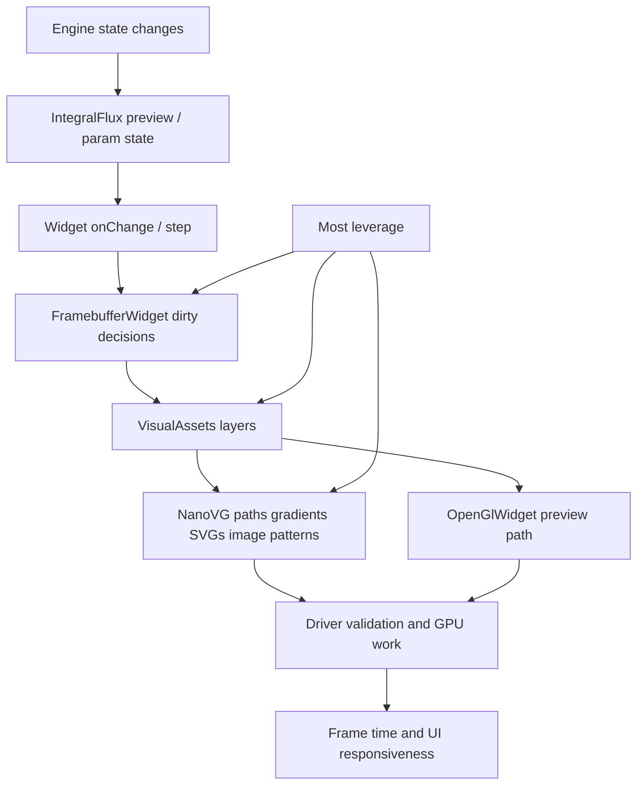
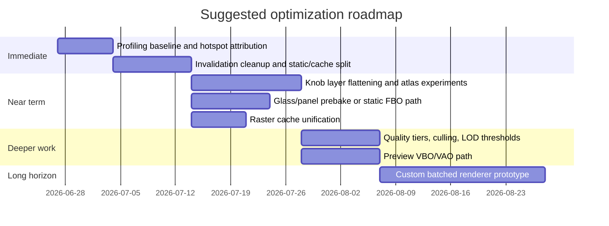

# Optimizing draw Performance in Rack and IntegralFlux

## Executive summary

The highest-confidence conclusion is that your most valuable performance work is **not** a backend rewrite first. It is a **render-complexity reduction and invalidation-discipline pass** over the existing Rack/NanoVG widget graph, especially around `VisualAssets` compositions and the way `FramebufferWidget` dirtiness is triggered. In the uploaded code, IntegralFlux already contains useful per-subsystem UI timing instrumentation around `ModuleWidget::draw()`, and the module is built from several layered custom controls whose draw cost is amplified by multiple `FramebufferWidget`s, SVG layers, segmented arc renderers, gradient-heavy overlays, and animation-triggered `setDirty()` paths. The biggest short-term wins are therefore likely to come from collapsing static layers, reducing layer count in `LeviathanHaloKnob2`/gear/eclipse assets, eliminating avoidable redraws, and turning some procedurally drawn effects into cached or atlased rasters. fileciteturn6file7 fileciteturn8file0 fileciteturn8file1 fileciteturn7file0

That recommendation aligns with the underlying Rack model. VCV Rack’s UI is a widget scene graph drawn through NanoVG, and `FramebufferWidget` is explicitly intended to cache child rendering until marked dirty. `OpenGlWidget` is a `FramebufferWidget` specialization that, by default, draws every frame unless you override its stepping behavior. In parallel, vendor guidance is consistent that the CPU cost of rendering is dominated by **draw-call count, state changes, binding churn, render-target switches, and redundant work**, and that batching, atlasing, state sorting, and culling are standard remedies. citeturn4view0turn13view0turn6search3turn7search0turn15search0turn15search2

For IntegralFlux specifically, I would prioritize four changes before anything more speculative: **make the full-panel labels/background layers as static as possible**, **replace procedural multi-pass knob blooms/highlights with precomposed assets or fewer passes**, **simplify panel glass/sheen effects into cached textures or single-pass renderables**, and **consolidate raster-image usage so repeated image-handle creation, image-size queries, and per-widget texture logic are amortized centrally**. In a patch with multiple IntegralFlux instances, those changes are plausibly worth a **double-digit reduction in UI CPU time** with low-to-moderate implementation risk; deeper batching/instancing/command-buffer work becomes attractive only if you later move significant drawing out of NanoVG into a custom GPU path. fileciteturn4file0 fileciteturn5file3 fileciteturn6file0 fileciteturn6file2 citeturn7search8turn6search3turn15search7

## What the current code suggests

The current IntegralFlux widget tree already exposes the likely hot regions. The module creates a panel surface effect widget, a full-panel labels SVG inside a `FramebufferWidget` with `oversample = 2.0f` and `dirtyOnSubpixelChange = true`, several custom knobs, multiple ports, lights, two shape-mode overlay framebuffers, and preview widgets with configurable NanoVG or OpenGL rendering modes. That means the effective render cost is not just “one module draw,” but a stack of nested cache boundaries and layered child widgets whose invalidation behavior matters as much as their raw draw code. fileciteturn4file0 fileciteturn4file1 fileciteturn8file8

The VisualAssets layer compounds this. `LeviathanHaloKnob2` alone builds its framebuffer from a background SVG layer, a glow arc, a light arc, a foreground glow arc, a center SVG, and a cap reflection; hover and drag swap the center SVG and call `fb->setDirty()`, while value changes update every sublayer and dirty the framebuffer again. `GearKnobInvertSized` adds a shadow widget and an active ring widget; its active-ring path uses several strokes and gradients, and its shadow widget performs three transformed shadow passes per draw. `Eclipse2Knob` likewise redraws shadow and progress-ring elements and dirties on both value change and halo-brightness changes. Those designs are visually rich, but they scale poorly when several controls move at once or when multiple module instances are on screen. fileciteturn8file0 fileciteturn8file1 fileciteturn7file0 fileciteturn7file2 fileciteturn7file1

The panel-surface effects are another clear hotspot candidate. The glass renderer subtracts screen rectangles from glass rectangles into pieces, then for each remaining piece performs scissoring and multiple gradient/stroke passes, including box gradients, linear gradients, fills, strokes, and sheen overlays. This is exactly the kind of “small but numerous immediate-mode vector work” that can look cheap in isolation and turn expensive once repeated across modules, zoom levels, and animation. fileciteturn5file2 fileciteturn5file3 fileciteturn5file4

The raster-image path is functional but leaves performance on the table. `MagitekRasterImage` and `AspectFitRasterImageWidget` both call `APP->window->loadImage()` and then maintain their own mipmapped NanoVG image-handle caches via `nvgCreateImage(..., NVG_IMAGE_GENERATE_MIPMAPS)`. `AspectFitRasterImageWidget` additionally calls `nvgImageSize()` during draw to compute aspect-fit rectangles. Even if Rack caches image loads by path in practice, the extra mipmap-handle layer and repeated size queries make the rendering path more complicated than it needs to be and are good candidates for centralization. fileciteturn6file0 fileciteturn6file1 fileciteturn6file2 citeturn10view0turn11search1

The preview path is more nuanced. The `WavePreviewWidget` already contains sensible micro-optimizations: LUTs for curve sampling, cached point arrays, version-based rebuilds, simplified NanoVG path emission, tracer caching, and a lock-free engine→UI preview state handoff. That is good engineering. However, when OpenGL preview mode is selected, the widget explicitly calls `setDirty()` and `FramebufferWidget::step()` every frame, and the OpenGL path uses immediate-mode style submission (`glBegin`/`glEnd`) for ribbons and dots. Because `OpenGlWidget` is designed to draw every frame by default, this path is acceptable for a small preview but not a pattern to generalize across the wider UI. fileciteturn4file2 fileciteturn5file8 fileciteturn6file6 fileciteturn6file8 citeturn13view0



The broader graphics literature reinforces this diagnosis. Intel’s graphics profiling guidance flags high draw calls, `UseProgram`, `BindBuffer`, and `BindTexture` counts as symptoms that should be addressed with better batching, fewer bindings, indexed/pooled geometry, and texture atlases. Arm’s best-practice documents recommend reducing draw-call count, combining textures into atlases, and optimizing render order to improve both CPU cost and power efficiency. On explicit APIs, D3D12 and Vulkan push the same direction through PSOs, command lists/buffers, secondary command buffers, indirect drawing, and descriptor indexing to reduce CPU submission overhead and binding churn. citeturn6search3turn7search0turn7search4turn7search8turn15search0turn15search2turn15search3turn15search5turn15search7

## Prioritized actionable changes

### Highest priority changes

The first change I would make is to **reclassify as much of the module as possible into “static until theme/zoom/layout changes”**. The clearest offender is the full-panel labels framebuffer, which is intentionally oversampled and marked dirty on subpixel movement. That may be visually useful while zooming, but it is expensive because it covers the full module area. If the labels are not visually unacceptable when slightly resampled, change this to `dirtyOnSubpixelChange = false`; if some zoom cases truly need sharper labels, split static labels from genuinely zoom-sensitive elements, or rebuild only on quantized zoom/subpixel thresholds rather than every fractional move. Rack’s `FramebufferWidget` is designed precisely for this kind of caching boundary. fileciteturn4file0 citeturn4view0

The second change is to **flatten the knob render stacks**. `LeviathanHaloKnob2` currently composes six layers in one framebuffer; `GearKnobInvertSized` and `Eclipse2Knob` do similar multi-layer work with additional shadow and arc rendering. Short-term, keep the Rack API surface but replace some procedural layers with **prebaked atlased RGBA assets** keyed by quality/theme, especially for bloom reflections, fixed shadows, and cap highlights. The dynamic portion should then be reduced to the minimum truly param-dependent geometry: ideally one arc/ring layer plus one rotating pointer/center. This directly attacks draw count, state churn, gradient setup, and vector tessellation cost. fileciteturn8file0 fileciteturn8file1 fileciteturn7file0 fileciteturn7file1 citeturn6search3turn7search8

The third change is to **precompose panel glass and sheen effects**. The present algorithm subtracts screen rectangles from glass rectangles and redraws each surviving piece with multiple gradient and stroke passes. For a static panel, the cheapest solution is usually a pre-rendered texture or a one-time FBO bake that is invalidated only by theme changes. If theme colors must remain dynamic, generate a small set of themed atlases or rasterize the effect once when the panel is created. That removes a surprising amount of per-frame NanoVG work and eliminates scissor-heavy piece iteration from steady-state drawing. fileciteturn5file2 fileciteturn5file3 citeturn7search8turn6search3

The fourth change is to **centralize raster asset metadata and mipmap-handle ownership**. Today there are multiple raster-image widgets that each manage their own mipmap/image-path logic. Replace that with a single `VisualAssetImageCache` that owns: image handle, mipmapped variant handle, dimensions, last-context token, and perhaps a texture-atlas slot. The draw path for each widget should become a simple “fetch cached descriptor, submit rect.” This is a modest engineering change with low visual risk and meaningful cleanup value. fileciteturn6file0 fileciteturn6file1 fileciteturn6file2 citeturn10view0turn11search1

A practical implementation shape for invalidation looks like this:

```cpp
enum DirtyBits : uint32_t {
    Dirty_None        = 0,
    Dirty_Value       = 1 << 0,
    Dirty_Hover       = 1 << 1,
    Dirty_Theme       = 1 << 2,
    Dirty_ZoomBucket  = 1 << 3,
    Dirty_Layout      = 1 << 4
};

struct CachedVisual {
    uint32_t dirtyBits = Dirty_Theme | Dirty_Layout;
    int zoomBucket = 0;
    bool hovered = false;
    float lastValueNorm = -1.f;

    void markValue(float v) {
        if (std::abs(v - lastValueNorm) > 1e-4f) {
            lastValueNorm = v;
            dirtyBits |= Dirty_Value;
        }
    }

    void markZoom(float zoom) {
        int bucket = int(std::floor(zoom * 4.f)); // quantize
        if (bucket != zoomBucket) {
            zoomBucket = bucket;
            dirtyBits |= Dirty_ZoomBucket;
        }
    }

    bool needsFullRedraw() const {
        return dirtyBits & (Dirty_Theme | Dirty_Layout | Dirty_ZoomBucket);
    }

    bool needsDynamicRedraw() const {
        return dirtyBits & (Dirty_Value | Dirty_Hover);
    }

    void clear() { dirtyBits = Dirty_None; }
};
```

That pattern is especially useful for your Rack controls because many current redraw triggers are semantically broader than they need to be. A hover state change should not necessarily rebuild the same layers as a theme change or a zoom shift. The narrower your dirty regions and dirty causes, the more leverage you get from `FramebufferWidget`. citeturn4view0 fileciteturn8file1 fileciteturn7file1

### Medium-priority changes

The next tier is to **reduce per-control dynamic geometry complexity**. In the uploaded code, at least one arc path uses `segmentCount = 16`, and `Eclipse2Knob` exposes a 25-LED-style ring. Those are visually elegant, but segment counts are an obvious quality/performance dial. Introduce a quality ladder driven by control size on screen: for small controls or lower zoom levels, render 8 segments instead of 16, or alpha-blend a coarser precomputed strip. This is classic level-of-detail thinking applied to UI, and the Vulkan guidance on culling/size-based LOD maps conceptually well even though the concrete implementation here stays CPU-side and widget-level. fileciteturn5file0 fileciteturn5file11 citeturn7search11turn6search3

You should also **introduce visibility and projected-size culling for purely decorative children**. Rack gives each widget a viewport chain and `FramebufferWidget` supports viewport-based limits; you do not need to render every decorative sub-widget when it contributes only a handful of pixels or is clipped out. Full frustum/occlusion systems are overkill for Rack UI, but projected-size thresholds for bloom glows, cap reflections, extra sheen overlays, and tracer history are straightforward and low risk. citeturn4view0turn7search11turn7search2

For the preview widget, keep the current architecture but **avoid over-investing in it until the rest of the module is cheaper**. The code already uses LUTs, cached points, and version-based rebuilds. The only medium-term improvement that seems clearly worthwhile is replacing immediate-mode GL preview ribbons with a tiny persistent VBO/VAO path if the OpenGL mode remains important, because persistent buffers and array-based submission reduce per-draw CPU work relative to repeated command-style submission. However, this is not where I would spend the first optimization sprint unless the profiler proves the preview dominates. fileciteturn6file6 fileciteturn5file8 citeturn13view0turn16search2turn16search6

### Deeper architectural changes

If, after the earlier steps, UI rendering is still materially over budget in large patches, the next move is to **replace portions of NanoVG-issued decorative work with a purpose-built GPU batched renderer**. The shape of that renderer is familiar: one atlas for knob/port sprites and precomputed effects, one or a few vertex buffers for quads/arcs, sorting by texture/state, and a single per-frame submission path for repeated controls. In OpenGL terms, this means pooled VBOs/VAOs and texture atlases; in D3D12/Vulkan terms, it means packed descriptor/resource indexing, persistent command-list patterns, and possibly indirect drawing for massive repetition. This is where batching, instancing, command buffering, and state sorting become genuinely high leverage. citeturn6search3turn7search0turn15search0turn15search2turn15search3turn15search7

The important caveat is scope: in today’s code, most rendering still lives in the Rack widget/NanoVG model. So technologies like instancing, descriptor indexing, secondary command buffers, and multi-draw indirect are **not immediate drop-in wins** for the current `draw()` paths; they are enabling techniques for a custom rendering layer or a future backend. They belong in the report because you asked for them, but they should be treated as **Phase Two/Three architecture options**, not the first prescription for this codebase. citeturn13view0turn15search2turn15search3turn15search4turn15search5

A representative batched path would look like this:

```cpp
struct SpriteInstance {
    float x, y, w, h;
    float u0, v0, u1, v1;
    uint32_t rgba;
    uint16_t atlasPage;
    uint16_t flags;
};

class UiBatcher {
public:
    void beginFrame();
    void pushSprite(const SpriteInstance& s);
    void pushArc(const ArcInstance& a);   // optional custom geometry
    void flushSorted();                   // sort by atlasPage, blend/state
};

// Rack widget draw() becomes:
void HaloKnobFast::draw(const DrawArgs& args) override {
    if (fallbackToNanoVG(args)) {
        drawLegacy(args);
        return;
    }
    if (auto* batch = currentUiBatcher()) {
        batch->pushSprite(backSprite());
        batch->pushArc(progressArc());
        batch->pushSprite(centerSprite());
    }
}
```

That style is directly aligned with vendor guidance to lower draw submissions, texture binds, and state changes by batching like-state work and using texture arrays/atlases instead of one-off binds. citeturn6search3turn7search0turn7search8turn15search7

## Optimization options compared

The table below is intentionally pragmatic: it ranks what is likely to matter for **this** code, not what is merely fashionable in rendering literature.

| Option | Where it applies here | Estimated impact on IntegralFlux UI time | Implementation complexity | Risk | Why it ranks this way |
|---|---|---:|---:|---:|---|
| Tighten `FramebufferWidget` invalidation and disable unnecessary subpixel dirtiness | Full-panel labels, decorative layers, hover states | **High**: ~5–20% | Low | Low | Rack’s cache model makes this immediately valuable, and the code already has obvious dirty triggers and a full-panel oversampled label framebuffer. fileciteturn4file0 citeturn4view0 |
| Flatten layered knob compositions into fewer dynamic passes | `LeviathanHaloKnob2`, gear/ecliptic knobs | **High**: ~10–35% in multi-instance patches | Medium | Medium | Current controls stack many sublayers and redraw on value/hover/drag changes. fileciteturn8file0 fileciteturn8file1 fileciteturn7file0 |
| Prebake or cache panel glass/sheen effects | `createPanelSurfaceEffectWidget()` path | **Medium**: ~3–10% | Medium | Low | Current implementation does piece subtraction plus gradient-heavy per-piece drawing. fileciteturn5file2 fileciteturn5file3 |
| Centralize raster handles, dimensions, and mipmaps | Magitek raster image widgets, aspect-fit widgets | **Low–Medium**: ~1–5% | Low | Low | Mostly reduces redundant work and simplifies rendering code. fileciteturn6file0 fileciteturn6file2 |
| Introduce quality-based segment/LOD reduction | Arc rings, glow segments, tracers | **Medium**: ~3–12% | Medium | Low | Good fit for decorative UI whose projected size varies with zoom. fileciteturn5file0 fileciteturn5file11 citeturn7search11 |
| Replace preview immediate-mode GL with VBO/VAO path | `WavePreviewWidget` OpenGL mode | **Low–Medium** overall, higher if previews dominate | Medium | Low | Good hygiene, but probably not the top bottleneck unless profiler proves it. fileciteturn6file6 fileciteturn7file9 citeturn13view0turn16search6 |
| Texture atlasing and state-sorted batched custom renderer | Repeated knobs/ports/decorative sprites | **High, but only after architectural work**: ~15–40% | High | Medium | Strong vendor support, but a deeper departure from pure NanoVG widget rendering. citeturn6search3turn7search0turn15search7 |
| Instancing / MDI / descriptor indexing / GPU-driven submission | Future custom renderer, not immediate Rack widget code | Potentially high at large scale | Very High | Medium–High | Valuable only if you move repeated UI drawing into a custom API-specific path. citeturn15search1turn15search3turn15search5 |
| Multithreaded command recording | Vulkan/D3D12-style future renderer | Context-dependent | Very High | Medium–High | Powerful in explicit APIs, but not a first-order fit for the current widget/NanoVG path. citeturn15search2turn15search4turn15search10 |

These impact ranges are **directional engineering estimates**, not benchmarked measurements. Because no captured sampling-profiler traces or frame captures were provided in the prompt, they should be treated as planning numbers and validated against your own profilers on representative “many IntegralFlux modules visible and animated” patches. Sampling tools are appropriate here because they have relatively low overhead compared with instrumentation, and mainstream tooling from Linux `perf`, Visual Studio CPU Usage, Apple Instruments Time Profiler, and Tracy all support the kind of hotspot-first workflow you described. citeturn12search1turn12search10turn12search5turn12search8turn12search18turn12search3



## Recommended roadmap

A disciplined first sprint should focus on **measurement and redraw reduction**, not visual redesign. Use a sampling profiler to establish whether time clusters in `Widget::draw`, NanoVG internals, your custom knob draw functions, or Rack’s framebuffer/render paths. At the same time, use the IntegralFlux per-subsystem metrics you already have to correlate profile samples with your `gear`, `eclipse`, `linear point`, `shape glyph`, and preview timings. This two-view approach—sampling profiler plus your module-local counters—should tell you whether the dominant cost is “too much total widget work,” “one or two pathological controls,” or “driver/API overhead from too many small submissions.” fileciteturn6file7 citeturn12search1turn12search5turn12search18turn12search3turn6search11

The second sprint should implement the no-regrets changes: freeze or quantize subpixel invalidation on full-module static framebuffers, unify raster image caches, and convert panel glass to a cached/prebaked path. These changes are relatively self-contained and should make the profile cleaner before you attempt aesthetic-control simplification. fileciteturn4file0 fileciteturn6file0 fileciteturn5file2

The third sprint should flatten the expensive controls. For `LeviathanHaloKnob2`, the obvious experiment is a **dynamic core + static shell** split: keep the center/pointer and one progress arc live, but bake the fixed background, glow field, and cap reflection into one or two textures. For gear/eclipse variants, fold multi-pass shadows into either a prerendered shadow sprite or a single simplified shadow pass. If you want to preserve the current look at high zoom, make the bake resolution theme- or zoom-bucket dependent rather than live every frame. fileciteturn8file0 fileciteturn8file1 fileciteturn7file0

Only after these changes are in place should you evaluate whether the system still needs a deeper renderer. If it does, the most promising architectural direction is a **batched sprite/arc renderer for repeated UI primitives**, not a wholesale abandonment of Rack widgets. That lets you preserve existing module logic while pulling the most repetitive decorative work into a state-sorted, atlas-backed submission path. It also provides a natural bridge toward explicit-API concepts like command buffers, resource indexing, and instancing if you ever move beyond the current backend assumptions. citeturn15search0turn15search2turn15search3turn15search7

## Assumptions and limits

Several constraints were explicitly unspecified in your request: exact frame budget, target hardware class, number of simultaneous visible IntegralFlux instances, and whether you ultimately care about standalone Rack only or also DAW-hosted/editor-reopened plugin contexts. Those matter, because the cost/benefit curve for visual fidelity, oversampling, and cache invalidation changes a lot between “one module at 60 Hz on desktop” and “many modules with host/editor churn.” citeturn11search1

At the same time, not everything is actually unspecified. The uploaded code clearly sits inside the **VCV Rack widget model**, uses **NanoVG** drawing, and makes concrete use of `FramebufferWidget` and `OpenGlWidget`; Rack’s own API documentation describes these classes in terms of NanoVG and OpenGL contexts. So while this report separates general OpenGL/D3D12/Vulkan guidance from Rack-specific action, the near-term recommendations are grounded in the fact that your current code is already living in a Rack/OpenGL/NanoVG-shaped environment, not an abstract renderer. citeturn8search3turn8search8turn4view0turn13view0turn14search1

The largest limitation of this report is that it is a **source audit plus primary-literature synthesis**, not a measured profiling session. I did not have your sampling-profiler captures, GPU frame captures, or a reproducible benchmark patch, so all impact estimates remain directional. The strongest conclusions here are therefore about **where the code is structurally expensive** and **which classes of optimization are best matched to that structure**. The next step in practice is to validate the ranking against a representative profile trace and keep only the changes that survive measurement. citeturn12search1turn12search5turn12search18turn6search11turn16search15