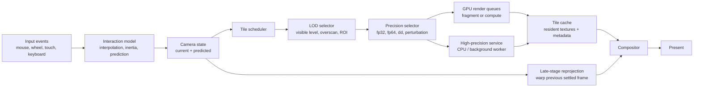
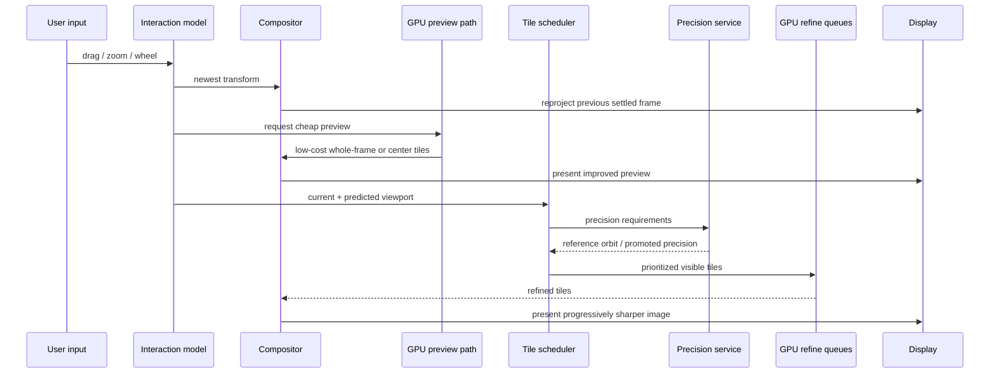

# Building a Responsive Real-Time Fractal Rendering System

## Executive summary

The highest-performing fractal viewers are not just “fast renderers.” They are layered interaction systems with at least four cooperating loops: an input loop that predicts motion and smooths user intent, a display loop that can always show *something* immediately, a progressive rendering loop that refines visible content in priority order, and a precision-management loop that escalates numerical rigor only when the zoom level or formula demands it. Native low-level APIs such as Vulkan, Direct3D 12, and Metal expose the queueing and synchronization primitives needed to build explicit low-latency pipelines; WebGPU brings a similar model to the browser, while WebGL remains primarily a fragment-shader path and needs careful main-thread avoidance and stall reduction. citeturn20view0turn21view3turn21view2turn22view2turn20view5turn41search0

For shallow and medium zooms, the best default architecture is a compute- or fullscreen-fragment path that keeps the interaction transform on the GPU, uses a multi-resolution tile pyramid, and continuously reprojects the most recent resolved image while higher-quality tiles are rendered asynchronously. For very deep zooms, the dominant strategy changes: one sparse, high-precision reference orbit is computed with arbitrary precision on the CPU or a high-precision subsystem, while the GPU renders most pixels as low-precision perturbations relative to that reference, optionally accelerated further with rebasing and bivariate linear approximation. This is the central practical breakthrough behind modern deep-zoom Mandelbrot rendering. citeturn21view5turn21view6turn25view1

The main latency trap is excessive queue depth. The main precision trap is catastrophic cancellation from mapping screen pixels directly into huge world coordinates. The main architectural trap is treating “render quality” and “interaction responsiveness” as the same pipeline. They should be decoupled. Lower queued-frame depth reduces interaction lag on DXGI-based stacks; triple buffering helps CPU-GPU overlap for dynamic data, but deeper overlap beyond what is needed can add responsiveness cost. On tiled/mobile architectures in particular, naïve fragment→compute→fragment synchronization can starve the GPU and hurt both throughput and latency. citeturn21view0turn21view1turn33view2

A practical note from your current prototype: the Nautiloid module already implements several of the right ideas—an interaction-first canonical preview, a larger overscan cache that can be cropped for nearby pans, a dedicated render worker plus a cache worker, generation-based preview swapping, stale-request suppression, and throttled pan/zoom request issuance. That is a strong conceptual starting point; the main next step is to generalize the cache from “one enlarged image” into a persistent tile pyramid with quality levels, prediction, and GPU residency. fileciteturn0file0 fileciteturn0file1

## Architecture principles

A robust fractal renderer should be organized around *interaction-first compositing*, not around a single monolithic “render frame” function. The display should always have a valid frame to present, even if that frame is only a reprojected approximation of the latest settled image. Then, in parallel, the renderer refines tiles according to visibility, predicted movement, and current quality deficits.

A good baseline decomposition is:

1. **State model**: logical camera state in world coordinates, plus a predicted future state for prefetch.
2. **Presentation cache**: the latest complete frame or tile set usable *right now*.
3. **Tile pyramid**: multiple LODs with increasingly better effective resolution and iteration / sample budgets.
4. **Render scheduler**: chooses which tiles, which precision tier, and which queue to use next.
5. **Precision service**: computes or updates reference orbits, BLA tables, or arbitrary-precision anchors.
6. **Compositor**: assembles the visible image from available tiles and optionally applies late-stage reprojection.

This is the architecture I would recommend as the default portable target:



Two architectural patterns matter most in practice.

The first is **dual-path rendering**. During movement, the system prioritizes immediacy: reproject the last good image, request low-cost center tiles, reduce iteration ceilings, and avoid CPU readbacks. After motion settles, the scheduler shifts into converge mode: higher iteration ceilings, adaptive supersampling at edges, deep-zoom precision promotion, and background cache completion.

The second is **anchor-relative coordinates**. Never compute every pixel from a huge global center directly if you can avoid it. Instead, define a high-precision tile anchor and evaluate local pixel deltas around that anchor. This single design choice has large downstream effects on numerical stability, texture reuse, and GPU friendliness.

A useful camera representation is:

\[
c_{\text{pixel}} = C_{\text{anchor}} + \Delta C_{\text{tile}} + M_{\text{view}} \cdot
\begin{bmatrix}
x + 0.5 \\
y + 0.5 \\
1
\end{bmatrix}
\]

where \(C_{\text{anchor}}\) is high precision, \(\Delta C_{\text{tile}}\) is moderate precision and tile-local, and \(M_{\text{view}}\) is built from small values in pixel space. This prevents subtracting nearly equal huge numbers for every fragment.

## Rendering pipeline and GPU paths

### Choosing the GPU execution path

There is no single best API or shader stage. The best choice depends on whether you optimize for portability, ease, or a fully explicit queueing model.

| Path | Best use | Strengths | Weaknesses | Recommendation |
|---|---|---|---|---|
| Fullscreen fragment shader | Simple Mandelbrot/Julia, moderate zoom, easy portability | Minimal setup, excellent occupancy for one-pixel-per-fragment work, easy to integrate with classic graphics render loops | Harder to do irregular tile scheduling, work stealing, shared-memory reductions, or persistent accumulation; deep-zoom precision promotion is awkward | Best first implementation on OpenGL/WebGL and a good fallback on all APIs |
| Compute shader | Tiled progressive rendering, adaptive sampling, accumulation buffers, multi-pass scheduling | Natural fit for tile dispatch, shared memory, atomics, custom accumulation, sparse tile queues, async compute | More explicit synchronization; poor dispatch granularity can raise overhead, especially on WebGPU or browsers | Best long-term architecture on Vulkan, D3D12, Metal, and WebGPU |
| Hybrid fragment + compute | Interaction in fragment path, refinement in compute | Lets you keep a very low-latency preview path while compute handles expensive settle passes | More complicated resource state management and compositing | Often the best production compromise |

Official API guidance strongly supports this decomposition. Vulkan and D3D12 expose multiple queues and explicit synchronization, including separate graphics, compute, and copy timelines; Metal provides long-lived command queues and transient command buffers; WebGL advises avoiding blocking API calls and main-thread jank; OffscreenCanvas allows moving rendering work into workers; WebGPU provides a modern command-buffer model and general-purpose compute. citeturn20view0turn21view3turn21view2turn22view1turn22view2turn41search0

On WebGPU specifically, keep dispatch count coarse. A recent cross-vendor study found measurable per-dispatch overhead and showed that kernel fusion mattered substantially on Vulkan-backed WebGPU stacks. The implication for fractals is direct: do not issue thousands of tiny per-tile dispatches if you can batch multiple tiles or scanlines into fewer kernels. citeturn40view0

### API trade-offs

| API | Practical strengths | Practical cautions | Best fractal use |
|---|---|---|---|
| Vulkan | Explicit control over queues, sync, memory, timestamps, multithreaded command recording | Most complex synchronization model; easy to over-sync and raise latency | Native high-end renderer with async compute, streaming tiles, and deep profiling |
| Direct3D 12 | Explicit multi-engine model, fences, GPU/CPU timestamp calibration, frame-latency controls on DXGI | Windows-only; queue/state complexity still high | Native Windows renderer with strong profiling and low-latency present control |
| Metal | Clean command queue/buffer model, strong Apple GPU integration, straightforward dynamic-buffer guidance | Apple-only; some details differ between macOS device classes | Best native Apple path; particularly strong for integrated/mobile-like latency-sensitive systems |
| OpenGL | Mature, easy deployment, fragment path simple | Driver hidden sync, less explicit latency control, compute less modern | Good desktop fallback or prototyping path |
| WebGL | Broadest browser portability, good fullscreen-fragment model, OffscreenCanvas workers available | No standard compute shader path; stalls and main-thread overhead need active avoidance | Best browser fallback for wide compatibility |
| WebGPU | Modern browser GPU model, compute support, cross-platform backends | Dispatch overhead and browser/implementation variance matter; current profiling support is less uniform than native APIs | Best future-facing browser target for tiled progressive rendering |

The API characteristics above are grounded in vendor and standards documentation. Vulkan explicitly warns that synchronization misuse can cause both correctness problems and unnecessary GPU idle time; D3D12 describes parallel copy, compute, and graphics engines; Metal documents ordered command-buffer execution on long-lived queues; MDN’s WebGL guidance explicitly warns about blocking entry points on the main thread and recommends worker/offscreen use when possible. citeturn20view0turn21view3turn21view2turn22view1turn22view2

### Multi-resolution tiles and mipmap-like LOD

Fractals are not normal sampled images, so literal mipmaps are not sufficient. What you want is a **fractal tile pyramid** that *behaves* like mipmaps from the scheduler’s point of view, but is actually re-rendered per LOD. A tile key should include at least:

- formula / parameter set
- tile level
- tile coordinates
- iteration budget tier
- sample budget tier
- precision tier
- coloring version

A practical LOD stack is:

- **Preview level**: one whole-frame image or a very coarse grid, generated with cheap settings.
- **Interactive tile levels**: visible tiles plus one or two rings of overscan around the predicted viewport.
- **Settle levels**: exact-resolution tiles with full iteration and adaptive supersampling.
- **Deep-zoom precision levels**: same spatial tiles, but promoted from fp32/fp64 to perturbation or arbitrary-precision-backed evaluation.

Use overscan at every level, generally 8–32 pixels, to prevent seams during pan/zoom and to allow small reprojection errors without exposing gaps.

A good tile priority function is:

\[
\text{priority} =
w_v V +
w_c C +
w_p P +
w_q Q -
w_s S
\]

where \(V\) is current visibility, \(C\) is center bias, \(P\) is predicted future visibility, \(Q\) is quality deficit, and \(S\) is stale age or mismatch with current transform.

### Progressive rendering and streaming tiles

Progressive rendering should happen on two axes at once:

- **Spatial progression**: center-first, then foveal ring, then peripheral ring.
- **Quality progression**: low iteration / low supersample first, then higher budgets.

For local rendering, stream tiles from GPU queues into a resident texture atlas or sparse resource pool. For remote or distributed rendering, stream compressed tile payloads and decode asynchronously into GPU-resident textures. Do not compress every transient in-flight tile; compress only long-lived cache layers or remote assets.

MDN’s WebGL guidance recommends considering smaller back buffers, batching draws, and compressed textures where appropriate. For browser stacks, compressed textures save VRAM, but the big caveat is that WebGL does not compress for you: content must already be in an uploadable compressed representation. That makes compression far more attractive for *persistent tile caches* or network delivery than for per-frame transient tile outputs. citeturn22view0turn39view0

### Concrete rendering algorithms

#### Compute-shader tile kernel

```text
kernel RenderTile(tileID, qualityTier, precisionTier):
    tile = tileTable[tileID]
    anchor = tile.anchor          // high or medium precision per tile
    viewport = tile.viewportMap   // pixel->complex delta map
    accum = tile.accumBuffer
    meta  = tile.metaBuffer

    for each invocation -> pixel (px, py) in tile:
        localCoord = viewport.pixelDelta(px, py)
        c = anchor + localCoord

        if precisionTier == PERTURBATION:
            state = EvaluatePerturbation(c, tile.referenceOrbit, tile.blaTable)
        else:
            state = EvaluateDirect(c, precisionTier)

        // progressive quality: first pass one sample, later passes more
        estimate = EscapeTimeOrDistanceEstimate(
            state,
            iterBudget[qualityTier],
            bailout
        )

        accum[pixel] += estimate.color
        meta[pixel].samples += 1
        meta[pixel].error = UpdateErrorMetric(meta[pixel], estimate)

        if meta[pixel].error < threshold[qualityTier]:
            meta[pixel].done = true
```

This style is easiest on compute-capable APIs because shader storage, workgroup IDs, shared memory, barriers, and atomics are first-class concepts. The OpenGL compute model illustrates the core structure: workgroups are identified by global and local invocation IDs; outputs flow through images or storage buffers; workgroup cooperation requires both memory barriers and `barrier()`, and all barrier points must remain dynamically uniform. citeturn35view0turn35view1turn35view2

#### Fullscreen fragment preview pass

```text
fragment Preview(pixelCoord):
    c = CameraMap(pixelCoord, currentTransform)
    value = IterateFractal(c, previewIterBudget, previewPrecision)
    return Shade(value)
```

The fullscreen fragment pass should be your *emergency fast path*: simple, deterministic, and always available. Use it for startup, fallback, and any moment when tile residency is incomplete.

### Rendering timeline

The rendering timeline should explicitly separate “what can be shown now” from “what is being improved.”



## Interaction and latency control

### Interpolation, inertia, and predictive prefetch

You want the logical camera state to be smooth but not sluggish. The best default is a *critically damped interaction model* with two states:

- **authoritative state**: exact user intent after each event
- **render state**: smoothed state used by preview and tile scheduling

For drag and wheel input, use timestamps and integrate velocity. On release, preserve the velocity vector and decay it exponentially or with a critically damped spring. Then prefetch along the predicted viewport path, not just the current viewport.

A practical pan/zoom predictor is:

```text
state.position += state.velocity * dt
state.velocity *= exp(-lambda * dt)

predictedViewport = ViewportFrom(
    state.position + leadTime * state.velocity,
    state.zoom + leadTime * state.zoomVelocity
)
```

Use that predicted viewport to ask for one extra ring of tiles in the likely direction of travel. Keep lead time modest, roughly one to two frame intervals at the current refresh target.

### Latency-reduction techniques

The low-latency toolkit is consistent across native and browser stacks, even though the implementation hooks differ.

**Frame pacing.** Present at a stable cadence and measure missed intervals, not just average FPS. `requestAnimationFrame()` aligns callbacks with display refresh and provides a high-resolution timestamp; use the timestamp passed to the callback rather than assuming a fixed 60 Hz frame period. citeturn22view3

**Keep queue depth shallow.** On DXGI flip-model stacks, Microsoft documents that queued presents must be managed relative to back-buffer count, and `SetMaximumFrameLatency()` explicitly controls how many frames the swap chain may queue; the default is 1 for that API. For interactive fractal navigation, favor one frame queued, or two only when throughput instability would otherwise cause frequent misses. citeturn20view1turn21view0

**Use triple buffering selectively.** Apple’s Metal guidance is clear that triple buffering reduces CPU-GPU access conflicts and idling for dynamic buffers by allowing CPU work at least one frame ahead. That is useful for frequently updated uniform/state buffers, but it should not become an excuse to create deep interactive lag. Use triple buffering for *dynamic resource staging*, not for arbitrarily deep interactivity queues. citeturn21view1

**Avoid unnecessary overlap that adds latency.** The Vulkan async-compute sample makes an important point: some kinds of additional overlap increase complexity and can increase input latency. Prefer queue structures that keep the “latest frame” work at higher priority than speculative future work. citeturn33view2

**Move browser work off the main thread.** OffscreenCanvas can be rendered in workers, decoupling DOM work from rendering. In WebGL, explicitly avoid blocking entry points such as repeated `getError()`/`getParameter()` in production, and flush only when needed for query completion or non-RAF rendering models. citeturn22view2turn22view1

### Timewarp for fractal viewers

In a fractal viewer, “timewarp” is simpler than VR asynchronous reprojection: it is a last-moment 2D or complex-plane reprojection of the most recent settled image according to the freshest camera transform. Conceptually:

```text
if no exact tiles are ready for newest transform:
    warp(lastResolvedTexture, deltaTransform)
    composite with any newly ready tiles
    present
```

This does not replace true rerendering, because deep zoom or non-affine coloring changes can create holes or slight misregistrations. But it is extremely effective for reducing perceived drag and zoom latency. The broader rendering literature around late-stage reprojection and low-latency display systems supports the general principle that users prefer lower end-to-end latency and that prediction / reprojection are common strategies for masking it. citeturn31academia0turn31academia1

## Precision and deep zoom math

### Why precision becomes the central problem

Deep zoom failure is usually not “not enough iterations”; it is usually “not enough numerically reliable coordinate representation.” At large magnifications, neighboring pixels correspond to microscopic differences in the complex plane. If those differences are smaller than the representable spacing of your working precision near the current center, adjacent pixels collapse onto the same coordinate or become noise.

The practical rule is:

- use direct fp32 or fp64 only while neighboring pixel coordinates remain well separated in working precision;
- once direct evaluation becomes unstable, switch to **anchor-relative** arithmetic;
- once that stops being enough, switch to **reference-orbit perturbation**;
- reserve full arbitrary precision for sparse reference work, not for every pixel.

MPFR is a standard arbitrary-precision floating-point choice when you need reproducible semantics and explicit rounding behavior; it is designed as a portable arbitrary-precision library with IEEE-like rounding modes. citeturn25view1

### Precision method comparison

| Precision method | Stability | Cost | Best use | Practical note |
|---|---|---:|---|---|
| fp32 | Low for deep zoom | Very low | Preview, shallow zoom, browser/mobile fallback | Fine for interaction previews and low-cost tile levels |
| fp64 | Moderate | Low to moderate | Medium zoom, desktop/native, reference anchors | Good default native precision tier if hardware support is acceptable |
| Double-double | High | High | Deep zoom without full arbitrary precision everywhere | Usually software-emulated; useful for anchors or limited kernels |
| Quad-double / multiprecision components | Very high | Very high | Specialized deep zoom, offline or sparse reference work | Strong but expensive; often not suitable for full per-pixel GPU work |
| Arbitrary precision | Highest | Extreme | Sparse CPU-side reference orbits, exact anchors, validation | Use sparingly, then hand off to perturbation on GPU |
| Perturbation + reference orbit | Very high when valid | Excellent amortized cost | Deep Mandelbrot/Julia zoom | Modern practical standard |
| Perturbation + BLA | Very high when valid | Better still | Very deep zoom with long orbits | Best production deep-zoom path if implementation complexity is acceptable |

Recent GPU multiprecision work confirms the expected trade-off: multi-component precision is feasible, but overhead is real and can move kernels from memory-bound toward compute-bound behavior. In fractal systems, that generally argues for concentrating such arithmetic in sparse reference computations rather than across all pixels. citeturn23academia3turn24academia9

### Perturbation, rebasing, and BLA

The modern deep-zoom recipe is:

1. Compute one high-precision reference orbit \(Z_m\) for a representative parameter \(C\).
2. For each pixel, render the low-precision delta orbit \(z_n\) relative to that reference.
3. Rebase when the current reference becomes numerically poor.
4. Optionally skip multiple iterations with BLA where the nonlinear term is provably negligible.

The core perturbation recurrence is:

\[
z_{n+1} = 2Z_m z_n + z_n^2 + c
\]

with rebasing when the running perturbed orbit is closer to a new reference location than to the old one. Mathr’s deep-zoom notes give the practical rebasing rule and the BLA form

\[
z_{n+l} = A_{n,l} z_n + B_{n,l} c
\]

for skipped iteration blocks. citeturn21view5

A production-oriented version looks like this:

```text
function EvaluatePerturbation(c_delta, referenceOrbit, blaTable):
    z = 0
    n = 0
    refIndex = 0

    while n < maxIter:
        bla = LargestValidBLA(blaTable, refIndex, z, c_delta)
        if bla exists:
            z = bla.A * z + bla.B * c_delta
            n += bla.skip
            refIndex += bla.skip
        else:
            z = 2 * referenceOrbit[refIndex] * z + z*z + c_delta
            n += 1
            refIndex += 1

        if ShouldRebase(referenceOrbit[refIndex], z):
            z = referenceOrbit[refIndex] + z
            refIndex = 0

        if |referenceOrbit[refIndex] + z| > bailout:
            return Escaped(n, z)

    return Interior(maxIter)
```

Mathr also documents two deep-zoom extensions that matter if you support more than classic analytic Mandelbrot/Julia families:

- for formulas with absolute-value folds such as Burning Ship, the BLA validity radius must also respect folding boundaries;
- for formulas with multiple critical points, you need multiple references and multiple BLA tables. citeturn18view0turn22view6

### Distance estimation, interior detection, and adaptive sampling

A responsive renderer should avoid spending equal work everywhere. Two especially valuable techniques are derivative-based distance estimation and interior detection. Mathr recommends tracking derivatives of the perturbed orbit with respect to pixel coordinates for distance estimation, and tracking derivative decay relative to a critical-point-derived quantity for interior detection. These derivatives provide a principled basis for both edge-aware refinement and early interior termination. citeturn22view6turn22view7

This leads directly to a useful adaptive strategy:

- **Interior regions**: detect early, mark tile subregions as converged, skip supersampling.
- **Far exterior**: use lower iteration budgets if distance estimates are large and stable.
- **Boundary / filaments**: increase iteration budget and adaptive supersamples where distance estimates are small or neighboring escape values vary sharply.
- **Motion phase**: suppress expensive supersampling entirely and rely on temporal convergence after interaction settles.

## Optimization, benchmarking, and trade-offs

### Performance optimization advice

The highest-value optimizations are architectural, not micro-architectural.

Keep the whole interaction path GPU-resident. Avoid GPU→CPU readbacks during interaction. Use timestamp or timer-query mechanisms for profiling rather than synchronous polling. Vulkan timestamp queries are designed for measuring GPU work within command buffers; D3D12 documents queue-based GPU timestamp frequency and CPU/GPU calibration; WebGL exposes non-stalling timer queries through `EXT_disjoint_timer_query` where available. citeturn21view4turn22view5turn37view0

Do not over-fragment work. Batch multiple tiles into one dispatch where practical. On compute pipelines, choose workgroup sizes that match occupancy and shared-memory limits; OpenGL’s compute documentation emphasizes both per-axis local-size limits and total workgroup-invocation caps, as well as the cost of shared-memory coordination. citeturn35view0turn35view1

Reuse long-lived resources. Metal explicitly recommends reusing queues, buffers, textures, and pipeline states in hot paths. The same principle generally applies everywhere: transient command buffers, persistent resource pools. citeturn21view2

For texture formats:

- use **RGBA8** for broad compatibility and quick previews;
- use **RGBA16F** or **R11G11B10F** if coloring or accumulation benefits from HDR-like range;
- use **RG16F/RG32F** or integer side-buffers for intermediate orbit / error / sample metadata if needed;
- compress only persistent cache tile assets or remote-transferred tiles, not constantly updated transient framebuffers.

On browser stacks, compressed textures save VRAM but require supported extensions and precompressed assets. citeturn39view0

For tiled/mobile/TBDR-style architectures, be especially conservative with fragment→compute→fragment barriers. Khronos’s async-compute sample shows exactly how such barriers can starve fragment work, and recommends multiple queues plus higher priority for the final-image queue where possible. Its layout-transition sample also shows that “functionally correct” image-layout choices can still hurt performance. citeturn33view2turn33view1

### Benchmark methodology

A fractal renderer should be benchmarked with *interaction metrics*, not only throughput metrics. The minimum useful metric set is:

| Metric | What it tells you | How to measure |
|---|---|---|
| Input-to-preview latency | Time from user event to first visibly updated frame | Timestamp input event, correlate with presented frame ID |
| Input-to-sharp latency | Time from user event to full-quality or target-quality visible result | Track first “quality tier complete” for current viewport |
| CPU frame time | Main-thread / worker scheduling cost | Engine profiler, Tracy, browser performance timeline |
| GPU frame time | Actual GPU execution cost | Vulkan/D3D12/Metal timestamps, WebGL timer queries |
| Present jitter | Stability of pacing, not just average FPS | Present interval histogram, p95/p99, stddev |
| Queue depth | Responsiveness risk | Internal telemetry + swapchain/present counters |
| Tile cache hit rate | Cache efficiency | Resident-tile lookup counters |
| Prefetch accuracy | Predictor quality | Fraction of prefetched tiles later used |
| Stale-work discard rate | Scheduler waste | Count completed but superseded tiles |
| Precision fallback rate | Deep-zoom stability pressure | Count precision promotions, rebases, glitches |

The benchmark scenarios should include more than one motion pattern. I would strongly recommend at least the following suite:

- steady drag at low, medium, and high speed;
- fast fling with inertia;
- rapid reversals while zooming;
- zoom-only at several depths;
- combined pan+zoom across a precision threshold;
- window resize and DPI changes;
- 60 Hz, 120 Hz, and 144 Hz displays where available;
- integrated GPU, discrete GPU, and thermally constrained laptop runs.

A good reporting format is median, p95, and p99 for latency and frame intervals, not just mean values. If you only report average FPS, you will miss the very behavior that makes fractal navigation feel bad.

### Suggested profiling tools

For native renderers, the strongest tool chain is explicit timestamp instrumentation plus vendor profilers:

| Tool | Best for | Source |
|---|---|---|
| Vulkan timestamp queries | Per-pass GPU timings in command buffers | Khronos sample and guide material citeturn21view4 |
| PIX on Windows | D3D12 timing captures, event analysis, Windows native path | Microsoft PIX distribution and release notes citeturn29view0 |
| NVIDIA Nsight Graphics | Frame debugging, traces, shader and hardware bottleneck analysis | NVIDIA official tool page citeturn29view2 |
| AMD Radeon GPU Profiler / tool suite | AMD-side frame timing, queue, memory, latency tooling | GPUOpen tool suite page citeturn29view1 |
| WebGL `EXT_disjoint_timer_query` | Browser-side non-stalling GPU timing where supported | MDN / Khronos extension docs citeturn37view0 |

For browser implementations, combine GPU query data with browser performance traces and explicit app-level telemetry counters. On WebGL, MDN specifically recommends avoiding blocking API calls in production and using async/query-based methods instead of synchronous polling. citeturn22view1turn37view0

### Consolidated trade-off table

The table below is the most practical “design matrix” for choosing an overall system shape.

| Overall approach | GPU API family | Precision method | Tiling strategy | Latency profile | When to choose |
|---|---|---|---|---|---|
| Simple interactive viewer | OpenGL / WebGL fragment path | fp32 or fp64 direct | Whole-frame preview + optional coarse tiles | Very good first-response latency, weaker deep-zoom scalability | Fast prototype, widest compatibility |
| Native production renderer | Vulkan / D3D12 / Metal compute-centric | fp64 direct + anchor-relative | Persistent tile pyramid, center-first progressive refinement | Best balance of responsiveness and throughput if queue depth is controlled | Desktop/mobile production app |
| Browser production renderer | WebGPU compute + fragment fallback | fp32/fp64 where available, promote sparingly | Batched tile pyramid with coarse dispatch granularity | Good responsiveness, but dispatch granularity matters more than native | Modern browser target |
| Deep-zoom explorer | Native compute + CPU precision service | Perturbation + rebasing + BLA, arbitrary-precision references | Same tile pyramid, plus precision tiers and reference residency | Excellent once implemented well; complexity highest | Ultra-deep Mandelbrot/Julia exploration |
| Remote / distributed tile service | Any local compositor + remote compute | Server-side arbitrary precision, client-side reprojected display | Stream visible + predicted tiles, compress persistent cache | Network-dependent, but can still feel responsive with reprojection | Shared/cloud rendering, handheld clients |

### Recommended default blueprint

If I had to recommend one architecture with the best overall risk-adjusted payoff, it would be this:

- **Preview path**: fullscreen fragment or compute preview at low iteration budget, always available.
- **Main renderer**: compute-driven tile pyramid with visible-ring priority, GPU-resident caches, and batched dispatches.
- **Interaction policy**: reproject latest settled frame on every input event, then progressively replace warped regions with exact tiles.
- **Precision policy**: fp32 preview, fp64 or anchor-relative direct evaluation next, then perturbation + rebasing + BLA for deep zoom, with arbitrary-precision CPU references only when needed.
- **Queueing policy**: one latency-sensitive final-image queue, shallow frame queue depth, copy/compute overlap only when it does not delay freshest visible work.
- **Measurement policy**: optimize p95 input-to-preview and input-to-sharp latency first; optimize average throughput second.

## Open questions and limitations

This report prioritizes high-confidence primary documentation and established deep-zoom references, but a few areas remain implementation-dependent.

The first is **exact WebGPU timing and timestamp-query ergonomics across browsers**. WebGPU clearly provides the command-buffer model and general query infrastructure, but practical availability and behavior still vary by browser and backend, so browser-specific validation is necessary before you rely on a particular timing path in production. citeturn20view6turn40view0

The second is **precision crossover thresholds**. The exact zoom depth at which fp32, fp64, double-double, or perturbation becomes necessary depends on formula, coloring math, viewport size, and whether you use anchor-relative transforms. The correct engineering move is to instrument glitch/error rates and promote precision dynamically, rather than hard-coding a universal threshold. This recommendation is an inference from the cited deep-zoom material and from multiprecision cost trade-offs. citeturn21view5turn25view1turn23academia3

The third is **hardware architecture variance**. Queue and barrier advice that is excellent on one class of GPU can have different performance implications elsewhere. Khronos’s own performance samples explicitly distinguish tiled/mobile-style behavior from more immediate-mode desktop behavior. That means your benchmark matrix must include at least one integrated/mobile-like GPU and one desktop discrete GPU before you lock down your final scheduler. citeturn33view2